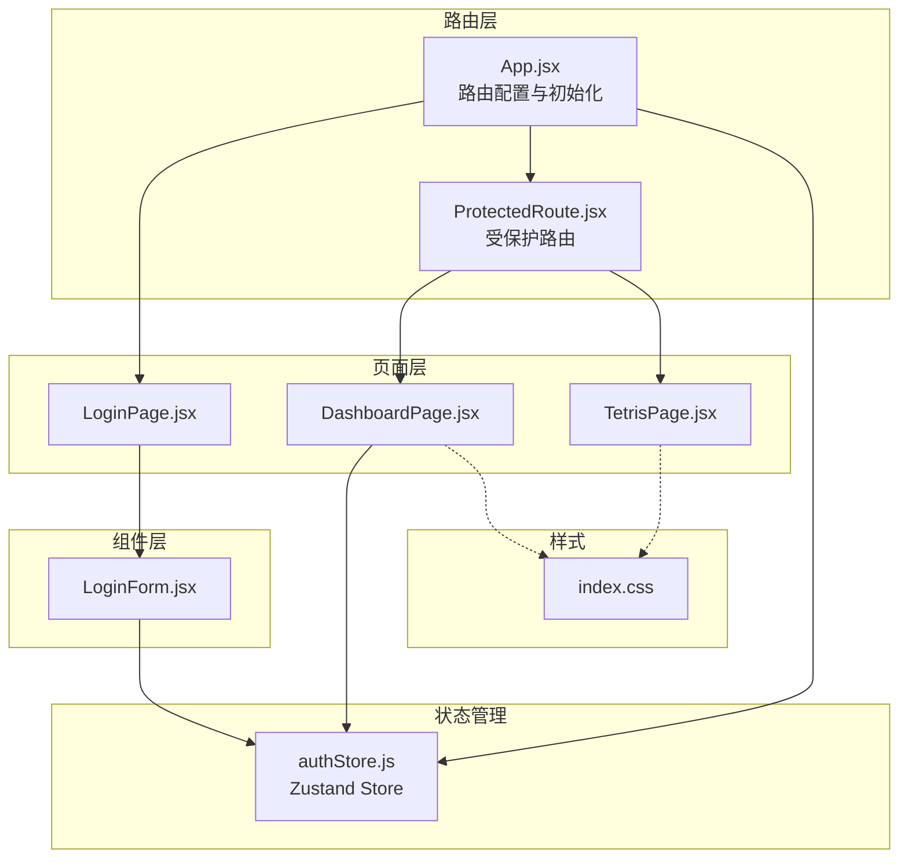
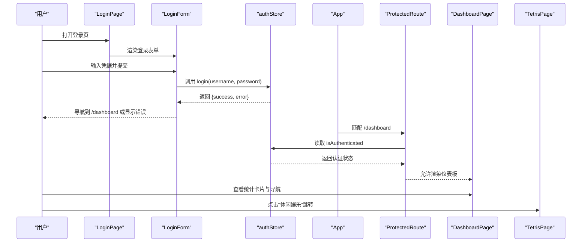
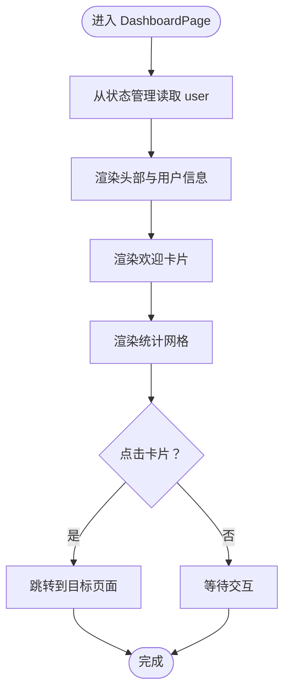
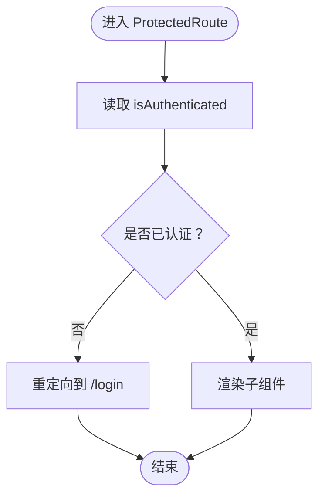
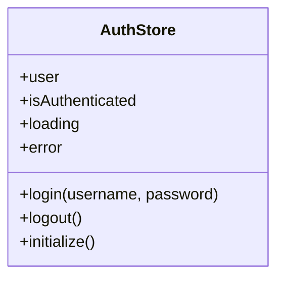
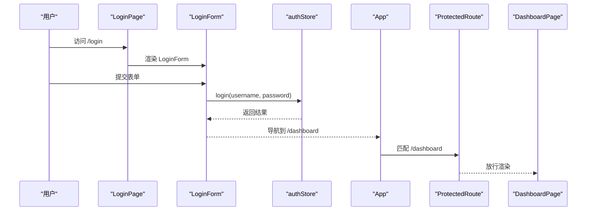
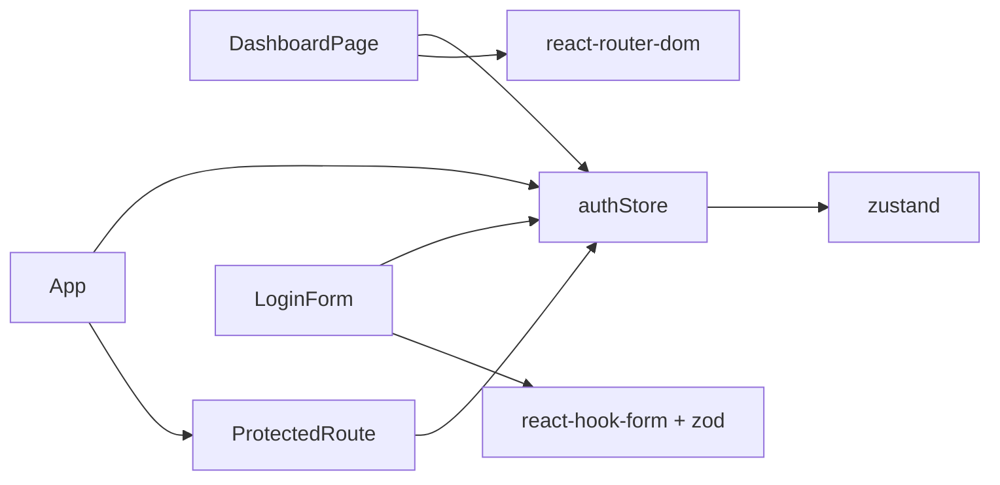

# 仪表板功能

<cite>
**本文引用的文件**
- [DashboardPage.jsx](file://src/pages/DashboardPage.jsx)
- [authStore.js](file://src/store/authStore.js)
- [App.jsx](file://src/App.jsx)
- [ProtectedRoute.jsx](file://src/routes/ProtectedRoute.jsx)
- [LoginForm.jsx](file://src/components/LoginForm.jsx)
- [LoginPage.jsx](file://src/pages/LoginPage.jsx)
- [TetrisPage.jsx](file://src/pages/TetrisPage.jsx)
- [index.css](file://src/index.css)
- [package.json](file://package.json)
</cite>

## 目录
1. [简介](#简介)
2. [项目结构](#项目结构)
3. [核心组件](#核心组件)
4. [架构总览](#架构总览)
5. [详细组件分析](#详细组件分析)
6. [依赖关系分析](#依赖关系分析)
7. [性能考虑](#性能考虑)
8. [故障排除指南](#故障排除指南)
9. [结论](#结论)
10. [附录](#附录)

## 简介
本文件面向仪表板功能的实现与使用，重点说明用户认证后主界面的设计与实现，包括 DashboardPage 组件的布局、用户信息展示区、导航功能、数据展示逻辑与统计信息呈现方式、交互设计、组件 props 接口、事件处理机制、状态管理集成、响应式设计与用户体验优化策略，并提供自定义仪表板内容的方法与扩展指南，以及与其他页面的导航关系与数据传递机制。

## 项目结构
该项目采用基于页面与组件分层的组织方式：
- 页面层：DashboardPage、LoginPage、TetrisPage
- 组件层：LoginForm
- 路由保护：ProtectedRoute
- 状态管理：useAuthStore（Zustand）
- 样式：index.css（全局样式）

图表来源
- [App.jsx:10-41](file://src/App.jsx#L10-L41)
- [ProtectedRoute.jsx:4-12](file://src/routes/ProtectedRoute.jsx#L4-L12)
- [DashboardPage.jsx:4-56](file://src/pages/DashboardPage.jsx#L4-L56)
- [LoginPage.jsx:3-15](file://src/pages/LoginPage.jsx#L3-L15)
- [LoginForm.jsx:12-29](file://src/components/LoginForm.jsx#L12-L29)
- [authStore.js:3-41](file://src/store/authStore.js#L3-L41)
- [index.css:159-261](file://src/index.css#L159-L261)

章节来源
- [App.jsx:10-41](file://src/App.jsx#L10-L41)
- [index.css:159-261](file://src/index.css#L159-L261)

## 核心组件
- DashboardPage：认证后的主界面，负责用户信息展示、统计卡片与导航入口。
- ProtectedRoute：路由守卫，确保仅在已认证状态下访问受保护页面。
- useAuthStore：Zustand 状态管理，提供登录、登出、初始化等能力。
- LoginForm：登录表单，配合验证与状态管理完成认证流程。
- LoginPage：登录页容器，承载 LoginForm。
- TetrisPage：示例受保护页面，用于演示从仪表板跳转到其他页面。

章节来源
- [DashboardPage.jsx:4-56](file://src/pages/DashboardPage.jsx#L4-L56)
- [ProtectedRoute.jsx:4-12](file://src/routes/ProtectedRoute.jsx#L4-L12)
- [authStore.js:3-41](file://src/store/authStore.js#L3-L41)
- [LoginForm.jsx:12-29](file://src/components/LoginForm.jsx#L12-L29)
- [LoginPage.jsx:3-15](file://src/pages/LoginPage.jsx#L3-L15)
- [TetrisPage.jsx:63-410](file://src/pages/TetrisPage.jsx#L63-L410)

## 架构总览
仪表板功能围绕“认证状态 + 受保护路由 + 页面导航”的模式构建。用户通过登录页完成认证后，进入仪表板；仪表板提供用户信息展示与导航入口，点击可跳转至其他受保护页面（如俄罗斯方块）。

图表来源
- [LoginForm.jsx:24-29](file://src/components/LoginForm.jsx#L24-L29)
- [authStore.js:9-27](file://src/store/authStore.js#L9-L27)
- [App.jsx:21-27](file://src/App.jsx#L21-L27)
- [ProtectedRoute.jsx:5-11](file://src/routes/ProtectedRoute.jsx#L5-L11)
- [DashboardPage.jsx:45-48](file://src/pages/DashboardPage.jsx#L45-L48)
- [TetrisPage.jsx:331-336](file://src/pages/TetrisPage.jsx#L331-L336)

## 详细组件分析

### DashboardPage 组件
- 布局设计
  - 头部区域包含标题与用户信息展示区，右侧提供“退出登录”按钮。
  - 主体区域包含欢迎卡片与统计网格布局，统计卡片以网格自适应排列。
  - “休闲娱乐”卡片作为链接跳转至 TetrisPage。
- 用户信息展示
  - 展示当前用户的名称或用户名，来源于状态管理中的 user 字段。
- 导航功能
  - 退出登录：调用状态管理的 logout 并导航回登录页。
  - 统计卡片点击：跳转至 TetrisPage。
- 数据展示逻辑
  - 统计值为静态占位符，实际应用中可替换为动态数据源。
- 交互设计
  - 退出按钮具备悬停态样式，提升可点击性。
  - 统计卡片具备阴影与圆角，增强卡片化视觉层次。
- 响应式设计
  - 统计网格使用 CSS Grid 的 auto-fit 与 minmax，实现小屏自适应列宽。
  - 容器最大宽度与内边距保证在大屏下的良好留白。
- Props 接口
  - 无外部 props，内部通过 hooks 获取状态与方法。
- 事件处理机制
  - handleLogout：触发 logout 后导航。
  - Link 组件：用于卡片跳转。
- 状态管理集成
  - 使用 useAuthStore 读取 user 与 logout。
- 自定义扩展建议
  - 在 stats-grid 中新增卡片，绑定相应业务数据。
  - 将统计值从静态改为异步加载，结合状态管理更新。
  - 添加筛选器或刷新按钮，提升交互体验。

图表来源
- [DashboardPage.jsx:13-53](file://src/pages/DashboardPage.jsx#L13-L53)
- [authStore.js:4-6](file://src/store/authStore.js#L4-L6)

章节来源
- [DashboardPage.jsx:4-56](file://src/pages/DashboardPage.jsx#L4-L56)
- [index.css:236-261](file://src/index.css#L236-L261)

### ProtectedRoute 路由守卫
- 功能概述
  - 读取认证状态，未认证则重定向到登录页；已认证则放行子组件。
- 关键点
  - 依赖 useAuthStore 的 isAuthenticated 字段。
  - 使用 Navigate 组件进行路由重定向。
- 扩展建议
  - 可增加角色校验或权限判断，细化访问控制。

图表来源
- [ProtectedRoute.jsx:4-12](file://src/routes/ProtectedRoute.jsx#L4-L12)
- [authStore.js:5](file://src/store/authStore.js#L5)

章节来源
- [ProtectedRoute.jsx:4-12](file://src/routes/ProtectedRoute.jsx#L4-L12)

### 状态管理 useAuthStore（Zustand）
- 数据模型
  - user：当前用户对象
  - isAuthenticated：认证状态
  - loading：加载状态
  - error：错误信息
- 核心方法
  - login：模拟登录，设置用户与认证状态，持久化到本地存储
  - logout：移除本地存储并清空状态
  - initialize：启动时从本地存储恢复认证状态
- 性能与复杂度
  - 方法均为同步/异步轻量操作，复杂度低，适合小型应用。
- 错误处理
  - 登录失败时设置错误信息，供 UI 显示。

图表来源
- [authStore.js:3-41](file://src/store/authStore.js#L3-L41)

章节来源
- [authStore.js:3-41](file://src/store/authStore.js#L3-L41)

### 登录流程与导航
- 登录页 LoginPage
  - 承载登录表单，渲染头部与 LoginForm。
- 登录表单 LoginForm
  - 使用 react-hook-form 与 zod 进行表单验证。
  - 提交后调用 useAuthStore.login，成功则导航到 /dashboard。
- App 路由
  - 初始化时调用 initialize 恢复认证状态。
  - /dashboard 与 /tetris 通过 ProtectedRoute 保护。
  - /login 为公开登录页。

图表来源
- [LoginPage.jsx:3-15](file://src/pages/LoginPage.jsx#L3-L15)
- [LoginForm.jsx:24-29](file://src/components/LoginForm.jsx#L24-L29)
- [authStore.js:9-27](file://src/store/authStore.js#L9-L27)
- [App.jsx:13-15](file://src/App.jsx#L13-L15)
- [App.jsx:21-27](file://src/App.jsx#L21-L27)
- [ProtectedRoute.jsx:5-11](file://src/routes/ProtectedRoute.jsx#L5-L11)

章节来源
- [LoginPage.jsx:3-15](file://src/pages/LoginPage.jsx#L3-L15)
- [LoginForm.jsx:12-29](file://src/components/LoginForm.jsx#L12-L29)
- [App.jsx:10-41](file://src/App.jsx#L10-L41)

### 与其他页面的导航关系与数据传递
- 仪表板到俄罗斯方块
  - DashboardPage 中的“休闲娱乐”卡片使用 Link 组件跳转到 /tetris。
  - TetrisPage 通过 Link 返回到 /dashboard。
- 数据传递
  - 当前实现为页面级导航，未见跨页面参数传递逻辑。
  - 若需传递数据，可在 Link 中使用 state，或通过状态管理共享。

章节来源
- [DashboardPage.jsx:45-48](file://src/pages/DashboardPage.jsx#L45-L48)
- [TetrisPage.jsx:331-336](file://src/pages/TetrisPage.jsx#L331-L336)

## 依赖关系分析
- 组件耦合
  - DashboardPage 依赖 useAuthStore 与 react-router-dom 的 Link/useNavigate。
  - ProtectedRoute 依赖 useAuthStore 的认证状态。
  - App 在初始化阶段调用 useAuthStore.initialize。
- 外部依赖
  - react-router-dom：路由与导航
  - zustand：状态管理
  - react-hook-form + zod：表单验证
  - 浏览器本地存储：持久化用户信息

图表来源
- [DashboardPage.jsx:1-2](file://src/pages/DashboardPage.jsx#L1-L2)
- [ProtectedRoute.jsx:2](file://src/routes/ProtectedRoute.jsx#L2)
- [App.jsx:3](file://src/App.jsx#L3)
- [LoginForm.jsx:1-5](file://src/components/LoginForm.jsx#L1-L5)
- [authStore.js:1](file://src/store/authStore.js#L1)
- [package.json:12-19](file://package.json#L12-L19)

章节来源
- [package.json:12-19](file://package.json#L12-L19)

## 性能考虑
- 状态粒度
  - useAuthStore 将用户、认证状态、加载与错误集中管理，便于按需订阅，避免不必要的重渲染。
- 渲染优化
  - DashboardPage 为纯展示组件，无复杂计算，渲染成本低。
- 路由守卫
  - ProtectedRoute 仅做布尔判断，开销极小。
- 建议
  - 对于大型应用，可拆分更细的状态模块，减少订阅范围。
  - 登录流程中的延迟模拟可移除或改为真实 API 调用。

## 故障排除指南
- 无法进入仪表板
  - 检查 ProtectedRoute 是否正确读取 isAuthenticated。
  - 确认 App 初始化时调用了 initialize。
- 登录失败
  - 检查 LoginForm 的表单验证与错误提示。
  - 确认 useAuthStore.login 的返回值与错误信息。
- 退出登录无效
  - 确认 logout 是否清除了本地存储并重置了状态。
  - 检查导航是否执行。

章节来源
- [ProtectedRoute.jsx:5-11](file://src/routes/ProtectedRoute.jsx#L5-L11)
- [App.jsx:13-15](file://src/App.jsx#L13-L15)
- [LoginForm.jsx:24-29](file://src/components/LoginForm.jsx#L24-L29)
- [authStore.js:29-32](file://src/store/authStore.js#L29-L32)

## 结论
仪表板功能以简洁清晰的方式实现了认证后的主界面：用户信息展示、统计卡片与导航入口。通过受保护路由与状态管理，系统保证了安全与一致性。现有实现易于扩展，可通过引入动态数据、增强交互与完善样式适配，进一步提升用户体验与可维护性。

## 附录

### 响应式设计实现细节
- 统计网格
  - 使用 CSS Grid 的 auto-fit 与 minmax 实现自适应列宽，最小宽度为 250px，自动换行。
- 容器与间距
  - 最大宽度限制与内边距保证在大屏下的留白与居中。
- 按钮与卡片
  - 圆角与阴影营造卡片化视觉，按钮具备悬停态，提升交互反馈。

章节来源
- [index.css:236-261](file://src/index.css#L236-L261)
- [index.css:159-217](file://src/index.css#L159-L217)

### 用户体验优化策略
- 视觉层次
  - 使用颜色变量与阴影，突出重要元素（如统计值）。
- 交互反馈
  - 按钮悬停态与禁用态，表单错误提示，登录加载态。
- 导航一致性
  - 统一的头部与卡片风格，保持页面间一致的交互体验。

章节来源
- [index.css:198-211](file://src/index.css#L198-L211)
- [index.css:242-261](file://src/index.css#L242-L261)
- [LoginForm.jsx:63-67](file://src/components/LoginForm.jsx#L63-L67)

### 自定义仪表板内容的方法与扩展指南
- 新增统计卡片
  - 在 stats-grid 中添加新的 stat-card，绑定业务数据。
- 动态数据
  - 将静态统计值替换为异步数据源，结合状态管理更新。
- 交互增强
  - 为卡片添加点击事件或下拉菜单，支持筛选与刷新。
- 样式定制
  - 使用 CSS 变量与媒体查询，适配不同屏幕尺寸。

章节来源
- [DashboardPage.jsx:32-49](file://src/pages/DashboardPage.jsx#L32-L49)
- [index.css:236-261](file://src/index.css#L236-L261)