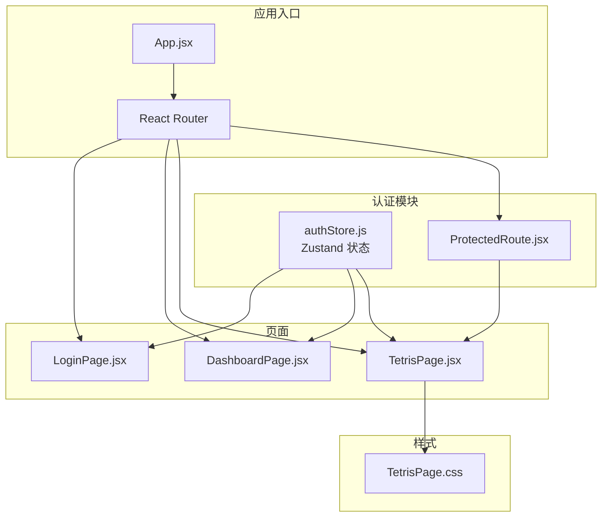
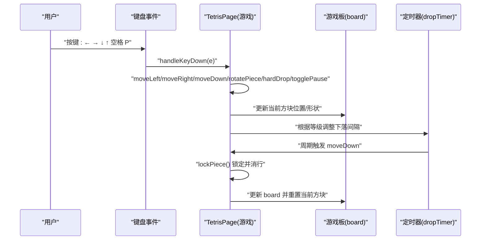
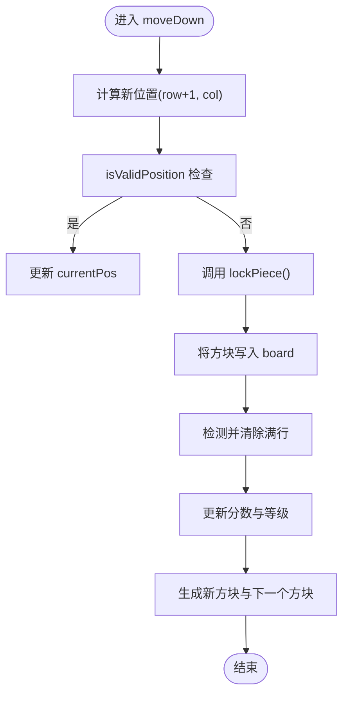
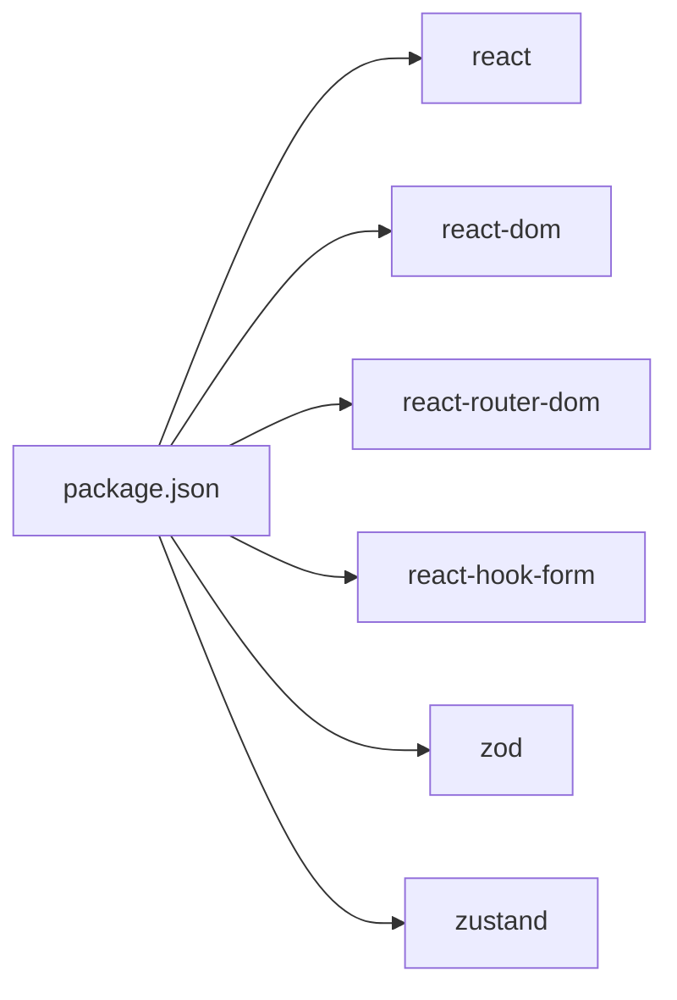

# 俄罗斯方块游戏

<cite>
**本文引用的文件**
- [TetrisPage.jsx](file://src/pages/TetrisPage.jsx)
- [TetrisPage.css](file://src/pages/TetrisPage.css)
- [App.jsx](file://src/App.jsx)
- [authStore.js](file://src/store/authStore.js)
- [ProtectedRoute.jsx](file://src/routes/ProtectedRoute.jsx)
- [DashboardPage.jsx](file://src/pages/DashboardPage.jsx)
- [LoginPage.jsx](file://src/pages/LoginPage.jsx)
- [LoginForm.jsx](file://src/components/LoginForm.jsx)
- [package.json](file://package.json)
- [README.md](file://README.md)
</cite>

## 目录
1. [简介](#简介)
2. [项目结构](#项目结构)
3. [核心组件](#核心组件)
4. [架构总览](#架构总览)
5. [详细组件分析](#详细组件分析)
6. [依赖关系分析](#依赖关系分析)
7. [性能考量](#性能考量)
8. [故障排查指南](#故障排查指南)
9. [结论](#结论)
10. [附录](#附录)

## 简介
本文件为俄罗斯方块游戏的完整技术文档，面向开发者与产品人员，系统性阐述游戏引擎的实现原理与核心算法，包括：
- 游戏板数据结构设计与渲染
- 方块生成与旋转机制
- 物理模拟与碰撞检测
- 键盘事件处理与游戏状态管理
- 分数计算与难度递增
- CSS Grid 布局与动画效果
- 性能优化与可扩展性建议

## 项目结构
该仓库是一个基于 React + Vite 的前端应用，包含登录认证与俄罗斯方块页面。俄罗斯方块页面位于 src/pages/TetrisPage.jsx，样式位于 TetrisPage.css；路由与受保护访问由 App.jsx、ProtectedRoute.jsx 配合认证状态管理器实现。

图表来源
- [App.jsx:10-41](file://src/App.jsx#L10-L41)
- [ProtectedRoute.jsx:4-12](file://src/routes/ProtectedRoute.jsx#L4-L12)
- [authStore.js:3-41](file://src/store/authStore.js#L3-L41)
- [TetrisPage.jsx:1-413](file://src/pages/TetrisPage.jsx#L1-L413)
- [TetrisPage.css:1-293](file://src/pages/TetrisPage.css#L1-L293)

章节来源
- [App.jsx:10-41](file://src/App.jsx#L10-L41)
- [package.json:12-31](file://package.json#L12-L31)

## 核心组件
- 游戏主组件 TetrisPage：负责游戏状态、物理模拟、碰撞检测、键盘输入、计分与难度递增、渲染等。
- 样式模块 TetrisPage.css：定义网格布局、颜色体系、动画与覆盖层。
- 认证与路由：通过 ProtectedRoute 保护 /tetris 页面，结合 Zustand 管理登录态。

章节来源
- [TetrisPage.jsx:63-413](file://src/pages/TetrisPage.jsx#L63-L413)
- [TetrisPage.css:36-293](file://src/pages/TetrisPage.css#L36-L293)
- [ProtectedRoute.jsx:4-12](file://src/routes/ProtectedRoute.jsx#L4-L12)
- [authStore.js:3-41](file://src/store/authStore.js#L3-L41)

## 架构总览
俄罗斯方块采用“函数组件 + Hooks”的纯前端实现，使用 React 状态驱动 UI，定时器驱动下落，键盘事件驱动输入，Zustand 管理全局认证状态。游戏状态通过一个引用对象 gs 与 React 状态保持同步，确保回调函数读取到最新状态。

图表来源
- [TetrisPage.jsx:252-268](file://src/pages/TetrisPage.jsx#L252-L268)
- [TetrisPage.jsx:240-250](file://src/pages/TetrisPage.jsx#L240-L250)
- [TetrisPage.jsx:94-153](file://src/pages/TetrisPage.jsx#L94-L153)

## 详细组件分析

### 游戏板与数据结构
- 尺寸常量：ROWS=20，COLS=10
- 空棋盘初始化：createEmptyBoard 创建二维数组，初始值为 null
- 方块集合：TETROMINOES 定义七种基础形状与颜色标识
- 当前状态：board、currentPiece、currentPos、nextPiece、score、lines、level、gameOver、paused、started
- 参考状态：gs 作为“真实世界”引用，实时同步上述状态，供回调读取

复杂度与空间：
- 棋盘占用 O(ROWS×COLS) 存储
- 每次渲染 flat() 生成 200 个单元格元素（可优化为按需渲染）

章节来源
- [TetrisPage.jsx:5-26](file://src/pages/TetrisPage.jsx#L5-L26)
- [TetrisPage.jsx:20-21](file://src/pages/TetrisPage.jsx#L20-L21)
- [TetrisPage.jsx:63-92](file://src/pages/TetrisPage.jsx#L63-L92)

### 方块生成与变换
- 随机生成：randomPiece 从七种形状中等概率选择
- 旋转：rotateCW 实现顺时针 90° 旋转矩阵
- 位移：moveLeft/moveRight/moveDown 改变 currentPos
- 旋转位移校正：旋转后尝试向左/右偏移以避免墙体穿透

复杂度：
- 旋转矩阵拷贝与填充 O(shape 面积)，通常为常数级
- 旋转踢墙尝试最多 5 次，常数开销

章节来源
- [TetrisPage.jsx:23-26](file://src/pages/TetrisPage.jsx#L23-L26)
- [TetrisPage.jsx:28-38](file://src/pages/TetrisPage.jsx#L28-L38)
- [TetrisPage.jsx:166-182](file://src/pages/TetrisPage.jsx#L166-L182)
- [TetrisPage.jsx:184-197](file://src/pages/TetrisPage.jsx#L184-L197)

### 碰撞检测与锁定机制
- 有效位置判断：isValidPosition 对每个非空单元格检查边界与占用
- 锁定：当无法下移时，将当前方块写入 board，触发消行与新方块生成
- 碰撞检测流程图：

图表来源
- [TetrisPage.jsx:155-164](file://src/pages/TetrisPage.jsx#L155-L164)
- [TetrisPage.jsx:40-51](file://src/pages/TetrisPage.jsx#L40-L51)
- [TetrisPage.jsx:94-153](file://src/pages/TetrisPage.jsx#L94-L153)

章节来源
- [TetrisPage.jsx:40-51](file://src/pages/TetrisPage.jsx#L40-L51)
- [TetrisPage.jsx:94-153](file://src/pages/TetrisPage.jsx#L94-L153)

### 幽灵线（Ghost）与硬降
- 幽灵线：getGhostPosition 从当前位置向下扫描，找到可放置的最低行
- 硬降：hardDrop 将方块直接移动到幽灵线位置，并按位移距离加成分数
- 渲染：renderBoard 在幽灵线位置以特殊类名绘制半透明占位

章节来源
- [TetrisPage.jsx:53-59](file://src/pages/TetrisPage.jsx#L53-L59)
- [TetrisPage.jsx:199-209](file://src/pages/TetrisPage.jsx#L199-L209)
- [TetrisPage.jsx:270-311](file://src/pages/TetrisPage.jsx#L270-L311)

### 键盘事件与控制流
- 控制键：← → 下降加速 ↓ 旋转 ↑ 空格硬降 P 暂停
- 事件绑定：useEffect 绑定 window 的 keydown，在 started=true 时生效
- 防抖：preventDefault 阻止默认滚动行为

章节来源
- [TetrisPage.jsx:252-268](file://src/pages/TetrisPage.jsx#L252-L268)

### 游戏状态管理与定时器
- 状态：started、paused、gameOver、level、score、lines、board、currentPiece、currentPos、nextPiece
- 定时器：根据等级动态调整下落速度，等级每 10 行提升一次
- 启动：startGame 初始化棋盘、重置分数与等级、生成首两个方块

章节来源
- [TetrisPage.jsx:63-92](file://src/pages/TetrisPage.jsx#L63-L92)
- [TetrisPage.jsx:61](file://src/pages/TetrisPage.jsx#L61)
- [TetrisPage.jsx:216-238](file://src/pages/TetrisPage.jsx#L216-L238)
- [TetrisPage.jsx:240-250](file://src/pages/TetrisPage.jsx#L240-L250)

### 分数计算与难度递增
- 消行计分：单行 100×等级、双行 300×等级、三行 500×等级、四行 800×等级
- 硬降加分：按位移距离 × 2
- 等级：每累计 10 行升一级，最小速度限制 100ms

章节来源
- [TetrisPage.jsx:125-132](file://src/pages/TetrisPage.jsx#L125-L132)
- [TetrisPage.jsx:204](file://src/pages/TetrisPage.jsx#L204)
- [TetrisPage.jsx:61](file://src/pages/TetrisPage.jsx#L61)

### 渲染与 CSS Grid 布局
- 游戏板：grid-template-columns: repeat(10, 30px)、grid-template-rows: repeat(20, 30px)
- 单元格：.tetris-cell 定义尺寸、边框、阴影；.filled/.ghost 区分实体与幽灵
- 形状颜色：I/O/T/S/Z/J/L 六种颜色，幽灵线使用半透明背景
- 下一个方块预览：4×4 网格居中显示 nextPiece
- 动画：.line-clear-flash 结合 @keyframes clearFlash 实现消行动画

章节来源
- [TetrisPage.css:36-76](file://src/pages/TetrisPage.css#L36-L76)
- [TetrisPage.css:100-125](file://src/pages/TetrisPage.css#L100-L125)
- [TetrisPage.css:285-293](file://src/pages/TetrisPage.css#L285-L293)

### 用户交互与界面
- 控件：开始/继续、暂停、重新开始
- 覆盖层：游戏结束与暂停遮罩
- 操作提示：方向键与功能键说明
- 返回导航：返回仪表板

章节来源
- [TetrisPage.jsx:331-409](file://src/pages/TetrisPage.jsx#L331-L409)
- [TetrisPage.css:181-246](file://src/pages/TetrisPage.css#L181-L246)

## 依赖关系分析
- React 生态：react、react-dom、react-router-dom
- 表单与校验：react-hook-form、zod
- 状态管理：zustand
- 构建工具：vite、@vitejs/plugin-react

图表来源
- [package.json:12-31](file://package.json#L12-L31)

章节来源
- [package.json:12-31](file://package.json#L12-L31)

## 性能考量
现状与建议：
- 渲染优化
  - 当前 renderBoard 使用 flat() 生成全部单元格，即使未填充也渲染，建议改为仅渲染 board 中非空单元格及其幽灵投影，减少 DOM 数量。
  - 使用 React.memo 缓存单元格渲染结果，避免重复渲染。
- 状态同步
  - gs 与 React 状态双向同步，建议统一通过 gs 读取，回调内部使用 gs.current，减少闭包捕获带来的不一致。
- 定时器
  - 下落速度随等级变化，建议在 level 变化时清理并重建定时器，避免多定时器竞争。
- 动画
  - 消行动画可使用 CSS 过渡或 Web Animations API，避免强制同步布局。
- 内存
  - 避免在每次渲染创建新的数组/对象，使用 useMemo/useCallback 缓存计算结果。
- 事件
  - 键盘事件监听在组件挂载时绑定，卸载时解绑，避免内存泄漏。

[本节为通用性能指导，无需特定文件引用]

## 故障排查指南
- 无法开始游戏
  - 检查 started 状态是否为 true，确认 startGame 已被调用。
  - 章节来源: [TetrisPage.jsx:216-238](file://src/pages/TetrisPage.jsx#L216-L238)
- 方块卡墙或穿墙
  - 检查 isValidPosition 与旋转踢墙逻辑，确认偏移尝试顺序正确。
  - 章节来源: [TetrisPage.jsx:40-51](file://src/pages/TetrisPage.jsx#L40-L51), [TetrisPage.jsx:184-197](file://src/pages/TetrisPage.jsx#L184-L197)
- 无法暂停/继续
  - 检查 paused 状态切换与定时器开关逻辑。
  - 章节来源: [TetrisPage.jsx:211-214](file://src/pages/TetrisPage.jsx#L211-L214), [TetrisPage.jsx:240-250](file://src/pages/TetrisPage.jsx#L240-L250)
- 分数异常
  - 检查消行计分与等级乘数，确认 lines 累加与 level 更新逻辑。
  - 章节来源: [TetrisPage.jsx:125-132](file://src/pages/TetrisPage.jsx#L125-L132)
- 键盘无响应
  - 确认 started 为 true，且 keydown 事件已绑定。
  - 章节来源: [TetrisPage.jsx:252-268](file://src/pages/TetrisPage.jsx#L252-L268)

## 结论
本项目以简洁的 React 函数组件实现了标准俄罗斯方块的核心玩法：随机方块生成、旋转与位移、碰撞检测、消行计分、难度递增与幽灵线提示。通过 CSS Grid 实现了高精度的网格布局与丰富的视觉反馈。建议在渲染性能、状态一致性与动画体验方面进行进一步优化，以获得更流畅的游戏体验。

[本节为总结，无需特定文件引用]

## 附录

### 游戏规则与玩法说明
- 目标：通过移动与旋转方块填满水平行，消除行并获得分数。
- 控制：
  - ← →：左右移动
  - ↓：加速下落
  - ↑：旋转
  - 空格：硬降（直接落到最底部）
  - P：暂停/继续
- 游戏结束：新方块无法放置时判定失败。
- 难度：每消除 10 行升一级，下落速度加快。

[本节为规则说明，无需特定文件引用]

### 扩展与自定义建议
- 新增功能
  - 预览多个 nextPiece
  - 彩虹模式/主题切换
  - 音效与背景音乐
  - 本地最高分记录
- 算法增强
  - 使用位运算优化旋转与碰撞检测
  - 引入帧循环替代定时器，提升稳定性
- 可访问性
  - 提供无障碍键盘映射与屏幕阅读器支持
- 多语言
  - 国际化文案与数字格式

[本节为扩展建议，无需特定文件引用]