# 方块系统

<cite>
**本文档引用的文件**
- [TetrisPage.jsx](file://src/pages/TetrisPage.jsx)
- [TetrisPage.css](file://src/pages/TetrisPage.css)
- [App.jsx](file://src/App.jsx)
- [ProtectedRoute.jsx](file://src/routes/ProtectedRoute.jsx)
- [authStore.js](file://src/store/authStore.js)
- [LoginForm.jsx](file://src/components/LoginForm.jsx)
- [DashboardPage.jsx](file://src/pages/DashboardPage.jsx)
- [LoginPage.jsx](file://src/pages/LoginPage.jsx)
- [main.jsx](file://src/main.jsx)
- [package.json](file://package.json)
</cite>

## 目录
1. [简介](#简介)
2. [项目结构](#项目结构)
3. [核心组件](#核心组件)
4. [架构概览](#架构概览)
5. [详细组件分析](#详细组件分析)
6. [依赖关系分析](#依赖关系分析)
7. [性能考虑](#性能考虑)
8. [故障排除指南](#故障排除指南)
9. [结论](#结论)

## 简介

本项目是一个基于React的俄罗斯方块游戏实现，提供了完整的方块系统功能。该系统包含七种标准俄罗斯方块（I、O、T、S、Z、J、L），实现了随机生成算法、旋转机制、碰撞检测和边界情况处理等核心功能。

## 项目结构

该项目采用React + Vite的现代前端架构，主要文件组织如下：

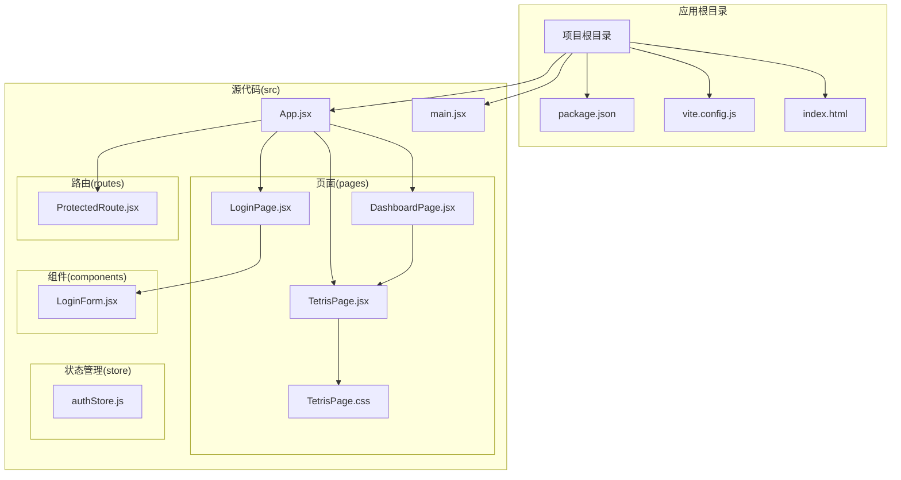

**图表来源**
- [App.jsx:1-44](file://src/App.jsx#L1-L44)
- [main.jsx:1-11](file://src/main.jsx#L1-L11)
- [package.json:1-33](file://package.json#L1-L33)

**章节来源**
- [App.jsx:1-44](file://src/App.jsx#L1-L44)
- [main.jsx:1-11](file://src/main.jsx#L1-L11)
- [package.json:1-33](file://package.json#L1-L33)

## 核心组件

### 方块定义系统

系统定义了七种标准俄罗斯方块，每种方块都有其独特的形状矩阵和颜色标识：

| 方块名称 | 形状矩阵 | 颜色标识 |
|---------|---------|---------|
| I方块 | `[[1,1,1,1]]` | `I` |
| O方块 | `[[1,1],[1,1]]` | `O` |
| T方块 | `[[0,1,0],[1,1,1]]` | `T` |
| S方块 | `[[0,1,1],[1,1,0]]` | `S` |
| Z方块 | `[[1,1,0],[0,1,1]]` | `Z` |
| J方块 | `[[1,0,0],[1,1,1]]` | `J` |
| L方块 | `[[0,0,1],[1,1,1]]` | `L` |

### 随机生成算法

系统实现了简单的随机生成算法，确保方块分布的随机性和平衡性：

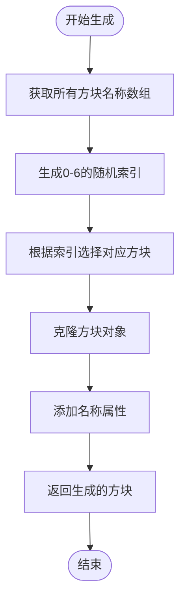

**图表来源**
- [TetrisPage.jsx:23-26](file://src/pages/TetrisPage.jsx#L23-L26)

**章节来源**
- [TetrisPage.jsx:8-16](file://src/pages/TetrisPage.jsx#L8-L16)
- [TetrisPage.jsx:18](file://src/pages/TetrisPage.jsx#L18)
- [TetrisPage.jsx:23-26](file://src/pages/TetrisPage.jsx#L23-L26)

## 架构概览

### 游戏系统架构

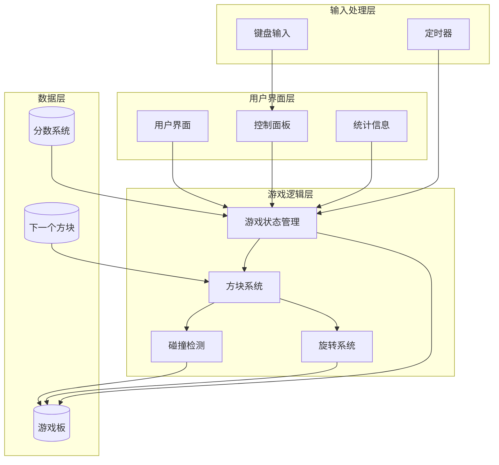

**图表来源**
- [TetrisPage.jsx:63-413](file://src/pages/TetrisPage.jsx#L63-L413)

### 状态管理系统

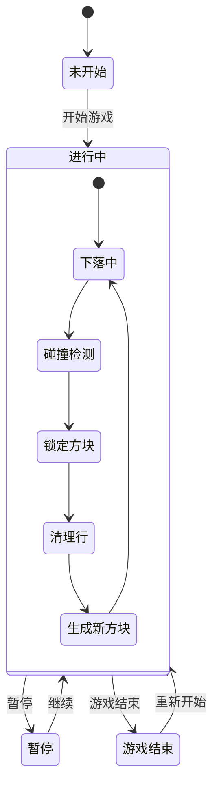

**图表来源**
- [TetrisPage.jsx:63-413](file://src/pages/TetrisPage.jsx#L63-L413)

**章节来源**
- [TetrisPage.jsx:63-413](file://src/pages/TetrisPage.jsx#L63-L413)

## 详细组件分析

### 方块系统核心实现

#### 形状矩阵定义

每个方块都使用二维数组表示其形状，其中1表示方块单元，0表示空位：

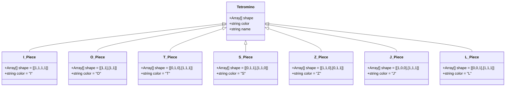

**图表来源**
- [TetrisPage.jsx:8-16](file://src/pages/TetrisPage.jsx#L8-L16)

#### 随机生成算法实现

系统使用均匀分布的随机算法确保每种方块的出现概率相等：

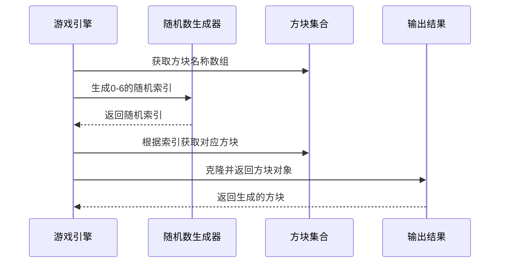

**图表来源**
- [TetrisPage.jsx:23-26](file://src/pages/TetrisPage.jsx#L23-L26)

**章节来源**
- [TetrisPage.jsx:8-16](file://src/pages/TetrisPage.jsx#L8-L16)
- [TetrisPage.jsx:23-26](file://src/pages/TetrisPage.jsx#L23-L26)

### 旋转机制实现

#### 顺时针旋转算法

旋转算法基于矩阵转置和行列翻转的数学原理：

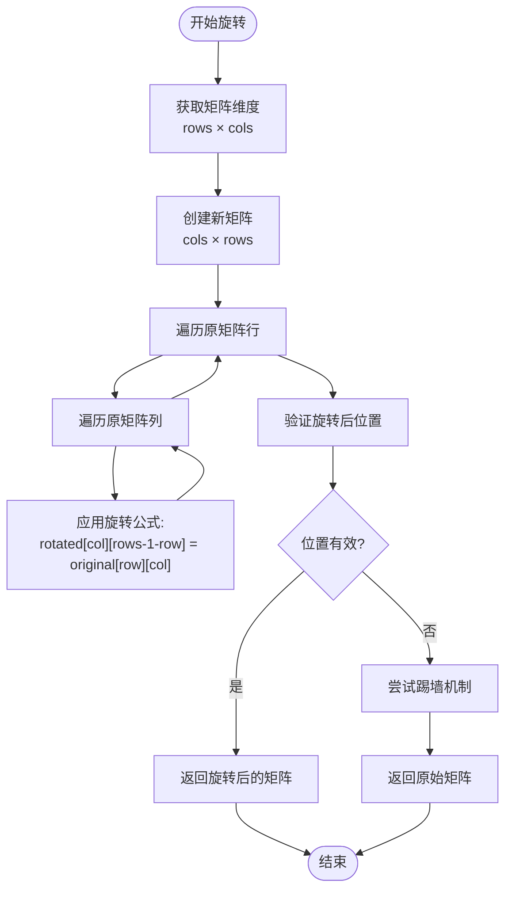

**图表来源**
- [TetrisPage.jsx:28-38](file://src/pages/TetrisPage.jsx#L28-L38)
- [TetrisPage.jsx:184-197](file://src/pages/TetrisPage.jsx#L184-L197)

#### 踢墙机制实现

当旋转导致方块超出边界时，系统会尝试向左或向右移动方块：

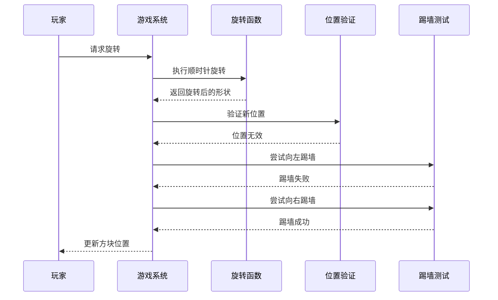

**图表来源**
- [TetrisPage.jsx:184-197](file://src/pages/TetrisPage.jsx#L184-L197)

**章节来源**
- [TetrisPage.jsx:28-38](file://src/pages/TetrisPage.jsx#L28-L38)
- [TetrisPage.jsx:184-197](file://src/pages/TetrisPage.jsx#L184-L197)

### 碰撞检测算法

#### 位置验证机制

碰撞检测算法通过检查方块的每个单元格来确定是否可以移动到新位置：

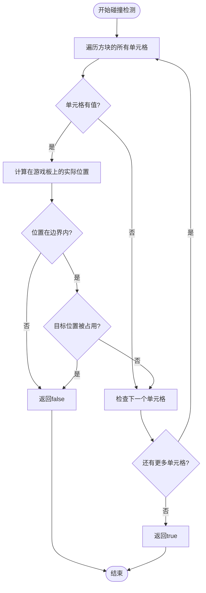

**图表来源**
- [TetrisPage.jsx:40-51](file://src/pages/TetrisPage.jsx#L40-L51)

#### 幽灵方块实现

幽灵方块显示方块将要落下的位置，帮助玩家做出决策：

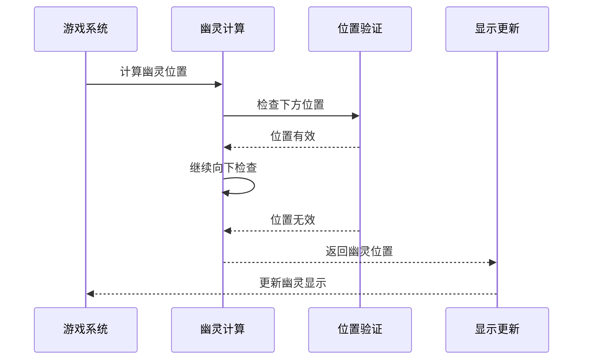

**图表来源**
- [TetrisPage.jsx:53-59](file://src/pages/TetrisPage.jsx#L53-L59)

**章节来源**
- [TetrisPage.jsx:40-51](file://src/pages/TetrisPage.jsx#L40-L51)
- [TetrisPage.jsx:53-59](file://src/pages/TetrisPage.jsx#L53-L59)

### 游戏状态管理

#### 分数和等级系统

系统实现了基于行清除数量的分数计算和等级提升机制：

| 行清除数量 | 基础分数 | 等级倍数 | 总分 |
|-----------|---------|---------|------|
| 0行       | 0       | n级     | 0    |
| 1行       | 100     | n级     | 100n |
| 2行       | 300     | n级     | 300n |
| 3行       | 500     | n级     | 500n |
| 4行       | 800     | n级     | 800n |

#### 硬降机制

硬降功能允许玩家直接将方块落到最底部：

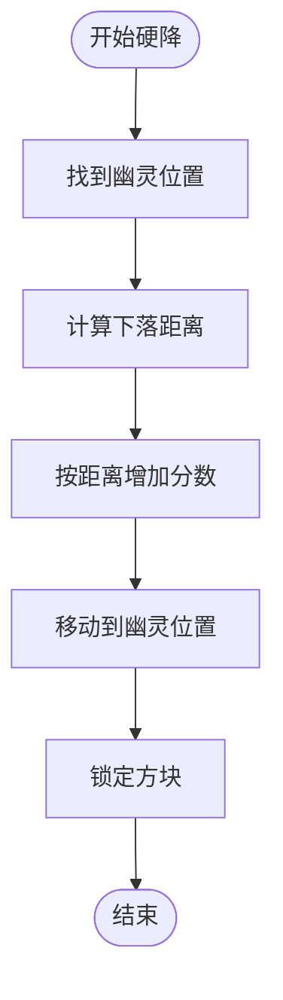

**图表来源**
- [TetrisPage.jsx:199-209](file://src/pages/TetrisPage.jsx#L199-L209)

**章节来源**
- [TetrisPage.jsx:125-133](file://src/pages/TetrisPage.jsx#L125-L133)
- [TetrisPage.jsx:199-209](file://src/pages/TetrisPage.jsx#L199-L209)

## 依赖关系分析

### 外部依赖

项目使用现代化的React生态系统，主要依赖包括：

```mermaid
graph TB
subgraph "核心框架"
React[React 19.2.4]
ReactDOM[React DOM 19.2.4]
end
subgraph "路由系统"
Router[React Router 7.14.0]
end
subgraph "状态管理"
Zustand[Zustand 5.0.12]
end
subgraph "表单处理"
HookForm[React Hook Form 7.72.1]
Zod[Zod 4.3.6]
Resolver[@hookform/resolvers 5.2.2]
end
subgraph "构建工具"
Vite[Vite 8.0.4]
ReactPlugin[@vitejs/plugin-react 6.0.1]
end
subgraph "开发工具"
ESLint[ESLint 9.39.4]
Typescript[@types/react 19.2.14]
end
React --> Router
React --> HookForm
HookForm --> Zod
HookForm --> Resolver
Zustand --> React
ReactDOM --> React
Vite --> ReactPlugin
```

**图表来源**
- [package.json:12-31](file://package.json#L12-L31)

### 内部模块依赖

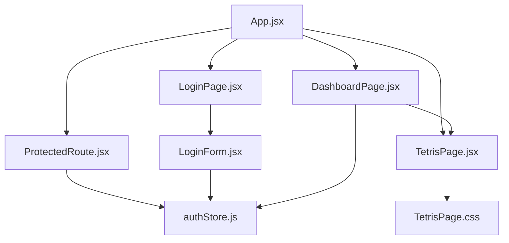

**图表来源**
- [App.jsx:1-44](file://src/App.jsx#L1-L44)
- [LoginForm.jsx:1-78](file://src/components/LoginForm.jsx#L1-L78)

**章节来源**
- [package.json:12-31](file://package.json#L12-L31)
- [App.jsx:1-44](file://src/App.jsx#L1-L44)

## 性能考虑

### 游戏循环优化

系统使用定时器驱动的游戏循环，根据等级动态调整下落速度：

- **基础速度**: 800毫秒
- **速度递增**: 每级减少70毫秒
- **最小速度**: 100毫秒

### 内存管理

- 使用不可变数据结构更新游戏状态
- 通过引用缓存避免不必要的重渲染
- 合理的垃圾回收策略

### 渲染优化

- CSS Grid用于高效的游戏板渲染
- 条件渲染减少DOM节点数量
- 幽灵方块使用透明度而非额外DOM元素

## 故障排除指南

### 常见问题及解决方案

#### 方块无法旋转

**症状**: 方块旋转时立即回到原位置

**可能原因**:
1. 旋转后位置超出边界
2. 踢墙机制失败
3. 碰撞检测逻辑错误

**解决方法**:
- 检查旋转矩阵计算
- 验证踢墙偏移量
- 确认边界检查逻辑

#### 方块卡住不动

**症状**: 方块在空中悬停不落

**可能原因**:
1. 定时器未正确启动
2. 状态更新异常
3. 碰撞检测误判

**解决方法**:
- 检查游戏状态切换
- 验证定时器清理逻辑
- 调试碰撞检测函数

#### 分数计算错误

**症状**: 分数与预期不符

**可能原因**:
1. 行清除计数错误
2. 等级倍数计算问题
3. 硬降分数计算

**解决方法**:
- 验证行清除检测逻辑
- 检查等级提升条件
- 确认硬降分数加成

**章节来源**
- [TetrisPage.jsx:155-164](file://src/pages/TetrisPage.jsx#L155-L164)
- [TetrisPage.jsx:125-133](file://src/pages/TetrisPage.jsx#L125-L133)

## 结论

本项目的方块系统实现了俄罗斯方块的核心功能，具有以下特点：

### 技术优势

1. **清晰的架构设计**: 模块化组件结构，职责分离明确
2. **高效的算法实现**: 优化的碰撞检测和旋转算法
3. **良好的用户体验**: 实时反馈和视觉效果
4. **可扩展性**: 易于添加新功能和改进现有功能

### 功能完整性

- 完整的七种标准方块支持
- 均匀分布的随机生成算法
- 标准化的旋转和踢墙机制
- 实时的碰撞检测和边界处理
- 完善的分数和等级系统

### 改进建议

1. **增加音效系统**: 为各种游戏事件添加音效反馈
2. **实现预览功能**: 展示多个后续方块
3. **添加难度选择**: 提供不同的游戏难度级别
4. **优化移动端体验**: 改进触摸控制和响应式设计

该系统为学习React应用开发和游戏逻辑实现提供了优秀的参考案例，展示了现代前端技术在游戏开发中的应用。