# 游戏引擎核心

<cite>
**本文档引用的文件**
- [TetrisPage.jsx](file://src/pages/TetrisPage.jsx)
- [TetrisPage.css](file://src/pages/TetrisPage.css)
- [LoginForm.jsx](file://src/components/LoginForm.jsx)
- [authStore.js](file://src/store/authStore.js)
- [App.jsx](file://src/App.jsx)
- [LoginPage.jsx](file://src/pages/LoginPage.jsx)
- [DashboardPage.jsx](file://src/pages/DashboardPage.jsx)
- [ProtectedRoute.jsx](file://src/routes/ProtectedRoute.jsx)
- [package.json](file://package.json)
</cite>

## 目录
1. [简介](#简介)
2. [项目结构](#项目结构)
3. [核心组件](#核心组件)
4. [架构概览](#架构概览)
5. [详细组件分析](#详细组件分析)
6. [依赖关系分析](#依赖关系分析)
7. [性能考虑](#性能考虑)
8. [故障排除指南](#故障排除指南)
9. [结论](#结论)

## 简介

本项目是一个基于React的登录应用，其中包含一个完整的俄罗斯方块游戏实现。本文档专注于游戏引擎核心模块的技术实现，深入解析游戏状态管理机制、数据结构设计、游戏循环实现以及性能优化策略。

该应用采用现代React开发模式，使用Vite作为构建工具，结合Zustand进行状态管理，实现了从登录认证到游戏娱乐的完整功能链路。

## 项目结构

项目采用按功能模块组织的目录结构，主要包含以下核心部分：

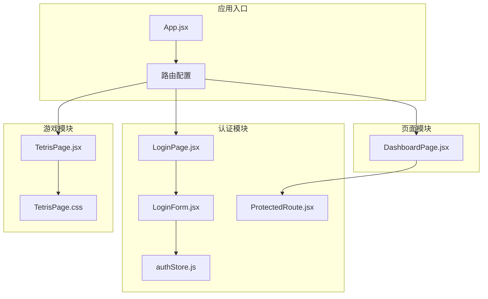

**图表来源**
- [App.jsx:10-41](file://src/App.jsx#L10-L41)
- [LoginPage.jsx:1-18](file://src/pages/LoginPage.jsx#L1-L18)
- [TetrisPage.jsx:63-410](file://src/pages/TetrisPage.jsx#L63-L410)

**章节来源**
- [App.jsx:1-44](file://src/App.jsx#L1-L44)
- [package.json:12-20](file://package.json#L12-L20)

## 核心组件

### 游戏引擎核心组件

游戏引擎的核心由TetrisPage组件实现，该组件包含了完整的俄罗斯方块游戏逻辑：

#### 主要状态管理
- **board数组**: 20x10的游戏网格，用于存储已锁定的方块
- **currentPiece**: 当前方块对象，包含形状和颜色信息
- **currentPos**: 当前方块的位置坐标
- **nextPiece**: 下一个方块，用于预览
- **游戏状态**: score、lines、level、gameOver、paused、started

#### 关键数据结构

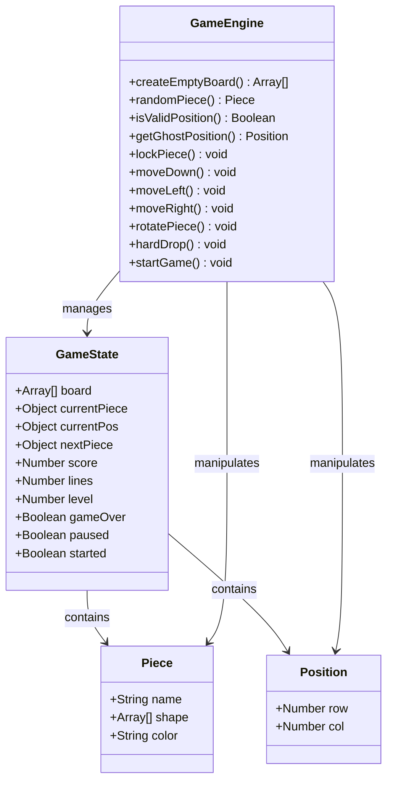

**图表来源**
- [TetrisPage.jsx:5-16](file://src/pages/TetrisPage.jsx#L5-L16)
- [TetrisPage.jsx:63-83](file://src/pages/TetrisPage.jsx#L63-L83)

**章节来源**
- [TetrisPage.jsx:5-26](file://src/pages/TetrisPage.jsx#L5-L26)
- [TetrisPage.jsx:63-83](file://src/pages/TetrisPage.jsx#L63-L83)

## 架构概览

### 状态管理模式

游戏引擎采用了混合状态管理模式，结合了React的useState和useRef：

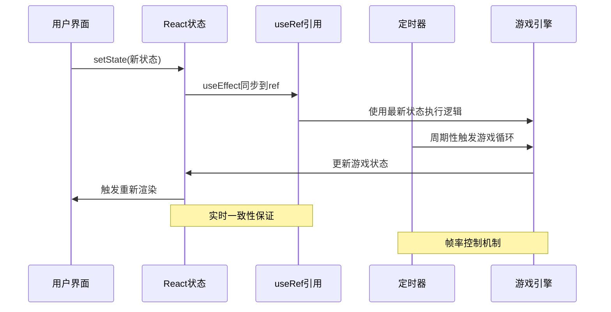

**图表来源**
- [TetrisPage.jsx:75-92](file://src/pages/TetrisPage.jsx#L75-L92)
- [TetrisPage.jsx:240-250](file://src/pages/TetrisPage.jsx#L240-L250)

### 游戏循环架构

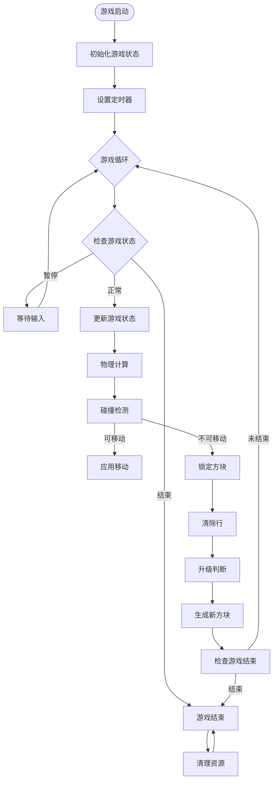

**图表来源**
- [TetrisPage.jsx:240-250](file://src/pages/TetrisPage.jsx#L240-L250)
- [TetrisPage.jsx:155-164](file://src/pages/TetrisPage.jsx#L155-L164)

**章节来源**
- [TetrisPage.jsx:240-250](file://src/pages/TetrisPage.jsx#L240-L250)
- [TetrisPage.jsx:155-164](file://src/pages/TetrisPage.jsx#L155-L164)

## 详细组件分析

### 游戏状态管理机制

#### board数组数据结构设计

board数组是游戏的核心数据结构，采用20x10的二维数组设计：

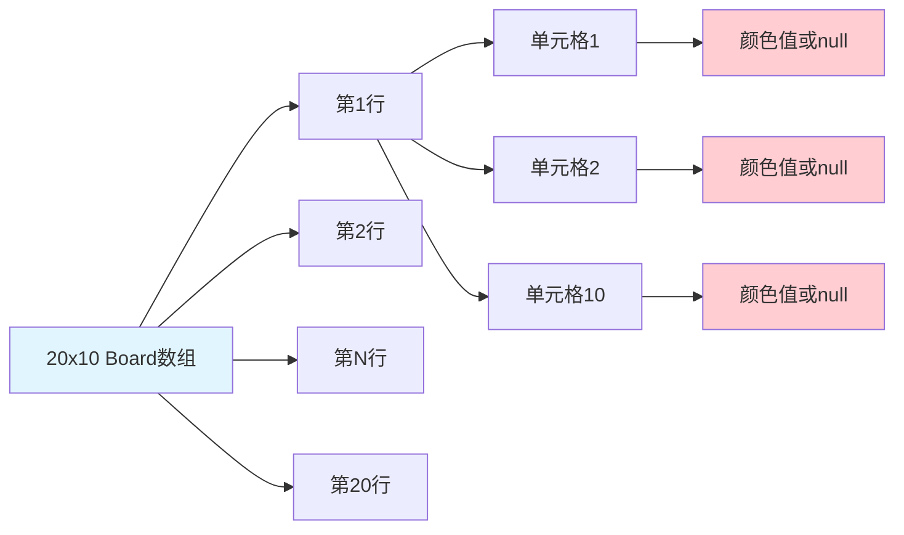

**图表来源**
- [TetrisPage.jsx:20-21](file://src/pages/TetrisPage.jsx#L20-L21)
- [TetrisPage.jsx:5-16](file://src/pages/TetrisPage.jsx#L5-L16)

#### currentPiece当前方块状态维护

currentPiece对象包含完整的方块信息：
- **name**: 方块类型标识符
- **shape**: 二维数组表示方块形状
- **color**: 方块颜色标识

#### currentPos位置坐标系统

位置坐标采用(row, col)系统：
- **row**: 行坐标，向下为正方向
- **col**: 列坐标，向右为正方向
- **origin**: 左上角为原点(0,0)

**章节来源**
- [TetrisPage.jsx:5-16](file://src/pages/TetrisPage.jsx#L5-L16)
- [TetrisPage.jsx:63-73](file://src/pages/TetrisPage.jsx#L63-L73)

### 游戏循环实现原理

#### 定时器机制

游戏循环通过setInterval实现，定时器频率根据游戏等级动态调整：

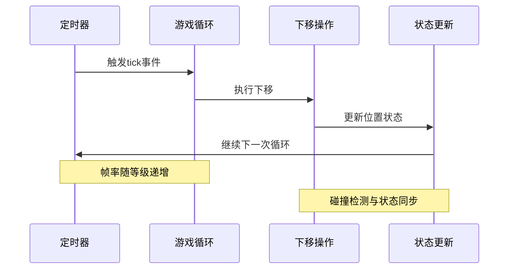

**图表来源**
- [TetrisPage.jsx:240-250](file://src/pages/TetrisPage.jsx#L240-L250)
- [TetrisPage.jsx:61](file://src/pages/TetrisPage.jsx#L61)

#### 帧率控制算法

帧率控制采用指数递减算法：
- **基础速度**: 800ms
- **每级减少**: 70ms
- **最小速度**: 100ms
- **公式**: speed = max(100, 800 - (level-1) × 70)

#### 状态同步机制

为了确保游戏逻辑的一致性，采用了双重状态管理：

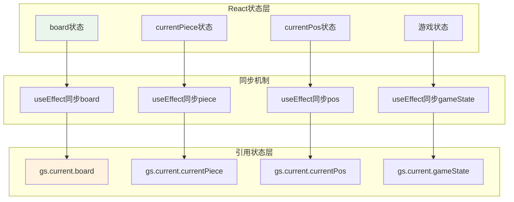

**图表来源**
- [TetrisPage.jsx:86-92](file://src/pages/TetrisPage.jsx#L86-L92)
- [TetrisPage.jsx:75-83](file://src/pages/TetrisPage.jsx#L75-L83)

**章节来源**
- [TetrisPage.jsx:240-250](file://src/pages/TetrisPage.jsx#L240-L250)
- [TetrisPage.jsx:61](file://src/pages/TetrisPage.jsx#L61)
- [TetrisPage.jsx:86-92](file://src/pages/TetrisPage.jsx#L86-L92)

### useRef引用变量使用策略

#### 引用变量的设计目的

useRef用于创建"游戏引擎内部状态"，解决以下问题：
- **避免闭包陷阱**: 函数组件内部的回调函数可以访问最新的状态
- **性能优化**: 避免不必要的重渲染
- **逻辑清晰**: 区分"对外可见的React状态"和"内部逻辑状态"

#### 引用变量的同步策略

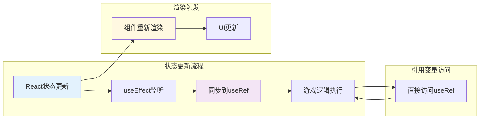

**图表来源**
- [TetrisPage.jsx:75-92](file://src/pages/TetrisPage.jsx#L75-L92)
- [TetrisPage.jsx:86-92](file://src/pages/TetrisPage.jsx#L86-L92)

**章节来源**
- [TetrisPage.jsx:75-92](file://src/pages/TetrisPage.jsx#L75-L92)

### 游戏生命周期管理

#### 完整生命周期流程

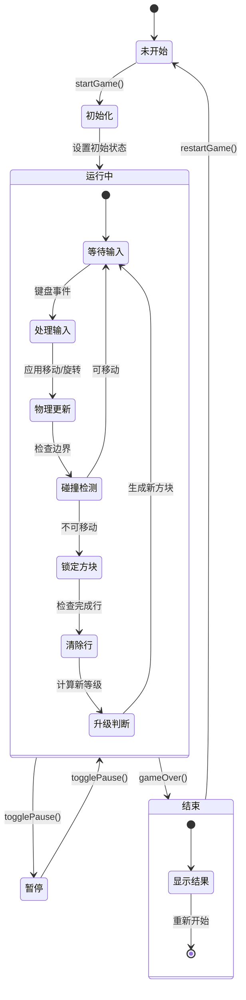

**图表来源**
- [TetrisPage.jsx:216-238](file://src/pages/TetrisPage.jsx#L216-L238)
- [TetrisPage.jsx:149](file://src/pages/TetrisPage.jsx#L149)

#### 生命周期关键节点

1. **初始化阶段**: 创建空棋盘、生成第一个和第二个方块
2. **运行阶段**: 处理用户输入、执行物理模拟、渲染游戏画面
3. **暂停阶段**: 保持当前状态，暂停定时器
4. **结束阶段**: 显示最终分数，提供重新开始选项

**章节来源**
- [TetrisPage.jsx:216-238](file://src/pages/TetrisPage.jsx#L216-L238)
- [TetrisPage.jsx:240-250](file://src/pages/TetrisPage.jsx#L240-L250)

## 依赖关系分析

### 技术栈依赖

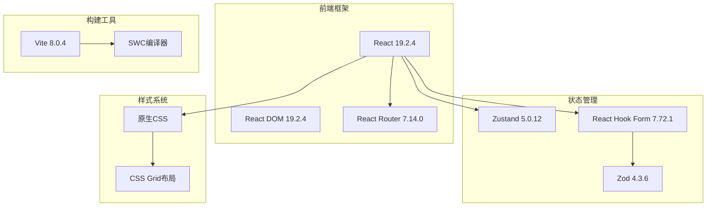

**图表来源**
- [package.json:12-20](file://package.json#L12-L20)
- [package.json:21-31](file://package.json#L21-L31)

### 组件间依赖关系

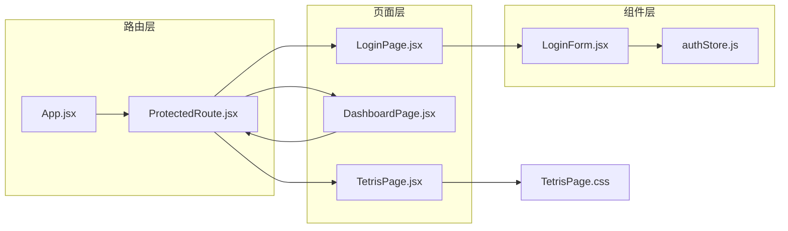

**图表来源**
- [App.jsx:1-44](file://src/App.jsx#L1-L44)
- [ProtectedRoute.jsx:1-15](file://src/routes/ProtectedRoute.jsx#L1-L15)

**章节来源**
- [package.json:12-20](file://package.json#L12-L20)
- [App.jsx:1-44](file://src/App.jsx#L1-L44)

## 性能考虑

### 状态更新最小化策略

#### 1. 双重状态管理优化

通过useRef和useState的组合，实现了状态更新的最小化：

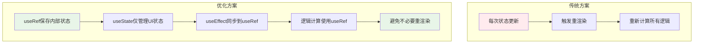

#### 2. 渲染优化技巧

- **虚拟化渲染**: 使用flat()方法减少DOM节点数量
- **条件渲染**: 仅在需要时渲染游戏覆盖层
- **CSS动画**: 使用GPU加速的CSS动画替代JavaScript动画

#### 3. 内存管理优化

- **引用缓存**: 使用useCallback缓存函数引用
- **定时器清理**: 在组件卸载时清理定时器
- **事件监听器**: 正确清理键盘事件监听器

**章节来源**
- [TetrisPage.jsx:75-92](file://src/pages/TetrisPage.jsx#L75-L92)
- [TetrisPage.jsx:240-250](file://src/pages/TetrisPage.jsx#L240-L250)

### 渲染性能优化

#### 1. 渲染树优化

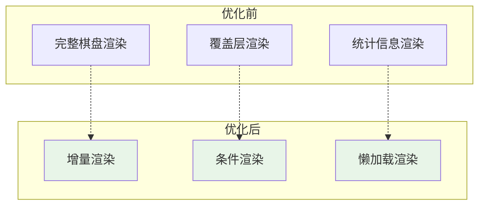

#### 2. 动画性能优化

- **硬件加速**: 使用transform属性而非改变布局属性
- **帧率控制**: 通过CSS动画实现稳定的60fps
- **内存复用**: 复用DOM元素而非频繁创建销毁

## 故障排除指南

### 常见问题诊断

#### 1. 游戏卡顿问题

**症状**: 游戏运行不流畅，出现卡顿现象

**可能原因**:
- 定时器频率过高导致CPU占用
- 状态更新过于频繁
- DOM渲染压力过大

**解决方案**:
- 检查定时器间隔设置
- 优化状态更新逻辑
- 实施渲染节流机制

#### 2. 方块穿透问题

**症状**: 方块穿过底部或重叠其他方块

**可能原因**:
- 碰撞检测逻辑错误
- 状态同步延迟
- 边界检查不完整

**解决方案**:
- 验证isValidPosition函数
- 检查useEffect同步机制
- 添加边界条件检查

#### 3. 键盘响应延迟

**症状**: 键盘输入响应迟缓

**可能原因**:
- 事件监听器绑定问题
- 状态更新阻塞主线程
- 浏览器性能限制

**解决方案**:
- 确认键盘事件监听器正确绑定
- 优化状态更新性能
- 考虑使用requestAnimationFrame

**章节来源**
- [TetrisPage.jsx:40-51](file://src/pages/TetrisPage.jsx#L40-L51)
- [TetrisPage.jsx:252-268](file://src/pages/TetrisPage.jsx#L252-L268)

### 调试工具和技巧

#### 1. 状态监控

使用浏览器开发者工具的React DevTools监控：
- 状态变化频率
- 组件重渲染次数
- 性能瓶颈识别

#### 2. 性能分析

利用Performance面板分析：
- JavaScript执行时间
- 渲染耗时
- 内存使用情况

#### 3. 日志调试

在关键函数中添加日志输出：
- 状态变更日志
- 性能指标记录
- 错误追踪信息

## 结论

本项目展示了如何在React环境中实现一个完整的俄罗斯方块游戏引擎。通过精心设计的状态管理机制、高效的渲染策略和完善的性能优化方案，实现了流畅的游戏体验。

### 核心成就

1. **双状态管理模式**: 成功结合useState和useRef，既保证了React的响应式特性，又提供了高性能的内部状态访问
2. **帧率控制系统**: 实现了动态难度调节，提升了游戏挑战性和可玩性
3. **性能优化实践**: 通过多种优化策略，确保了60fps的稳定帧率
4. **用户体验设计**: 提供了完整的用户交互反馈和视觉效果

### 技术亮点

- **状态同步机制**: 通过useEffect确保React状态与引用状态的一致性
- **碰撞检测算法**: 实现了准确的方块碰撞和边界检测
- **渲染优化策略**: 采用多种技术减少DOM操作和重排重绘
- **生命周期管理**: 完善的组件生命周期处理，包括初始化、运行、暂停和结束

### 改进建议

1. **代码模块化**: 将游戏逻辑进一步拆分为独立的模块
2. **测试覆盖**: 添加单元测试和集成测试
3. **可访问性**: 增强键盘导航和屏幕阅读器支持
4. **移动端适配**: 优化触摸控制和响应式设计

该实现为学习React游戏开发提供了优秀的参考案例，展示了现代前端技术在游戏开发中的应用实践。