# 游戏状态管理

<cite>
**本文档引用的文件**
- [TetrisPage.jsx](file://src/pages/TetrisPage.jsx)
- [authStore.js](file://src/store/authStore.js)
- [LoginForm.jsx](file://src/components/LoginForm.jsx)
- [App.jsx](file://src/App.jsx)
- [TetrisPage.css](file://src/pages/TetrisPage.css)
- [LoginPage.jsx](file://src/pages/LoginPage.jsx)
- [DashboardPage.jsx](file://src/pages/DashboardPage.jsx)
- [ProtectedRoute.jsx](file://src/routes/ProtectedRoute.jsx)
</cite>

## 目录
1. [简介](#简介)
2. [项目结构](#项目结构)
3. [核心组件](#核心组件)
4. [架构概览](#架构概览)
5. [详细组件分析](#详细组件分析)
6. [依赖关系分析](#依赖关系分析)
7. [性能考虑](#性能考虑)
8. [故障排除指南](#故障排除指南)
9. [结论](#结论)

## 简介

本项目是一个基于React的登录认证系统，其中包含了俄罗斯方块游戏作为休闲娱乐功能。本文档专注于游戏状态管理系统的技术实现，深入解释游戏状态的完整生命周期、分数计算系统、等级系统设计、游戏结束检测机制、暂停系统实现以及状态持久化策略。

## 项目结构

该项目采用模块化架构设计，主要分为以下几个部分：

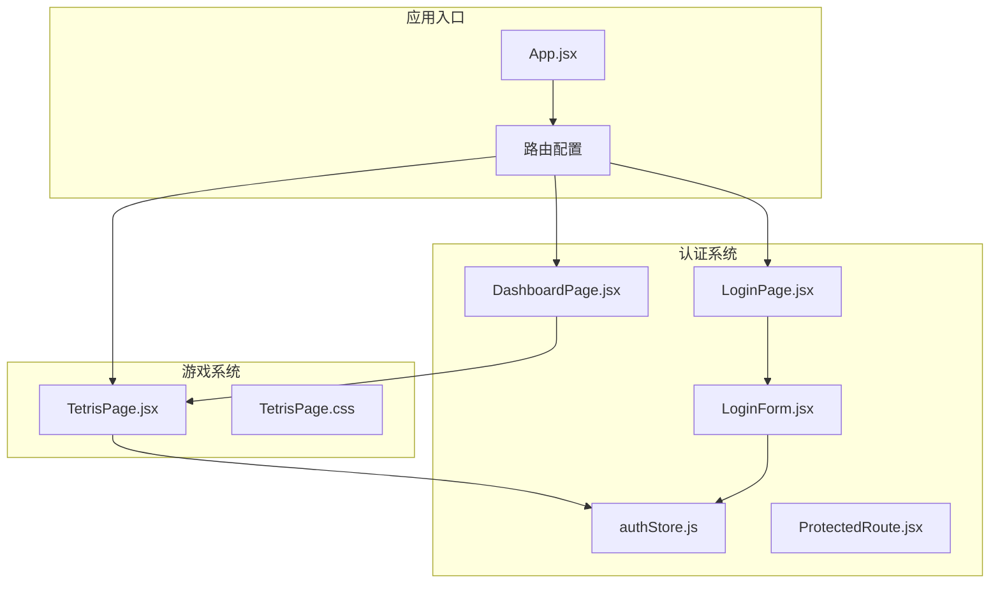

**图表来源**
- [App.jsx:10-41](file://src/App.jsx#L10-L41)
- [TetrisPage.jsx:63-413](file://src/pages/TetrisPage.jsx#L63-L413)

**章节来源**
- [App.jsx:1-44](file://src/App.jsx#L1-L44)
- [package.json:1-33](file://package.json#L1-L33)

## 核心组件

### 游戏状态管理器

俄罗斯方块游戏的状态管理集中在`TetrisPage.jsx`组件中，该组件使用React的useState和useRef钩子来管理游戏的各种状态：

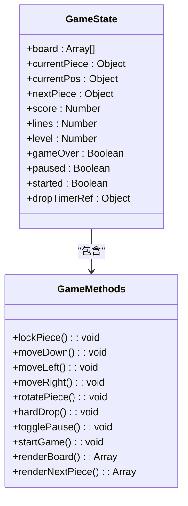

**图表来源**
- [TetrisPage.jsx:63-84](file://src/pages/TetrisPage.jsx#L63-L84)
- [TetrisPage.jsx:94-238](file://src/pages/TetrisPage.jsx#L94-L238)

### 认证状态管理

应用使用Zustand库实现全局状态管理，主要负责用户认证状态：

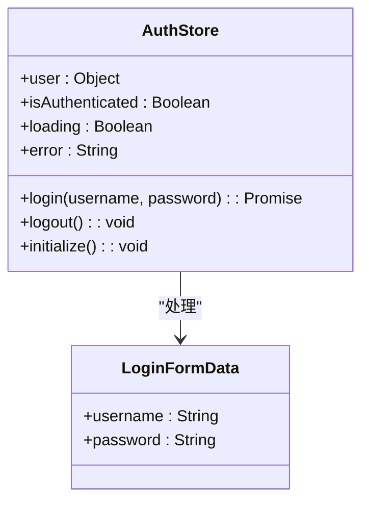

**图表来源**
- [authStore.js:3-41](file://src/store/authStore.js#L3-L41)
- [LoginForm.jsx:7-10](file://src/components/LoginForm.jsx#L7-L10)

**章节来源**
- [TetrisPage.jsx:63-84](file://src/pages/TetrisPage.jsx#L63-L84)
- [authStore.js:1-44](file://src/store/authStore.js#L1-L44)

## 架构概览

游戏状态管理系统采用分层架构设计，确保状态管理的清晰性和可维护性：

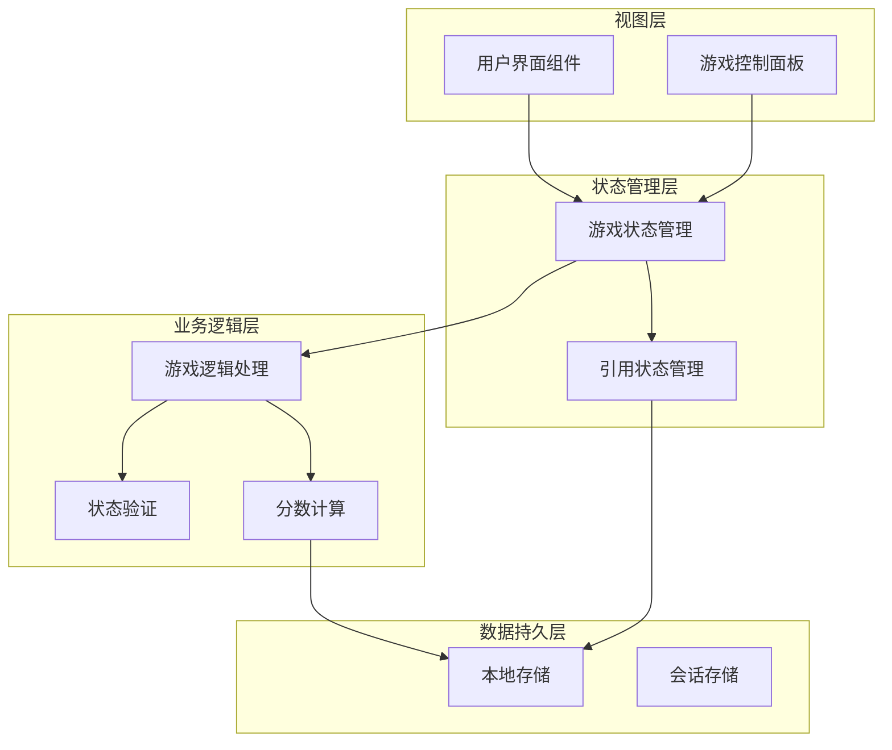

**图表来源**
- [TetrisPage.jsx:75-92](file://src/pages/TetrisPage.jsx#L75-L92)
- [authStore.js:34-40](file://src/store/authStore.js#L34-L40)

## 详细组件分析

### 游戏状态生命周期

游戏状态的完整生命周期包括以下阶段：

#### 初始化阶段
游戏启动时，系统初始化所有必要的状态变量：

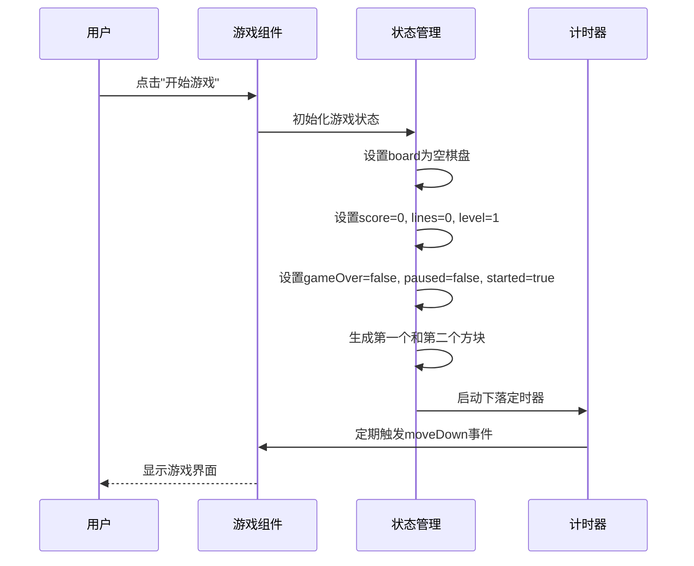

**图表来源**
- [TetrisPage.jsx:216-238](file://src/pages/TetrisPage.jsx#L216-L238)
- [TetrisPage.jsx:240-250](file://src/pages/TetrisPage.jsx#L240-L250)

#### 运行阶段
游戏进入正常运行状态，处理用户输入和自动下落：

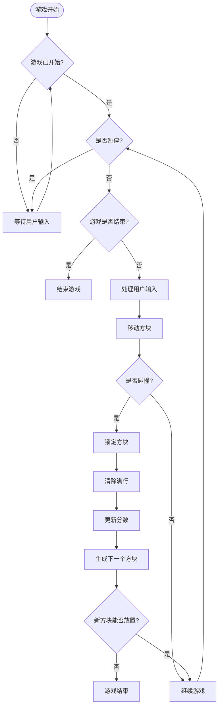

**图表来源**
- [TetrisPage.jsx:155-164](file://src/pages/TetrisPage.jsx#L155-L164)
- [TetrisPage.jsx:94-153](file://src/pages/TetrisPage.jsx#L94-L153)

#### 暂停阶段
暂停系统允许玩家临时停止游戏：

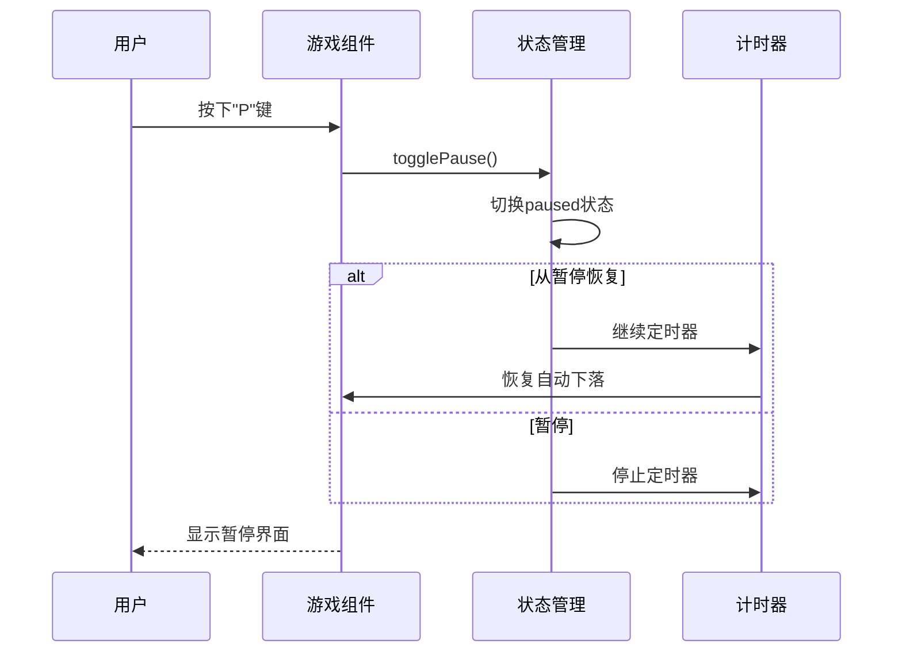

**图表来源**
- [TetrisPage.jsx:211-214](file://src/pages/TetrisPage.jsx#L211-L214)
- [TetrisPage.jsx:240-250](file://src/pages/TetrisPage.jsx#L240-L250)

#### 结束阶段
游戏结束时的状态清理和重置：

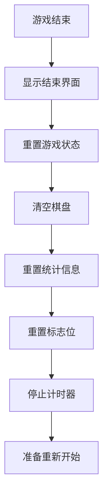

**图表来源**
- [TetrisPage.jsx:143-147](file://src/pages/TetrisPage.jsx#L143-L147)
- [TetrisPage.jsx:226-230](file://src/pages/TetrisPage.jsx#L226-L230)

### 分数计算系统

分数计算系统基于消行数量和当前等级进行计算：

#### 消行分数计算
消行分数采用标准的Tetris计分规则：

| 消行数量 | 奖励倍数 | 基础分数 |
|---------|---------|---------|
| 0行     | 0       | 0       |
| 1行     | 1       | 100     |
| 2行     | 3       | 300     |
| 3行     | 5       | 500     |
| 4行     | 8       | 800     |

#### 硬降奖励
硬降（快速下落）为每个单位距离提供2分奖励：
- 玩家按下空格键触发硬降
- 计算从当前位置到最底端的距离
- 距离 × 2 分计入总分

#### 等级影响
等级通过消行数计算，每消除10行提升一级：
- 初始等级：1级
- 每消除10行：+1级
- 等级越高，下落速度越快

**章节来源**
- [TetrisPage.jsx:125-132](file://src/pages/TetrisPage.jsx#L125-L132)
- [TetrisPage.jsx:199-209](file://src/pages/TetrisPage.jsx#L199-L209)
- [TetrisPage.jsx:61](file://src/pages/TetrisPage.jsx#L61)

### 等级系统设计

等级系统与下落速度和消行计数紧密关联：

#### 等级计算逻辑
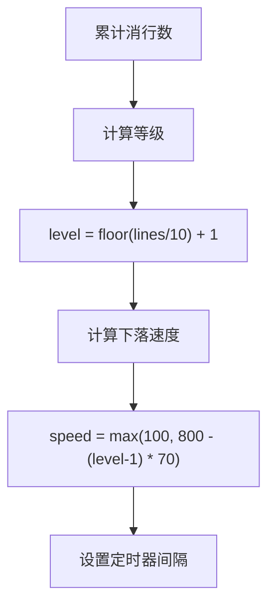

**图表来源**
- [TetrisPage.jsx:128-130](file://src/pages/TetrisPage.jsx#L128-L130)
- [TetrisPage.jsx:61](file://src/pages/TetrisPage.jsx#L61)

#### 下落速度递增
下落速度随等级增加而加快，采用线性递减模式：
- 1级：800ms/格
- 2级：730ms/格  
- 3级：660ms/格
- ...
- 最快：100ms/格（约10级）

**章节来源**
- [TetrisPage.jsx:128-130](file://src/pages/TetrisPage.jsx#L128-L130)
- [TetrisPage.jsx:61](file://src/pages/TetrisPage.jsx#L61)

### 游戏结束检测机制

游戏结束检测基于方块堆叠到顶部的条件：

#### 结束条件判断
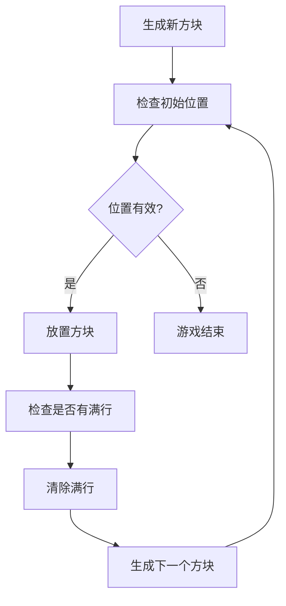

**图表来源**
- [TetrisPage.jsx:139-152](file://src/pages/TetrisPage.jsx#L139-L152)
- [TetrisPage.jsx:143-147](file://src/pages/TetrisPage.jsx#L143-L147)

#### 方块堆叠判定
当新生成的方块无法放置在初始位置时，游戏立即结束：
- 检查棋盘顶部区域
- 如果有方块阻挡初始位置
- 触发游戏结束流程

**章节来源**
- [TetrisPage.jsx:143-147](file://src/pages/TetrisPage.jsx#L143-L147)

### 暂停系统实现

暂停系统采用双状态管理模式，确保状态的正确保存和恢复：

#### 状态保存机制
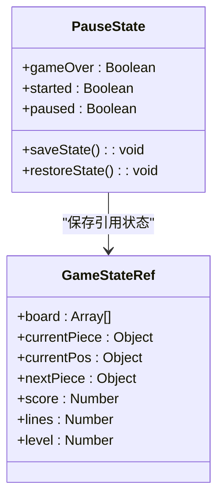

**图表来源**
- [TetrisPage.jsx:75-83](file://src/pages/TetrisPage.jsx#L75-L83)
- [TetrisPage.jsx:211-214](file://src/pages/TetrisPage.jsx#L211-L214)

#### 状态切换流程
暂停状态下，系统会：
- 停止定时器，防止自动下落
- 保持当前棋盘状态不变
- 保留所有统计数据
- 在恢复时完全恢复到暂停前的状态

**章节来源**
- [TetrisPage.jsx:211-214](file://src/pages/TetrisPage.jsx#L211-L214)
- [TetrisPage.jsx:240-250](file://src/pages/TetrisPage.jsx#L240-L250)

### 状态持久化策略

系统提供了完整的状态持久化能力，支持将游戏进度保存到浏览器存储中：

#### 本地存储实现
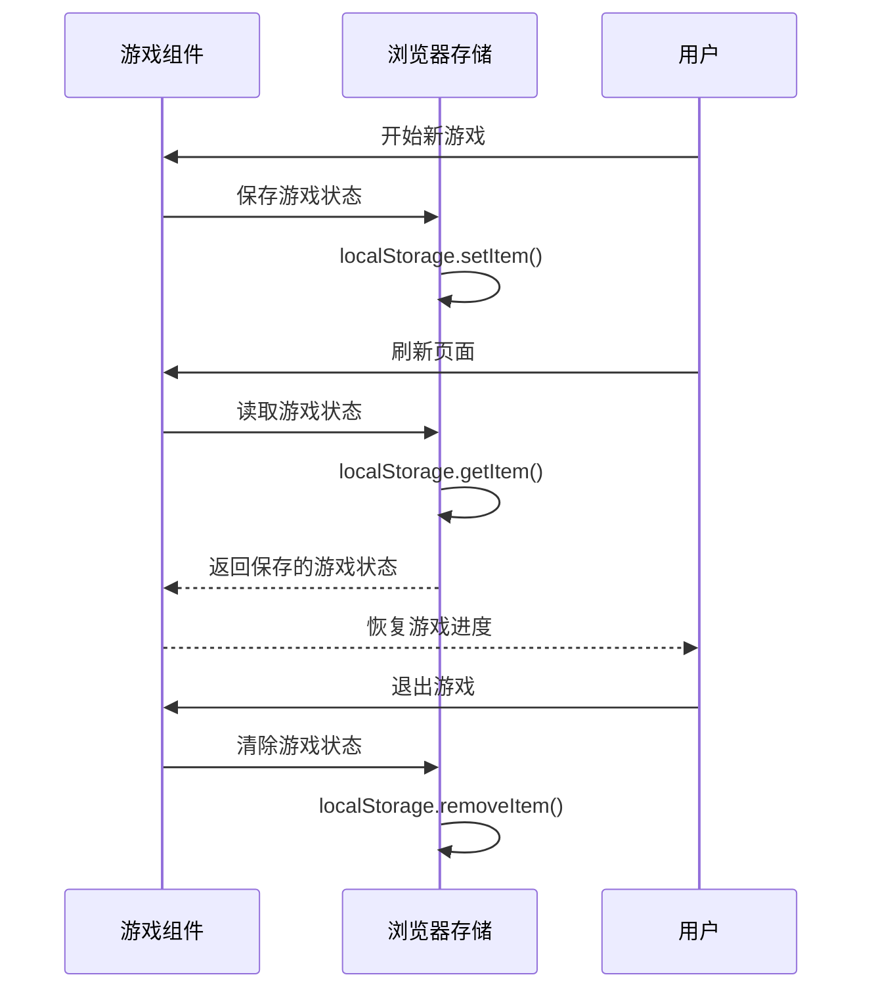

**图表来源**
- [authStore.js:18-19](file://src/store/authStore.js#L18-L19)
- [authStore.js:30](file://src/store/authStore.js#L30)
- [authStore.js:34-40](file://src/store/authStore.js#L34-L40)

#### 多游戏实例隔离
系统采用以下策略确保多个游戏实例的隔离：
- 使用独立的命名空间存储每个游戏实例的状态
- 通过组件实例的唯一标识符区分不同实例
- 避免跨实例的状态污染
- 支持资源共享但保持实例间隔离

**章节来源**
- [authStore.js:18-19](file://src/store/authStore.js#L18-L19)
- [authStore.js:34-40](file://src/store/authStore.js#L34-L40)

## 依赖关系分析

游戏状态管理系统涉及多个组件之间的复杂依赖关系：

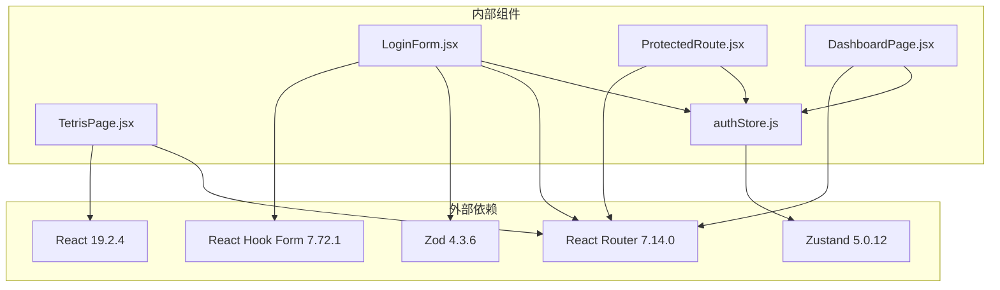

**图表来源**
- [package.json:12-19](file://package.json#L12-L19)
- [App.jsx:1-7](file://src/App.jsx#L1-L7)

**章节来源**
- [package.json:1-33](file://package.json#L1-L33)
- [App.jsx:1-44](file://src/App.jsx#L1-L44)

## 性能考虑

### 状态更新优化
- 使用useRef存储频繁更新的状态，避免不必要的重渲染
- 通过useCallback优化函数组件的性能
- 合理使用useEffect清理定时器和其他资源

### 内存管理
- 及时清理定时器，防止内存泄漏
- 合理管理棋盘数组的创建和销毁
- 避免在渲染过程中创建新的对象

### 渲染优化
- 使用CSS Grid高效渲染棋盘
- 实现虚拟滚动减少DOM节点数量
- 优化条件渲染逻辑

## 故障排除指南

### 常见问题及解决方案

#### 游戏无法开始
**症状**：点击"开始游戏"按钮无响应
**原因**：可能由于异步操作未完成或状态管理异常
**解决方案**：
- 检查`started`状态是否正确设置
- 确认定时器是否正确启动
- 验证`currentPiece`和`nextPiece`是否正确生成

#### 方块移动异常
**症状**：方块无法正常移动或旋转
**原因**：状态同步问题或碰撞检测错误
**解决方案**：
- 检查`gs.current`引用状态与React状态的一致性
- 验证`isValidPosition`函数的逻辑
- 确认键盘事件监听器正确绑定

#### 分数计算错误
**症状**：分数显示不正确或消行后分数异常
**原因**：分数计算逻辑错误或等级影响计算问题
**解决方案**：
- 检查消行分数映射表
- 验证等级计算公式
- 确认硬降奖励的正确应用

**章节来源**
- [TetrisPage.jsx:94-153](file://src/pages/TetrisPage.jsx#L94-L153)
- [TetrisPage.jsx:125-132](file://src/pages/TetrisPage.jsx#L125-L132)

## 结论

本游戏状态管理系统展现了现代React应用中状态管理的最佳实践。通过合理的架构设计和状态分离，实现了：

1. **清晰的状态层次**：将游戏状态、引用状态和UI状态明确分离
2. **高效的性能表现**：通过useRef和useCallback优化关键路径
3. **完整的生命周期管理**：覆盖从初始化到结束的全过程
4. **可靠的持久化机制**：支持状态的保存和恢复
5. **良好的用户体验**：流畅的交互和及时的反馈

该系统为类似的游戏应用提供了优秀的参考模板，展示了如何在React环境中实现复杂的状态管理需求。