# 物理机制

<cite>
**本文档引用的文件**
- [TetrisPage.jsx](file://src/pages/TetrisPage.jsx)
- [TetrisPage.css](file://src/pages/TetrisPage.css)
</cite>

## 目录
1. [简介](#简介)
2. [项目结构](#项目结构)
3. [核心组件](#核心组件)
4. [架构概览](#架构概览)
5. [详细组件分析](#详细组件分析)
6. [依赖关系分析](#依赖关系分析)
7. [性能考虑](#性能考虑)
8. [故障排除指南](#故障排除指南)
9. [结论](#结论)

## 简介

本文件详细阐述了React Tetris游戏中物理机制的实现原理和技术细节。该系统实现了标准俄罗斯方块的核心物理特性，包括重力系统、碰撞检测、方块锁定、幽灵方块投影、行消除等完整功能。文档将深入分析每个物理组件的实现方式，提供可视化图表和最佳实践建议。

## 项目结构

该项目采用React函数组件架构，主要的游戏逻辑集中在单个页面组件中：

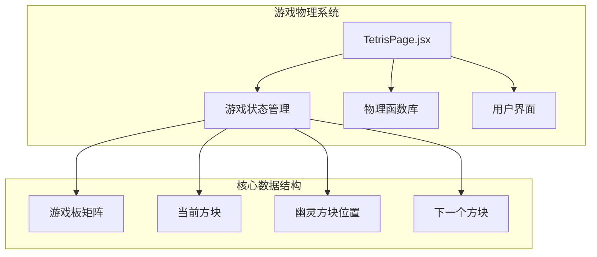

**图表来源**
- [TetrisPage.jsx:63-410](file://src/pages/TetrisPage.jsx#L63-L410)

**章节来源**
- [TetrisPage.jsx:1-413](file://src/pages/TetrisPage.jsx#L1-L413)

## 核心组件

### 游戏常量定义

系统使用固定的网格尺寸和预定义的七种标准俄罗斯方块形状：

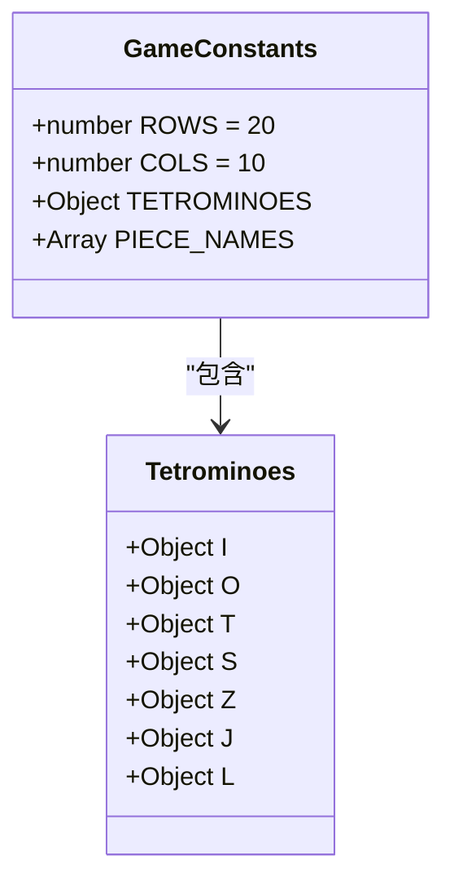

**图表来源**
- [TetrisPage.jsx:5-18](file://src/pages/TetrisPage.jsx#L5-L18)

系统支持七种经典方块类型，每种都有独特的形状矩阵和颜色标识：
- I型：直线方块（4个单元）
- O型：正方形方块（2×2）
- T型：T字形方块（3个单元）
- S型：右弯方块（4个单元）
- Z型：左弯方块（4个单元）
- J型：反向L字形（4个单元）
- L型：L字形方块（4个单元）

**章节来源**
- [TetrisPage.jsx:8-16](file://src/pages/TetrisPage.jsx#L8-L16)

### 游戏状态管理

使用React的useRef创建持久化的游戏状态对象，确保物理计算的实时性和准确性：

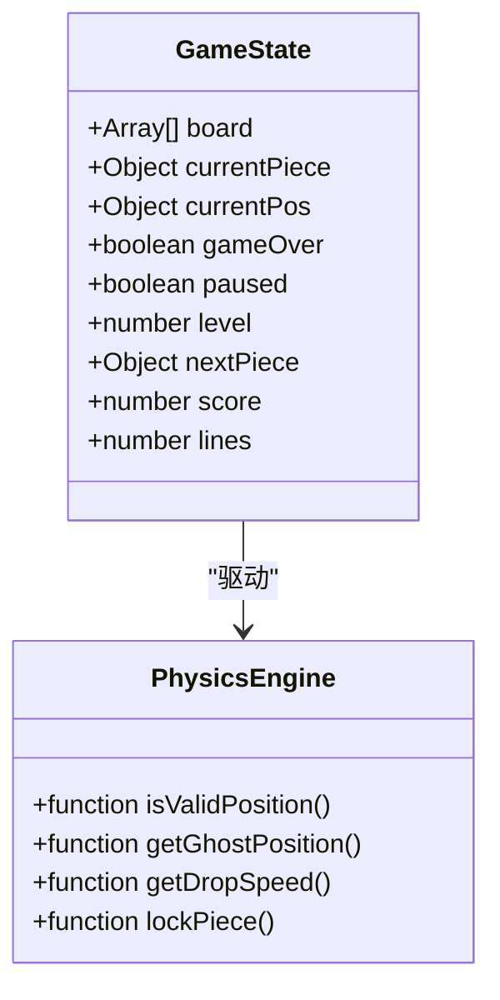

**图表来源**
- [TetrisPage.jsx:75-84](file://src/pages/TetrisPage.jsx#L75-L84)

**章节来源**
- [TetrisPage.jsx:63-93](file://src/pages/TetrisPage.jsx#L63-L93)

## 架构概览

整个物理系统采用函数式编程模式，通过纯函数实现核心物理逻辑：

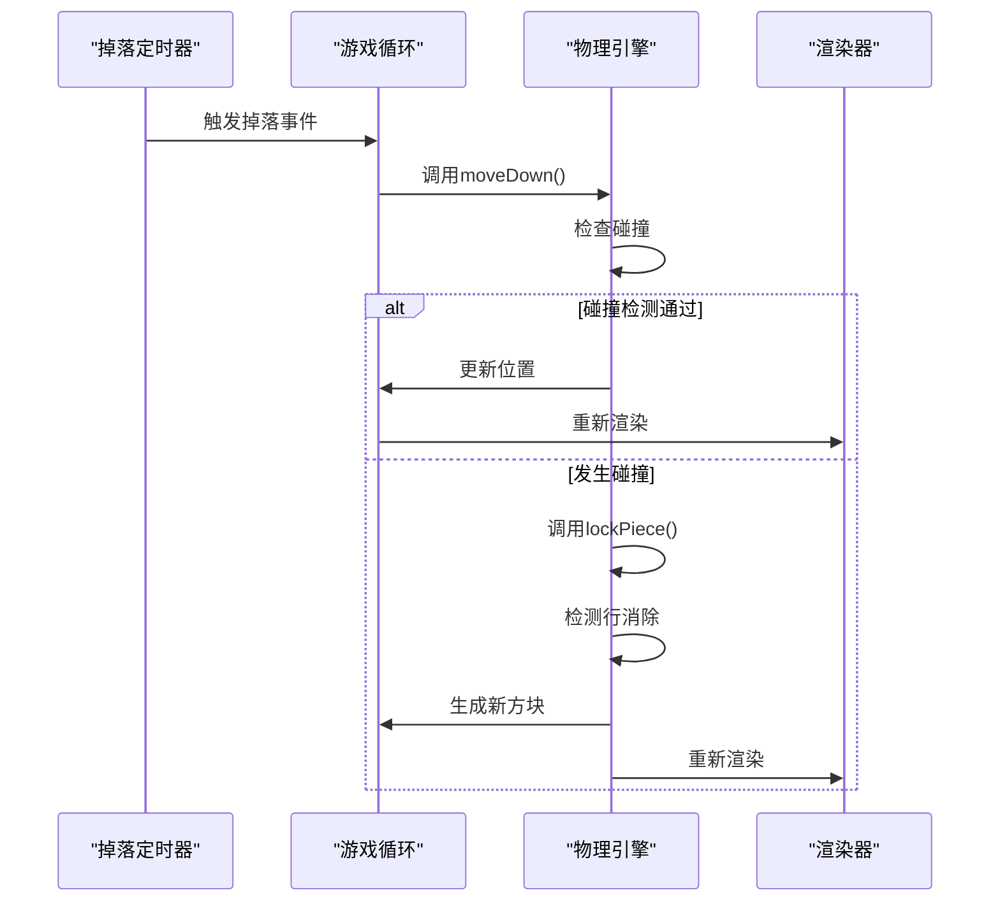

**图表来源**
- [TetrisPage.jsx:155-164](file://src/pages/TetrisPage.jsx#L155-L164)
- [TetrisPage.jsx:240-250](file://src/pages/TetrisPage.jsx#L240-L250)

## 详细组件分析

### 重力系统设计

#### getDropSpeed难度递增函数

重力系统的难度递增遵循线性衰减模型，确保游戏体验的渐进挑战性：

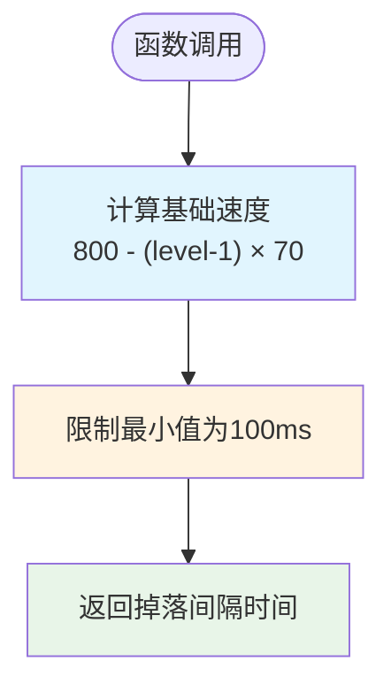

**图表来源**
- [TetrisPage.jsx:61](file://src/pages/TetrisPage.jsx#L61)

难度递增公式特点：
- 基础掉落速度：800毫秒
- 每级递减：70毫秒
- 最小限制：100毫秒
- 计算范围：100-800毫秒

#### 速度计算公式

掉落速度与等级的关系为：
```
dropSpeed(level) = max(100, 800 - (level - 1) × 70)
```

这种设计确保：
1. **渐进难度**：等级越高，方块下落越快
2. **可预测性**：固定的时间间隔便于玩家适应
3. **上限保护**：防止速度过快影响游戏体验

**章节来源**
- [TetrisPage.jsx:61](file://src/pages/TetrisPage.jsx#L61)
- [TetrisPage.jsx:246-248](file://src/pages/TetrisPage.jsx#L246-L248)

### 碰撞检测算法

#### isValidPosition函数实现

碰撞检测是物理系统的核心，负责验证方块移动的有效性：

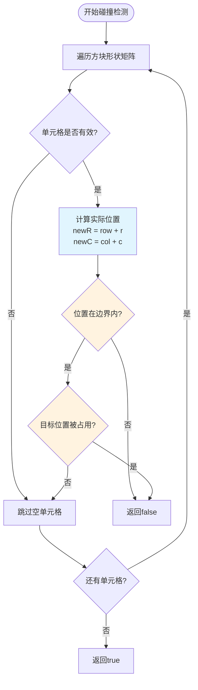

**图表来源**
- [TetrisPage.jsx:40-51](file://src/pages/TetrisPage.jsx#L40-L51)

碰撞检测的边界检查机制：
1. **边界约束**：位置必须在0到ROWS-1和0到COLS-1范围内
2. **占用检查**：目标位置必须为空（null）
3. **形状遍历**：仅检查非零单元格（方块的实际部分）

#### 边界检查机制

边界检查采用双重验证策略：

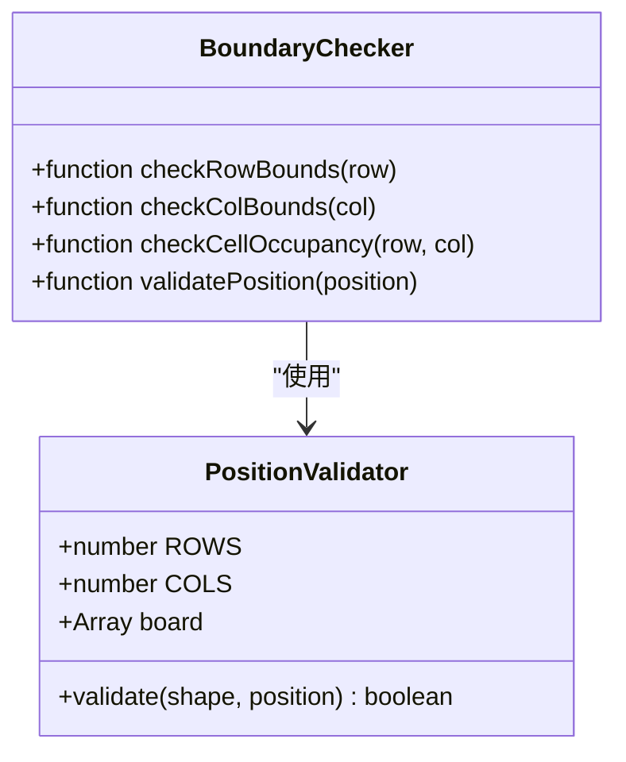

**图表来源**
- [TetrisPage.jsx:40-51](file://src/pages/TetrisPage.jsx#L40-L51)

**章节来源**
- [TetrisPage.jsx:40-51](file://src/pages/TetrisPage.jsx#L40-L51)

### 方块锁定机制

#### lockPiece函数实现

方块锁定是物理系统的关键转折点，负责将活动方块永久固定到游戏板上：

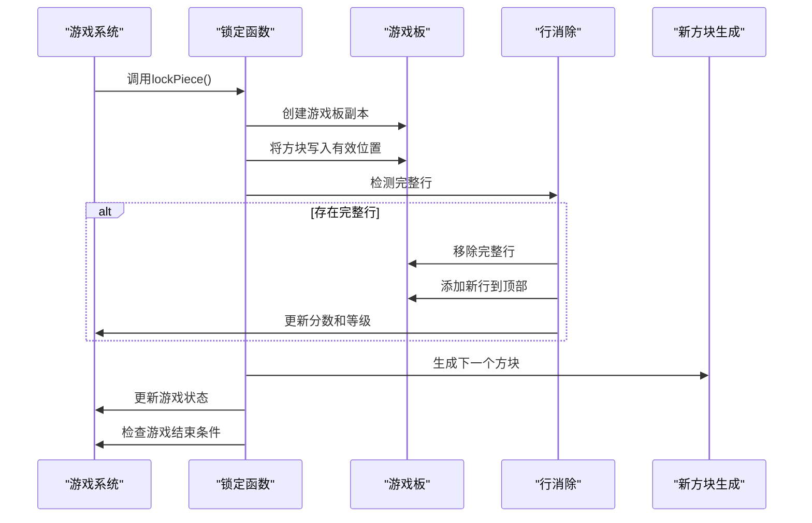

**图表来源**
- [TetrisPage.jsx:94-153](file://src/pages/TetrisPage.jsx#L94-L153)

锁定流程的详细步骤：

1. **状态复制**：创建当前游戏板的深拷贝，避免直接修改
2. **位置映射**：将方块的相对坐标转换为绝对游戏板坐标
3. **边界过滤**：仅处理在有效行范围内的单元格
4. **着色标记**：将方块颜色写入对应的游戏板位置

#### 行消除算法

行消除采用自底向上的扫描策略：

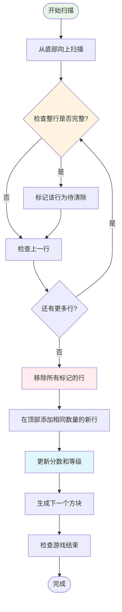

**图表来源**
- [TetrisPage.jsx:113-133](file://src/pages/TetrisPage.jsx#L113-L133)

行消除的计分规则：
- 单行：100 × 等级
- 双行：300 × 等级  
- 三行：500 × 等级
- 四行：800 × 等级

等级提升机制：每消除10行提升一级，最高可达9级

**章节来源**
- [TetrisPage.jsx:94-153](file://src/pages/TetrisPage.jsx#L94-L153)

### 幽灵方块系统

#### getGhostPosition函数

幽灵方块提供视觉反馈，显示方块的最终着陆位置：

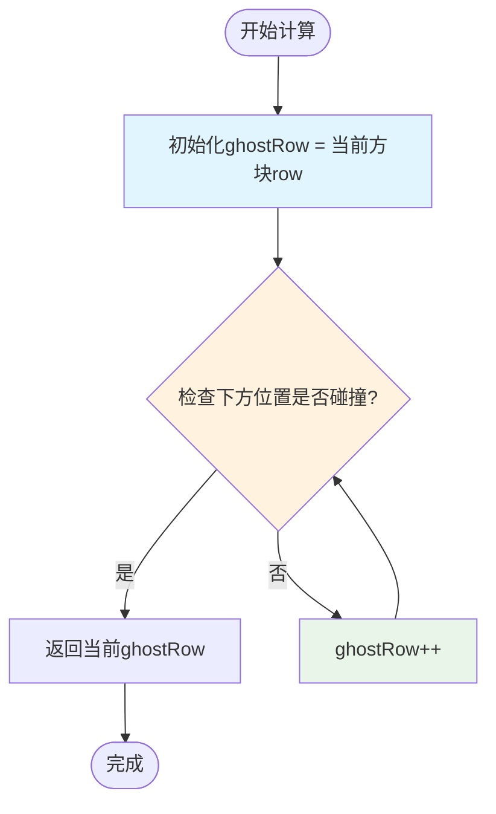

**图表来源**
- [TetrisPage.jsx:53-59](file://src/pages/TetrisPage.jsx#L53-L59)

幽灵方块的计算特点：
1. **连续检测**：从当前位置向下逐行检查
2. **即时停止**：遇到碰撞立即停止
3. **精确投影**：显示方块的最终着陆位置
4. **视觉分离**：使用特殊样式区分普通方块和幽灵方块

**章节来源**
- [TetrisPage.jsx:53-59](file://src/pages/TetrisPage.jsx#L53-L59)

### 物理交互系统

#### 键盘控制与物理响应

系统支持完整的键盘控制，每个按键都触发相应的物理动作：

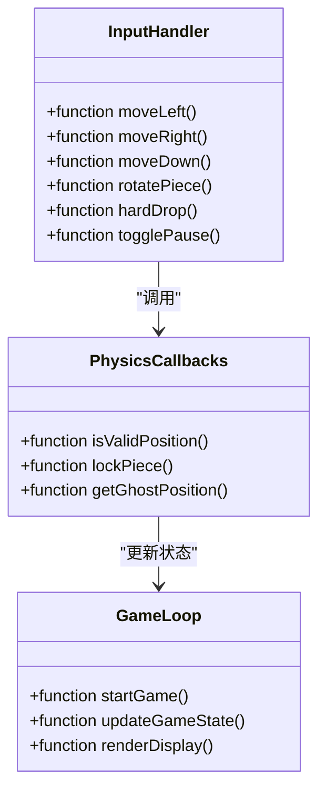

**图表来源**
- [TetrisPage.jsx:166-209](file://src/pages/TetrisPage.jsx#L166-L209)

**章节来源**
- [TetrisPage.jsx:252-268](file://src/pages/TetrisPage.jsx#L252-L268)

## 依赖关系分析

### 物理系统内部依赖

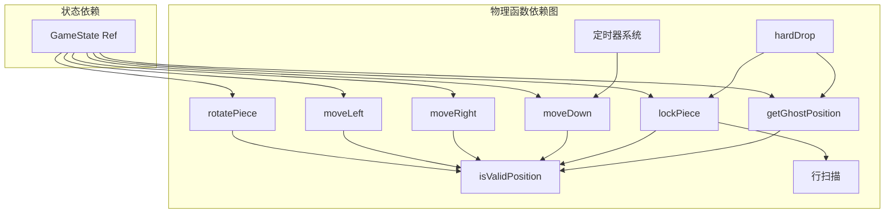

**图表来源**
- [TetrisPage.jsx:40-61](file://src/pages/TetrisPage.jsx#L40-L61)
- [TetrisPage.jsx:75-93](file://src/pages/TetrisPage.jsx#L75-L93)

### 外部依赖关系

系统依赖于React的状态管理和副作用处理机制：

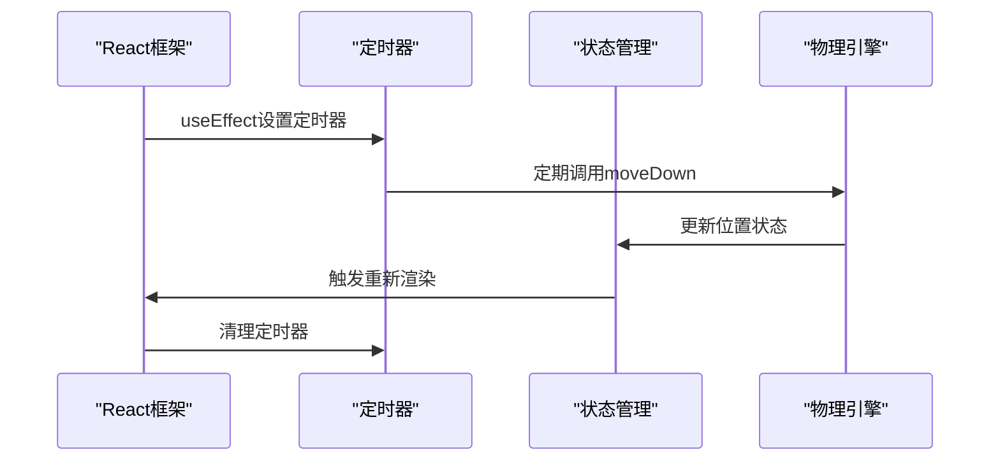

**图表来源**
- [TetrisPage.jsx:240-250](file://src/pages/TetrisPage.jsx#L240-L250)

**章节来源**
- [TetrisPage.jsx:86-92](file://src/pages/TetrisPage.jsx#L86-L92)

## 性能考虑

### 时间复杂度分析

| 函数 | 时间复杂度 | 空间复杂度 | 说明 |
|------|------------|------------|------|
| isValidPosition | O(b) | O(1) | b为方块单元格数量 |
| getGhostPosition | O(h) | O(1) | h为垂直距离 |
| lockPiece | O(R×C+b) | O(R×C) | R×C为游戏板大小 |
| 行扫描 | O(R×C) | O(L) | L为完整行数量 |

### 优化策略

#### 1. 碰撞检测优化

- **早期退出**：一旦发现无效位置立即返回
- **边界预检查**：在数组访问前进行边界验证
- **形状遍历优化**：跳过空单元格减少不必要的检查

#### 2. 内存管理优化

- **状态引用**：使用useRef存储游戏状态避免不必要的重渲染
- **深拷贝优化**：仅在必要时创建游戏板副本
- **垃圾回收**：及时清理定时器和事件监听器

#### 3. 渲染性能优化

- **虚拟化渲染**：使用CSS Grid而非大量DOM元素
- **条件渲染**：仅在状态变化时更新相关区域
- **样式复用**：统一的颜色和样式类减少CSS解析

#### 4. 实时性优化

- **帧率同步**：使用requestAnimationFrame替代setInterval
- **输入缓冲**：处理快速连续按键输入
- **状态一致性**：确保物理计算和渲染状态同步

## 故障排除指南

### 常见问题诊断

#### 1. 方块穿透问题

**症状**：方块穿过游戏板边界或相互穿透
**可能原因**：
- 碰撞检测边界检查不完整
- 状态更新顺序错误
- 定时器冲突

**解决方案**：
- 验证isValidPosition函数的边界检查逻辑
- 确保状态更新在渲染之前完成
- 检查定时器的清理和重新设置

#### 2. 幽灵方块显示异常

**症状**：幽灵方块位置不正确或显示错误
**可能原因**：
- getGhostPosition函数计算错误
- 渲染时序问题
- 状态不同步

**解决方案**：
- 重新计算幽灵方块位置
- 确保渲染使用最新的游戏状态
- 检查状态引用的一致性

#### 3. 行消除逻辑错误

**症状**：行消除不触发或错误移除
**可能原因**：
- 行扫描算法错误
- 分数计算公式不正确
- 等级提升逻辑问题

**解决方案**：
- 验证行完整性检查逻辑
- 检查分数乘数和等级系数
- 确认等级计算的整数除法

#### 4. 性能问题

**症状**：游戏运行缓慢或卡顿
**可能原因**：
- 频繁的状态更新
- 不必要的渲染
- 内存泄漏

**解决方案**：
- 优化状态更新频率
- 实施渲染节流
- 检查定时器和事件监听器的清理

### 调试技巧

#### 1. 状态监控

使用浏览器开发者工具监控：
- 游戏板状态变化
- 方块位置坐标
- 分数和等级数值
- 定时器状态

#### 2. 性能分析

- 使用React DevTools Profiler
- 监控渲染次数和时间
- 分析内存使用情况
- 检查事件监听器数量

#### 3. 日志记录

在关键物理函数中添加日志：
- 碰撞检测结果
- 行消除触发条件
- 状态更新前后对比
- 性能指标测量

**章节来源**
- [TetrisPage.jsx:155-164](file://src/pages/TetrisPage.jsx#L155-L164)
- [TetrisPage.jsx:240-250](file://src/pages/TetrisPage.jsx#L240-L250)

## 结论

本物理系统实现了标准俄罗斯方块的核心机制，具有以下特点：

### 技术优势

1. **模块化设计**：清晰分离的物理函数和状态管理
2. **性能优化**：高效的碰撞检测和行消除算法
3. **用户体验**：流畅的动画和即时反馈
4. **可扩展性**：易于添加新功能和调整参数

### 设计亮点

- **渐进难度**：合理的速度递增曲线
- **精确控制**：完整的键盘控制支持
- **视觉反馈**：幽灵方块提供直观的位置信息
- **状态管理**：稳定的引用式状态存储

### 改进建议

1. **算法优化**：考虑使用更高效的碰撞检测算法
2. **性能增强**：实施更严格的渲染节流
3. **功能扩展**：添加更多游戏变体选项
4. **测试完善**：建立全面的单元测试和集成测试

该物理系统为学习游戏开发提供了优秀的参考实现，展示了如何在React环境中构建复杂的物理模拟系统。