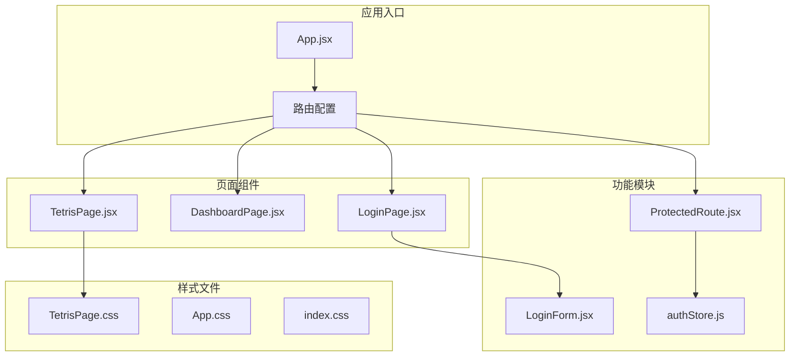
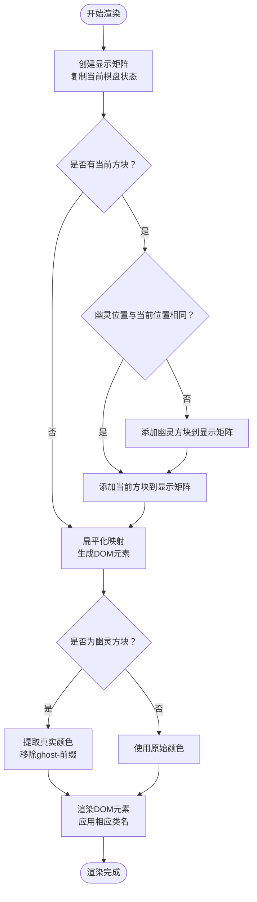
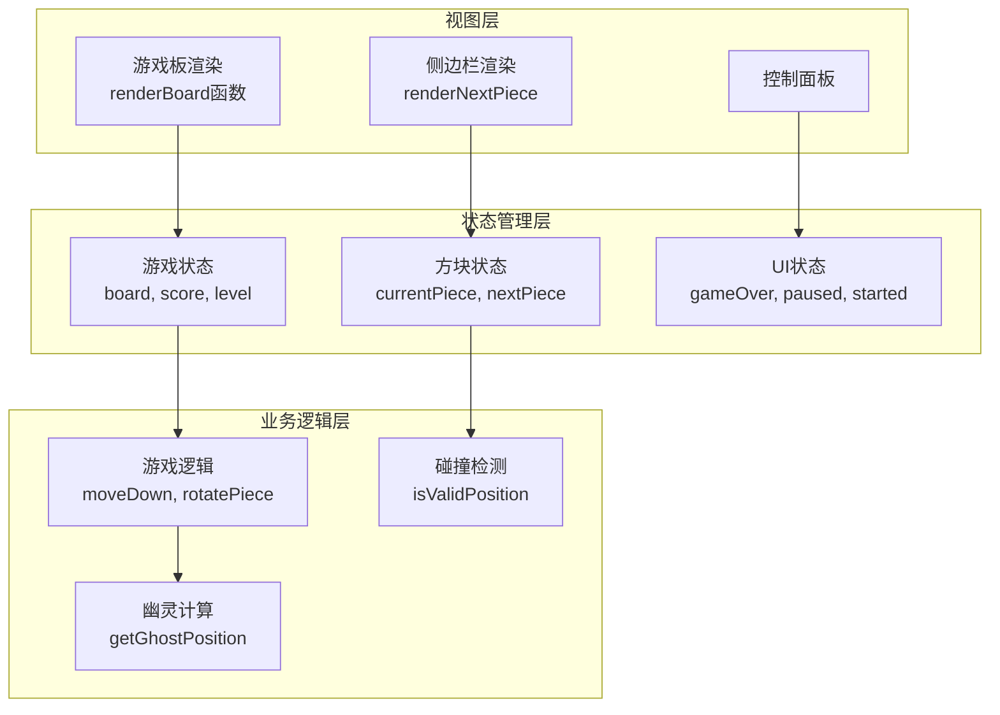
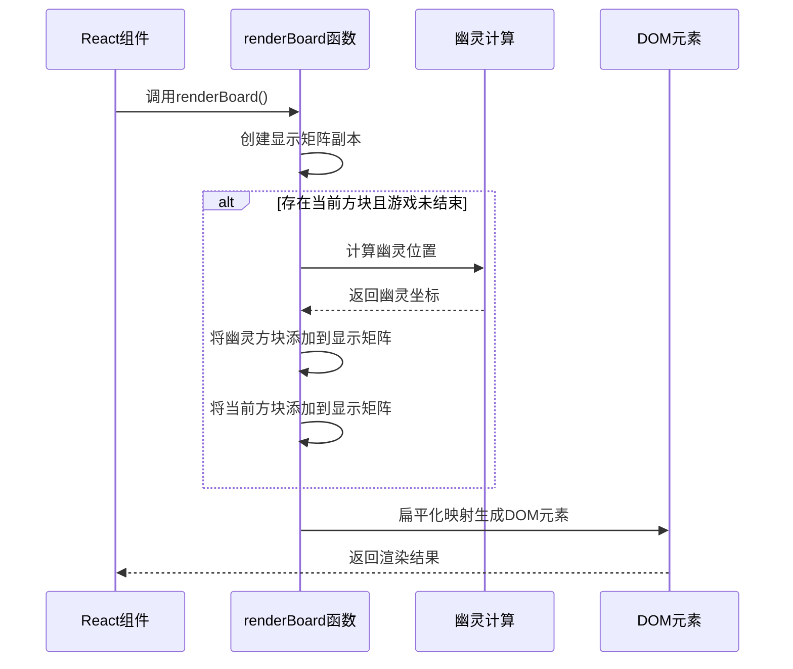
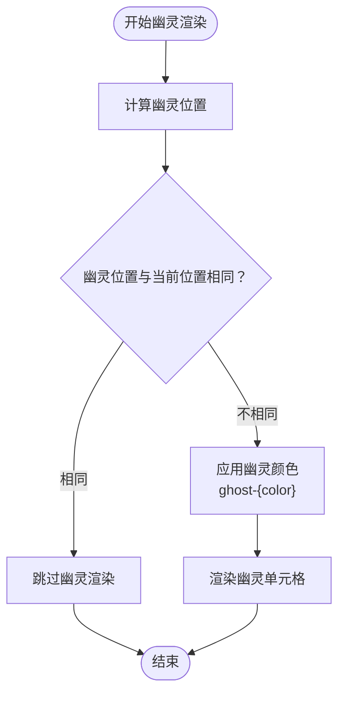
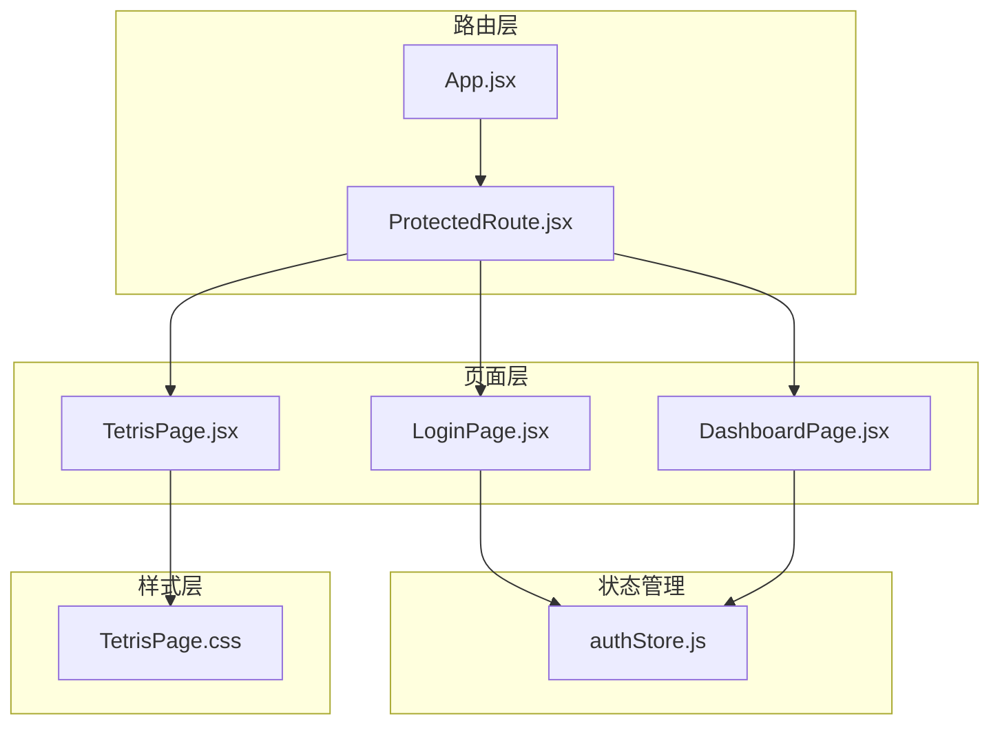

# 界面渲染

<cite>
**本文引用的文件**
- [TetrisPage.jsx](file://src/pages/TetrisPage.jsx)
- [TetrisPage.css](file://src/pages/TetrisPage.css)
- [App.jsx](file://src/App.jsx)
- [ProtectedRoute.jsx](file://src/routes/ProtectedRoute.jsx)
- [authStore.js](file://src/store/authStore.js)
</cite>

## 目录
1. [简介](#简介)
2. [项目结构](#项目结构)
3. [核心组件](#核心组件)
4. [架构概览](#架构概览)
5. [详细组件分析](#详细组件分析)
6. [依赖关系分析](#依赖关系分析)
7. [性能考虑](#性能考虑)
8. [故障排除指南](#故障排除指南)
9. [结论](#结论)

## 简介

本文档深入解析了基于React的俄罗斯方块游戏界面渲染系统。该系统实现了完整的游戏板渲染、方块颜色系统、幽灵方块效果、侧边栏信息展示以及响应式设计。通过CSS Grid布局和高效的DOM元素生成机制，为玩家提供了流畅的游戏体验。

## 项目结构

该项目采用模块化架构，主要包含以下关键目录和文件：



**图表来源**
- [App.jsx:1-44](file://src/App.jsx#L1-L44)
- [TetrisPage.jsx:1-413](file://src/pages/TetrisPage.jsx#L1-L413)

**章节来源**
- [App.jsx:1-44](file://src/App.jsx#L1-L44)
- [TetrisPage.jsx:1-413](file://src/pages/TetrisPage.jsx#L1-L413)

## 核心组件

### 游戏板渲染引擎

游戏板渲染系统的核心是`renderBoard`函数，它负责将内部的二维数组状态转换为可视化的DOM元素。该函数采用"显示矩阵"的概念，在渲染前创建当前游戏状态的副本，确保渲染过程不会影响实际的游戏逻辑。



**图表来源**
- [TetrisPage.jsx:270-311](file://src/pages/TetrisPage.jsx#L270-L311)

### 方块颜色系统

系统实现了完整的七种经典俄罗斯方块的颜色标识系统，每种方块都有独特的视觉特征：

| 方块类型 | 颜色标识 | CSS类名 | RGB值 | 视觉效果 |
|---------|----------|---------|-------|----------|
| I型 | I | `.tetris-cell.I` | `#00f0f0` | 青色，带内阴影 |
| O型 | O | `.tetris-cell.O` | `#f0f000` | 黄色，带内阴影 |
| T型 | T | `.tetris-cell.T` | `#a000f0` | 紫色，带内阴影 |
| S型 | S | `.tetris-cell.S` | `#00f000` | 绿色，带内阴影 |
| Z型 | Z | `.tetris-cell.Z` | `#f00000` | 红色，带内阴影 |
| J型 | J | `.tetris-cell.J` | `#0000f0` | 蓝色，带内阴影 |
| L型 | L | `.tetris-cell.L` | `#f0a000` | 橙色，带内阴影 |

**章节来源**
- [TetrisPage.jsx:8-16](file://src/pages/TetrisPage.jsx#L8-L16)
- [TetrisPage.css:58-64](file://src/pages/TetrisPage.css#L58-L64)

## 架构概览

整个渲染系统采用函数式组件模式，结合React Hooks实现状态管理。系统架构分为三个层次：



**图表来源**
- [TetrisPage.jsx:63-410](file://src/pages/TetrisPage.jsx#L63-L410)

**章节来源**
- [TetrisPage.jsx:63-410](file://src/pages/TetrisPage.jsx#L63-L410)

## 详细组件分析

### 渲染引擎深度解析

#### renderBoard函数实现

`renderBoard`函数是整个渲染系统的核心，它实现了以下关键功能：

1. **状态同步**：创建当前棋盘状态的深拷贝，避免直接修改原始数据
2. **幽灵方块计算**：动态计算当前方块的投影位置
3. **条件渲染**：根据游戏状态决定是否显示当前方块
4. **颜色处理**：区分普通方块和幽灵方块的颜色应用



**图表来源**
- [TetrisPage.jsx:270-311](file://src/pages/TetrisPage.jsx#L270-L311)

#### 幽灵方块渲染机制

幽灵方块是游戏中重要的视觉辅助功能，帮助玩家确定方块的最终落点。系统通过以下步骤实现：

1. **位置计算**：使用`getGhostPosition`函数找到方块的投影位置
2. **半透明效果**：通过特殊的颜色标识符实现透明度效果
3. **实时更新**：随着方块移动和旋转，幽灵位置动态调整



**图表来源**
- [TetrisPage.jsx:53-59](file://src/pages/TetrisPage.jsx#L53-L59)
- [TetrisPage.jsx:270-311](file://src/pages/TetrisPage.jsx#L270-L311)

**章节来源**
- [TetrisPage.jsx:270-311](file://src/pages/TetrisPage.jsx#L270-L311)
- [TetrisPage.jsx:53-59](file://src/pages/TetrisPage.jsx#L53-L59)

### CSS Grid布局应用

#### 游戏板网格设计

游戏板采用CSS Grid实现精确的20×10网格布局：

```css
.tetris-board {
  display: grid;
  grid-template-columns: repeat(10, 30px);
  grid-template-rows: repeat(20, 30px);
}
```

每个单元格具有固定的尺寸（30px × 30px），确保方块的视觉比例一致。网格容器还包含以下样式特性：

- **边框设计**：3px深色边框，增强立体感
- **背景效果**：深色背景配合渐变阴影
- **边框圆角**：4px圆角提升视觉舒适度

#### 响应式适配策略

系统采用相对单位和弹性布局实现响应式设计：

```css
.tetris-wrapper {
  display: flex;
  gap: 24px;
  align-items: flex-start;
}

.side-panel {
  min-width: 160px;
}
```

侧边栏采用固定宽度（160px）确保内容布局稳定，同时主游戏区域使用flex布局适应不同屏幕尺寸。

**章节来源**
- [TetrisPage.css:36-44](file://src/pages/TetrisPage.css#L36-L44)
- [TetrisPage.css:12-22](file://src/pages/TetrisPage.css#L12-L22)

### 侧边栏信息渲染

#### 下一个方块预览

侧边栏的第一个面板展示下一个即将出现的方块，采用4×4的网格布局：

```css
.next-piece-grid {
  display: grid;
  grid-template-columns: repeat(4, 24px);
  grid-template-rows: repeat(4, 24px);
  justify-content: center;
}
```

渲染算法通过计算方块形状的居中偏移量，确保不同形状的方块都能正确显示在网格中心。

#### 统计数据显示

侧边栏包含三个核心统计信息面板：

1. **分数统计**：使用醒目的黄色字体突出显示
2. **行数统计**：显示玩家清除的总行数
3. **等级统计**：反映游戏难度级别

每个统计项都采用灵活的布局设计，支持响应式调整。

**章节来源**
- [TetrisPage.jsx:313-329](file://src/pages/TetrisPage.jsx#L313-L329)
- [TetrisPage.jsx:370-389](file://src/pages/TetrisPage.jsx#L370-L389)

### 移动端适配和触摸控制

虽然当前版本主要针对桌面环境优化，但系统具备良好的移动端适配基础：

#### 触摸友好的按钮设计

```css
.tetris-controls button {
  padding: 8px 18px;
  min-width: 80px;
  font-size: 13px;
}
```

按钮采用较大的点击区域（最小80px宽度），确保触摸操作的准确性。

#### 响应式布局调整

系统通过媒体查询和弹性布局实现自适应：

- **最小屏幕宽度**：确保在小屏幕上仍有足够的交互空间
- **字体缩放**：根据屏幕尺寸调整文本大小
- **间距调整**：使用相对单位确保在不同设备上的一致性

## 依赖关系分析

### 组件间依赖关系



**图表来源**
- [App.jsx:1-44](file://src/App.jsx#L1-L44)
- [ProtectedRoute.jsx:1-15](file://src/routes/ProtectedRoute.jsx#L1-L15)

### 外部依赖分析

项目使用现代React生态系统的关键依赖：

- **React 19.2.4**：提供核心框架支持
- **react-router-dom 7.14.0**：实现客户端路由导航
- **zustand 5.0.12**：轻量级状态管理解决方案
- **react-hook-form**：表单验证和状态管理
- **zod**：类型安全的验证库

**章节来源**
- [package.json:12-20](file://package.json#L12-L20)

## 性能考虑

### 渲染性能优化策略

#### 虚拟滚动技术

虽然当前游戏板大小固定（20×10），但系统设计为未来可能的虚拟滚动优化预留了空间：

1. **增量渲染**：只渲染可见区域内的单元格
2. **批处理更新**：合并多个状态变化到单次重渲染
3. **记忆化优化**：缓存昂贵的计算结果

#### 批量更新技巧

系统采用多种策略减少不必要的重渲染：

```javascript
// 使用useCallback缓存回调函数
const moveDown = useCallback(() => {
  // 实现细节
}, [lockPiece]);

// 使用useMemo优化复杂计算
const memoizedValue = useMemo(() => expensiveCalculation(a, b), [a, b]);
```

#### 内存管理

- **状态引用**：使用ref存储频繁访问的状态，避免闭包陷阱
- **事件监听器**：在effect cleanup中正确移除事件监听器
- **定时器清理**：确保游戏循环定时器在组件卸载时正确清理

### 动画性能优化

#### CSS动画优势

系统大量使用CSS动画而非JavaScript动画：

```css
@keyframes clearFlash {
  0% { background: #fff; }
  100% { background: transparent; }
}
```

CSS动画由浏览器硬件加速，提供更流畅的用户体验。

#### 优化建议

1. **减少DOM节点**：通过CSS类名切换替代条件渲染
2. **使用transform**：优先使用transform属性进行动画
3. **避免强制同步布局**：批量读写DOM操作

## 故障排除指南

### 常见渲染问题

#### 方块颜色显示异常

**症状**：方块显示为默认颜色而非预期颜色

**可能原因**：
1. CSS类名拼写错误
2. 样式加载顺序问题
3. 条件渲染逻辑错误

**解决方法**：
1. 检查颜色类名与方块标识符的对应关系
2. 确认样式文件正确导入
3. 验证条件渲染逻辑的执行路径

#### 幽灵方块不显示

**症状**：方块投影不显示或显示异常

**可能原因**：
1. 幽灵位置计算错误
2. 颜色标识符处理问题
3. 渲染优先级冲突

**解决方法**：
1. 检查`getGhostPosition`函数的实现
2. 验证颜色字符串的前缀处理逻辑
3. 确认幽灵类名的渲染优先级

### 性能问题诊断

#### 渲染卡顿

**症状**：游戏运行时出现帧率下降

**诊断步骤**：
1. 使用浏览器开发者工具的性能面板
2. 检查渲染时间线中的长任务
3. 分析重渲染频率

**优化建议**：
1. 减少不必要的状态更新
2. 使用React.memo优化子组件
3. 实施虚拟滚动（如适用）

**章节来源**
- [TetrisPage.jsx:270-311](file://src/pages/TetrisPage.jsx#L270-L311)
- [TetrisPage.jsx:53-59](file://src/pages/TetrisPage.jsx#L53-L59)

## 结论

本界面渲染系统展现了现代React应用的最佳实践，通过精心设计的渲染架构、优雅的CSS Grid布局和高效的性能优化策略，为用户提供了流畅的俄罗斯方块游戏体验。

系统的主要优势包括：

1. **清晰的架构分离**：渲染逻辑与业务逻辑完全分离
2. **优秀的视觉设计**：基于CSS Grid的精确布局和丰富的色彩系统
3. **良好的可维护性**：模块化设计便于功能扩展和bug修复
4. **性能优化到位**：采用多种策略确保流畅的游戏体验

未来可以考虑的改进方向：
- 实现移动端触摸控制支持
- 添加更多视觉特效和音效
- 优化高分场景下的渲染性能
- 增加可访问性支持