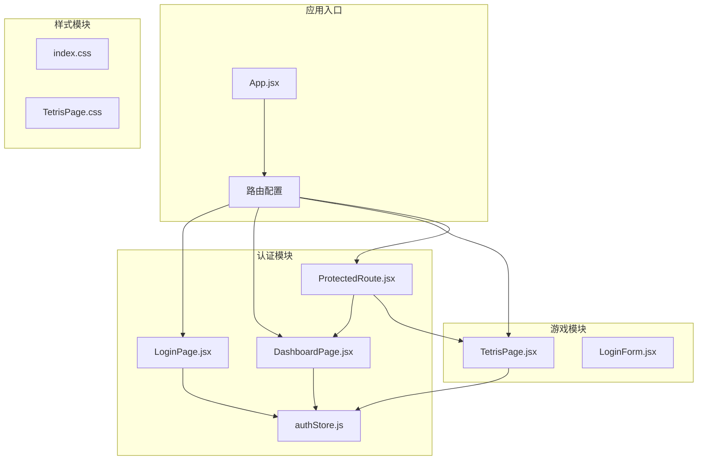
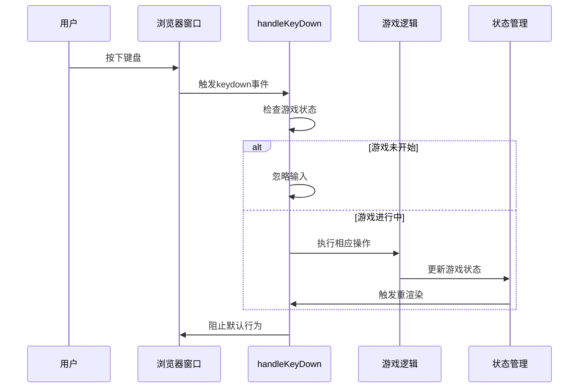
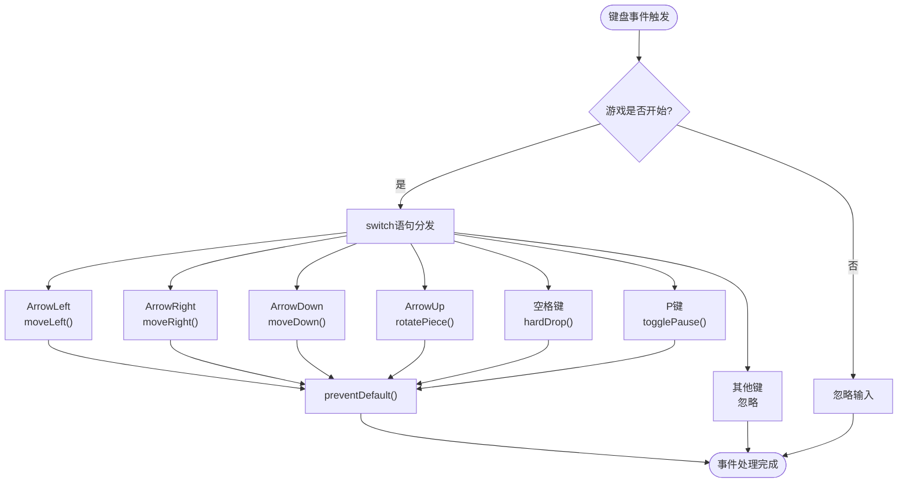
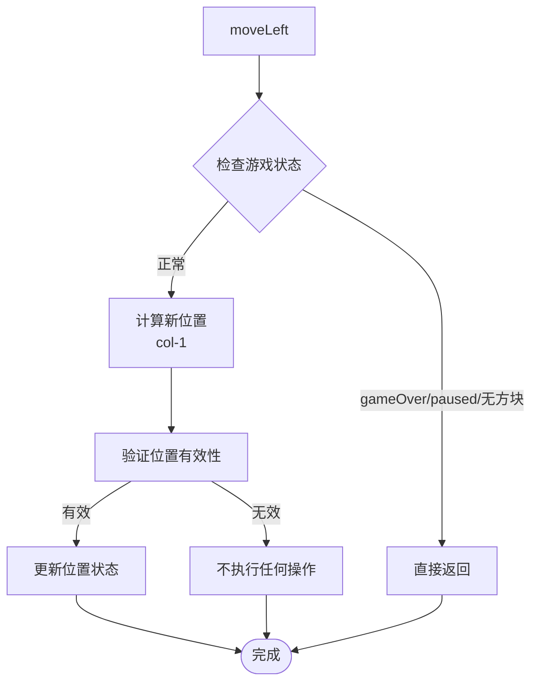
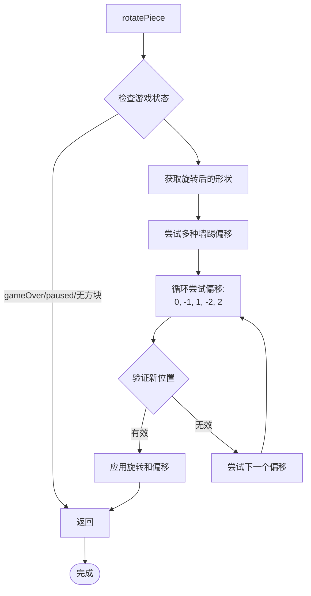
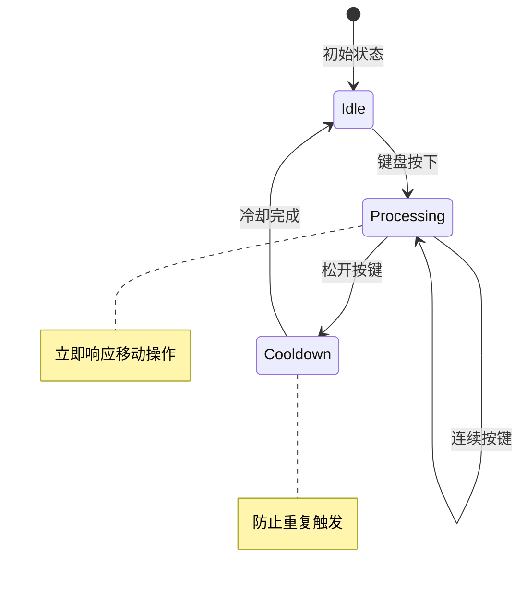
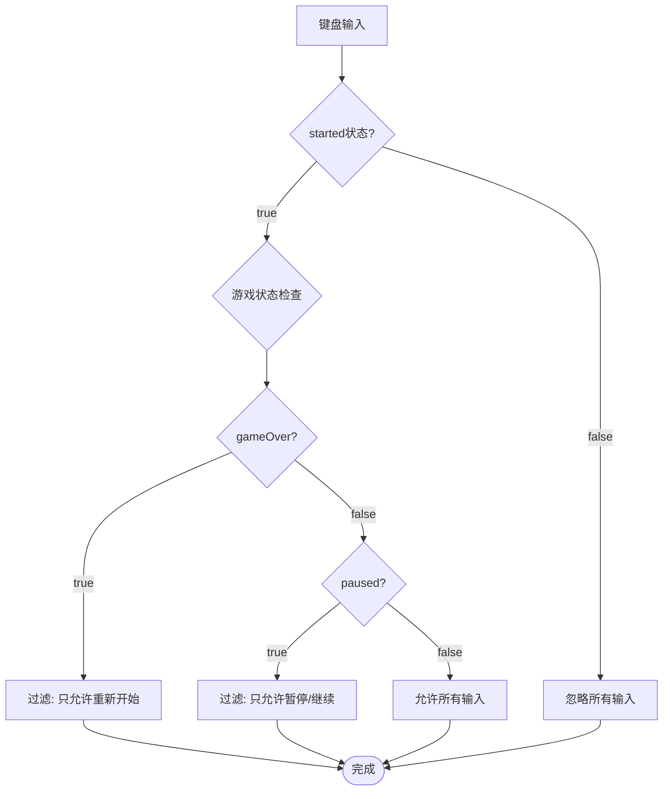
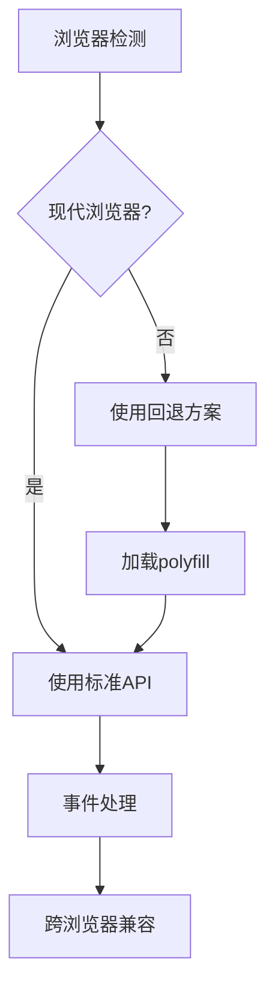
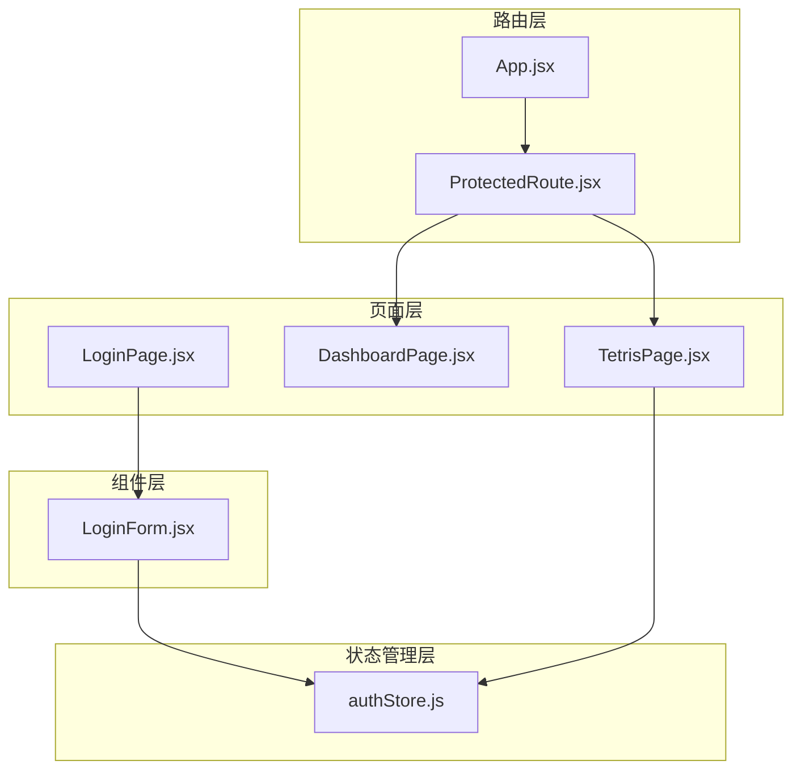

# 输入处理

<cite>
**本文档引用的文件**
- [TetrisPage.jsx](file://src/pages/TetrisPage.jsx)
- [TetrisPage.css](file://src/pages/TetrisPage.css)
- [App.jsx](file://src/App.jsx)
- [ProtectedRoute.jsx](file://src/routes/ProtectedRoute.jsx)
- [authStore.js](file://src/store/authStore.js)
- [LoginForm.jsx](file://src/components/LoginForm.jsx)
- [LoginPage.jsx](file://src/pages/LoginPage.jsx)
- [DashboardPage.jsx](file://src/pages/DashboardPage.jsx)
- [package.json](file://package.json)
</cite>

## 目录
1. [简介](#简介)
2. [项目结构](#项目结构)
3. [核心组件](#核心组件)
4. [架构概览](#架构概览)
5. [详细组件分析](#详细组件分析)
6. [依赖关系分析](#依赖关系分析)
7. [性能考虑](#性能考虑)
8. [故障排除指南](#故障排除指南)
9. [结论](#结论)

## 简介

本文件详细分析了React登录应用程序中的用户输入处理系统，特别是俄罗斯方块游戏的键盘事件监听机制。该系统实现了完整的键盘输入处理，包括左右移动、向下加速、旋转、硬降和暂停等功能，并提供了防抖和按键连发处理机制。

## 项目结构

该项目采用典型的React单页应用架构，主要包含以下模块：

**图表来源**
- [App.jsx:10-41](file://src/App.jsx#L10-L41)
- [ProtectedRoute.jsx:4-12](file://src/routes/ProtectedRoute.jsx#L4-L12)

**章节来源**
- [App.jsx:1-44](file://src/App.jsx#L1-L44)
- [package.json:1-33](file://package.json#L1-L33)

## 核心组件

### 键盘事件处理系统

俄罗斯方块游戏的核心输入处理由TetrisPage组件实现，该组件包含了完整的键盘事件监听机制：

#### 主要输入处理函数

1. **handleKeyDown函数** - 核心键盘事件处理器
2. **moveLeft/moveRight** - 左右移动控制
3. **moveDown** - 向下移动控制
4. **rotatePiece** - 旋转控制
5. **hardDrop** - 硬降控制
6. **togglePause** - 暂停/继续控制

#### 游戏状态管理

系统通过多个状态变量控制输入行为：
- `started` - 游戏是否开始
- `paused` - 游戏是否暂停
- `gameOver` - 游戏是否结束
- `currentPiece` - 当前方块是否存在

**章节来源**
- [TetrisPage.jsx:63-413](file://src/pages/TetrisPage.jsx#L63-L413)

## 架构概览

输入处理系统采用React Hooks模式，结合useEffect和useCallback实现高效的事件监听和状态管理：

**图表来源**
- [TetrisPage.jsx:252-268](file://src/pages/TetrisPage.jsx#L252-L268)

## 详细组件分析

### 键盘事件监听机制

#### handleKeyDown函数实现

handleKeyDown是整个输入系统的核心，负责处理所有键盘事件：

**图表来源**
- [TetrisPage.jsx:254-265](file://src/pages/TetrisPage.jsx#L254-L265)

#### 事件绑定策略

系统采用React useEffect Hook实现事件绑定：

1. **动态事件绑定** - 在组件挂载时添加事件监听器
2. **清理机制** - 在组件卸载时移除事件监听器
3. **依赖管理** - 使用useCallback确保回调函数稳定

**章节来源**
- [TetrisPage.jsx:252-268](file://src/pages/TetrisPage.jsx#L252-L268)

### 按键操作响应逻辑

#### 左右移动控制

**图表来源**
- [TetrisPage.jsx:166-173](file://src/pages/TetrisPage.jsx#L166-L173)

#### 向下加速和硬降

系统实现了两种下降机制：

1. **常规下降** - 通过定时器自动触发
2. **硬降** - 瞬间下降到最底部

**章节来源**
- [TetrisPage.jsx:155-164](file://src/pages/TetrisPage.jsx#L155-L164)
- [TetrisPage.jsx:199-209](file://src/pages/TetrisPage.jsx#L199-L209)

#### 旋转功能

旋转功能包含复杂的碰撞检测和墙踢机制：

**图表来源**
- [TetrisPage.jsx:184-197](file://src/pages/TetrisPage.jsx#L184-L197)

### 防抖和按键连发处理

#### 防抖机制

系统通过以下方式实现防抖：

1. **状态检查** - 在每个操作前检查游戏状态
2. **条件执行** - 仅在允许的状态下执行操作
3. **即时响应** - 移动操作不需要等待

#### 按键连发优化

**图表来源**
- [TetrisPage.jsx:252-268](file://src/pages/TetrisPage.jsx#L252-L268)

### 游戏状态对输入的影响

#### 状态过滤机制

系统根据不同的游戏状态过滤输入：

**图表来源**
- [TetrisPage.jsx:211-214](file://src/pages/TetrisPage.jsx#L211-L214)
- [TetrisPage.jsx:155-164](file://src/pages/TetrisPage.jsx#L155-L164)

**章节来源**
- [TetrisPage.jsx:211-214](file://src/pages/TetrisPage.jsx#L211-L214)
- [TetrisPage.jsx:155-164](file://src/pages/TetrisPage.jsx#L155-L164)

### 输入映射的可配置性

#### 当前输入映射

系统支持以下标准输入映射：

| 键位 | 功能 | 说明 |
|------|------|------|
| ArrowLeft | 左移动 | 左移一个单位 |
| ArrowRight | 右移动 | 右移一个单位 |
| ArrowDown | 加速下落 | 快速下降 |
| ArrowUp | 旋转 | 顺时针旋转 |
| Space | 硬降 | 瞬间下降到底部 |
| P | 暂停 | 暂停/继续游戏 |

#### 扩展新控制方案

要扩展新的控制方案，可以：

1. **修改handleKeyDown函数** - 添加新的case分支
2. **更新状态检查** - 确保新功能符合游戏状态要求
3. **添加UI提示** - 在界面中显示新的控制说明

**章节来源**
- [TetrisPage.jsx:256-262](file://src/pages/TetrisPage.jsx#L256-L262)

### 跨浏览器兼容性处理

#### 特殊键位支持

系统使用标准的DOM键盘事件API：

1. **Arrow键支持** - 所有现代浏览器都支持
2. **Space键支持** - 标准空格键
3. **字母键支持** - P键用于暂停

#### 兼容性策略

**图表来源**
- [TetrisPage.jsx:254-265](file://src/pages/TetrisPage.jsx#L254-L265)

## 依赖关系分析

### 组件依赖图

**图表来源**
- [App.jsx:10-41](file://src/App.jsx#L10-L41)
- [ProtectedRoute.jsx:4-12](file://src/routes/ProtectedRoute.jsx#L4-L12)

**章节来源**
- [App.jsx:10-41](file://src/App.jsx#L10-L41)
- [ProtectedRoute.jsx:4-12](file://src/routes/ProtectedRoute.jsx#L4-L12)

### 外部依赖

项目使用的主要外部依赖：

| 依赖包 | 版本 | 用途 |
|--------|------|------|
| react | ^19.2.4 | React框架 |
| react-dom | ^19.2.4 | DOM渲染 |
| react-router-dom | ^7.14.0 | 路由管理 |
| zustand | ^5.0.12 | 状态管理 |
| react-hook-form | ^7.72.1 | 表单处理 |
| zod | ^4.3.6 | 数据验证 |

**章节来源**
- [package.json:12-20](file://package.json#L12-L20)

## 性能考虑

### 事件处理性能优化

1. **useCallback优化** - 使用useCallback缓存回调函数
2. **依赖数组管理** - 精确控制useEffect的依赖项
3. **状态最小化** - 仅更新必要的状态

### 内存管理

1. **事件监听器清理** - 组件卸载时移除事件监听器
2. **定时器管理** - 下降定时器随游戏状态变化而启停
3. **引用优化** - 使用useRef存储游戏状态

**章节来源**
- [TetrisPage.jsx:86-92](file://src/pages/TetrisPage.jsx#L86-L92)
- [TetrisPage.jsx:241-250](file://src/pages/TetrisPage.jsx#L241-L250)

## 故障排除指南

### 常见问题及解决方案

#### 输入无响应

**症状**: 按键后游戏无反应

**可能原因**:
1. 游戏未开始状态
2. 游戏已结束状态
3. 暂停状态
4. 事件监听器未正确绑定

**解决方法**:
1. 确认游戏已开始
2. 检查gameOver状态
3. 检查paused状态
4. 重新加载页面

#### 旋转功能异常

**症状**: 方块无法正确旋转

**可能原因**:
1. 墙踢检测失败
2. 碰撞检测错误
3. 形状数据损坏

**解决方法**:
1. 检查方块边界
2. 验证旋转算法
3. 重置游戏状态

#### 暂停功能失效

**症状**: P键无法暂停游戏

**可能原因**:
1. 游戏未开始
2. 游戏已结束
3. 事件处理错误

**解决方法**:
1. 确保游戏开始后再暂停
2. 检查togglePause函数
3. 验证状态切换逻辑

**章节来源**
- [TetrisPage.jsx:211-214](file://src/pages/TetrisPage.jsx#L211-L214)
- [TetrisPage.jsx:184-197](file://src/pages/TetrisPage.jsx#L184-L197)

## 结论

该输入处理系统展现了现代React应用中键盘事件处理的最佳实践：

1. **模块化设计** - 将输入处理逻辑封装在独立的组件中
2. **状态驱动** - 通过游戏状态控制输入行为
3. **性能优化** - 使用useCallback和精确的依赖管理
4. **可扩展性** - 支持输入映射的配置和扩展
5. **兼容性** - 良好的跨浏览器支持

系统为开发者提供了清晰的扩展点，可以轻松添加新的控制方案或修改现有功能。同时，完善的错误处理和状态管理确保了系统的稳定性和用户体验。