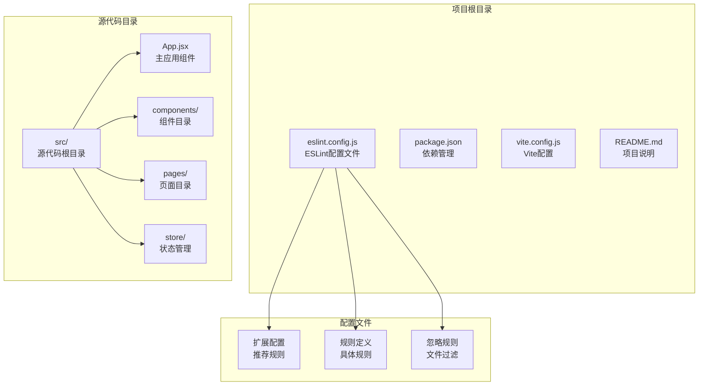
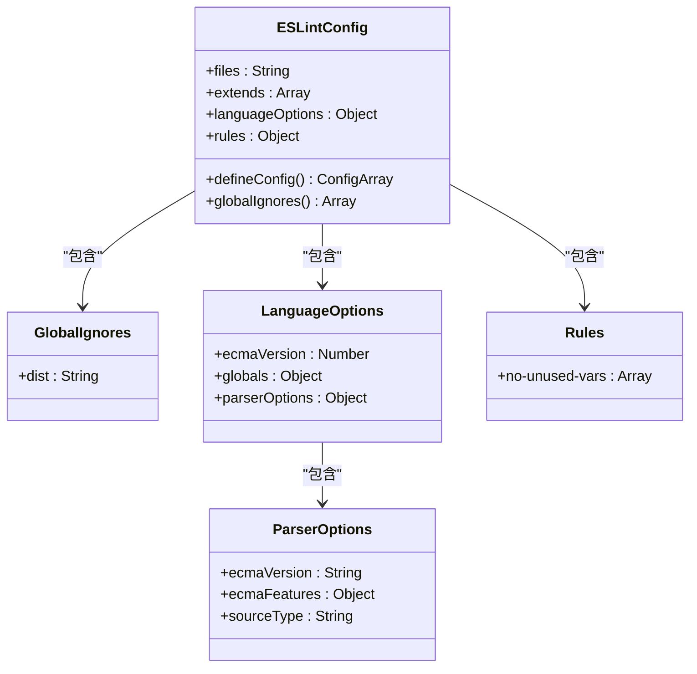
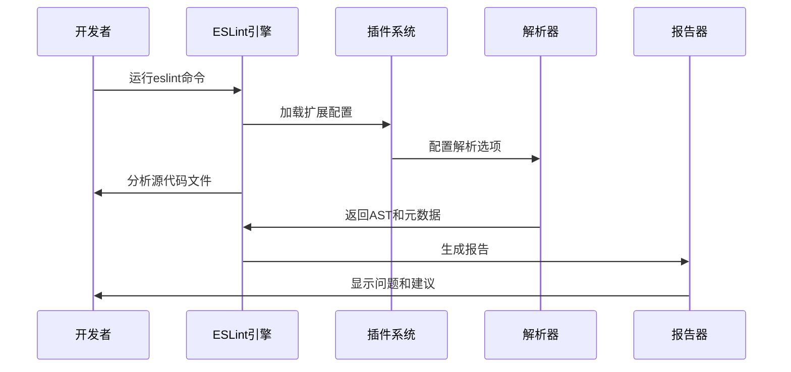
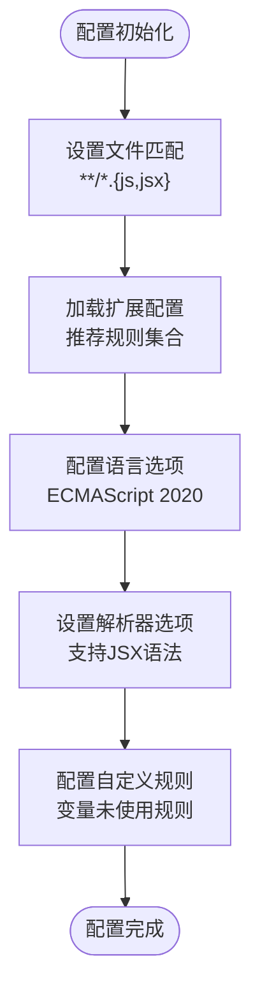
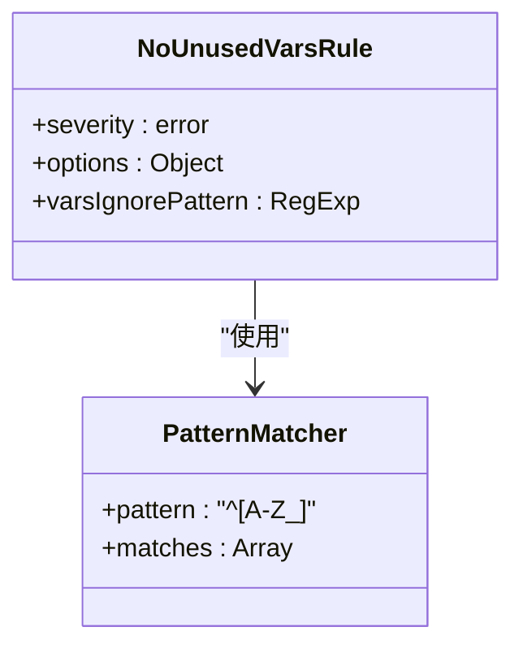
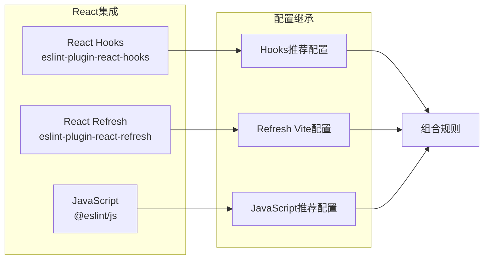
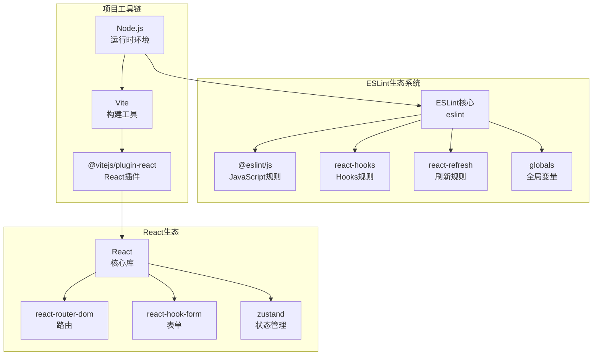

# ESLint 代码规范

<cite>
**本文档引用的文件**
- [eslint.config.js](file://eslint.config.js)
- [package.json](file://package.json)
- [README.md](file://README.md)
- [vite.config.js](file://vite.config.js)
- [src/App.jsx](file://src/App.jsx)
- [src/components/LoginForm.jsx](file://src/components/LoginForm.jsx)
- [src/store/authStore.js](file://src/store/authStore.js)
- [src/pages/LoginPage.jsx](file://src/pages/LoginPage.jsx)
</cite>

## 目录
1. [简介](#简介)
2. [项目结构](#项目结构)
3. [核心组件](#核心组件)
4. [架构概览](#架构概览)
5. [详细组件分析](#详细组件分析)
6. [依赖关系分析](#依赖关系分析)
7. [性能考虑](#性能考虑)
8. [故障排除指南](#故障排除指南)
9. [结论](#结论)
10. [附录](#附录)

## 简介

本指南专注于React + Vite项目中的ESLint代码规范配置，基于项目现有的eslint.config.js配置文件进行深入分析。该配置实现了现代化的JavaScript开发环境，集成了React生态系统专用的lint规则，提供了完整的ES6+语法支持和现代JavaScript特性验证。

项目采用最新的ESLint Flat Config格式，通过模块化的方式组织配置，确保了配置的可维护性和扩展性。配置文件不仅包含了基础的JavaScript规则，还深度集成了React Hooks和React Refresh相关的最佳实践。

## 项目结构

该项目遵循标准的React应用结构，ESLint配置位于项目根目录，与源代码文件分离，便于维护和版本控制。

**图表来源**
- [eslint.config.js:1-30](file://eslint.config.js#L1-L30)
- [package.json:1-33](file://package.json#L1-L33)

**章节来源**
- [eslint.config.js:1-30](file://eslint.config.js#L1-L30)
- [package.json:1-33](file://package.json#L1-L33)

## 核心组件

### ESLint配置架构

项目的核心配置采用了ESLint 9.x引入的Flat Config格式，这种格式提供了更清晰的配置层次结构和更好的性能表现。

**图表来源**
- [eslint.config.js:7-29](file://eslint.config.js#L7-L29)

### 扩展配置系统

配置文件通过`extends`属性集成了多个官方推荐配置，形成了完整的规则体系：

| 扩展配置 | 来源 | 功能描述 |
|---------|------|----------|
| `js.configs.recommended` | @eslint/js | 基础JavaScript语言规则 |
| `reactHooks.configs.flat.recommended` | eslint-plugin-react-hooks | React Hooks最佳实践规则 |
| `reactRefresh.configs.vite` | eslint-plugin-react-refresh | React Fast Refresh兼容性规则 |

**章节来源**
- [eslint.config.js:11-15](file://eslint.config.js#L11-L15)

## 架构概览

ESLint在项目中的工作流程体现了现代前端开发的最佳实践：

**图表来源**
- [eslint.config.js:1-30](file://eslint.config.js#L1-L30)
- [package.json:9](file://package.json#L9)

## 详细组件分析

### JavaScript语言配置

配置文件的语言选项为现代JavaScript开发提供了完整支持：

**图表来源**
- [eslint.config.js:9-27](file://eslint.config.js#L9-L27)

#### 语言版本支持

配置明确指定了语言版本和特性支持：
- **ECMAScript版本**: 2020（支持现代JavaScript特性）
- **全局变量**: 浏览器环境变量（DOM API等）
- **解析器特性**: 启用JSX语法支持
- **模块类型**: ES6模块系统

#### 自定义规则配置

项目实现了特定的变量未使用规则配置，用于处理React组件中的特殊命名模式：

**图表来源**
- [eslint.config.js:25-27](file://eslint.config.js#L25-L27)

**章节来源**
- [eslint.config.js:16-27](file://eslint.config.js#L16-L27)

### React生态系统集成

项目深度集成了React相关的ESLint插件，确保React应用的代码质量：

**图表来源**
- [eslint.config.js:3-4](file://eslint.config.js#L3-L4)
- [eslint.config.js:12-14](file://eslint.config.js#L12-L14)

#### React Hooks规则

React Hooks插件提供了专门的规则来确保Hook的正确使用，包括：
- Hook调用位置规则
- Hook依赖数组完整性检查
- Hook命名约定验证

#### React Refresh规则

React Refresh插件针对Vite的热重载机制进行了优化：
- Fast Refresh兼容性检查
- 组件更新策略验证
- 开发环境特有规则

**章节来源**
- [eslint.config.js:12-14](file://eslint.config.js#L12-L14)

### 实际代码验证示例

通过分析项目中的实际代码，可以更好地理解ESLint规则的应用效果：

#### 应用组件分析

App.jsx展示了现代React开发的典型模式，ESLint会验证以下方面：
- 组件函数声明的正确性
- Hook使用的位置和方式
- 路由组件的嵌套结构
- 导入语句的组织

#### 表单组件分析

LoginForm.jsx体现了复杂表单处理的ESLint验证：
- React Hook Form的集成验证
- Zod验证器的使用检查
- 异步操作的Promise处理
- 错误状态的管理

**章节来源**
- [src/App.jsx:10-41](file://src/App.jsx#L10-L41)
- [src/components/LoginForm.jsx:12-29](file://src/components/LoginForm.jsx#L12-L29)

## 依赖关系分析

ESLint配置与项目其他工具形成了紧密的依赖关系网络：

**图表来源**
- [package.json:21-31](file://package.json#L21-L31)
- [package.json:12-20](file://package.json#L12-L20)

### 版本兼容性

项目依赖的版本关系确保了工具链的稳定性：
- **ESLint**: ^9.39.4（最新稳定版）
- **React**: ^19.2.4（最新稳定版）
- **Vite**: ^8.0.4（与React插件兼容）

**章节来源**
- [package.json:21-31](file://package.json#L21-L31)

## 性能考虑

ESLint配置在性能优化方面采用了多项策略：

### 文件过滤优化

配置使用了精确的文件匹配模式，避免不必要的文件扫描：
- 仅处理`.js`和`.jsx`文件
- 排除`dist`目录的构建输出
- 支持递归目录匹配

### 规则执行优化

通过合理的规则配置减少了分析开销：
- 使用推荐配置而非自定义实现
- 避免重复的规则检查
- 启用适当的缓存机制

## 故障排除指南

### 常见问题及解决方案

#### 规则冲突问题

当自定义规则与推荐规则发生冲突时：
1. 检查规则优先级设置
2. 使用规则覆盖机制
3. 调整规则严重级别

#### 性能问题诊断

如果ESLint运行缓慢：
1. 检查文件过滤配置
2. 减少不必要的规则检查
3. 优化项目结构

#### IDE集成问题

VSCode中ESLint不工作时：
1. 确保ESLint扩展已安装
2. 检查VSCode设置中的ESLint配置
3. 验证项目根目录的配置文件

**章节来源**
- [eslint.config.js:8](file://eslint.config.js#L8)
- [eslint.config.js:25-27](file://eslint.config.js#L25-L27)

## 结论

本项目的ESLint配置展现了现代JavaScript开发的最佳实践，通过合理的配置架构和丰富的规则集，为React应用提供了全面的代码质量保障。配置文件的设计体现了以下优势：

1. **模块化设计**: 采用Flat Config格式，配置清晰易维护
2. **生态系统集成**: 深度集成React相关插件，确保最佳实践
3. **性能优化**: 通过精确的文件过滤和规则配置提升性能
4. **可扩展性**: 提供了良好的扩展点，便于团队定制

对于生产环境的进一步改进，建议考虑集成TypeScript以获得更强的类型安全检查，但这需要相应的配置调整和团队技能准备。

## 附录

### VSCode集成配置

为了在VSCode中获得最佳的ESLint体验，建议进行以下配置：

1. 安装ESLint扩展
2. 在VSCode设置中启用ESLint
3. 配置保存时自动修复
4. 设置合适的错误提示级别

### 团队协作建议

1. **统一配置**: 在团队内共享相同的ESLint配置
2. **CI集成**: 在持续集成中加入ESLint检查
3. **定期更新**: 定期更新依赖包以获得最新的规则
4. **文档维护**: 维护团队的代码规范文档