# Vite 构建配置

<cite>
**本文档引用的文件**
- [vite.config.js](file://vite.config.js)
- [package.json](file://package.json)
- [index.html](file://index.html)
- [src/main.jsx](file://src/main.jsx)
- [src/App.jsx](file://src/App.jsx)
- [src/components/LoginForm.jsx](file://src/components/LoginForm.jsx)
- [src/store/authStore.js](file://src/store/authStore.js)
- [src/routes/ProtectedRoute.jsx](file://src/routes/ProtectedRoute.jsx)
- [src/pages/DashboardPage.jsx](file://src/pages/DashboardPage.jsx)
- [src/index.css](file://src/index.css)
- [eslint.config.js](file://eslint.config.js)
</cite>

## 目录
1. [简介](#简介)
2. [项目结构](#项目结构)
3. [核心组件](#核心组件)
4. [架构概览](#架构概览)
5. [详细组件分析](#详细组件分析)
6. [依赖关系分析](#依赖关系分析)
7. [性能考虑](#性能考虑)
8. [故障排除指南](#故障排除指南)
9. [结论](#结论)
10. [附录](#附录)

## 简介

本项目是一个基于 React 19 和 Vite 的现代化前端应用，实现了用户登录认证功能。项目采用模块化架构设计，包含完整的开发工具链配置，支持热重载、代码分割和生产环境优化。

该应用的核心特性包括：
- 基于 React Router 的路由管理
- Zustand 状态管理
- React Hook Form 表单处理
- Zod 数据验证
- 响应式设计和现代 CSS 实现

## 项目结构

项目采用标准的 Vite + React 项目结构，主要目录组织如下：

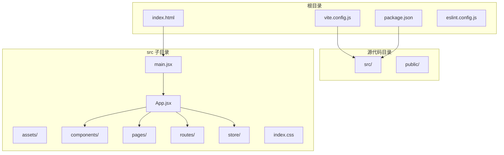

**图表来源**
- [vite.config.js:1-8](file://vite.config.js#L1-L8)
- [package.json:1-33](file://package.json#L1-L33)
- [index.html:1-14](file://index.html#L1-L14)

**章节来源**
- [vite.config.js:1-8](file://vite.config.js#L1-L8)
- [package.json:1-33](file://package.json#L1-L33)
- [index.html:1-14](file://index.html#L1-L14)

## 核心组件

### Vite 配置系统

当前项目使用最小化的 Vite 配置，仅启用 React 插件支持：

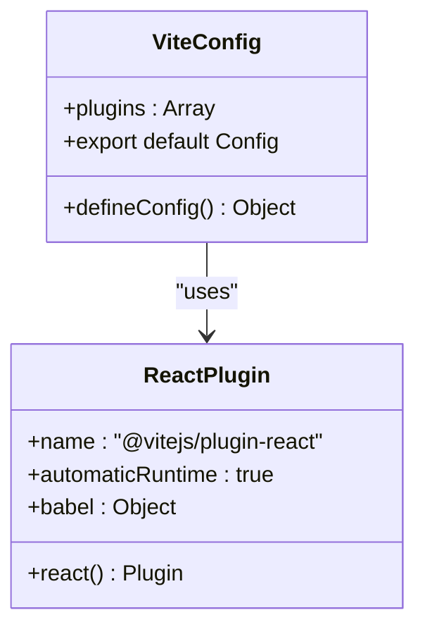

**图表来源**
- [vite.config.js:5-7](file://vite.config.js#L5-L7)

### React 应用架构

应用采用分层架构设计，各组件职责明确：

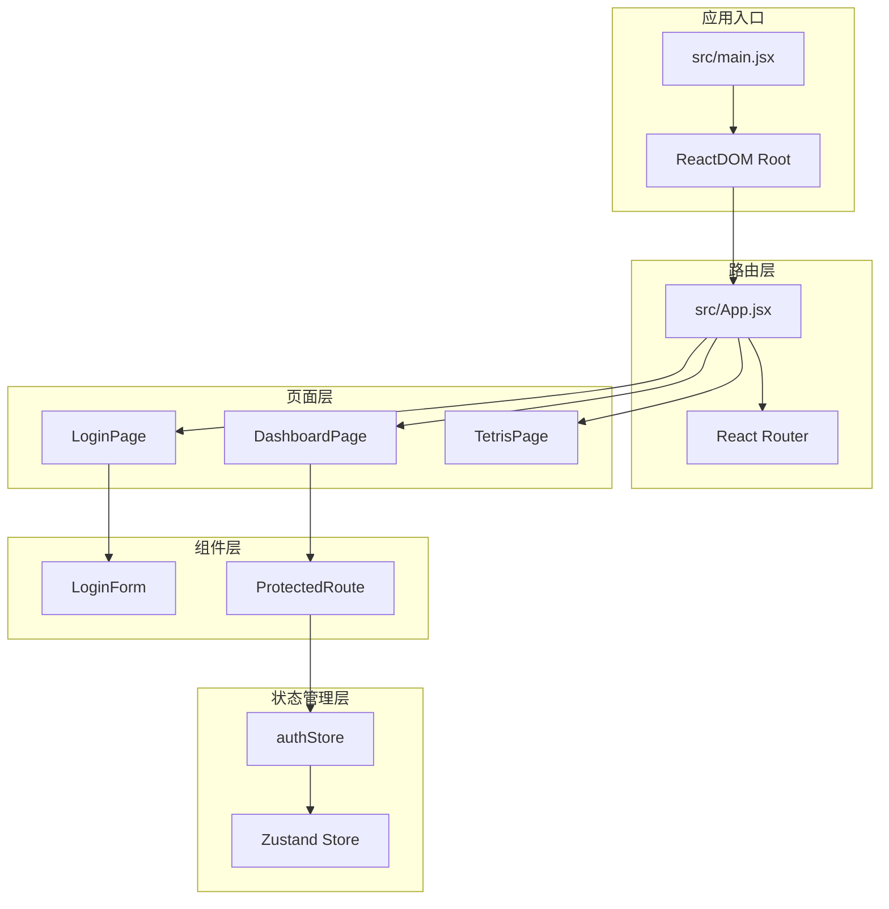

**图表来源**
- [src/main.jsx:1-11](file://src/main.jsx#L1-L11)
- [src/App.jsx:1-44](file://src/App.jsx#L1-L44)
- [src/store/authStore.js:1-44](file://src/store/authStore.js#L1-L44)

**章节来源**
- [vite.config.js:1-8](file://vite.config.js#L1-L8)
- [src/main.jsx:1-11](file://src/main.jsx#L1-L11)
- [src/App.jsx:1-44](file://src/App.jsx#L1-L44)

## 架构概览

### 开发服务器架构

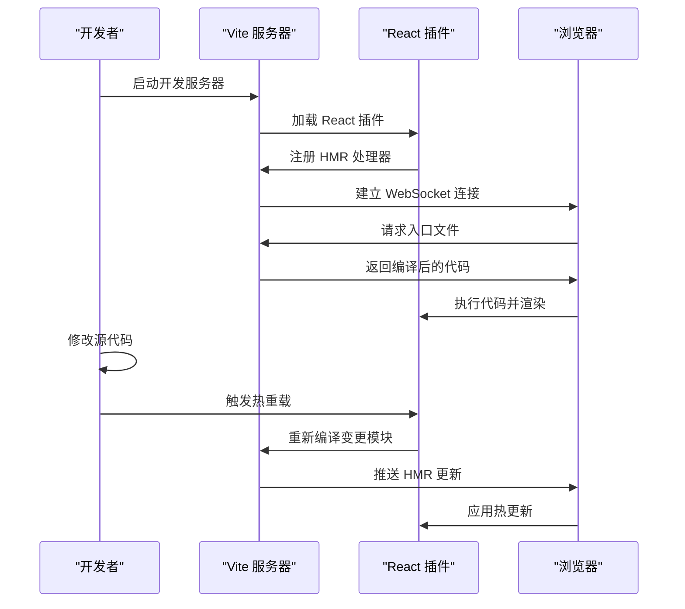

**图表来源**
- [vite.config.js:5-7](file://vite.config.js#L5-L7)
- [src/main.jsx:1-11](file://src/main.jsx#L1-L11)

### 生产构建流程

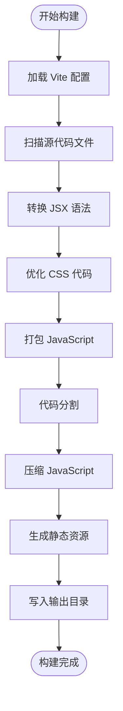

**图表来源**
- [vite.config.js:5-7](file://vite.config.js#L5-L7)
- [package.json:6-11](file://package.json#L6-L11)

## 详细组件分析

### @vitejs/plugin-react 插件详解

#### 插件作用机制

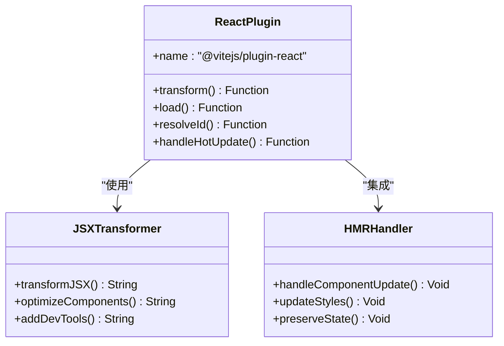

**图表来源**
- [vite.config.js:2](file://vite.config.js#L2)

#### 配置参数说明

当前配置采用默认设置，支持以下特性：
- 自动 JSX 转换
- React Refresh 热重载
- 开发环境调试工具
- 生产环境优化

**章节来源**
- [vite.config.js:1-8](file://vite.config.js#L1-L8)

### 开发服务器配置

#### 端口和网络设置

虽然当前配置未显式指定端口，但可以通过以下方式配置：

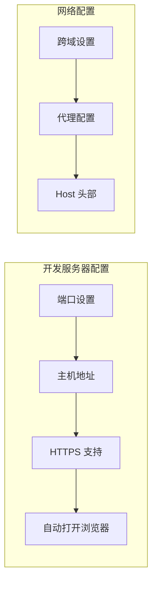

#### 路径别名配置

项目结构中未配置路径别名，可通过以下方式扩展：

**章节来源**
- [vite.config.js:5-7](file://vite.config.js#L5-L7)

### 构建优化策略

#### 代码分割实现

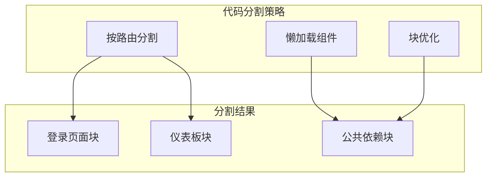

#### 生产环境优化

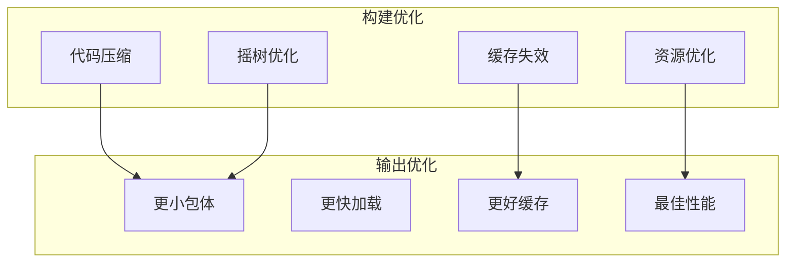

**图表来源**
- [package.json:8](file://package.json#L8)

**章节来源**
- [package.json:6-11](file://package.json#L6-L11)

### 热重载机制

#### HMR 工作原理

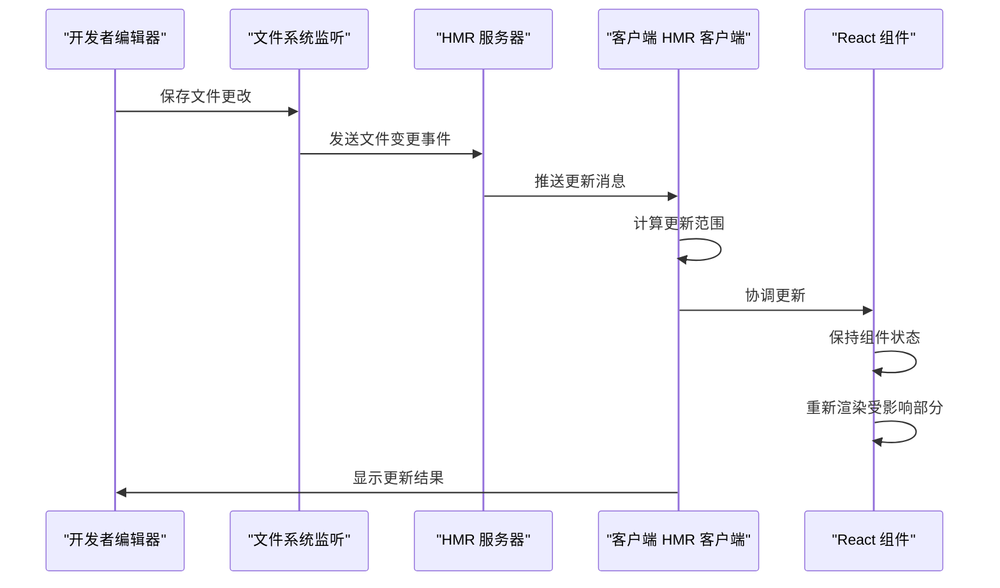

#### 状态保持策略

React Refresh 插件确保在热重载过程中保持组件状态：
- 函数组件状态保持
- Hooks 状态持久化
- 错误边界处理
- 性能优化提示

**章节来源**
- [vite.config.js:2](file://vite.config.js#L2)

### 静态资源处理

#### 资源类型支持

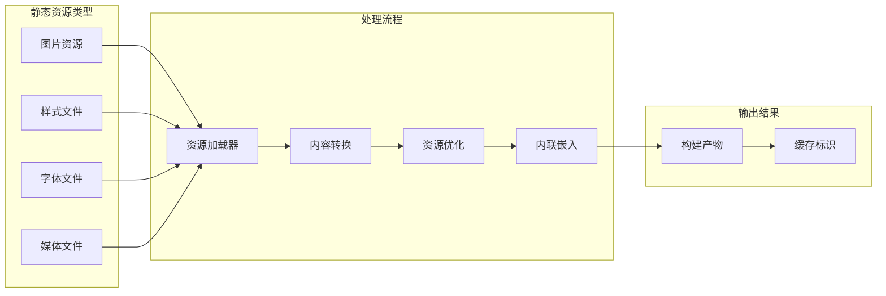

**章节来源**
- [index.html:5](file://index.html#L5)

### 环境变量处理

#### 变量命名规范

项目使用 Vite 的环境变量约定：
- `VITE_` 前缀的变量在客户端可用
- 其他变量仅在服务端可用
- 默认值通过 `??` 操作符设置

**章节来源**
- [package.json:12-20](file://package.json#L12-L20)

## 依赖关系分析

### 核心依赖关系

```mermaid
graph TB
subgraph "运行时依赖"
REACT[react ^19.2.4]
REACTDOM[react-dom ^19.2.4]
ROUTER[react-router-dom ^7.14.0]
ZUSTAND[zustand ^5.0.12]
HOOKFORM[react-hook-form ^7.72.1]
ZOD[zod ^4.3.6]
RESOLVERS[@hookform/resolvers ^5.2.2]
end
subgraph "开发依赖"
VITE[vite ^8.0.4]
REACT_PLUGIN[@vitejs/plugin-react ^6.0.1]
ESLINT[eslint ^9.39.4]
TYPES[@types/react ^19.2.14]
REFRESH[react-refresh ^0.5.2]
end
subgraph "工具链"
ESLINT_CONFIG[eslint.config.js]
VITE_CONFIG[vite.config.js]
PACKAGE_JSON[package.json]
end
REACT --> REACTDOM
REACT --> ROUTER
REACT --> HOOKFORM
HOOKFORM --> RESOLVERS
HOOKFORM --> ZOD
ZUSTAND --> REACT
VITE --> REACT_PLUGIN
ESLINT --> ESLINT_CONFIG
VITE_CONFIG --> VITE
PACKAGE_JSON --> VITE
PACKAGE_JSON --> ESLINT
```

**图表来源**
- [package.json:12-31](file://package.json#L12-L31)

### 版本兼容性

#### React 19 兼容性

项目已升级到 React 19.2.4，主要兼容性改进：
- 新的并发特性支持
- 改进的 Suspense 行为
- 更好的错误边界处理
- 优化的渲染性能

**章节来源**
- [package.json:14-19](file://package.json#L14-L19)

## 性能考虑

### 构建性能优化

#### 缓存策略

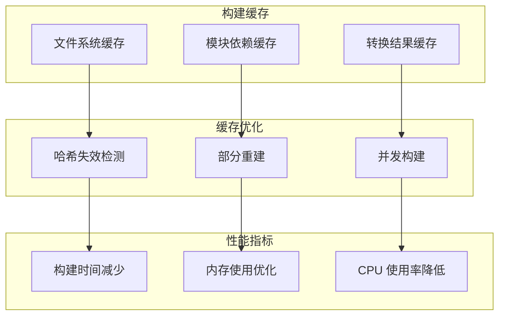

#### 内存管理

- 模块图缓存
- AST 解析缓存
- 转换结果缓存
- 文件内容缓存

### 运行时性能

#### 代码分割策略

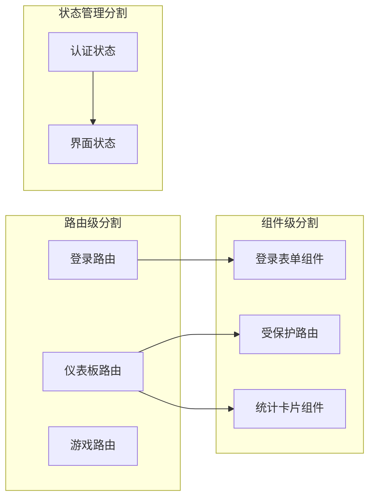

## 故障排除指南

### 常见问题诊断

#### 热重载不工作

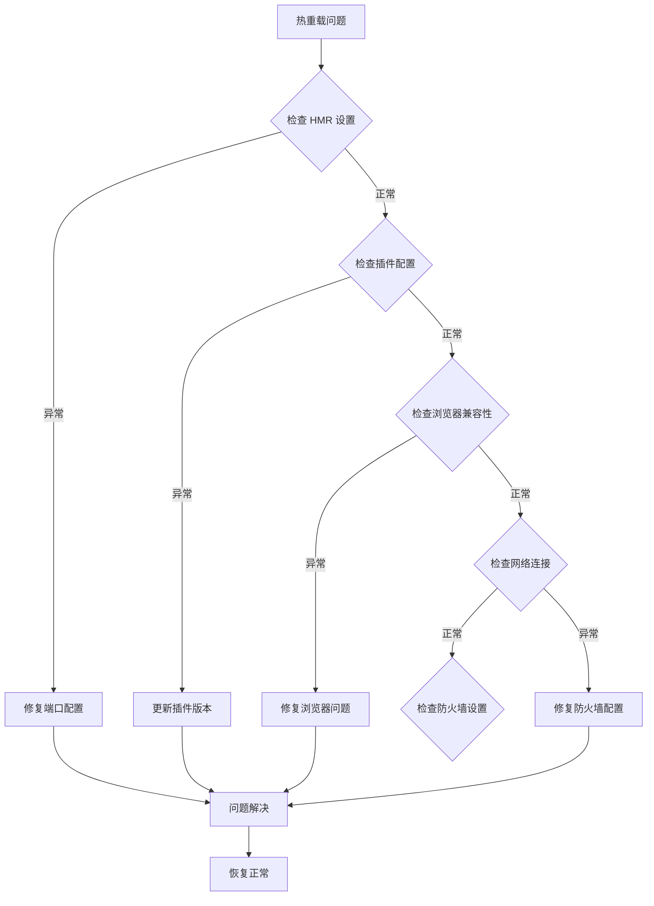

#### 构建失败排查

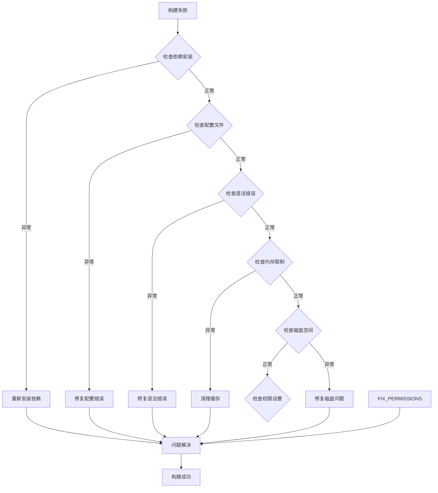

**章节来源**
- [eslint.config.js:1-30](file://eslint.config.js#L1-L30)

### 性能问题诊断

#### 内存泄漏检测

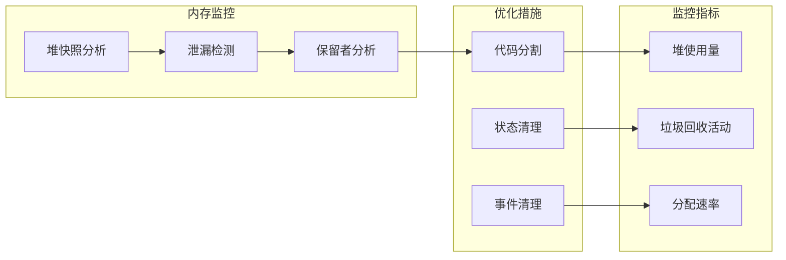

**章节来源**
- [src/store/authStore.js:1-44](file://src/store/authStore.js#L1-L44)

## 结论

本项目展示了现代 Vite + React 开发的最佳实践。通过合理的配置和架构设计，实现了高效的开发体验和优秀的运行时性能。

### 主要优势

1. **开发体验优秀**：热重载、快速构建、智能错误提示
2. **性能表现优异**：代码分割、缓存优化、按需加载
3. **架构清晰**：模块化设计、职责分离、可维护性强
4. **技术栈先进**：React 19、Vite 8、ESLint 9

### 改进建议

1. **增加配置项**：端口、代理、路径别名等
2. **增强监控**：构建性能监控、运行时性能分析
3. **完善测试**：单元测试、集成测试、端到端测试
4. **优化部署**：CDN 配置、PWA 支持、服务端渲染

## 附录

### 最佳实践清单

#### 开发阶段
- 使用严格的 TypeScript 类型检查
- 实施代码格式化和 linting 规则
- 建立完善的错误边界处理
- 实现组件级别的测试覆盖

#### 构建阶段
- 启用代码压缩和混淆
- 实现资源内联和外链优化
- 配置适当的缓存策略
- 实施安全头文件配置

#### 部署阶段
- 使用 CDN 分发静态资源
- 配置 HTTPS 和安全证书
- 实现渐进式 Web 应用(PWA)
- 建立监控和日志系统