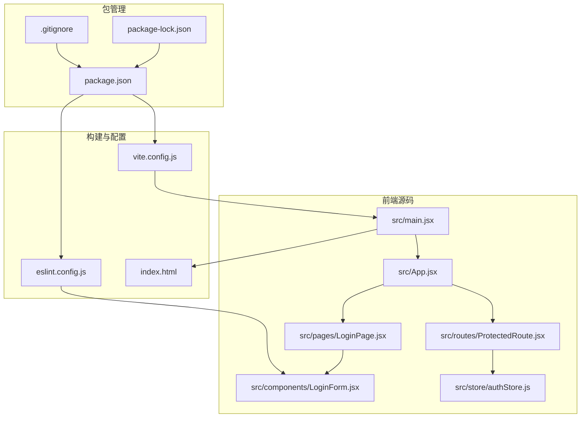
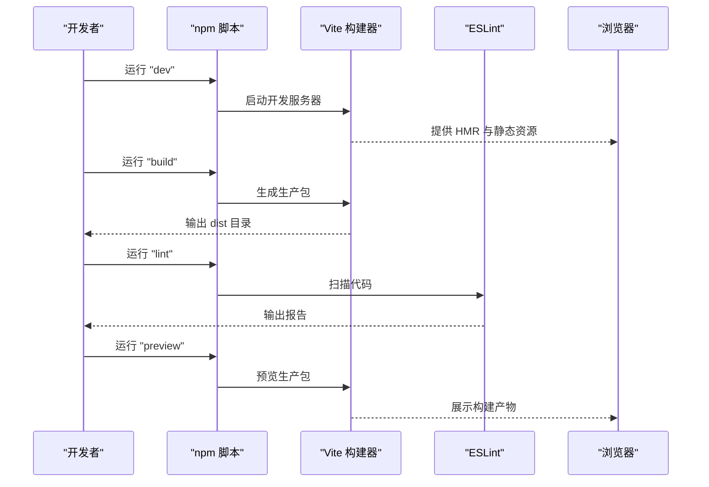
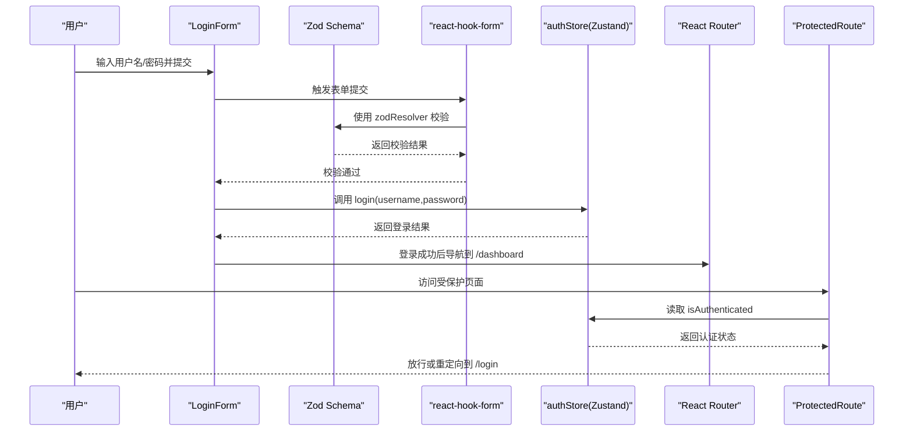
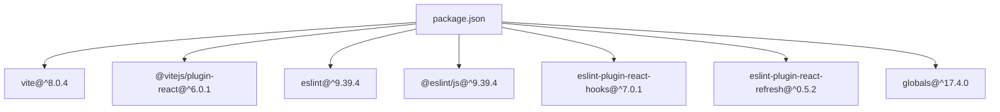

# 包依赖管理

<cite>
**本文引用的文件**
- [package.json](file://package.json)
- [package-lock.json](file://package-lock.json)
- [vite.config.js](file://vite.config.js)
- [eslint.config.js](file://eslint.config.js)
- [README.md](file://README.md)
- [src/App.jsx](file://src/App.jsx)
- [src/main.jsx](file://src/main.jsx)
- [src/components/LoginForm.jsx](file://src/components/LoginForm.jsx)
- [src/store/authStore.js](file://src/store/authStore.js)
- [src/routes/ProtectedRoute.jsx](file://src/routes/ProtectedRoute.jsx)
- [src/pages/LoginPage.jsx](file://src/pages/LoginPage.jsx)
- [index.html](file://index.html)
- [.gitignore](file://.gitignore)
</cite>

## 目录
1. [简介](#简介)
2. [项目结构](#项目结构)
3. [核心组件](#核心组件)
4. [架构总览](#架构总览)
5. [详细组件分析](#详细组件分析)
6. [依赖关系分析](#依赖关系分析)
7. [性能考量](#性能考量)
8. [故障排查指南](#故障排查指南)
9. [结论](#结论)
10. [附录](#附录)

## 简介
本指南围绕 React 登录应用的包依赖管理展开，系统讲解 package.json 中的脚本命令、依赖声明与版本管理策略；深入剖析开发依赖与生产依赖的区别、版本锁定机制与依赖树优化；阐述 npm 脚本命令的使用方法、构建流程自动化与开发工作流配置；提供依赖更新策略、安全漏洞扫描与版本兼容性管理建议；涵盖项目初始化、依赖安装优化与团队协作最佳实践，并解释 package-lock.json 的作用、版本锁定机制与部署一致性保障。

## 项目结构
该 React 应用采用 Vite 作为构建工具，ESLint 进行代码质量控制，使用 React Router 实现路由保护，Zustand 管理状态，配合 Zod 和 react-hook-form 完成表单校验与状态绑定。项目通过 package.json 统一管理脚本与依赖，vite.config.js 配置 React 插件，eslint.config.js 提供扁平化配置，README.md 提供模板说明与扩展建议。

图表来源
- [src/main.jsx:1-11](file://src/main.jsx#L1-L11)
- [src/App.jsx:1-44](file://src/App.jsx#L1-L44)
- [src/pages/LoginPage.jsx:1-18](file://src/pages/LoginPage.jsx#L1-L18)
- [src/components/LoginForm.jsx:1-78](file://src/components/LoginForm.jsx#L1-L78)
- [src/routes/ProtectedRoute.jsx:1-15](file://src/routes/ProtectedRoute.jsx#L1-L15)
- [src/store/authStore.js:1-44](file://src/store/authStore.js#L1-L44)
- [vite.config.js:1-8](file://vite.config.js#L1-L8)
- [eslint.config.js:1-30](file://eslint.config.js#L1-L30)
- [index.html:1-14](file://index.html#L1-L14)
- [package.json:1-33](file://package.json#L1-L33)
- [package-lock.json:1-800](file://package-lock.json#L1-L800)
- [.gitignore:1-25](file://.gitignore#L1-L25)

章节来源
- [package.json:1-33](file://package.json#L1-L33)
- [vite.config.js:1-8](file://vite.config.js#L1-L8)
- [eslint.config.js:1-30](file://eslint.config.js#L1-L30)
- [README.md:1-17](file://README.md#L1-L17)
- [index.html:1-14](file://index.html#L1-L14)
- [.gitignore:1-25](file://.gitignore#L1-L25)

## 核心组件
- 构建与脚本
  - 开发服务器：dev
  - 生产构建：build
  - 代码检查：lint
  - 预览构建：preview
- 依赖与版本
  - 生产依赖：React 生态、路由、表单与状态管理等
  - 开发依赖：Vite、ESLint 及其插件、类型定义等
- 工作流配置
  - Vite 插件：@vitejs/plugin-react
  - ESLint 扁平化配置：推荐规则、hooks 规则、刷新规则、浏览器全局

章节来源
- [package.json:6-11](file://package.json#L6-L11)
- [package.json:12-20](file://package.json#L12-L20)
- [package.json:21-31](file://package.json#L21-L31)
- [vite.config.js:1-8](file://vite.config.js#L1-L8)
- [eslint.config.js:1-30](file://eslint.config.js#L1-L30)

## 架构总览
下图展示从脚本到构建、从配置到运行的整体流程，体现 package.json 脚本如何驱动 Vite 与 ESLint，以及应用入口如何组织路由与状态。

图表来源
- [package.json:6-11](file://package.json#L6-L11)
- [vite.config.js:1-8](file://vite.config.js#L1-L8)
- [eslint.config.js:1-30](file://eslint.config.js#L1-L30)

## 详细组件分析

### 1) package.json 脚本命令与依赖管理
- 脚本命令
  - dev：启动 Vite 开发服务器，支持热更新与快速预览
  - build：调用 Vite 进行生产构建，输出 dist 目录
  - lint：执行 ESLint 对项目进行静态检查
  - preview：在本地预览生产构建结果
- 依赖声明
  - 生产依赖：React、React DOM、React Router DOM、Zustand、react-hook-form、@hookform/resolvers、Zod
  - 开发依赖：Vite、@vitejs/plugin-react、ESLint、@eslint/js、eslint-plugin-react-hooks、eslint-plugin-react-refresh、@types/react、@types/react-dom、globals
- 版本策略
  - 使用语义化版本范围（^）以允许补丁与次版本更新，平衡稳定性与新特性
  - 通过 package-lock.json 锁定具体版本，确保团队与 CI/CD 一致性

章节来源
- [package.json:6-11](file://package.json#L6-L11)
- [package.json:12-20](file://package.json#L12-L20)
- [package.json:21-31](file://package.json#L21-L31)

### 2) 开发依赖与生产依赖的区别
- 生产依赖
  - 运行期必需：React、React DOM、路由、状态管理、表单与校验库
  - 影响最终包体积与运行时行为
- 开发依赖
  - 构建期与开发期使用：Vite、ESLint、类型定义、React 插件
  - 不随应用打包进入生产环境，降低生产包体积
- 最佳实践
  - 将仅用于构建或开发的工具放入 devDependencies
  - 严格区分运行时与构建时依赖，避免污染生产环境

章节来源
- [package.json:12-20](file://package.json#L12-L20)
- [package.json:21-31](file://package.json#L21-L31)

### 3) 版本锁定机制与依赖树优化
- package-lock.json 的作用
  - 锁定所有依赖的确切版本，确保不同环境安装一致
  - 记录依赖树结构，避免因版本范围导致的不一致
- 依赖树优化
  - 合理使用 ^ 与 ~，优先允许安全更新
  - 定期清理未使用的依赖，减少包体积与安全风险
  - 使用 npm ls 查看依赖树，识别重复或冲突模块
- 部署一致性
  - CI/CD 使用 npm ci（基于锁文件）替代 npm install，提升速度与一致性
  - 在 .gitignore 中忽略 node_modules，仅提交 package-lock.json

章节来源
- [package-lock.json:1-800](file://package-lock.json#L1-L800)
- [.gitignore:10](file://.gitignore#L10)

### 4) npm 脚本命令与构建流程自动化
- 命令解析
  - dev：由 Vite 提供 HMR 与开发服务器
  - build：Vite 执行打包，生成静态资源
  - lint：ESLint 扫描代码风格与潜在问题
  - preview：本地预览生产构建效果
- 自动化建议
  - 在 CI 中集成 lint 与构建步骤，失败即阻断合并
  - 使用 pre-commit 钩子自动执行 lint 与格式化，减少代码审查负担

章节来源
- [package.json:6-11](file://package.json#L6-L11)
- [eslint.config.js:1-30](file://eslint.config.js#L1-L30)

### 5) 开发工作流配置
- Vite 配置
  - 通过 @vitejs/plugin-react 加速开发体验
  - 支持 Oxc 解析器，提升性能与兼容性
- ESLint 配置
  - 推荐规则、React Hooks 规则、React Refresh 规则
  - 浏览器全局变量启用，适配前端开发场景
  - 忽略 dist 目录，避免对构建产物进行检查

章节来源
- [vite.config.js:1-8](file://vite.config.js#L1-L8)
- [eslint.config.js:1-30](file://eslint.config.js#L1-L30)
- [README.md:7-16](file://README.md#L7-L16)

### 6) 依赖更新策略与版本兼容性管理
- 更新策略
  - 先更新 devDependencies，再更新生产依赖
  - 使用 npm outdated 检查过期依赖，按风险排序升级
  - 分批升级，结合单元测试与端到端测试验证兼容性
- 兼容性管理
  - 关注 React 与 React DOM 的主版本一致性
  - 路由、表单与状态管理库需保持生态链版本匹配
- 安全扫描
  - 使用 npm audit 或第三方工具定期扫描安全漏洞
  - 结合 CI 自动化扫描，阻断高危依赖合并

章节来源
- [package.json:12-31](file://package.json#L12-L31)
- [README.md:10-16](file://README.md#L10-L16)

### 7) 项目初始化与依赖安装优化
- 初始化要点
  - 明确脚本命令与构建目标，统一团队约定
  - 在 README 中记录模板特性与扩展建议
- 安装优化
  - 使用 npm ci 进行生产环境安装，确保一致性
  - 在 CI 中缓存 node_modules 或使用 package-lock 缓存策略
  - 合理拆分依赖，避免一次性安装过多包

章节来源
- [README.md:1-17](file://README.md#L1-L17)
- [package.json:6-11](file://package.json#L6-L11)

### 8) 团队协作最佳实践
- 规范与工具
  - 统一 ESLint 规则与 Prettier 配置，减少风格分歧
  - 在 PR 中强制执行 lint 与构建检查
- 依赖治理
  - 建立依赖审批流程，避免引入高风险或过时库
  - 定期回顾依赖树，移除不再使用的库
- 文档与沟通
  - 在 README 中说明模板特性与扩展路径
  - 在变更日志中标注重大依赖升级与破坏性变更

章节来源
- [eslint.config.js:1-30](file://eslint.config.js#L1-L30)
- [README.md:14-16](file://README.md#L14-L16)

### 9) 应用层依赖与数据流（代码级）
- 登录流程
  - LoginForm 使用 react-hook-form 与 Zod 进行表单校验
  - 调用 Zustand 的 authStore.login 执行登录逻辑
  - 成功后通过 React Router 导航至仪表盘
- 路由保护
  - ProtectedRoute 读取认证状态，未认证则重定向至登录页
- 状态初始化
  - App 在挂载时调用 authStore.initialize，从 localStorage 恢复会话

图表来源
- [src/components/LoginForm.jsx:1-78](file://src/components/LoginForm.jsx#L1-L78)
- [src/store/authStore.js:1-44](file://src/store/authStore.js#L1-L44)
- [src/routes/ProtectedRoute.jsx:1-15](file://src/routes/ProtectedRoute.jsx#L1-L15)
- [src/App.jsx:1-44](file://src/App.jsx#L1-L44)

章节来源
- [src/components/LoginForm.jsx:1-78](file://src/components/LoginForm.jsx#L1-L78)
- [src/store/authStore.js:1-44](file://src/store/authStore.js#L1-L44)
- [src/routes/ProtectedRoute.jsx:1-15](file://src/routes/ProtectedRoute.jsx#L1-L15)
- [src/App.jsx:1-44](file://src/App.jsx#L1-L44)

## 依赖关系分析
- 直接依赖
  - 生产依赖：react、react-dom、react-router-dom、zustand、react-hook-form、@hookform/resolvers、zod
  - 开发依赖：vite、@vitejs/plugin-react、eslint、@eslint/js、eslint-plugin-react-hooks、eslint-plugin-react-refresh、@types/react、@types/react-dom、globals
- 间接依赖
  - 通过生产与开发依赖传递引入的大量子依赖，详见 package-lock.json
- 依赖树可视化（节选）

图表来源
- [package.json:21-31](file://package.json#L21-L31)

章节来源
- [package.json:12-31](file://package.json#L12-L31)
- [package-lock.json:1-800](file://package-lock.json#L1-L800)

## 性能考量
- 构建性能
  - 使用 Vite 的原生 ESM 与插件体系，减少打包时间
  - 在 README 中明确 React Compiler 默认关闭，避免影响开发与构建性能
- 运行性能
  - 合理拆分依赖，避免一次性加载过多模块
  - 使用 Zustand 精简状态管理，减少不必要的渲染
- 开发体验
  - HMR 与快速预览缩短反馈周期
  - ESLint 扁平化配置减少规则冲突，提升检查效率

章节来源
- [README.md:10-12](file://README.md#L10-L12)
- [vite.config.js:1-8](file://vite.config.js#L1-L8)
- [eslint.config.js:1-30](file://eslint.config.js#L1-L30)

## 故障排查指南
- 常见问题
  - 依赖安装不一致：确认使用 npm ci 并提交 package-lock.json
  - 构建失败：检查 Vite 插件与配置是否正确
  - ESLint 报错：根据规则调整代码或补充配置
- 定位手段
  - 使用 npm ls 查看依赖树
  - 使用 npm audit 扫描安全漏洞
  - 在 CI 中开启 lint 与构建步骤，尽早发现问题

章节来源
- [package.json:6-11](file://package.json#L6-L11)
- [eslint.config.js:1-30](file://eslint.config.js#L1-L30)
- [.gitignore:10](file://.gitignore#L10)

## 结论
本指南从脚本命令、依赖声明、版本管理到构建流程与团队协作，全面梳理了 React 登录应用的包依赖管理体系。通过合理划分开发与生产依赖、利用 package-lock.json 保证一致性、结合 ESLint 与 Vite 提升开发与构建效率，并建立依赖更新与安全扫描机制，可有效提升项目的稳定性、可维护性与团队协作效率。

## 附录
- 术语
  - 语义化版本：主版本.次版本.修订号，遵循 ^ 与 ~ 的范围策略
  - 锁定文件：package-lock.json 记录精确版本，确保安装一致性
  - 开发依赖：仅在开发与构建阶段使用，不打入生产包
  - 生产依赖：运行期必需，随应用一起发布
- 参考文件
  - [package.json](file://package.json)
  - [package-lock.json](file://package-lock.json)
  - [vite.config.js](file://vite.config.js)
  - [eslint.config.js](file://eslint.config.js)
  - [README.md](file://README.md)
  - [index.html](file://index.html)
  - [.gitignore](file://.gitignore)