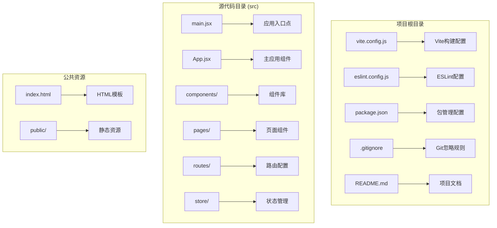
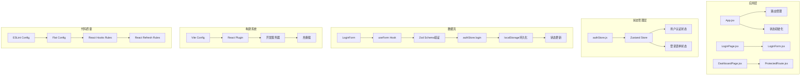
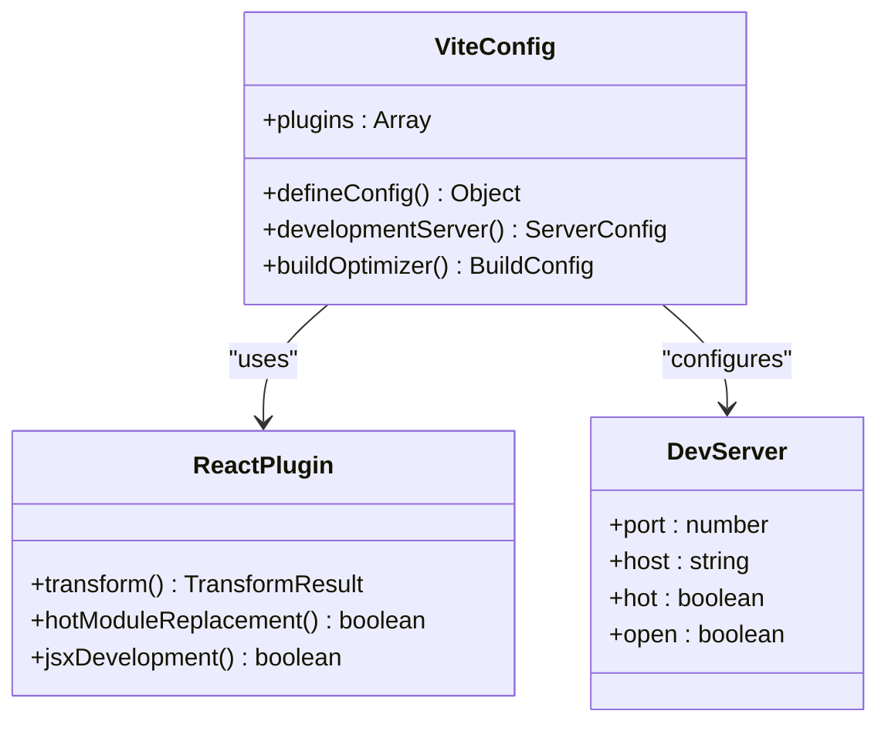
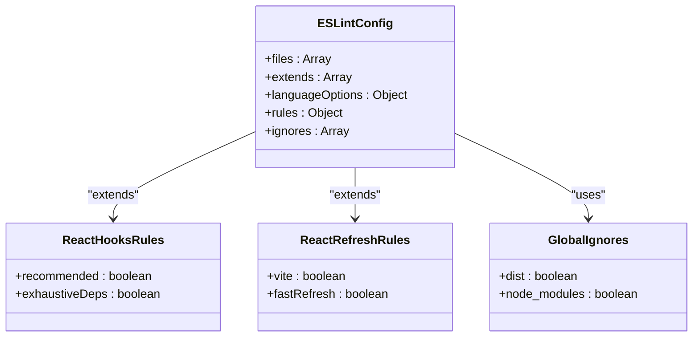
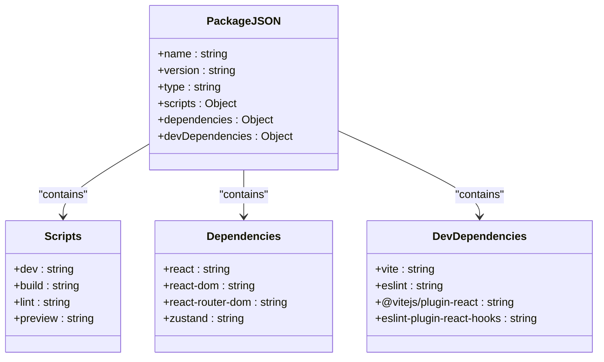
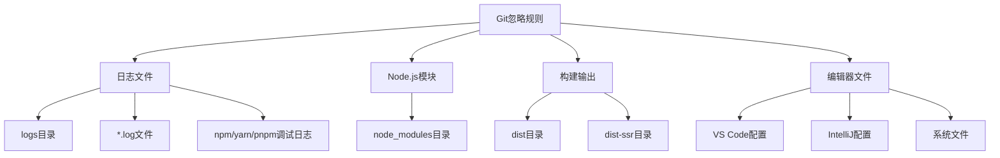
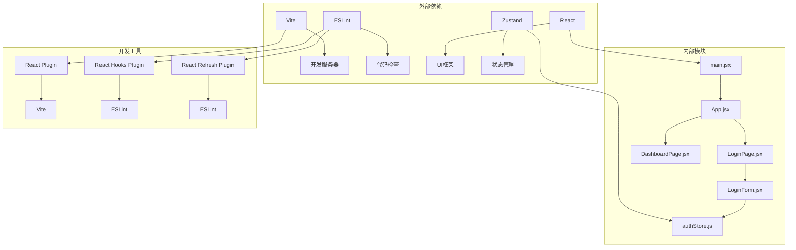

# 开发工具配置

<cite>
**本文档引用的文件**
- [vite.config.js](file://vite.config.js)
- [eslint.config.js](file://eslint.config.js)
- [package.json](file://package.json)
- [.gitignore](file://.gitignore)
- [README.md](file://README.md)
- [src/main.jsx](file://src/main.jsx)
- [src/App.jsx](file://src/App.jsx)
- [index.html](file://index.html)
- [src/pages/LoginPage.jsx](file://src/pages/LoginPage.jsx)
- [src/store/authStore.js](file://src/store/authStore.js)
- [src/components/LoginForm.jsx](file://src/components/LoginForm.jsx)
</cite>

## 目录
1. [简介](#简介)
2. [项目结构](#项目结构)
3. [核心组件](#核心组件)
4. [架构概览](#架构概览)
5. [详细组件分析](#详细组件分析)
6. [依赖关系分析](#依赖关系分析)
7. [性能考虑](#性能考虑)
8. [故障排除指南](#故障排除指南)
9. [结论](#结论)

## 简介

这是一个基于React和Vite的现代化前端开发工具配置指南。该项目展示了如何配置开发环境、构建工具、代码规范和版本控制系统。通过分析项目的配置文件，我们可以了解现代前端开发的最佳实践，包括热重载、ESLint规则、包管理策略和Git忽略规则等关键配置。

## 项目结构

该项目采用标准的React应用目录结构，主要包含以下关键目录和文件：

**图表来源**
- [vite.config.js:1-8](file://vite.config.js#L1-L8)
- [package.json:1-33](file://package.json#L1-L33)
- [src/main.jsx:1-11](file://src/main.jsx#L1-L11)

**章节来源**
- [vite.config.js:1-8](file://vite.config.js#L1-L8)
- [package.json:1-33](file://package.json#L1-L33)
- [README.md:1-17](file://README.md#L1-L17)

## 核心组件

### Vite构建配置

Vite作为现代前端构建工具，提供了快速的开发体验和高效的生产构建。当前配置相对简洁，专注于React应用的核心需求。

**配置特点：**
- 基于函数式配置方式，使用defineConfig函数
- 集成React插件，支持JSX语法和热重载
- 默认开发服务器配置，无需额外优化

### ESLint代码规范配置

ESLint配置采用了最新的flat配置格式，提供了完整的React开发环境支持。

**配置亮点：**
- 使用flat配置格式，支持更灵活的规则组合
- 集成React Hooks和React Refresh插件
- 支持浏览器全局变量访问
- 自定义未使用变量规则，允许大写常量模式

### 包管理配置

package.json包含了完整的依赖管理和脚本命令配置。

**依赖分类：**
- 运行时依赖：React生态系统核心库
- 开发依赖：构建工具和代码质量工具
- 脚本命令：开发、构建、预览和代码检查

**章节来源**
- [vite.config.js:5-7](file://vite.config.js#L5-L7)
- [eslint.config.js:7-29](file://eslint.config.js#L7-L29)
- [package.json:6-11](file://package.json#L6-L11)

## 架构概览

项目采用模块化的架构设计，各个组件通过清晰的职责分离实现松耦合。

**图表来源**
- [src/App.jsx:10-41](file://src/App.jsx#L10-L41)
- [src/store/authStore.js:3-41](file://src/store/authStore.js#L3-L41)
- [src/components/LoginForm.jsx:12-29](file://src/components/LoginForm.jsx#L12-L29)

## 详细组件分析

### Vite配置组件分析

Vite配置展现了现代前端构建工具的核心功能：

**图表来源**
- [vite.config.js:5-7](file://vite.config.js#L5-L7)

**配置要点：**
- 插件系统：仅启用React插件，保持配置简洁
- 开发服务器：默认端口和主机配置
- 热重载：自动文件监听和模块替换

**章节来源**
- [vite.config.js:1-8](file://vite.config.js#L1-L8)

### ESLint配置组件分析

ESLint配置采用了最新的flat配置格式，提供了完整的React开发支持：

**图表来源**
- [eslint.config.js:7-29](file://eslint.config.js#L7-L29)

**规则定制分析：**
- 语言特性：支持ES2020语法和JSX
- 全局变量：浏览器环境下的全局对象
- 自定义规则：未使用变量的特殊处理模式

**章节来源**
- [eslint.config.js:16-27](file://eslint.config.js#L16-L27)

### 包管理组件分析

package.json展示了完整的依赖管理和脚本配置：

**图表来源**
- [package.json:6-31](file://package.json#L6-L31)

**依赖管理策略：**
- 版本锁定：使用^符号进行兼容性版本管理
- 功能分离：运行时和开发时依赖明确区分
- 最小化原则：仅包含必要的依赖包

**章节来源**
- [package.json:12-31](file://package.json#L12-L31)

### Git忽略配置分析

.gitignore文件定义了版本控制中应该忽略的文件和目录：

**图表来源**
- [.gitignore:1-25](file://.gitignore#L1-L25)

**忽略规则策略：**
- 开发产物：构建输出和缓存文件
- 依赖管理：Node.js模块目录
- 编辑器配置：IDE特定文件和设置

**章节来源**
- [.gitignore:1-25](file://.gitignore#L1-L25)

## 依赖关系分析

项目各组件之间的依赖关系展现了清晰的架构层次：

**图表来源**
- [src/main.jsx:1-11](file://src/main.jsx#L1-L11)
- [src/App.jsx:1-44](file://src/App.jsx#L1-L44)
- [src/store/authStore.js:1-44](file://src/store/authStore.js#L1-L44)

**依赖关系特点：**
- 单向依赖：从入口到组件的线性依赖链
- 松耦合：组件间通过状态管理解耦
- 明确边界：外部依赖与内部逻辑清晰分离

**章节来源**
- [src/main.jsx:1-11](file://src/main.jsx#L1-L11)
- [src/App.jsx:1-44](file://src/App.jsx#L1-L44)
- [src/store/authStore.js:1-44](file://src/store/authStore.js#L1-L44)

## 性能考虑

### 开发服务器优化

项目采用Vite的默认配置，在开发环境下提供快速的热重载和模块替换功能。由于项目规模较小，当前配置已能满足开发需求。

### 代码质量优化

ESLint配置通过flat配置格式提供了更好的性能和更灵活的规则组合。React Hooks和React Refresh插件的集成确保了开发时的即时反馈。

### 依赖优化策略

- **按需加载**：React Router的路由组件支持懒加载
- **状态管理**：Zustand提供轻量级的状态管理方案
- **表单验证**：Zod提供高性能的类型安全验证

## 故障排除指南

### 常见开发问题

**热重载不工作**
- 检查Vite插件配置是否正确
- 确认文件保存后是否有重新编译
- 验证浏览器控制台是否有错误信息

**ESLint规则冲突**
- 检查eslint.config.js中的规则配置
- 确认IDE的ESLint插件已正确安装
- 验证全局忽略规则是否影响了目标文件

**依赖安装问题**
- 清理node_modules和package-lock.json
- 检查npm/yarn/pnpm的版本兼容性
- 确认网络连接正常

### 调试技巧

**开发环境调试**
- 使用浏览器开发者工具检查组件树
- 利用React DevTools分析组件性能
- 通过控制台输出调试信息

**构建问题排查**
- 检查构建输出目录的文件完整性
- 验证生产环境的代码压缩效果
- 确认静态资源的正确引用

**章节来源**
- [README.md:10-17](file://README.md#L10-L17)

## 结论

本项目展示了现代React应用开发的最佳实践配置。通过合理的工具选择和配置优化，实现了高效的开发体验和良好的代码质量保证。

**关键优势：**
- 简洁的Vite配置提供了快速的开发响应
- 完整的ESLint配置确保了代码一致性
- 合理的依赖管理保持了项目的轻量化
- 规范的Git忽略规则避免了不必要的文件提交

**建议改进方向：**
- 可以考虑添加TypeScript支持以获得更好的类型安全
- 在生产环境中可以进一步优化构建配置
- 可以添加更多的代码质量检查规则
- 考虑添加自动化测试配置

这个配置为中小型React应用提供了一个坚实的基础，可以根据具体需求进行扩展和定制。