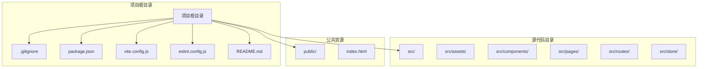
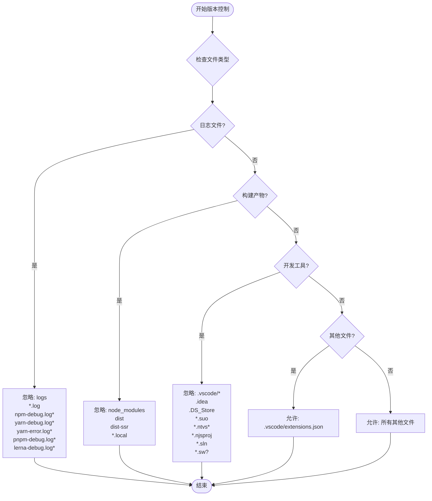
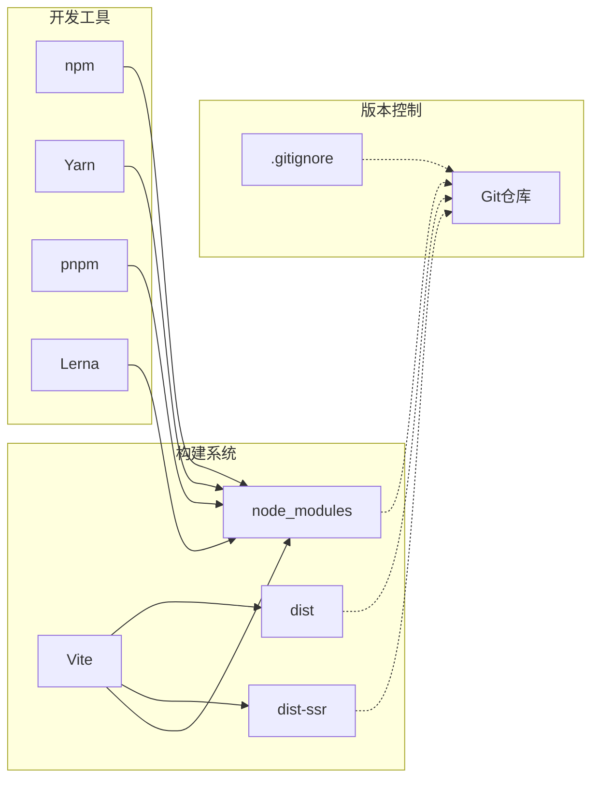
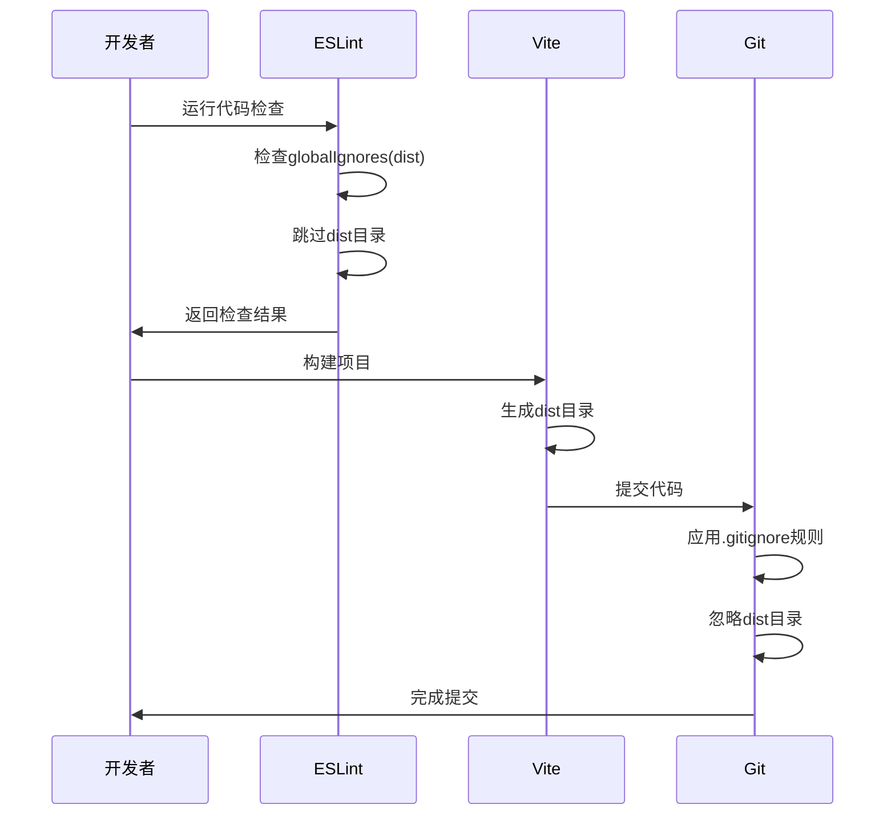
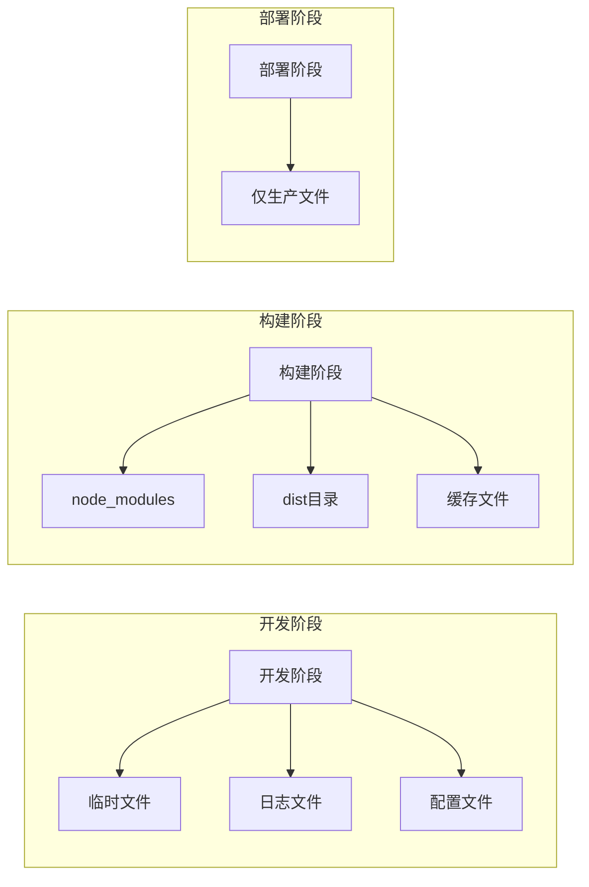

# 版本控制忽略规则

<cite>
**本文档引用的文件**
- [.gitignore](file://.gitignore)
- [package.json](file://package.json)
- [vite.config.js](file://vite.config.js)
- [eslint.config.js](file://eslint.config.js)
- [src/App.jsx](file://src/App.jsx)
- [src/main.jsx](file://src/main.jsx)
- [src/index.css](file://src/index.css)
</cite>

## 目录
1. [简介](#简介)
2. [项目结构](#项目结构)
3. [核心组件](#核心组件)
4. [架构概览](#架构概览)
5. [详细组件分析](#详细组件分析)
6. [依赖分析](#依赖分析)
7. [性能考虑](#性能考虑)
8. [故障排除指南](#故障排除指南)
9. [结论](#结论)
10. [附录](#附录)

## 简介

本文件详细说明了版本控制系统中.gitignore文件的忽略规则配置，重点分析了该React登录应用程序的忽略策略。通过深入解析.gitignore文件中的文件过滤规则、目录排除和通配符使用，阐述开发环境特有的文件忽略策略，包括node_modules、构建产物和临时文件的处理方式。

该文档还涵盖了不同操作系统和IDE的忽略配置、日志文件管理和敏感信息保护策略，以及Git工作流程优化、分支管理策略和团队协作的文件同步规则。最后提供了忽略规则的优先级、继承关系和特殊情况处理的解释，以及常见忽略模式的示例和最佳实践建议。

## 项目结构

该项目是一个基于React和Vite的登录应用程序，采用现代化的前端开发技术栈：

**图表来源**
- [package.json:1-33](file://package.json#L1-L33)
- [vite.config.js:1-8](file://vite.config.js#L1-L8)
- [src/App.jsx:1-44](file://src/App.jsx#L1-L44)

**章节来源**
- [package.json:1-33](file://package.json#L1-L33)
- [vite.config.js:1-8](file://vite.config.js#L1-L8)
- [README.md:1-17](file://README.md#L1-L17)

## 核心组件

### .gitignore文件结构分析

.gitignore文件采用分段组织的方式，每个部分对应特定类型的文件或目录：

#### 日志文件处理
- `logs`: 忽略所有日志目录
- `*.log`: 忽略所有扩展名为.log的日志文件
- `npm-debug.log*`: 忽略npm调试日志文件
- `yarn-debug.log*`: 忽略Yarn调试日志文件
- `yarn-error.log*`: 忽略Yarn错误日志文件
- `pnpm-debug.log*`: 忽略pnpm调试日志文件
- `lerna-debug.log*`: 忽略Lerna调试日志文件

#### 构建产物排除
- `node_modules`: 忽略Node.js模块目录
- `dist`: 忽略生产环境构建输出目录
- `dist-ssr`: 忽略服务端渲染构建输出目录
- `*.local`: 忽略本地配置文件

#### 开发工具和编辑器配置
- `.vscode/*`: 忽略VS Code配置目录的所有内容
- `.vscode/extensions.json`: 允许VS Code扩展配置文件
- `.idea`: 忽略IntelliJ IDEA相关配置
- `.DS_Store`: 忽略macOS系统文件
- `*.suo`: 忽略Visual Studio用户选项
- `*.ntvs*`: 忽略Node.js Tools for Visual Studio
- `*.njsproj`: 忽略Node.js项目文件
- `*.sln`: 忽略解决方案文件
- `*.sw?`: 忽略交换文件

**章节来源**
- [.gitignore:1-25](file://.gitignore#L1-L25)

## 架构概览

版本控制忽略规则的架构设计体现了分层过滤的原则：

**图表来源**
- [.gitignore:1-25](file://.gitignore#L1-L25)

## 详细组件分析

### 文件过滤规则详解

#### 通配符使用策略
- `*`: 匹配任意数量的字符（除斜杠外）
- `?`: 匹配单个字符
- `[]`: 字符类匹配
- `!`: 否定模式，用于允许特定文件

#### 目录排除机制
- `logs/`: 排除整个日志目录及其子目录
- `dist/`: 排除构建输出目录
- `.vscode/*`: 排除VS Code配置目录的所有内容
- `!pattern`: 反向匹配，允许特定文件

#### 特殊文件处理
- `.vscode/extensions.json`: 使用否定模式允许VS Code扩展配置
- `*.local`: 忽略本地配置文件，防止敏感信息泄露

**章节来源**
- [.gitignore:1-25](file://.gitignore#L1-L25)

### 开发环境忽略策略

#### Node.js生态系统支持
项目同时支持多种包管理器的调试日志：
- npm: `npm-debug.log*`
- yarn: `yarn-debug.log*`, `yarn-error.log*`
- pnpm: `pnpm-debug.log*`
- lerna: `lerna-debug.log*`

#### 构建工具集成
- Vite构建输出: `dist`, `dist-ssr`
- Node.js模块: `node_modules`
- 本地配置: `*.local`

**章节来源**
- [.gitignore:1-25](file://.gitignore#L1-L25)
- [package.json:6-11](file://package.json#L6-L11)

### 多平台兼容性配置

#### 操作系统特定文件
- macOS: `.DS_Store`
- Windows: `.vscode`, `*.suo`, `*.ntvs*`, `*.njsproj`, `*.sln`
- Linux: `.idea`

#### IDE配置管理
- VS Code: `.vscode/*` (除`extensions.json`)
- IntelliJ IDEA: `.idea`
- Visual Studio: `*.suo`, `*.ntvs*`, `*.njsproj`, `*.sln`

**章节来源**
- [.gitignore:15-25](file://.gitignore#L15-L25)

## 依赖分析

### 构建系统与忽略规则的关系

**图表来源**
- [vite.config.js:1-8](file://vite.config.js#L1-L8)
- [package.json:21-31](file://package.json#L21-L31)
- [.gitignore:10-13](file://.gitignore#L10-L13)

### ESLint配置与忽略规则的协同

ESLint配置通过globalIgnores排除构建目录，与.gitignore形成双重保护：

**图表来源**
- [eslint.config.js:8](file://eslint.config.js#L8)
- [vite.config.js:5-7](file://vite.config.js#L5-L7)

**章节来源**
- [eslint.config.js:1-30](file://eslint.config.js#L1-L30)
- [vite.config.js:1-8](file://vite.config.js#L1-L8)

## 性能考虑

### 忽略规则的性能影响

1. **规则匹配顺序**: Git按从上到下的顺序匹配忽略规则，第一条匹配的规则生效
2. **通配符效率**: 简单的通配符模式比复杂的正则表达式更高效
3. **目录遍历优化**: 使用目录级别的排除比逐文件排除更高效
4. **缓存机制**: Git会缓存忽略规则的匹配结果

### 最佳实践建议

- 将最常用的忽略规则放在前面
- 避免使用过于复杂的通配符模式
- 使用目录级别的排除优于文件级别的排除
- 定期审查和优化忽略规则

## 故障排除指南

### 常见问题诊断

#### 规则不生效的原因
1. **路径问题**: 确保忽略规则使用正确的相对路径
2. **大小写敏感**: 注意操作系统的大小写敏感性
3. **符号链接**: 检查符号链接文件是否被正确忽略
4. **缓存问题**: 使用`git rm -r --cached .`清除缓存

#### 规则优先级问题
1. **局部规则覆盖全局规则**: 本地.gitignore可以覆盖全局规则
2. **否定规则优先**: `!`前缀的规则优先于普通规则
3. **目录规则优先**: 目录级别的规则优先于文件级别的规则

**章节来源**
- [.gitignore:1-25](file://.gitignore#L1-L25)

## 结论

该React登录应用程序的.gitignore配置体现了现代前端开发的最佳实践，通过分层的忽略策略有效管理了开发过程中的各种文件类型。配置涵盖了日志文件、构建产物、开发工具配置和操作系统特定文件的处理，形成了完整的版本控制文件管理方案。

关键优势包括：
- 全面的多包管理器支持
- 现代构建工具的完整覆盖
- 跨平台兼容性
- 敏感信息保护
- 开发体验优化

建议在团队协作中保持这些规则的一致性，并根据项目发展定期更新和优化忽略规则。

## 附录

### 最佳实践清单

1. **日志文件管理**
   - 始终忽略所有日志文件
   - 不要提交任何调试日志
   - 使用环境变量控制日志级别

2. **构建产物处理**
   - 永远忽略node_modules
   - 忽略所有构建输出目录
   - 不要提交本地配置文件

3. **开发工具配置**
   - 忽略IDE特定配置文件
   - 允许必要的扩展配置
   - 避免提交个人设置

4. **团队协作规则**
   - 统一的忽略规则标准
   - 定期审查和更新规则
   - 新成员入职培训

### 常见忽略模式示例

