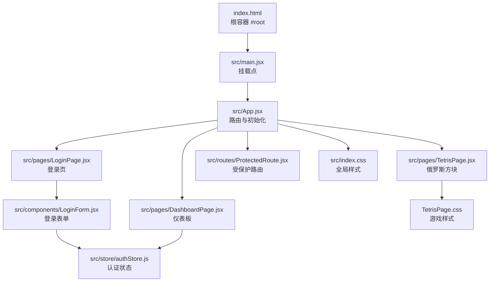
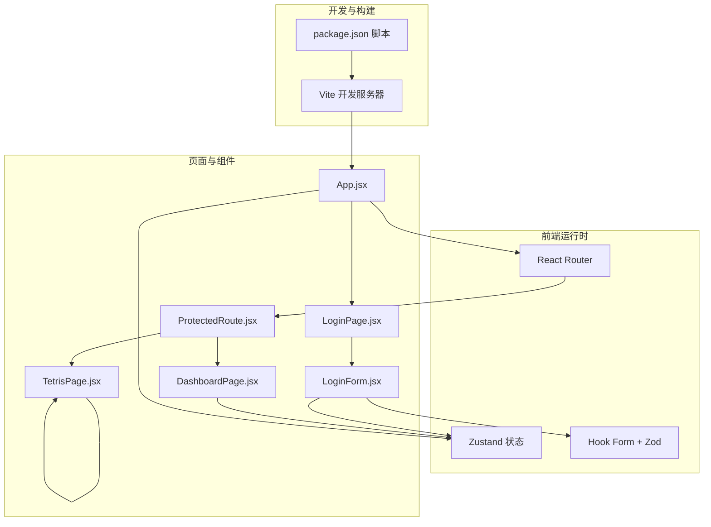
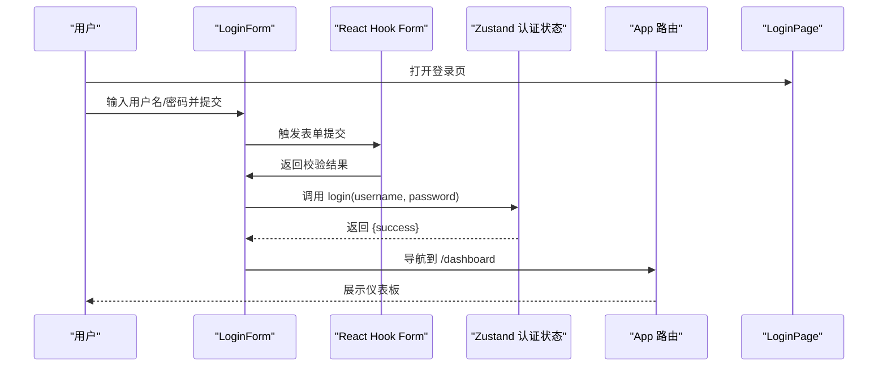
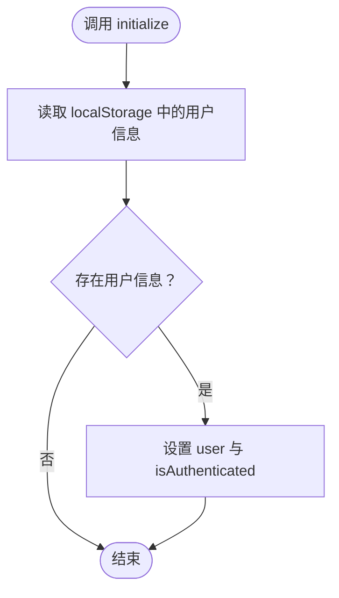
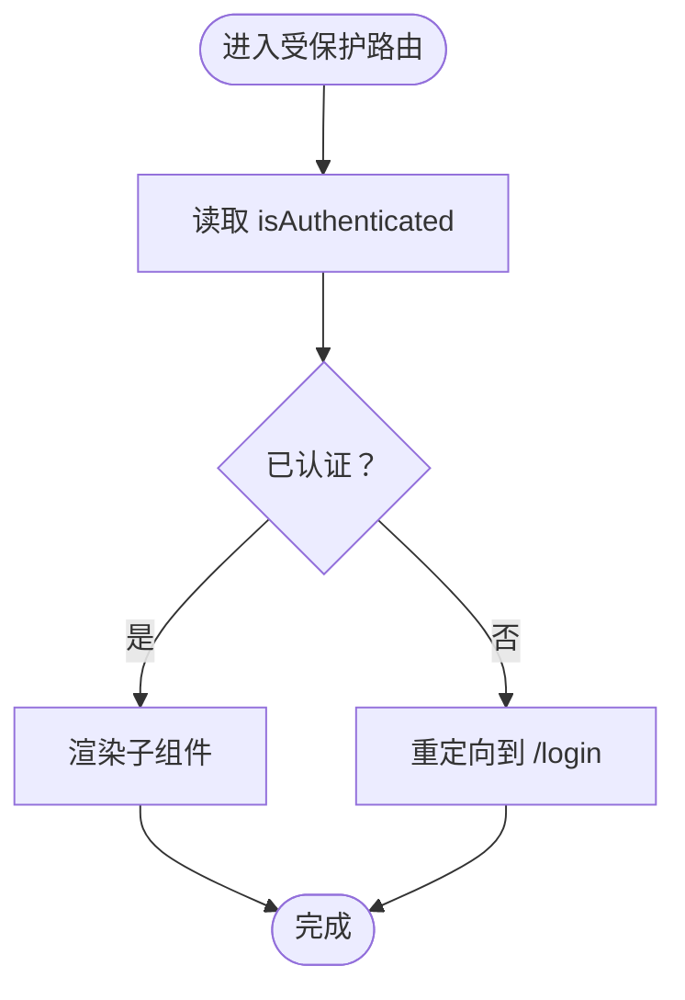
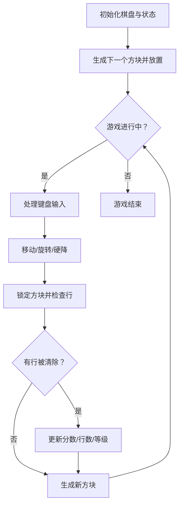

# 快速开始

<cite>
**本文引用的文件**
- [package.json](file://package.json)
- [vite.config.js](file://vite.config.js)
- [index.html](file://index.html)
- [src/main.jsx](file://src/main.jsx)
- [src/App.jsx](file://src/App.jsx)
- [src/components/LoginForm.jsx](file://src/components/LoginForm.jsx)
- [src/store/authStore.js](file://src/store/authStore.js)
- [src/routes/ProtectedRoute.jsx](file://src/routes/ProtectedRoute.jsx)
- [src/pages/LoginPage.jsx](file://src/pages/LoginPage.jsx)
- [src/pages/DashboardPage.jsx](file://src/pages/DashboardPage.jsx)
- [src/pages/TetrisPage.jsx](file://src/pages/TetrisPage.jsx)
- [src/index.css](file://src/index.css)
- [src/pages/TetrisPage.css](file://src/pages/TetrisPage.css)
- [eslint.config.js](file://eslint.config.js)
- [.gitignore](file://.gitignore)
- [README.md](file://README.md)
- [react-login-app.md](file://react-login-app.md)
</cite>

## 目录
1. [简介](#简介)
2. [项目结构](#项目结构)
3. [核心组件](#核心组件)
4. [架构总览](#架构总览)
5. [详细组件分析](#详细组件分析)
6. [依赖分析](#依赖分析)
7. [性能考虑](#性能考虑)
8. [故障排除指南](#故障排除指南)
9. [结论](#结论)
10. [附录](#附录)

## 简介
本指南面向希望在30分钟内快速搭建并运行一个React登录应用的开发者。项目基于Vite + React，采用现代化技术栈，包含登录表单、路由保护、状态管理与基础页面导航。你将学会：
- 环境要求与安装
- 克隆与安装依赖
- 启动开发服务器与访问
- 基本功能演示
- 常见问题排查
- 目录结构与关键配置说明
- 生产构建与部署要点

## 项目结构
项目采用按功能分层的组织方式，核心入口为浏览器端渲染，路由与状态管理贯穿各页面。

图表来源
- [index.html:1-14](file://index.html#L1-L14)
- [src/main.jsx:1-11](file://src/main.jsx#L1-L11)
- [src/App.jsx:1-44](file://src/App.jsx#L1-L44)
- [src/pages/LoginPage.jsx:1-18](file://src/pages/LoginPage.jsx#L1-L18)
- [src/pages/DashboardPage.jsx:1-57](file://src/pages/DashboardPage.jsx#L1-L57)
- [src/pages/TetrisPage.jsx:1-413](file://src/pages/TetrisPage.jsx#L1-L413)
- [src/routes/ProtectedRoute.jsx:1-15](file://src/routes/ProtectedRoute.jsx#L1-L15)
- [src/components/LoginForm.jsx:1-78](file://src/components/LoginForm.jsx#L1-L78)
- [src/store/authStore.js:1-44](file://src/store/authStore.js#L1-L44)
- [src/index.css:1-261](file://src/index.css#L1-L261)
- [src/pages/TetrisPage.css:1-293](file://src/pages/TetrisPage.css#L1-L293)

章节来源
- [react-login-app.md:15-35](file://react-login-app.md#L15-L35)

## 核心组件
- 登录表单组件负责收集用户名与密码，使用Zod进行字段校验，通过React Hook Form管理表单状态，并调用认证状态管理执行登录。
- 认证状态管理使用Zustand，提供登录、登出、初始化等能力，并持久化用户信息到localStorage。
- 受保护路由在渲染子组件前检查登录状态，未登录则重定向至登录页。
- 应用主组件配置路由，包含登录页、仪表板、受保护的俄罗斯方块页以及根路径重定向。
- 页面组件分别承载登录页布局、仪表板内容与俄罗斯方块游戏。

章节来源
- [src/components/LoginForm.jsx:1-78](file://src/components/LoginForm.jsx#L1-L78)
- [src/store/authStore.js:1-44](file://src/store/authStore.js#L1-L44)
- [src/routes/ProtectedRoute.jsx:1-15](file://src/routes/ProtectedRoute.jsx#L1-L15)
- [src/App.jsx:1-44](file://src/App.jsx#L1-L44)
- [src/pages/LoginPage.jsx:1-18](file://src/pages/LoginPage.jsx#L1-L18)
- [src/pages/DashboardPage.jsx:1-57](file://src/pages/DashboardPage.jsx#L1-L57)
- [src/pages/TetrisPage.jsx:1-413](file://src/pages/TetrisPage.jsx#L1-L413)

## 架构总览
应用采用前端SPA架构，使用Vite提供开发服务器与构建工具链，React Router进行客户端路由，Zustand管理认证状态，Zod与React Hook Form保障表单校验与交互。

图表来源
- [package.json:6-11](file://package.json#L6-L11)
- [vite.config.js:1-8](file://vite.config.js#L1-L8)
- [src/App.jsx:1-44](file://src/App.jsx#L1-L44)
- [src/routes/ProtectedRoute.jsx:1-15](file://src/routes/ProtectedRoute.jsx#L1-L15)
- [src/pages/LoginPage.jsx:1-18](file://src/pages/LoginPage.jsx#L1-L18)
- [src/pages/DashboardPage.jsx:1-57](file://src/pages/DashboardPage.jsx#L1-L57)
- [src/pages/TetrisPage.jsx:1-413](file://src/pages/TetrisPage.jsx#L1-L413)
- [src/components/LoginForm.jsx:1-78](file://src/components/LoginForm.jsx#L1-L78)
- [src/store/authStore.js:1-44](file://src/store/authStore.js#L1-L44)

## 详细组件分析

### 登录流程时序
从用户输入到登录完成，涉及表单校验、状态更新与路由跳转。

图表来源
- [src/components/LoginForm.jsx:24-29](file://src/components/LoginForm.jsx#L24-L29)
- [src/store/authStore.js:9-27](file://src/store/authStore.js#L9-L27)
- [src/App.jsx:20-37](file://src/App.jsx#L20-L37)
- [src/pages/LoginPage.jsx:1-18](file://src/pages/LoginPage.jsx#L1-L18)

章节来源
- [src/components/LoginForm.jsx:1-78](file://src/components/LoginForm.jsx#L1-L78)
- [src/store/authStore.js:1-44](file://src/store/authStore.js#L1-L44)
- [src/App.jsx:1-44](file://src/App.jsx#L1-L44)

### 认证状态管理（Zustand）
- 状态：用户信息、是否已认证、加载状态、错误信息
- 方法：登录（模拟API）、登出、初始化（读取localStorage）

图表来源
- [src/store/authStore.js:34-40](file://src/store/authStore.js#L34-L40)

章节来源
- [src/store/authStore.js:1-44](file://src/store/authStore.js#L1-L44)

### 受保护路由逻辑
- 渲染子组件前检查认证状态
- 未认证则重定向到登录页

图表来源
- [src/routes/ProtectedRoute.jsx:4-12](file://src/routes/ProtectedRoute.jsx#L4-L12)

章节来源
- [src/routes/ProtectedRoute.jsx:1-15](file://src/routes/ProtectedRoute.jsx#L1-L15)

### 俄罗斯方块页面（算法概览）
- 游戏网格尺寸、方块形状与颜色定义
- 位置合法性检测、旋转、幽灵块（预估落点）
- 下落速度随等级提升而加快
- 行消除与计分、等级提升

图表来源
- [src/pages/TetrisPage.jsx:63-238](file://src/pages/TetrisPage.jsx#L63-L238)
- [src/pages/TetrisPage.jsx:240-268](file://src/pages/TetrisPage.jsx#L240-L268)
- [src/pages/TetrisPage.jsx:331-410](file://src/pages/TetrisPage.jsx#L331-L410)

章节来源
- [src/pages/TetrisPage.jsx:1-413](file://src/pages/TetrisPage.jsx#L1-L413)

## 依赖分析
- 运行时依赖
  - react、react-dom：React核心
  - react-router-dom：客户端路由
  - react-hook-form + @hookform/resolvers + zod：表单与验证
  - zustand：轻量状态管理
- 开发依赖
  - vite：构建与开发服务器
  - @vitejs/plugin-react：React插件
  - eslint 及相关插件：代码质量

章节来源
- [package.json:12-31](file://package.json#L12-L31)

## 性能考虑
- Vite提供快速冷启动与热更新，适合开发阶段
- React Hook Form仅在需要时渲染，减少不必要的重渲染
- Zustand轻量且易于优化，避免过度拆分状态
- 生产构建建议开启压缩与Tree Shaking（由Vite默认启用）

## 故障排除指南
- 安装依赖失败（网络/权限问题）
  - 使用镜像源或代理，确保npm/yarn/pnpm可用
  - 清理缓存后重试
- 启动时报端口占用
  - 修改Vite配置中的端口或关闭占用进程
- 路由无法跳转或刷新后404
  - 确认使用BrowserRouter且无服务端路由冲突
- 登录无效或报错
  - 检查控制台是否有异常
  - 确认表单字段满足Zod校验规则
- 样式不生效
  - 确认index.css与页面样式文件正确引入
  - 检查类名拼写与作用域

章节来源
- [eslint.config.js:1-30](file://eslint.config.js#L1-L30)
- [vite.config.js:1-8](file://vite.config.js#L1-L8)
- [src/index.css:1-261](file://src/index.css#L1-L261)
- [src/pages/TetrisPage.css:1-293](file://src/pages/TetrisPage.css#L1-L293)

## 结论
本项目提供了从零到一的完整React登录应用骨架，结合路由保护与状态管理，便于快速扩展业务功能。按照本指南，你可以在30分钟内完成环境准备、安装依赖、启动开发服务器并体验核心功能。

## 附录

### 环境要求
- Node.js：建议使用长期支持版本（LTS），具体版本以包管理器与项目兼容性为准
- 包管理器：npm（推荐）或 yarn/pnpm
- 浏览器：支持现代ES模块与React语法

章节来源
- [README.md:1-17](file://README.md#L1-L17)

### 克隆与安装
- 克隆仓库到本地
- 在项目根目录执行安装命令（如 npm install）
- 安装完成后即可进入下一步

章节来源
- [react-login-app.md:39-48](file://react-login-app.md#L39-L48)

### 本地启动
- 启动开发服务器：执行开发脚本
- 访问地址：在终端输出的本地地址打开浏览器（通常为本地回环地址）
- 默认端口：Vite默认端口，若被占用会自动递增

章节来源
- [package.json:6-11](file://package.json#L6-L11)
- [vite.config.js:1-8](file://vite.config.js#L1-L8)
- [react-login-app.md:78-79](file://react-login-app.md#L78-L79)

### 基本功能演示
- 登录页：输入用户名与密码，点击登录按钮
- 仪表板：登录成功后展示欢迎信息与统计卡片
- 俄罗斯方块：从仪表板进入，使用方向键控制，空格硬降，P暂停

章节来源
- [src/pages/LoginPage.jsx:1-18](file://src/pages/LoginPage.jsx#L1-L18)
- [src/pages/DashboardPage.jsx:1-57](file://src/pages/DashboardPage.jsx#L1-L57)
- [src/pages/TetrisPage.jsx:1-413](file://src/pages/TetrisPage.jsx#L1-L413)

### 目录结构与关键文件说明
- public：静态资源目录
- src：源码目录
  - assets：静态资源（本项目未使用）
  - components：可复用组件（如登录表单）
  - pages：页面组件（登录页、仪表板、俄罗斯方块）
  - routes：路由组件（受保护路由）
  - store：状态管理（认证状态）
  - index.css：全局样式
  - main.jsx：应用入口
  - App.jsx：应用根组件与路由配置
- vite.config.js：Vite配置（集成React插件）
- index.html：HTML入口模板
- package.json：脚本与依赖
- eslint.config.js：ESLint配置
- .gitignore：忽略项

章节来源
- [react-login-app.md:15-35](file://react-login-app.md#L15-L35)
- [.gitignore:1-25](file://.gitignore#L1-L25)

### 生产构建与部署
- 构建命令：执行构建脚本
- 预览命令：本地预览构建产物
- 部署建议：将构建输出目录作为静态站点部署；如需历史路由模式，请在服务端配置回退至index.html

章节来源
- [package.json:6-11](file://package.json#L6-L11)
- [README.md:1-17](file://README.md#L1-L17)