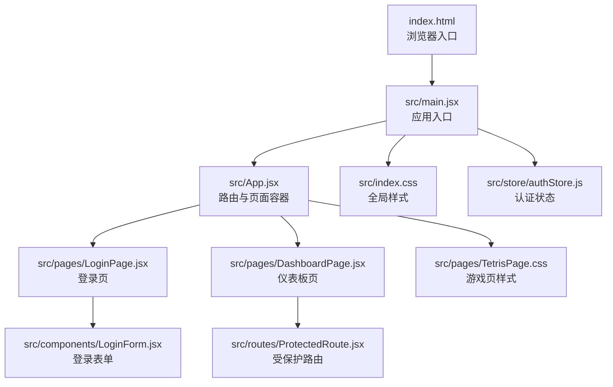
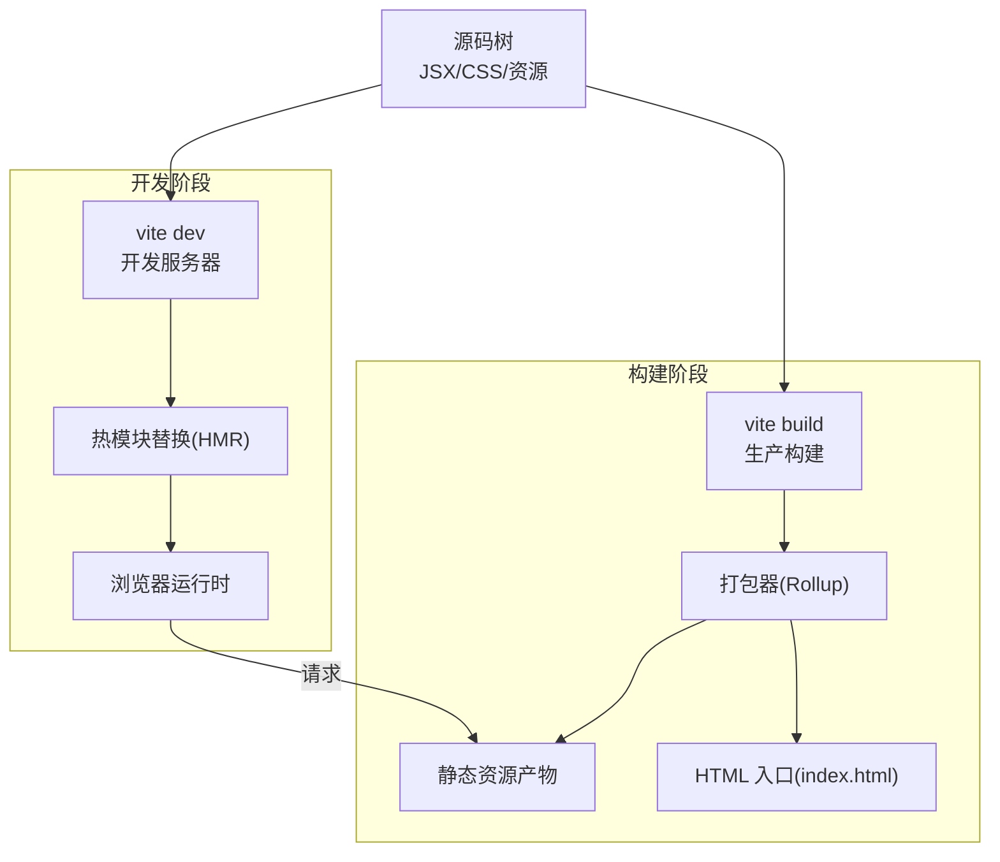
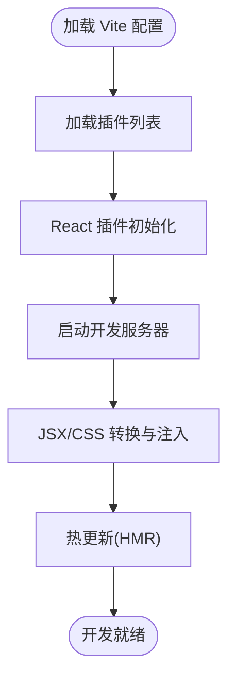
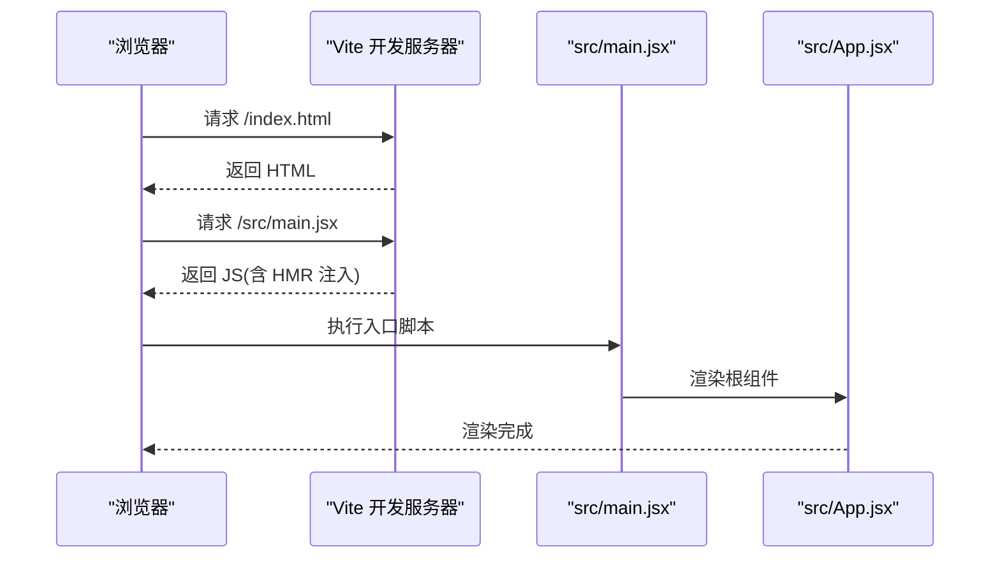
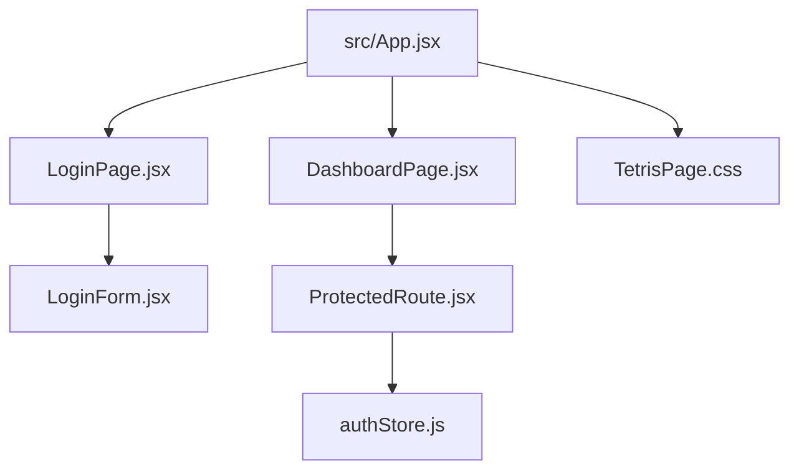
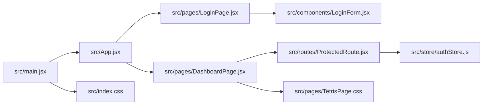

# 构建配置

<cite>
**本文引用的文件**
- [vite.config.js](file://vite.config.js)
- [package.json](file://package.json)
- [index.html](file://index.html)
- [src/main.jsx](file://src/main.jsx)
- [src/App.jsx](file://src/App.jsx)
- [src/components/LoginForm.jsx](file://src/components/LoginForm.jsx)
- [src/pages/LoginPage.jsx](file://src/pages/LoginPage.jsx)
- [src/pages/DashboardPage.jsx](file://src/pages/DashboardPage.jsx)
- [src/pages/TetrisPage.css](file://src/pages/TetrisPage.css)
- [src/store/authStore.js](file://src/store/authStore.js)
- [src/routes/ProtectedRoute.jsx](file://src/routes/ProtectedRoute.jsx)
- [src/index.css](file://src/index.css)
- [eslint.config.js](file://eslint.config.js)
- [README.md](file://README.md)
</cite>

## 目录
1. [引言](#引言)
2. [项目结构](#项目结构)
3. [核心组件](#核心组件)
4. [架构总览](#架构总览)
5. [详细组件分析](#详细组件分析)
6. [依赖分析](#依赖分析)
7. [性能考虑](#性能考虑)
8. [故障排查指南](#故障排查指南)
9. [结论](#结论)
10. [附录](#附录)

## 引言
本文件系统性梳理该 React 应用在 Vite 环境下的构建配置与优化策略，覆盖开发服务器启动、生产构建、模块解析与别名、插件体系、CSS 处理、代码分割与打包优化等主题，并通过流程图与依赖图展示从源码到产物的完整转换过程。同时提供性能优化建议与构建调试技巧，帮助开发者在保持开发体验的同时获得高质量的生产产物。

## 项目结构
该项目采用典型的 Vite + React 单页应用结构：
- 配置层：根目录下存在最小化的 Vite 配置文件与包管理脚本定义。
- 源码层：入口脚本、路由与页面、组件、状态管理、样式资源按功能域组织。
- 资源层：HTML 入口模板与静态资源目录。

图表来源
- [index.html](file://index.html)
- [src/main.jsx](file://src/main.jsx)
- [src/App.jsx](file://src/App.jsx)
- [src/pages/LoginPage.jsx](file://src/pages/LoginPage.jsx)
- [src/pages/DashboardPage.jsx](file://src/pages/DashboardPage.jsx)
- [src/pages/TetrisPage.css](file://src/pages/TetrisPage.css)
- [src/components/LoginForm.jsx](file://src/components/LoginForm.jsx)
- [src/routes/ProtectedRoute.jsx](file://src/routes/ProtectedRoute.jsx)
- [src/index.css](file://src/index.css)
- [src/store/authStore.js](file://src/store/authStore.js)

章节来源
- [index.html](file://index.html)
- [src/main.jsx](file://src/main.jsx)
- [src/App.jsx](file://src/App.jsx)

## 核心组件
- Vite 配置：当前配置启用 React 插件，未声明额外选项（如别名、插件扩展、CSS 预处理器等）。
- 包脚本：提供开发、构建、预览与代码质量检查命令。
- 应用入口：负责挂载根组件与引入全局样式。
- 路由与页面：基于 React Router 的路由结构，包含受保护路由。
- 组件与状态：登录表单、仪表板、受保护路由守卫与 Zustand 状态管理。
- 样式：全局样式与页面级样式，支持 CSS 变量与响应式布局。

章节来源
- [vite.config.js](file://vite.config.js)
- [package.json](file://package.json)
- [src/main.jsx](file://src/main.jsx)
- [src/App.jsx](file://src/App.jsx)
- [src/components/LoginForm.jsx](file://src/components/LoginForm.jsx)
- [src/pages/LoginPage.jsx](file://src/pages/LoginPage.jsx)
- [src/pages/DashboardPage.jsx](file://src/pages/DashboardPage.jsx)
- [src/pages/TetrisPage.css](file://src/pages/TetrisPage.css)
- [src/routes/ProtectedRoute.jsx](file://src/routes/ProtectedRoute.jsx)
- [src/index.css](file://src/index.css)
- [src/store/authStore.js](file://src/store/authStore.js)

## 架构总览
下图展示了从源码到产物的关键路径与处理阶段，包括开发服务器热更新、构建打包与资源产出。

图表来源
- [vite.config.js](file://vite.config.js)
- [package.json](file://package.json)
- [index.html](file://index.html)

## 详细组件分析

### Vite 配置与插件体系
- 当前配置启用 React 插件，用于 JSX 转换与开发体验增强；未声明额外插件或自定义选项。
- React 插件默认行为：基于 Oxc 的快速转译、HMR 支持、开发模式下的 React Refresh。
- 建议：若需 TypeScript、CSS 预处理器、路径别名、动态导入优化等，可在现有基础上扩展配置项。

图表来源
- [vite.config.js](file://vite.config.js)

章节来源
- [vite.config.js](file://vite.config.js)
- [README.md](file://README.md)

### 开发服务器与入口脚本
- HTML 入口模板定义了挂载点与基础元信息。
- 入口脚本负责渲染根组件并引入全局样式。
- 开发服务器通过脚本命令启动，自动监听变更并触发热更新。

图表来源
- [index.html](file://index.html)
- [src/main.jsx](file://src/main.jsx)
- [src/App.jsx](file://src/App.jsx)

章节来源
- [index.html](file://index.html)
- [src/main.jsx](file://src/main.jsx)
- [src/App.jsx](file://src/App.jsx)

### 路由与页面结构
- 应用通过路由容器组织多页面，登录页、仪表板页与受保护路由组合实现访问控制。
- 登录页依赖登录表单组件，仪表板页包含统计卡片与跳转至游戏页的链接。
- 受保护路由根据认证状态决定是否放行。

图表来源
- [src/App.jsx](file://src/App.jsx)
- [src/pages/LoginPage.jsx](file://src/pages/LoginPage.jsx)
- [src/pages/DashboardPage.jsx](file://src/pages/DashboardPage.jsx)
- [src/pages/TetrisPage.css](file://src/pages/TetrisPage.css)
- [src/components/LoginForm.jsx](file://src/components/LoginForm.jsx)
- [src/routes/ProtectedRoute.jsx](file://src/routes/ProtectedRoute.jsx)
- [src/store/authStore.js](file://src/store/authStore.js)

章节来源
- [src/App.jsx](file://src/App.jsx)
- [src/pages/LoginPage.jsx](file://src/pages/LoginPage.jsx)
- [src/pages/DashboardPage.jsx](file://src/pages/DashboardPage.jsx)
- [src/pages/TetrisPage.css](file://src/pages/TetrisPage.css)
- [src/components/LoginForm.jsx](file://src/components/LoginForm.jsx)
- [src/routes/ProtectedRoute.jsx](file://src/routes/ProtectedRoute.jsx)
- [src/store/authStore.js](file://src/store/authStore.js)

### CSS 与样式处理
- 全局样式通过入口脚本引入，页面级样式以独立文件组织。
- 项目使用原生 CSS，未启用预处理器；可通过 Vite 配置扩展 Sass/Less/Stylus 等。
- 建议：为大型项目引入预处理器可提升样式复用与维护性；同时结合 PostCSS 进行兼容性处理。

章节来源
- [src/index.css](file://src/index.css)
- [src/pages/TetrisPage.css](file://src/pages/TetrisPage.css)

### 代码分割与打包优化
- 当前配置未显式声明拆分策略；Vite 默认按需加载与动态导入进行代码分割。
- 建议：针对路由级页面采用动态导入以实现懒加载；对第三方库进行外部化与 CDN 引入以减少首屏体积。

章节来源
- [vite.config.js](file://vite.config.js)
- [src/pages/DashboardPage.jsx](file://src/pages/DashboardPage.jsx)

## 依赖分析
- 依赖关系：入口脚本依赖根组件与全局样式；根组件依赖路由与页面；页面依赖组件与受保护路由；登录表单依赖表单库与状态管理；仪表板依赖路由守卫与状态管理。
- 外部依赖：React 生态、路由、表单校验、状态管理与开发工具链。

图表来源
- [src/main.jsx](file://src/main.jsx)
- [src/App.jsx](file://src/App.jsx)
- [src/pages/LoginPage.jsx](file://src/pages/LoginPage.jsx)
- [src/pages/DashboardPage.jsx](file://src/pages/DashboardPage.jsx)
- [src/components/LoginForm.jsx](file://src/components/LoginForm.jsx)
- [src/routes/ProtectedRoute.jsx](file://src/routes/ProtectedRoute.jsx)
- [src/store/authStore.js](file://src/store/authStore.js)
- [src/index.css](file://src/index.css)
- [src/pages/TetrisPage.css](file://src/pages/TetrisPage.css)

章节来源
- [src/main.jsx](file://src/main.jsx)
- [src/App.jsx](file://src/App.jsx)
- [src/pages/LoginPage.jsx](file://src/pages/LoginPage.jsx)
- [src/pages/DashboardPage.jsx](file://src/pages/DashboardPage.jsx)
- [src/components/LoginForm.jsx](file://src/components/LoginForm.jsx)
- [src/routes/ProtectedRoute.jsx](file://src/routes/ProtectedRoute.jsx)
- [src/store/authStore.js](file://src/store/authStore.js)
- [src/index.css](file://src/index.css)
- [src/pages/TetrisPage.css](file://src/pages/TetrisPage.css)

## 性能考虑
- 开发体验
  - 启用 React 插件的 HMR，缩短反馈周期。
  - 使用最小化配置，避免不必要的插件开销。
- 构建优化
  - 对第三方库进行外部化与 CDN 引入，降低包体大小。
  - 使用动态导入实现路由级懒加载，减少首屏 JavaScript。
  - 启用 CSS 与图片资源压缩，合理设置产物目录与命名策略。
- 样式与资源
  - 将公共样式抽离为共享模块，避免重复打包。
  - 图片与字体资源采用合适格式与尺寸，必要时开启 WebP 或 AVIF。
- Lint 与类型
  - 结合 ESLint 规则与类型检查，提前发现潜在问题，减少运行时错误。

## 故障排查指南
- 开发服务器无法启动
  - 检查端口占用与网络权限；确认 Node 版本满足 Vite 与插件要求。
- 热更新不生效
  - 排查文件保存与监听状态；确认未禁用 HMR；检查浏览器控制台是否有错误。
- 构建失败或产物异常
  - 查看构建日志中的报错信息；核对插件版本与兼容性；检查路径别名与模块解析规则。
- 样式未生效
  - 确认样式文件被正确引入；检查选择器优先级与作用域；避免样式覆盖冲突。
- 路由跳转异常
  - 核对路由配置与受保护路由守卫逻辑；确保状态初始化顺序正确。

章节来源
- [eslint.config.js](file://eslint.config.js)
- [README.md](file://README.md)

## 结论
当前项目采用简洁的 Vite 配置与标准的 React 开发范式，具备良好的可扩展性。建议在保持开发体验的前提下，逐步引入路径别名、CSS 预处理器、动态导入与外部化策略，以进一步提升构建效率与运行性能。通过规范化的依赖管理与样式组织，可为后续功能迭代奠定坚实基础。

## 附录
- 常用脚本
  - 开发：vite
  - 构建：vite build
  - 预览：vite preview
  - 代码检查：eslint .
- 推荐实践
  - 在 Vite 配置中增加路径别名与预处理器支持。
  - 对大体积依赖进行外部化与 CDN 引入。
  - 使用动态导入实现页面级懒加载。
  - 结合 ESLint 与类型检查，提升代码质量与可维护性。