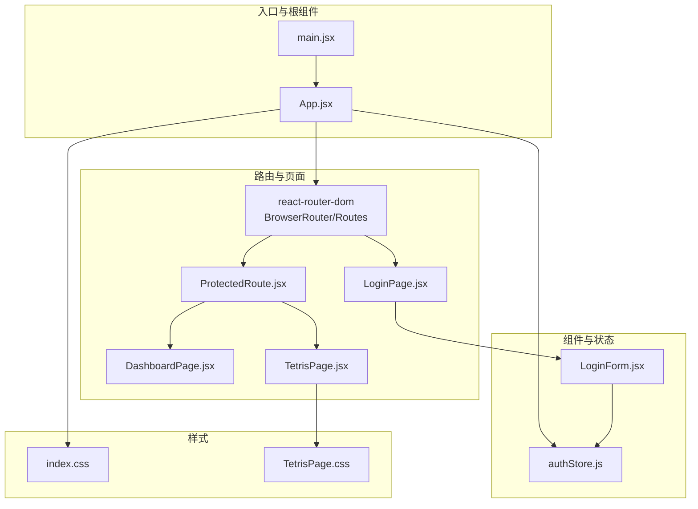
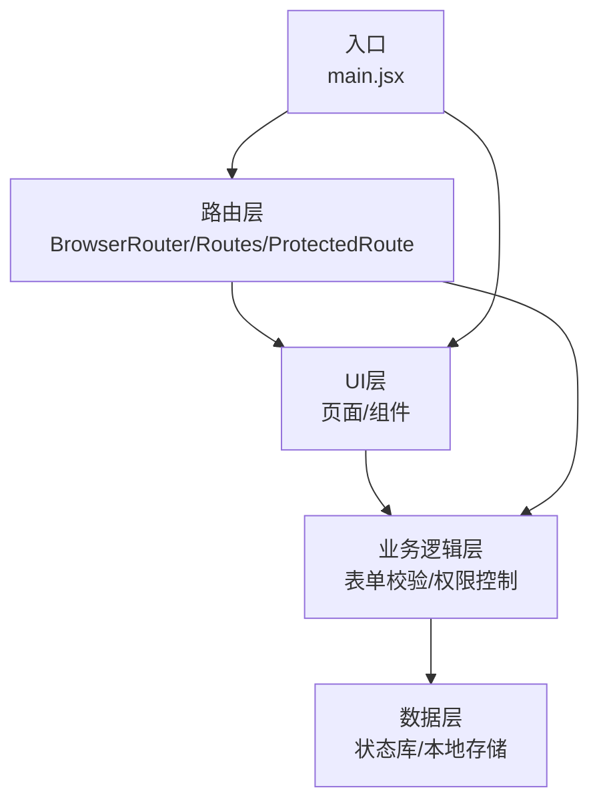
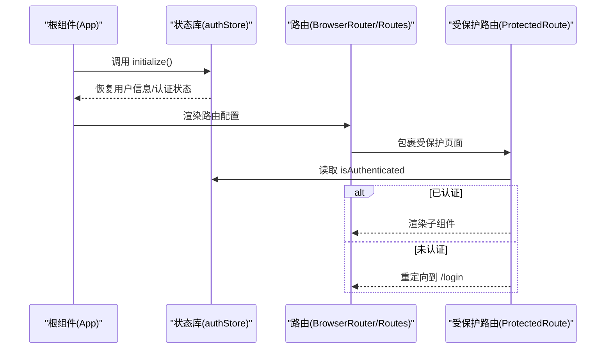
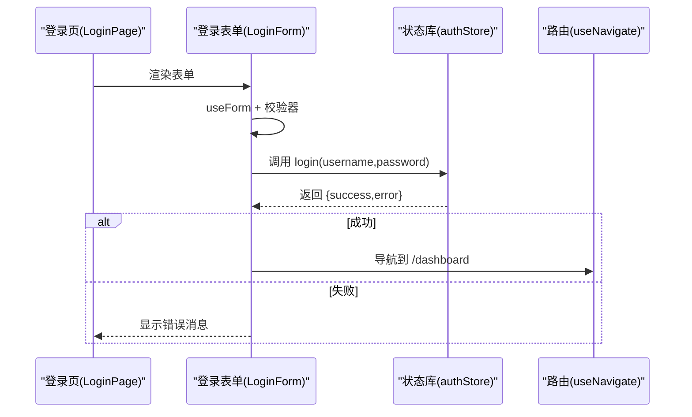
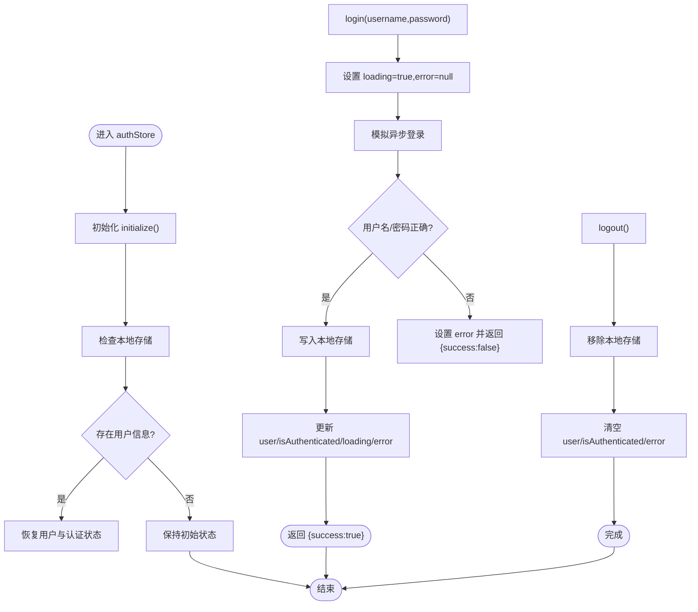
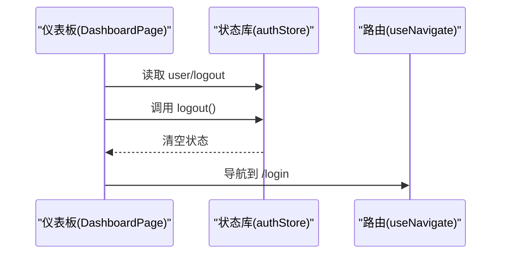
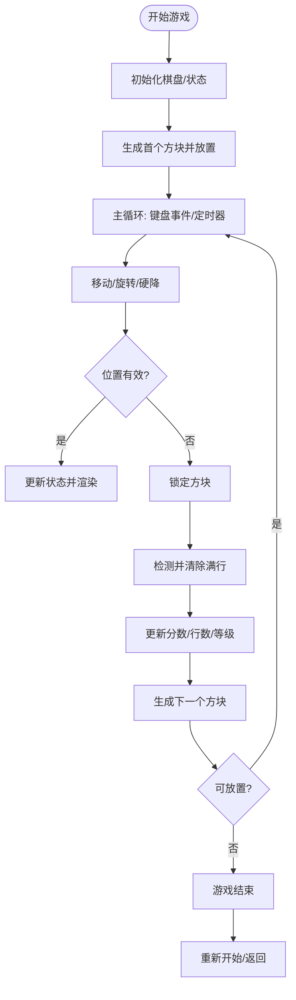
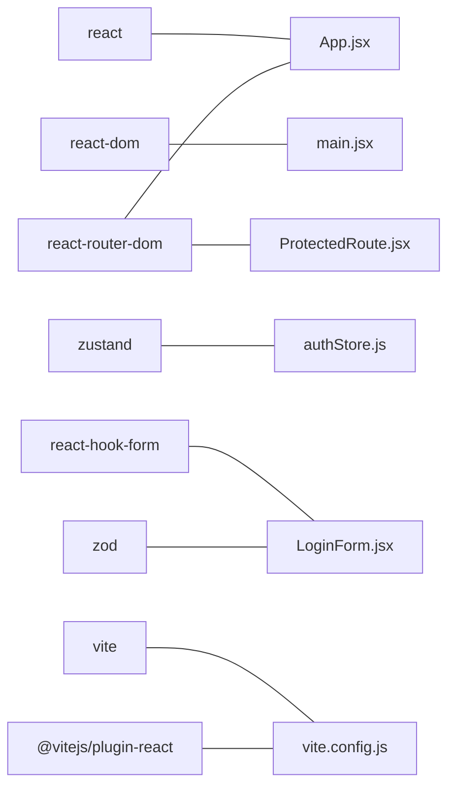

# 架构设计

<cite>
**本文引用的文件列表**
- [src/App.jsx](file://src/App.jsx)
- [src/main.jsx](file://src/main.jsx)
- [src/store/authStore.js](file://src/store/authStore.js)
- [src/components/LoginForm.jsx](file://src/components/LoginForm.jsx)
- [src/pages/LoginPage.jsx](file://src/pages/LoginPage.jsx)
- [src/pages/DashboardPage.jsx](file://src/pages/DashboardPage.jsx)
- [src/pages/TetrisPage.jsx](file://src/pages/TetrisPage.jsx)
- [src/routes/ProtectedRoute.jsx](file://src/routes/ProtectedRoute.jsx)
- [src/index.css](file://src/index.css)
- [src/pages/TetrisPage.css](file://src/pages/TetrisPage.css)
- [package.json](file://package.json)
- [vite.config.js](file://vite.config.js)
- [README.md](file://README.md)
</cite>

## 目录
1. [简介](#简介)
2. [项目结构](#项目结构)
3. [核心组件](#核心组件)
4. [架构总览](#架构总览)
5. [详细组件分析](#详细组件分析)
6. [依赖分析](#依赖分析)
7. [性能考量](#性能考量)
8. [故障排查指南](#故障排查指南)
9. [结论](#结论)
10. [附录](#附录)

## 简介
本项目是一个基于 React 的登录应用，采用组件化架构与分层设计，结合前端状态管理与路由守卫实现认证流程与页面导航。应用通过轻量的状态管理库进行全局状态维护，使用表单校验库保障输入合法性，并通过路由系统实现受保护页面访问控制。整体技术栈简洁明确，适合快速迭代与扩展。

## 项目结构
项目采用按功能域划分的目录组织方式：
- 入口与根组件：入口文件负责挂载根组件；根组件负责路由配置与全局初始化。
- 页面层：包含登录页、仪表板页、俄罗斯方块页等页面级组件。
- 组件层：通用可复用的表单组件（如登录表单）。
- 路由层：受保护路由组件，用于权限控制。
- 状态层：使用轻量状态库集中管理认证状态。
- 样式层：全局样式与页面样式分离，便于主题与布局统一。

**图表来源**
- [src/main.jsx:1-11](file://src/main.jsx#L1-L11)
- [src/App.jsx:1-44](file://src/App.jsx#L1-L44)
- [src/pages/LoginPage.jsx:1-18](file://src/pages/LoginPage.jsx#L1-L18)
- [src/components/LoginForm.jsx:1-78](file://src/components/LoginForm.jsx#L1-L78)
- [src/store/authStore.js:1-44](file://src/store/authStore.js#L1-L44)
- [src/routes/ProtectedRoute.jsx:1-15](file://src/routes/ProtectedRoute.jsx#L1-L15)
- [src/pages/TetrisPage.jsx:1-413](file://src/pages/TetrisPage.jsx#L1-L413)
- [src/index.css:1-261](file://src/index.css#L1-L261)
- [src/pages/TetrisPage.css:1-293](file://src/pages/TetrisPage.css#L1-L293)

**章节来源**
- [src/main.jsx:1-11](file://src/main.jsx#L1-L11)
- [src/App.jsx:1-44](file://src/App.jsx#L1-L44)
- [package.json:1-33](file://package.json#L1-L33)

## 核心组件
- 根组件与路由：根组件负责初始化认证状态并配置路由，包含登录页、受保护的仪表板页与俄罗斯方块页。
- 登录表单：集成表单校验与提交逻辑，调用状态库执行登录并跳转。
- 受保护路由：在渲染子组件前检查认证状态，未认证则重定向到登录页。
- 认证状态库：集中管理用户信息、认证状态、加载与错误状态，并提供登录、登出与初始化方法。
- 页面组件：登录页、仪表板页、俄罗斯方块页分别承担不同职责，页面样式独立管理。

**章节来源**
- [src/App.jsx:10-41](file://src/App.jsx#L10-L41)
- [src/components/LoginForm.jsx:12-29](file://src/components/LoginForm.jsx#L12-L29)
- [src/routes/ProtectedRoute.jsx:4-12](file://src/routes/ProtectedRoute.jsx#L4-L12)
- [src/store/authStore.js:3-41](file://src/store/authStore.js#L3-L41)
- [src/pages/LoginPage.jsx:3-14](file://src/pages/LoginPage.jsx#L3-L14)
- [src/pages/DashboardPage.jsx:4-53](file://src/pages/DashboardPage.jsx#L4-L53)
- [src/pages/TetrisPage.jsx:63-410](file://src/pages/TetrisPage.jsx#L63-L410)

## 架构总览
应用采用“入口 -> 根组件 -> 路由 -> 页面/组件 -> 状态”的分层架构：
- UI层：页面与组件负责视图渲染与交互。
- 业务逻辑层：登录表单与受保护路由封装业务规则（表单校验、权限控制）。
- 数据层：状态库集中管理认证数据，持久化于本地存储。
- 路由层：基于路由库实现页面导航与权限拦截。

**图表来源**
- [src/main.jsx:6-10](file://src/main.jsx#L6-L10)
- [src/App.jsx:17-40](file://src/App.jsx#L17-L40)
- [src/components/LoginForm.jsx:14-29](file://src/components/LoginForm.jsx#L14-L29)
- [src/routes/ProtectedRoute.jsx:4-12](file://src/routes/ProtectedRoute.jsx#L4-L12)
- [src/store/authStore.js:9-40](file://src/store/authStore.js#L9-L40)

## 详细组件分析

### 根组件与路由系统
- 初始化：根组件在挂载后调用状态库初始化方法，检查本地存储中的用户信息以恢复会话。
- 路由配置：定义登录页、受保护的仪表板页与俄罗斯方块页；根路径重定向至登录页。
- 权限控制：受保护路由在渲染子组件前读取认证状态，未认证则跳转登录页。

**图表来源**
- [src/App.jsx:11-15](file://src/App.jsx#L11-L15)
- [src/store/authStore.js:35-40](file://src/store/authStore.js#L35-L40)
- [src/App.jsx:21-37](file://src/App.jsx#L21-L37)
- [src/routes/ProtectedRoute.jsx:5-11](file://src/routes/ProtectedRoute.jsx#L5-L11)

**章节来源**
- [src/App.jsx:10-41](file://src/App.jsx#L10-L41)
- [src/routes/ProtectedRoute.jsx:4-12](file://src/routes/ProtectedRoute.jsx#L4-L12)

### 登录流程与表单校验
- 表单校验：使用表单库与校验库对用户名与密码进行字段级校验。
- 提交处理：提交时调用状态库的登录方法，根据结果决定跳转或显示错误。
- 用户提示：在表单中展示错误消息与加载状态，提升用户体验。

**图表来源**
- [src/pages/LoginPage.jsx:3-14](file://src/pages/LoginPage.jsx#L3-L14)
- [src/components/LoginForm.jsx:14-29](file://src/components/LoginForm.jsx#L14-L29)
- [src/store/authStore.js:9-27](file://src/store/authStore.js#L9-L27)

**章节来源**
- [src/components/LoginForm.jsx:12-29](file://src/components/LoginForm.jsx#L12-L29)
- [src/store/authStore.js:9-32](file://src/store/authStore.js#L9-L32)

### 认证状态管理
- 状态字段：用户信息、认证状态、加载状态、错误信息。
- 登录流程：设置加载状态，模拟异步登录，成功写入本地存储并更新状态，失败返回错误。
- 登出流程：移除本地存储中的用户信息并清空状态。
- 初始化流程：启动时从本地存储恢复用户信息与认证状态。

**图表来源**
- [src/store/authStore.js:3-41](file://src/store/authStore.js#L3-L41)

**章节来源**
- [src/store/authStore.js:3-41](file://src/store/authStore.js#L3-L41)

### 仪表板与受保护页面
- 仪表板：展示用户信息与统计卡片，提供退出登录按钮，点击后调用状态库登出并跳转登录页。
- 受保护路由：在渲染子组件前检查认证状态，未认证则重定向到登录页。

**图表来源**
- [src/pages/DashboardPage.jsx:6-11](file://src/pages/DashboardPage.jsx#L6-L11)
- [src/store/authStore.js:29-32](file://src/store/authStore.js#L29-L32)

**章节来源**
- [src/pages/DashboardPage.jsx:4-53](file://src/pages/DashboardPage.jsx#L4-L53)
- [src/routes/ProtectedRoute.jsx:4-12](file://src/routes/ProtectedRoute.jsx#L4-L12)

### 俄罗斯方块页面
- 游戏状态：包含棋盘、当前方块、下一个方块、分数、行数、等级、暂停、开始等状态。
- 游戏逻辑：包含移动、旋转、硬降、锁定、消行、难度递增等核心算法。
- 视觉呈现：通过网格渲染棋盘与下一个方块，提供暂停与结束覆盖层。
- 键盘控制：监听方向键与空格键实现移动、旋转、硬降与暂停。

**图表来源**
- [src/pages/TetrisPage.jsx:63-238](file://src/pages/TetrisPage.jsx#L63-L238)
- [src/pages/TetrisPage.jsx:241-268](file://src/pages/TetrisPage.jsx#L241-L268)

**章节来源**
- [src/pages/TetrisPage.jsx:63-410](file://src/pages/TetrisPage.jsx#L63-L410)

## 依赖分析
- 运行时依赖：React、React DOM、React Router、Zustand（状态管理）、React Hook Form 与 Zod（表单校验）。
- 构建工具：Vite 配合 React 插件，开发与构建均基于该配置。
- 开发依赖：ESLint 与相关插件，保证代码质量与规范。

**图表来源**
- [package.json:12-20](file://package.json#L12-L20)
- [vite.config.js:1-8](file://vite.config.js#L1-L8)

**章节来源**
- [package.json:12-31](file://package.json#L12-L31)
- [vite.config.js:5-7](file://vite.config.js#L5-L7)

## 性能考量
- 状态粒度：状态库仅包含认证相关字段，避免过度拆分导致的复杂性。
- 渲染优化：页面组件按需渲染，受保护路由在渲染前进行快速判断。
- 游戏性能：俄罗斯方块页面使用定时器与键盘事件监听，注意在组件卸载时清理定时器与事件监听，避免内存泄漏。
- 样式隔离：页面样式独立管理，减少全局样式冲突带来的重绘开销。

[本节为通用性能建议，不直接分析具体文件，故无“章节来源”]

## 故障排查指南
- 登录失败：检查表单校验规则与错误提示是否正确显示；确认状态库返回的错误信息是否被正确消费。
- 无法访问受保护页面：检查受保护路由的认证状态读取逻辑；确认根组件初始化是否成功恢复用户信息。
- 本地存储异常：确认浏览器支持本地存储；检查状态库初始化与登出逻辑是否正确写入/移除用户信息。
- 游戏卡顿：检查定时器频率与键盘事件监听是否在组件卸载时清理；确认渲染函数是否触发不必要的重渲染。

**章节来源**
- [src/components/LoginForm.jsx:63-63](file://src/components/LoginForm.jsx#L63-L63)
- [src/routes/ProtectedRoute.jsx:5-11](file://src/routes/ProtectedRoute.jsx#L5-L11)
- [src/store/authStore.js:35-40](file://src/store/authStore.js#L35-L40)
- [src/pages/TetrisPage.jsx:241-268](file://src/pages/TetrisPage.jsx#L241-L268)

## 结论
本项目通过清晰的分层架构与组件化设计，实现了从入口到页面、从路由到状态的完整闭环。认证流程简洁可靠，受保护路由确保了页面访问的安全性；状态库与表单校验提升了开发效率与用户体验。整体技术栈选择合理，具备良好的扩展性与演进空间。

## 附录
- 技术栈选择说明
  - React + React Router：现代前端框架与路由生态，适合构建单页应用。
  - Zustand：轻量状态管理，API 简洁，适合小型到中型应用。
  - React Hook Form + Zod：强大的表单校验组合，兼顾易用性与类型安全。
  - Vite：快速构建工具，提供良好的开发体验。
- 扩展性与演进方向
  - 状态库：可引入中间件或模块化拆分，支持更复杂的业务状态。
  - 路由：可增加动态路由与懒加载，提升首屏性能。
  - 样式：可引入 CSS Modules 或 styled-components，增强样式隔离与主题能力。
  - 测试：补充单元测试与端到端测试，保障代码质量。
  - 安全：在生产环境中替换模拟登录逻辑为真实 API 调用，并加强错误处理与安全防护。

**章节来源**
- [README.md:1-17](file://README.md#L1-L17)
- [package.json:12-31](file://package.json#L12-L31)