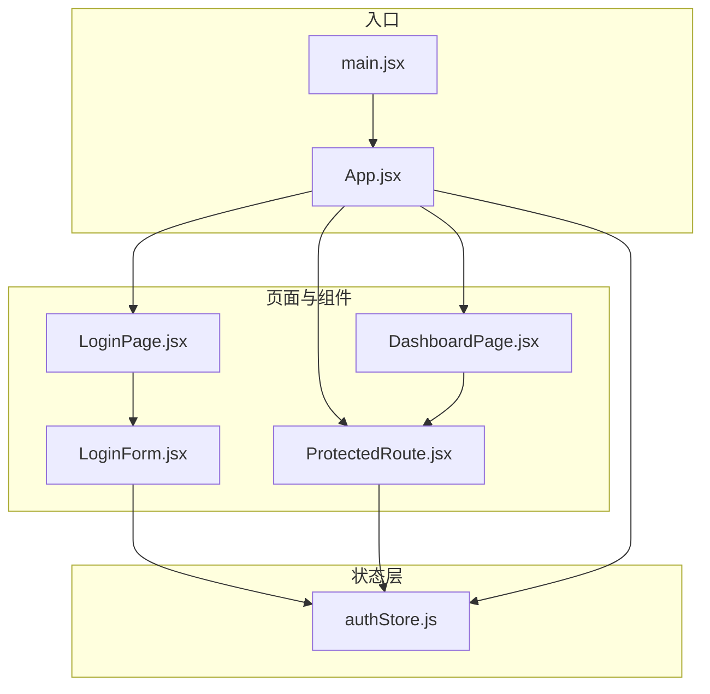
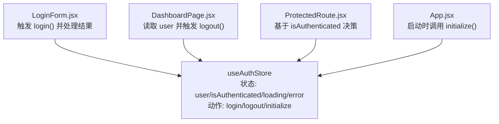
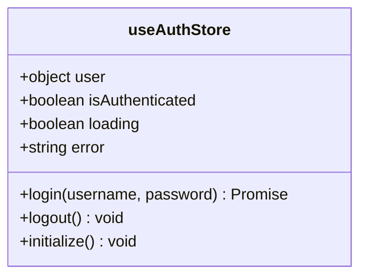
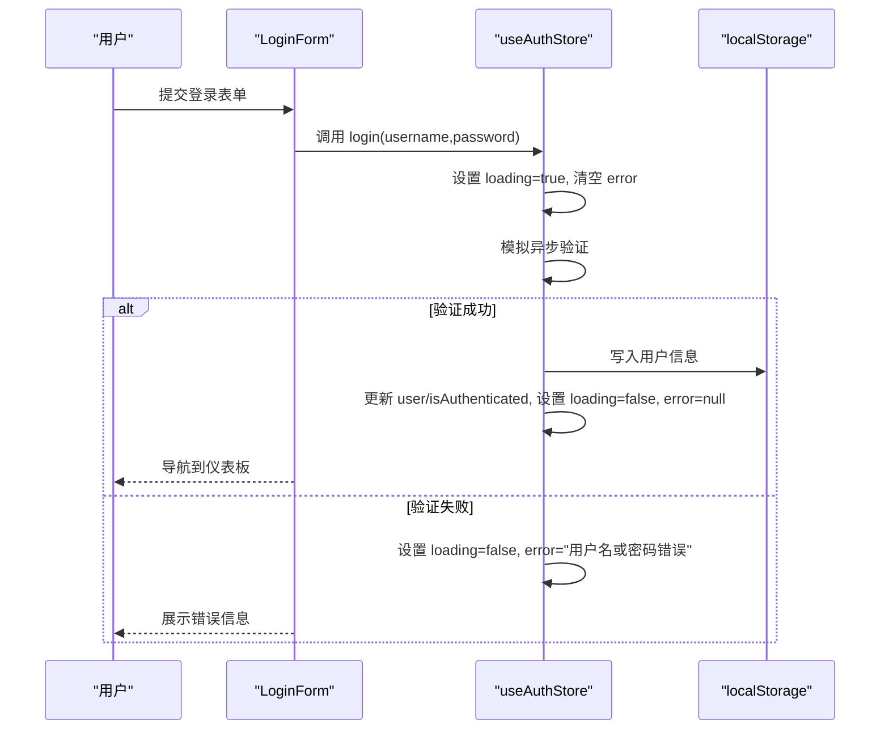
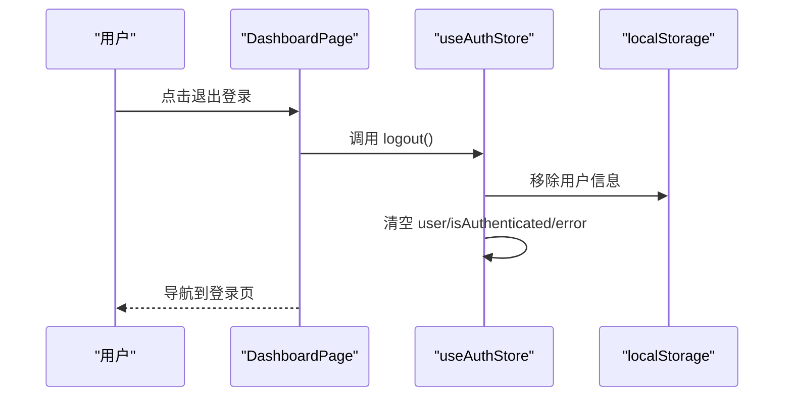
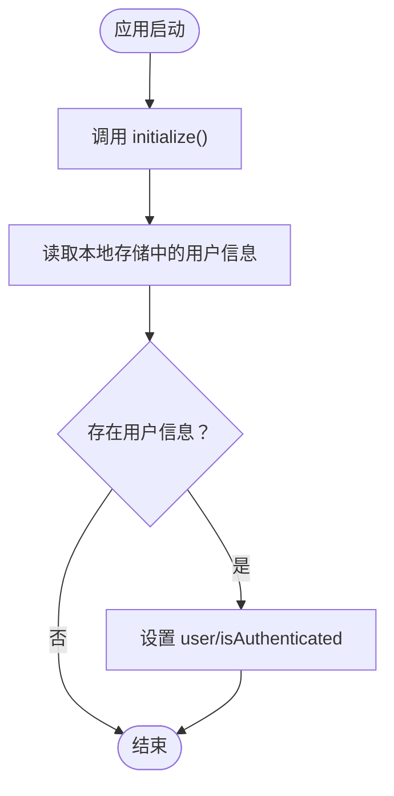
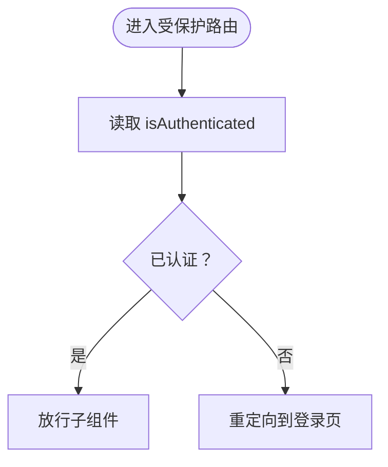
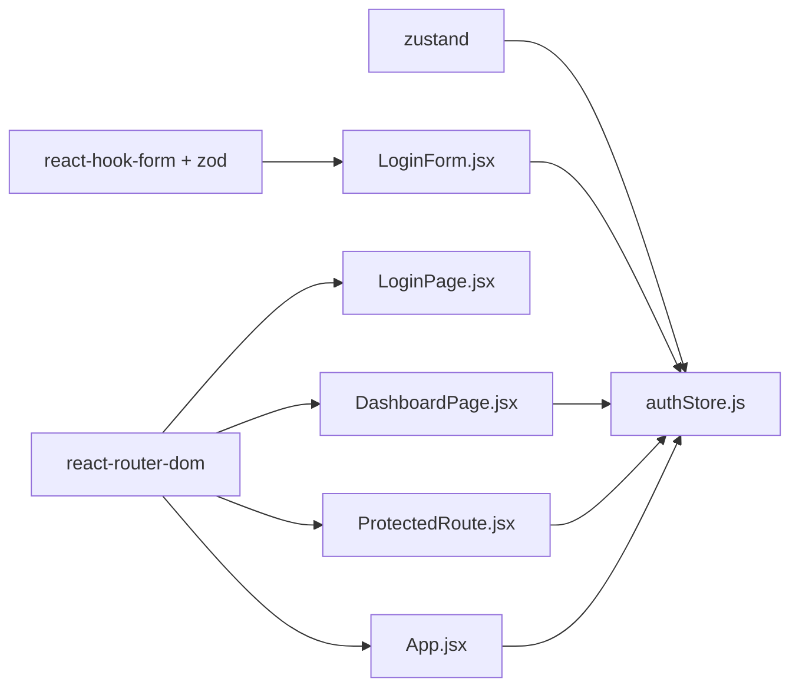

# 状态管理

<cite>
**本文引用的文件**
- [authStore.js](file://src/store/authStore.js)
- [App.jsx](file://src/App.jsx)
- [LoginPage.jsx](file://src/pages/LoginPage.jsx)
- [LoginForm.jsx](file://src/components/LoginForm.jsx)
- [ProtectedRoute.jsx](file://src/routes/ProtectedRoute.jsx)
- [DashboardPage.jsx](file://src/pages/DashboardPage.jsx)
- [main.jsx](file://src/main.jsx)
- [package.json](file://package.json)
</cite>

## 目录
1. [简介](#简介)
2. [项目结构](#项目结构)
3. [核心组件](#核心组件)
4. [架构总览](#架构总览)
5. [详细组件分析](#详细组件分析)
6. [依赖分析](#依赖分析)
7. [性能考虑](#性能考虑)
8. [故障排查指南](#故障排查指南)
9. [结论](#结论)
10. [附录](#附录)

## 简介
本项目采用 Zustand 作为轻量级状态管理方案，围绕认证状态（用户、登录态、加载与错误）构建了完整的全局状态模型，并通过路由守卫实现受保护页面访问控制。状态持久化采用浏览器本地存储，确保刷新后仍能保持登录态。本文档将系统性解析状态结构、更新机制、订阅模式、认证流程与状态同步策略，并提供最佳实践与性能优化建议。

## 项目结构
项目采用按功能分层组织，状态逻辑集中在 store 目录，页面与组件分别位于 pages 与 components，路由守卫位于 routes，入口文件位于 main.jsx。Zustand 的状态容器集中于认证状态，避免跨模块耦合。

图表来源
- [main.jsx:1-11](file://src/main.jsx#L1-L11)
- [App.jsx:1-44](file://src/App.jsx#L1-L44)
- [authStore.js:1-44](file://src/store/authStore.js#L1-L44)
- [LoginPage.jsx:1-18](file://src/pages/LoginPage.jsx#L1-L18)
- [LoginForm.jsx:1-78](file://src/components/LoginForm.jsx#L1-L78)
- [ProtectedRoute.jsx:1-15](file://src/routes/ProtectedRoute.jsx#L1-L15)
- [DashboardPage.jsx:1-57](file://src/pages/DashboardPage.jsx#L1-L57)

章节来源
- [main.jsx:1-11](file://src/main.jsx#L1-L11)
- [App.jsx:1-44](file://src/App.jsx#L1-L44)
- [authStore.js:1-44](file://src/store/authStore.js#L1-L44)

## 核心组件
- 认证状态容器（useAuthStore）
  - 状态字段：用户信息、是否已认证、加载状态、错误信息
  - 动作方法：登录（异步）、登出、初始化（从本地存储恢复）
- 登录表单组件（LoginForm）
  - 使用表单库进行校验，调用登录动作并导航到仪表板
- 受保护路由（ProtectedRoute）
  - 基于认证状态决定是否放行
- 应用入口（App）
  - 启动时执行初始化，检查本地存储恢复登录态

章节来源
- [authStore.js:1-44](file://src/store/authStore.js#L1-L44)
- [LoginForm.jsx:1-78](file://src/components/LoginForm.jsx#L1-L78)
- [ProtectedRoute.jsx:1-15](file://src/routes/ProtectedRoute.jsx#L1-L15)
- [App.jsx:1-44](file://src/App.jsx#L1-L44)

## 架构总览
Zustand 在本项目中承担“单一真相源”的角色，所有需要共享的认证状态由该容器统一管理。组件通过选择器订阅所需状态片段，减少不必要重渲染；动作函数负责状态更新与副作用（如本地存储、导航）。

图表来源
- [authStore.js:1-44](file://src/store/authStore.js#L1-L44)
- [LoginForm.jsx:1-78](file://src/components/LoginForm.jsx#L1-L78)
- [DashboardPage.jsx:1-57](file://src/pages/DashboardPage.jsx#L1-L57)
- [ProtectedRoute.jsx:1-15](file://src/routes/ProtectedRoute.jsx#L1-L15)
- [App.jsx:1-44](file://src/App.jsx#L1-L44)

## 详细组件分析

### 认证状态容器（useAuthStore）
- 设计原则
  - 单一职责：仅管理认证相关状态与动作
  - 明确边界：登录为异步动作，包含加载与错误处理
  - 可恢复性：初始化时从本地存储恢复登录态
- 状态结构
  - user：当前用户对象或空
  - isAuthenticated：布尔值，表示登录态
  - loading：布尔值，表示登录请求进行中
  - error：字符串或空，表示最近一次错误
- 动作实现要点
  - login(username, password)：设置加载状态，模拟异步验证，成功写入本地存储并更新状态，失败设置错误信息
  - logout()：移除本地存储并清空认证状态
  - initialize()：从本地存储读取用户信息并恢复登录态
- 订阅模式
  - 组件通过选择器订阅所需字段，例如 LoginForm 订阅 login、loading、error；DashboardPage 订阅 user、logout；ProtectedRoute 订阅 isAuthenticated

图表来源
- [authStore.js:1-44](file://src/store/authStore.js#L1-L44)

章节来源
- [authStore.js:1-44](file://src/store/authStore.js#L1-L44)

### 登录流程（序列图）
展示从用户提交表单到登录完成的完整状态流转。

图表来源
- [LoginForm.jsx:1-78](file://src/components/LoginForm.jsx#L1-L78)
- [authStore.js:1-44](file://src/store/authStore.js#L1-L44)

章节来源
- [LoginForm.jsx:1-78](file://src/components/LoginForm.jsx#L1-L78)
- [authStore.js:1-44](file://src/store/authStore.js#L1-L44)

### 登出流程（序列图）
展示登出时的状态清理与导航。

图表来源
- [DashboardPage.jsx:1-57](file://src/pages/DashboardPage.jsx#L1-L57)
- [authStore.js:1-44](file://src/store/authStore.js#L1-L44)

章节来源
- [DashboardPage.jsx:1-57](file://src/pages/DashboardPage.jsx#L1-L57)
- [authStore.js:1-44](file://src/store/authStore.js#L1-L44)

### 初始化与状态恢复（流程图）
展示应用启动时如何从本地存储恢复登录态。

图表来源
- [App.jsx:1-44](file://src/App.jsx#L1-L44)
- [authStore.js:1-44](file://src/store/authStore.js#L1-L44)

章节来源
- [App.jsx:1-44](file://src/App.jsx#L1-L44)
- [authStore.js:1-44](file://src/store/authStore.js#L1-L44)

### 受保护路由（流程图）
展示受保护页面的访问控制逻辑。

图表来源
- [ProtectedRoute.jsx:1-15](file://src/routes/ProtectedRoute.jsx#L1-L15)
- [authStore.js:1-44](file://src/store/authStore.js#L1-L44)

章节来源
- [ProtectedRoute.jsx:1-15](file://src/routes/ProtectedRoute.jsx#L1-L15)
- [authStore.js:1-44](file://src/store/authStore.js#L1-L44)

## 依赖分析
- 外部依赖
  - Zustand：提供轻量状态容器与动作函数
  - react-router-dom：提供路由与导航能力
  - react-hook-form + zod：提供表单校验与错误提示
- 内部依赖关系
  - LoginForm 依赖 useAuthStore 的 login 动作
  - DashboardPage 依赖 useAuthStore 的 user 与 logout 动作
  - ProtectedRoute 依赖 useAuthStore 的 isAuthenticated
  - App 在启动时调用 useAuthStore 的 initialize 动作

图表来源
- [package.json:12-31](file://package.json#L12-L31)
- [authStore.js:1-44](file://src/store/authStore.js#L1-L44)
- [LoginForm.jsx:1-78](file://src/components/LoginForm.jsx#L1-L78)
- [DashboardPage.jsx:1-57](file://src/pages/DashboardPage.jsx#L1-L57)
- [ProtectedRoute.jsx:1-15](file://src/routes/ProtectedRoute.jsx#L1-L15)
- [App.jsx:1-44](file://src/App.jsx#L1-L44)

章节来源
- [package.json:12-31](file://package.json#L12-L31)
- [authStore.js:1-44](file://src/store/authStore.js#L1-L44)

## 性能考虑
- 选择器订阅
  - 组件仅订阅所需字段，避免不必要的重渲染
  - 将选择器提取为稳定引用可进一步降低重渲染风险
- 异步动作
  - login 动作内部设置 loading 与错误，避免组件重复处理状态
  - 使用 Promise 返回值简化调用端逻辑
- 本地存储
  - 初始化时一次性读取，避免频繁 IO
  - 登录成功后写入本地存储，便于刷新后恢复
- 路由守卫
  - 受保护路由仅订阅 isAuthenticated，保证判断逻辑轻量

## 故障排查指南
- 登录失败
  - 检查登录动作是否正确设置 loading 与 error
  - 确认表单校验规则与错误提示显示正常
- 无法进入受保护页面
  - 检查 isAuthenticated 是否被正确更新
  - 确认 App 启动时已调用 initialize
- 刷新后未保持登录态
  - 检查本地存储中是否存在用户信息
  - 确认 initialize 动作已从本地存储恢复状态
- 登出后仍可访问受保护页面
  - 检查 logout 动作是否清除本地存储并清空认证状态

章节来源
- [authStore.js:1-44](file://src/store/authStore.js#L1-L44)
- [LoginForm.jsx:1-78](file://src/components/LoginForm.jsx#L1-L78)
- [ProtectedRoute.jsx:1-15](file://src/routes/ProtectedRoute.jsx#L1-L15)
- [App.jsx:1-44](file://src/App.jsx#L1-L44)

## 结论
本项目以 Zustand 为核心，构建了简洁高效的认证状态管理方案。通过明确的状态结构、清晰的动作边界与本地存储持久化，实现了登录、登出与状态恢复的完整闭环。配合受保护路由与表单校验，提供了良好的用户体验与可维护性。建议在后续扩展中引入更细粒度的选择器与中间件，以进一步提升性能与可观测性。

## 附录
- 最佳实践
  - 将状态与动作分离，保持容器职责单一
  - 使用选择器订阅最小必要状态，避免全量订阅
  - 在动作中集中处理副作用（如本地存储、导航），保持组件纯净
  - 对异步动作提供统一的加载与错误处理模式
- 扩展方向
  - 引入中间件记录状态变更日志
  - 将本地存储封装为独立服务，便于替换与测试
  - 为复杂场景引入派生状态与批量更新工具