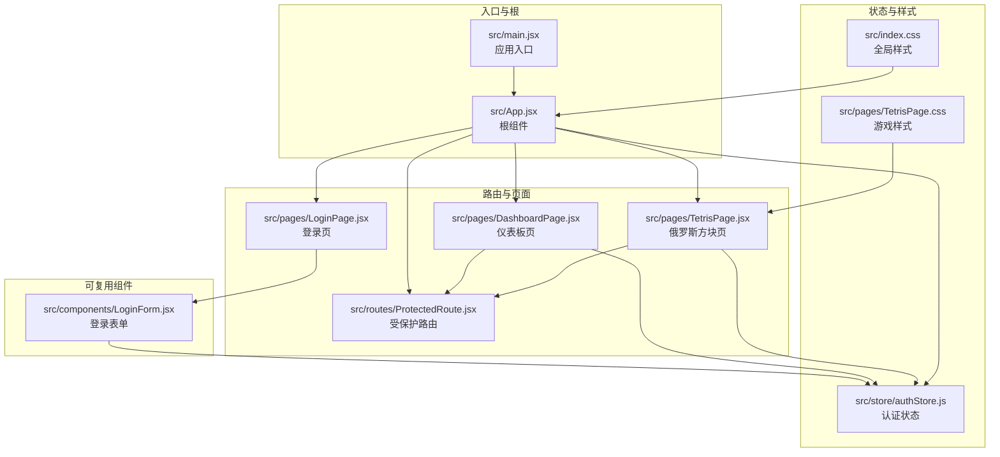
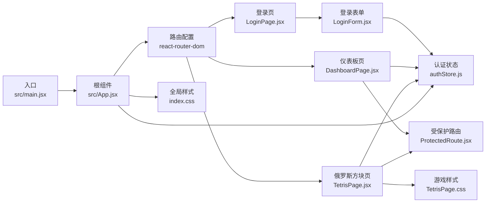
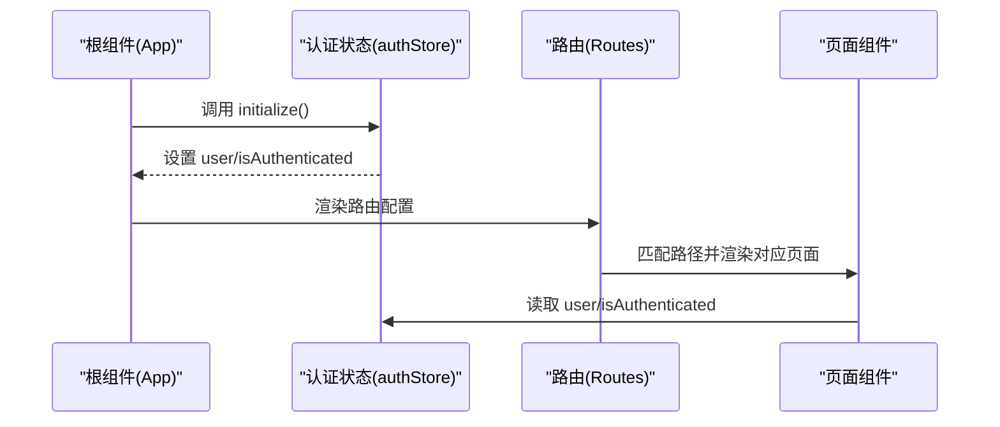
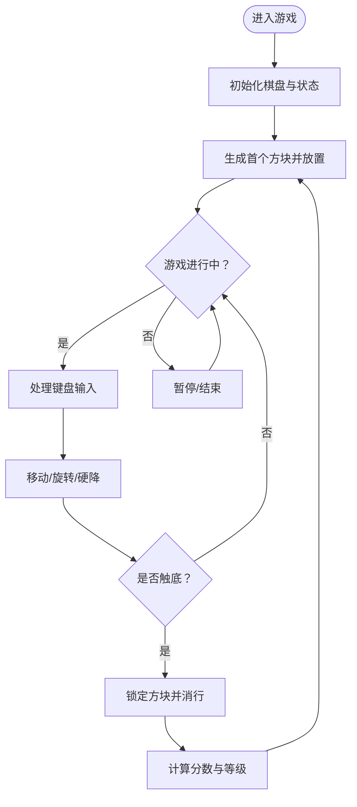
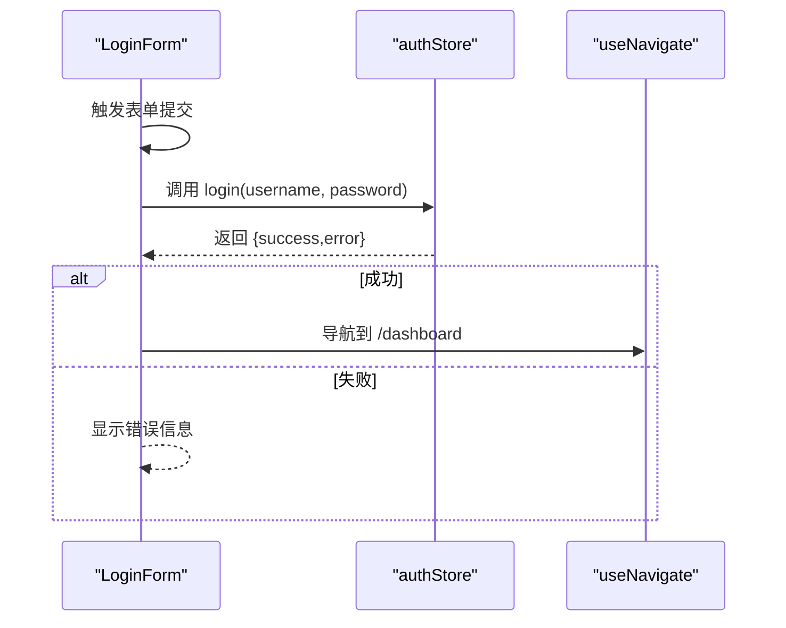
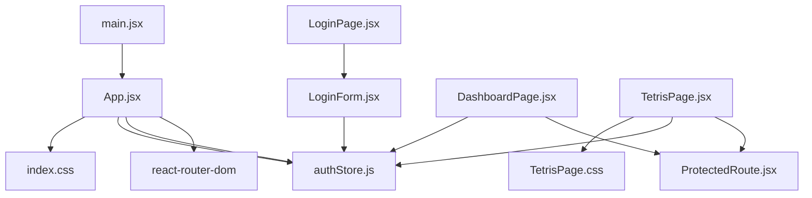
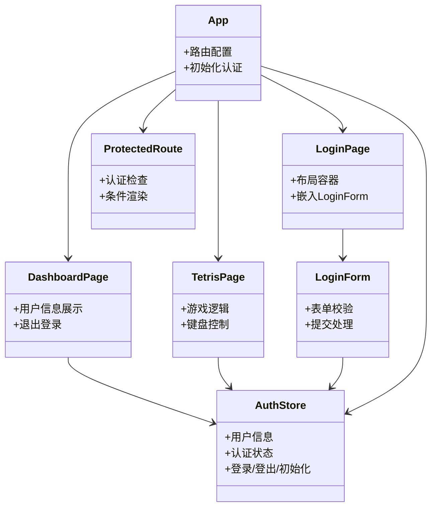
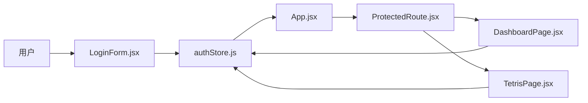

# 组件架构

<cite>
**本文引用的文件列表**
- [src/main.jsx](file://src/main.jsx)
- [src/App.jsx](file://src/App.jsx)
- [src/components/LoginForm.jsx](file://src/components/LoginForm.jsx)
- [src/pages/LoginPage.jsx](file://src/pages/LoginPage.jsx)
- [src/pages/DashboardPage.jsx](file://src/pages/DashboardPage.jsx)
- [src/pages/TetrisPage.jsx](file://src/pages/TetrisPage.jsx)
- [src/routes/ProtectedRoute.jsx](file://src/routes/ProtectedRoute.jsx)
- [src/store/authStore.js](file://src/store/authStore.js)
- [src/index.css](file://src/index.css)
- [src/pages/TetrisPage.css](file://src/pages/TetrisPage.css)
- [package.json](file://package.json)
</cite>

## 目录
1. [简介](#简介)
2. [项目结构](#项目结构)
3. [核心组件](#核心组件)
4. [架构总览](#架构总览)
5. [组件详细分析](#组件详细分析)
6. [依赖关系分析](#依赖关系分析)
7. [性能考量](#性能考量)
8. [故障排查指南](#故障排查指南)
9. [结论](#结论)
10. [附录](#附录)

## 简介
本项目是一个基于 React 的登录与游戏示例应用，采用组件化设计，通过路由控制页面级组件的渲染，并使用状态管理库进行全局状态共享。本文档从组件架构视角出发，系统阐述：
- 根组件设计理念与路由分发
- 页面级组件的职责划分与复用策略
- 可复用组件的设计模式与数据流
- 组件间通信机制、Props 传递与事件处理
- 生命周期管理、状态提升与组合模式
- 组件关系图与数据流向图
- 最佳实践与代码组织规范

## 项目结构
项目采用按功能域分层的目录组织方式：
- 入口与根组件：入口文件负责挂载根组件；根组件负责路由配置与全局初始化
- 页面级组件：登录页、仪表板页、俄罗斯方块页
- 可复用组件：登录表单组件
- 路由守卫：受保护路由组件
- 状态管理：认证状态存储（Zustand）
- 样式：全局样式与页面样式分离

图表来源
- [src/main.jsx:1-11](file://src/main.jsx#L1-L11)
- [src/App.jsx:1-44](file://src/App.jsx#L1-L44)
- [src/pages/LoginPage.jsx:1-18](file://src/pages/LoginPage.jsx#L1-L18)
- [src/pages/DashboardPage.jsx:1-57](file://src/pages/DashboardPage.jsx#L1-L57)
- [src/pages/TetrisPage.jsx:1-413](file://src/pages/TetrisPage.jsx#L1-L413)
- [src/routes/ProtectedRoute.jsx:1-15](file://src/routes/ProtectedRoute.jsx#L1-L15)
- [src/components/LoginForm.jsx:1-78](file://src/components/LoginForm.jsx#L1-L78)
- [src/store/authStore.js:1-44](file://src/store/authStore.js#L1-L44)
- [src/index.css:1-261](file://src/index.css#L1-L261)
- [src/pages/TetrisPage.css:1-293](file://src/pages/TetrisPage.css#L1-L293)

章节来源
- [src/main.jsx:1-11](file://src/main.jsx#L1-L11)
- [src/App.jsx:1-44](file://src/App.jsx#L1-L44)
- [package.json:1-33](file://package.json#L1-L33)

## 核心组件
本节聚焦于关键组件及其职责：
- 根组件 App.jsx：集中声明路由、初始化认证状态、提供受保护路由包装
- 页面级组件：登录页、仪表板页、俄罗斯方块页，分别承担不同业务场景
- 可复用组件：登录表单，封装表单校验、提交流程与错误提示
- 受保护路由：在渲染子组件前检查认证状态
- 认证状态存储：统一管理用户信息、认证状态、加载与错误状态

章节来源
- [src/App.jsx:10-41](file://src/App.jsx#L10-L41)
- [src/pages/LoginPage.jsx:3-14](file://src/pages/LoginPage.jsx#L3-L14)
- [src/pages/DashboardPage.jsx:4-53](file://src/pages/DashboardPage.jsx#L4-L53)
- [src/pages/TetrisPage.jsx:63-410](file://src/pages/TetrisPage.jsx#L63-L410)
- [src/components/LoginForm.jsx:12-77](file://src/components/LoginForm.jsx#L12-L77)
- [src/routes/ProtectedRoute.jsx:4-11](file://src/routes/ProtectedRoute.jsx#L4-L11)
- [src/store/authStore.js:3-41](file://src/store/authStore.js#L3-L41)

## 架构总览
应用采用“入口 -> 根组件 -> 页面级组件 -> 可复用组件”的层级结构，配合路由与状态管理实现清晰的数据流与控制流。

图表来源
- [src/main.jsx:6-10](file://src/main.jsx#L6-L10)
- [src/App.jsx:17-39](file://src/App.jsx#L17-L39)
- [src/pages/LoginPage.jsx:1-18](file://src/pages/LoginPage.jsx#L1-L18)
- [src/pages/DashboardPage.jsx:1-57](file://src/pages/DashboardPage.jsx#L1-L57)
- [src/pages/TetrisPage.jsx:1-413](file://src/pages/TetrisPage.jsx#L1-L413)
- [src/components/LoginForm.jsx:1-78](file://src/components/LoginForm.jsx#L1-L78)
- [src/routes/ProtectedRoute.jsx:1-15](file://src/routes/ProtectedRoute.jsx#L1-L15)
- [src/store/authStore.js:1-44](file://src/store/authStore.js#L1-L44)
- [src/index.css:1-261](file://src/index.css#L1-L261)
- [src/pages/TetrisPage.css:1-293](file://src/pages/TetrisPage.css#L1-L293)

## 组件详细分析

### 根组件 App.jsx
- 设计理念
  - 使用浏览器路由容器包裹所有页面
  - 在挂载后执行认证初始化，读取本地存储恢复登录态
  - 提供多条路由：登录页、受保护的仪表板页与俄罗斯方块页
  - 默认重定向到登录页
- 关键点
  - 初始化逻辑通过状态存储的初始化函数完成
  - 受保护路由以高阶方式包装目标页面组件
- 数据流
  - 认证状态变化影响路由渲染与页面可见性

图表来源
- [src/App.jsx:10-41](file://src/App.jsx#L10-L41)
- [src/store/authStore.js:34-40](file://src/store/authStore.js#L34-L40)

章节来源
- [src/App.jsx:10-41](file://src/App.jsx#L10-L41)
- [src/store/authStore.js:34-40](file://src/store/authStore.js#L34-L40)

### 页面级组件

#### 登录页 LoginPage.jsx
- 职责
  - 提供登录页布局与标题信息
  - 内部嵌入登录表单组件，不直接处理认证逻辑
- 设计要点
  - 结构清晰，便于扩展更多表单类型
  - 与登录表单解耦，利于复用

章节来源
- [src/pages/LoginPage.jsx:3-14](file://src/pages/LoginPage.jsx#L3-L14)

#### 仪表板页 DashboardPage.jsx
- 职责
  - 展示用户信息与统计卡片
  - 提供退出登录与跳转至游戏的导航
- 设计要点
  - 通过状态存储读取当前用户信息
  - 退出登录后跳转回登录页

章节来源
- [src/pages/DashboardPage.jsx:4-53](file://src/pages/DashboardPage.jsx#L4-L53)

#### 俄罗斯方块页 TetrisPage.jsx
- 职责
  - 实现完整的俄罗斯方块游戏逻辑
  - 提供游戏控制面板、分数统计与键盘输入处理
- 设计要点
  - 使用本地状态与引用对象协同维护游戏状态
  - 通过定时器驱动下落，支持暂停、硬降、旋转等操作
  - 渲染棋盘与下一个方块预览

图表来源
- [src/pages/TetrisPage.jsx:216-238](file://src/pages/TetrisPage.jsx#L216-L238)
- [src/pages/TetrisPage.jsx:240-250](file://src/pages/TetrisPage.jsx#L240-L250)
- [src/pages/TetrisPage.jsx:252-268](file://src/pages/TetrisPage.jsx#L252-L268)
- [src/pages/TetrisPage.jsx:94-153](file://src/pages/TetrisPage.jsx#L94-L153)

章节来源
- [src/pages/TetrisPage.jsx:63-410](file://src/pages/TetrisPage.jsx#L63-L410)

### 可复用组件 LoginForm.jsx
- 职责
  - 封装登录表单的输入、校验、提交与错误提示
  - 通过状态存储执行登录动作并处理结果
- 设计要点
  - 使用表单库进行字段注册与校验
  - 校验规则通过模式库定义，保证一致性
  - 提交成功后导航至仪表板页

图表来源
- [src/components/LoginForm.jsx:24-29](file://src/components/LoginForm.jsx#L24-L29)
- [src/store/authStore.js:9-27](file://src/store/authStore.js#L9-L27)

章节来源
- [src/components/LoginForm.jsx:12-77](file://src/components/LoginForm.jsx#L12-L77)
- [src/store/authStore.js:9-27](file://src/store/authStore.js#L9-L27)

### 受保护路由 ProtectedRoute.jsx
- 职责
  - 在渲染子组件前检查认证状态
  - 未认证则重定向到登录页
- 设计要点
  - 以高阶组件形式包装目标页面
  - 保持子组件的原生属性透传

章节来源
- [src/routes/ProtectedRoute.jsx:4-11](file://src/routes/ProtectedRoute.jsx#L4-L11)

### 认证状态存储 authStore.js
- 职责
  - 维护用户信息、认证状态、加载与错误状态
  - 提供登录、登出与初始化方法
- 设计要点
  - 使用轻量的状态库进行集中管理
  - 初始化时从本地存储恢复用户信息
  - 登录成功写入本地存储，登出清理

章节来源
- [src/store/authStore.js:3-41](file://src/store/authStore.js#L3-L41)

## 依赖关系分析
- 组件依赖
  - 登录页依赖登录表单
  - 仪表板页与俄罗斯方块页均依赖受保护路由
  - 所有页面均依赖认证状态存储
- 外部依赖
  - 路由：react-router-dom
  - 表单：react-hook-form + 模式解析器
  - 校验：zod
  - 状态：zustand
  - UI：基础样式与页面样式

图表来源
- [src/main.jsx:1-11](file://src/main.jsx#L1-L11)
- [src/App.jsx:1-44](file://src/App.jsx#L1-L44)
- [src/pages/LoginPage.jsx:1-18](file://src/pages/LoginPage.jsx#L1-L18)
- [src/components/LoginForm.jsx:1-78](file://src/components/LoginForm.jsx#L1-L78)
- [src/pages/DashboardPage.jsx:1-57](file://src/pages/DashboardPage.jsx#L1-L57)
- [src/pages/TetrisPage.jsx:1-413](file://src/pages/TetrisPage.jsx#L1-L413)
- [src/routes/ProtectedRoute.jsx:1-15](file://src/routes/ProtectedRoute.jsx#L1-L15)
- [src/store/authStore.js:1-44](file://src/store/authStore.js#L1-L44)
- [src/index.css:1-261](file://src/index.css#L1-L261)
- [src/pages/TetrisPage.css:1-293](file://src/pages/TetrisPage.css#L1-L293)
- [package.json:12-19](file://package.json#L12-L19)

章节来源
- [package.json:12-19](file://package.json#L12-L19)

## 性能考量
- 状态管理
  - 使用集中式状态减少跨组件重复请求与状态同步成本
  - 初始化阶段一次性读取本地存储，避免频繁 IO
- 渲染优化
  - 页面组件按需渲染，受保护路由仅在认证状态下渲染
  - 登录表单在提交过程中禁用输入，避免重复提交
- 游戏性能
  - 使用定时器与引用对象降低不必要的状态更新
  - 键盘事件监听在组件卸载时清理，防止内存泄漏
- 样式与资源
  - 全局样式与页面样式分离，便于缓存与按需加载

## 故障排查指南
- 登录失败
  - 检查登录表单的校验规则与错误提示是否正确显示
  - 确认状态存储返回的错误信息是否被正确消费
- 无法访问受保护页面
  - 检查受保护路由的认证判断逻辑
  - 确认初始化是否成功恢复用户信息
- 游戏异常
  - 检查定时器是否在暂停/结束状态下正确清理
  - 确认键盘事件监听是否在组件卸载时移除
- 样式问题
  - 确认全局样式与页面样式的优先级与覆盖关系

章节来源
- [src/components/LoginForm.jsx:63-63](file://src/components/LoginForm.jsx#L63-L63)
- [src/routes/ProtectedRoute.jsx:7-9](file://src/routes/ProtectedRoute.jsx#L7-L9)
- [src/pages/TetrisPage.jsx:240-250](file://src/pages/TetrisPage.jsx#L240-L250)
- [src/pages/TetrisPage.jsx:252-268](file://src/pages/TetrisPage.jsx#L252-L268)

## 结论
本项目通过清晰的组件分层与路由控制，实现了登录与游戏场景的模块化构建。根组件集中管理路由与初始化，页面级组件专注于业务视图，可复用组件封装通用交互，状态存储提供一致的数据源。该架构具备良好的可扩展性与可维护性，适合进一步引入更多页面与功能模块。

## 附录

### 组件关系图（类图）

图表来源
- [src/App.jsx:10-41](file://src/App.jsx#L10-L41)
- [src/pages/LoginPage.jsx:3-14](file://src/pages/LoginPage.jsx#L3-L14)
- [src/pages/DashboardPage.jsx:4-53](file://src/pages/DashboardPage.jsx#L4-L53)
- [src/pages/TetrisPage.jsx:63-410](file://src/pages/TetrisPage.jsx#L63-L410)
- [src/components/LoginForm.jsx:12-77](file://src/components/LoginForm.jsx#L12-L77)
- [src/routes/ProtectedRoute.jsx:4-11](file://src/routes/ProtectedRoute.jsx#L4-L11)
- [src/store/authStore.js:3-41](file://src/store/authStore.js#L3-L41)

### 数据流向图

图表来源
- [src/components/LoginForm.jsx:12-77](file://src/components/LoginForm.jsx#L12-L77)
- [src/store/authStore.js:3-41](file://src/store/authStore.js#L3-L41)
- [src/App.jsx:10-41](file://src/App.jsx#L10-L41)
- [src/routes/ProtectedRoute.jsx:4-11](file://src/routes/ProtectedRoute.jsx#L4-L11)
- [src/pages/DashboardPage.jsx:4-53](file://src/pages/DashboardPage.jsx#L4-L53)
- [src/pages/TetrisPage.jsx:63-410](file://src/pages/TetrisPage.jsx#L63-L410)

### 组件开发最佳实践与代码组织规范
- 组件拆分
  - 页面级组件只负责布局与组合，业务逻辑下沉至可复用组件或状态存储
  - 可复用组件应尽量无副作用，通过 Props 与回调暴露行为
- Props 与事件
  - 向下传递数据使用 Props，向上传递行为使用回调函数
  - 避免在组件内部直接访问 DOM 或外部副作用
- 状态管理
  - 全局状态集中在状态存储中，避免跨组件手动传递
  - 对外暴露最小化的状态接口，隐藏内部实现细节
- 路由与权限
  - 使用受保护路由包装需要认证的页面
  - 默认路由与重定向逻辑保持一致，提升用户体验
- 样式与主题
  - 使用 CSS 变量统一主题色，便于维护与切换
  - 页面样式与全局样式分离，避免冲突
- 性能与可维护性
  - 合理使用引用对象与本地状态，减少不必要的渲染
  - 事件监听在组件卸载时清理，避免内存泄漏
  - 为复杂逻辑编写单元测试与集成测试