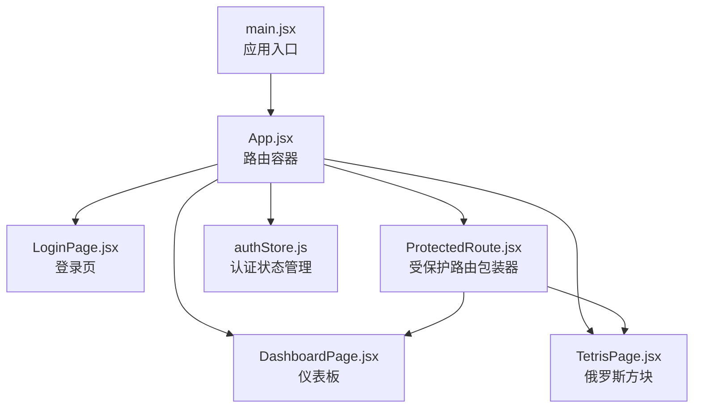
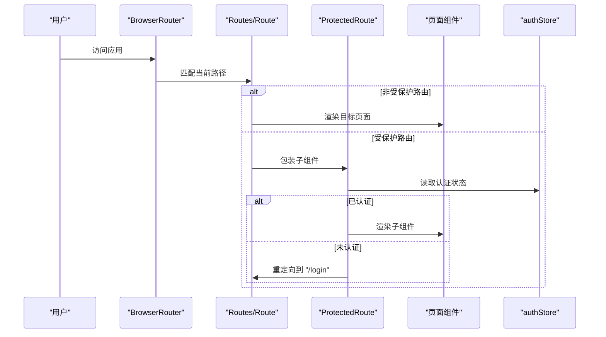
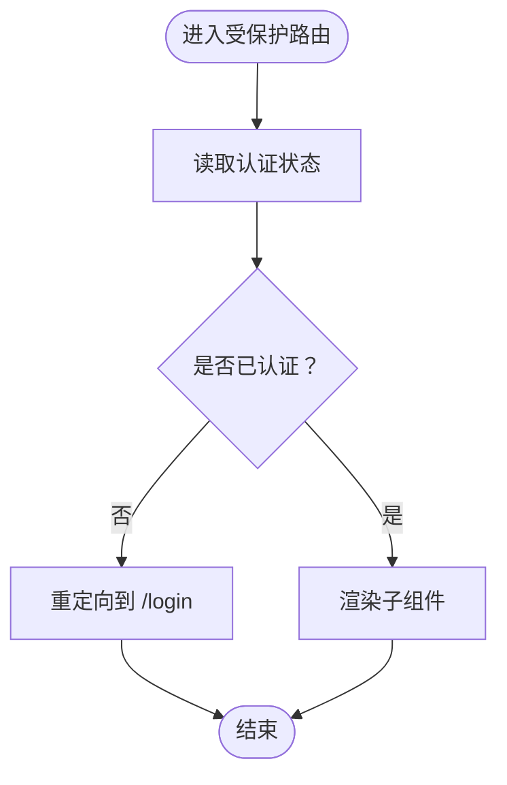
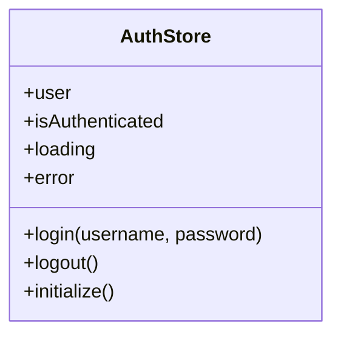
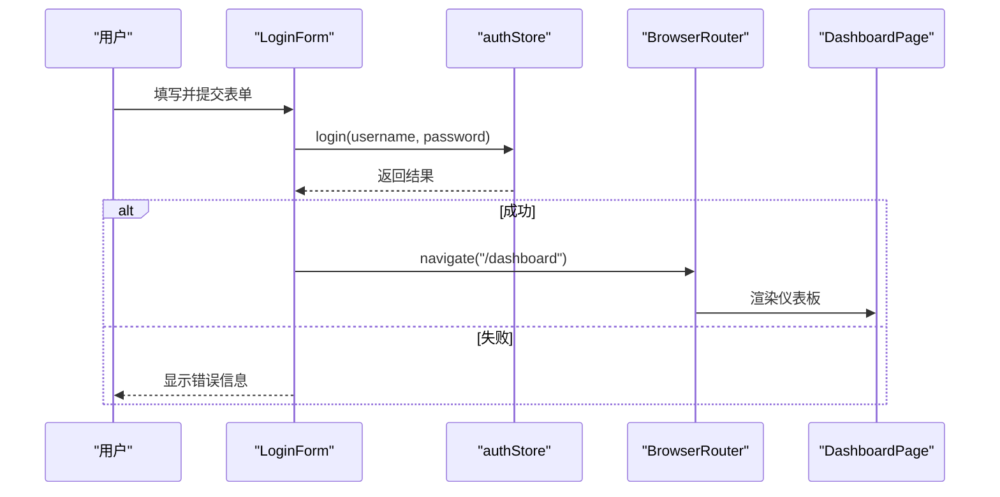
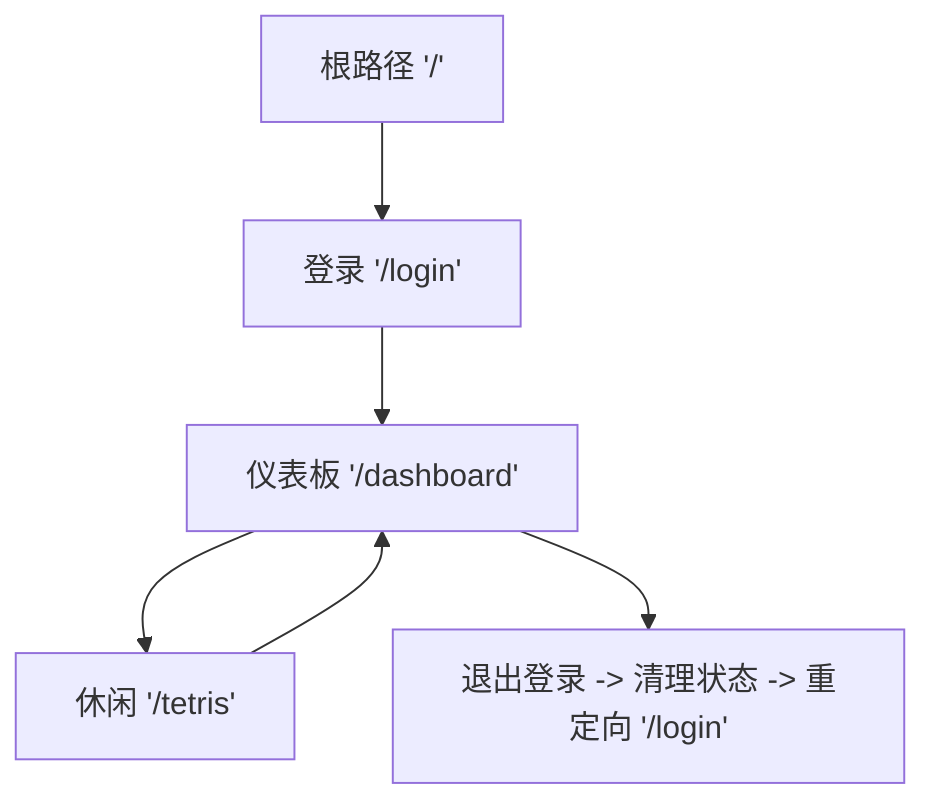
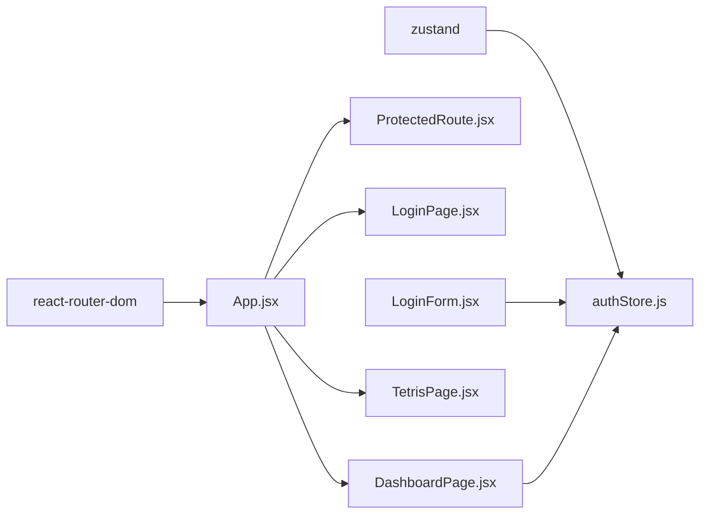

# 路由系统

<cite>
**本文引用的文件**
- [src/App.jsx](file://src/App.jsx)
- [src/main.jsx](file://src/main.jsx)
- [src/routes/ProtectedRoute.jsx](file://src/routes/ProtectedRoute.jsx)
- [src/store/authStore.js](file://src/store/authStore.js)
- [src/pages/LoginPage.jsx](file://src/pages/LoginPage.jsx)
- [src/pages/DashboardPage.jsx](file://src/pages/DashboardPage.jsx)
- [src/pages/TetrisPage.jsx](file://src/pages/TetrisPage.jsx)
- [src/components/LoginForm.jsx](file://src/components/LoginForm.jsx)
- [src/index.css](file://src/index.css)
- [src/pages/TetrisPage.css](file://src/pages/TetrisPage.css)
- [package.json](file://package.json)
</cite>

## 目录
1. [简介](#简介)
2. [项目结构](#项目结构)
3. [核心组件](#核心组件)
4. [架构总览](#架构总览)
5. [详细组件分析](#详细组件分析)
6. [依赖关系分析](#依赖关系分析)
7. [性能考虑](#性能考虑)
8. [故障排查指南](#故障排查指南)
9. [结论](#结论)
10. [附录](#附录)

## 简介
本文件系统性解析该 React 登录应用的路由体系，重点围绕以下方面展开：
- 路由配置策略与路径设计原则
- 页面导航机制与用户流转路径
- 路由保护机制（ProtectedRoute）的设计与权限控制逻辑
- 路由参数传递、查询字符串处理与路由监听机制
- 路由流程图与导航树
- 性能优化与 SEO 友好实践

## 项目结构
该项目采用基于文件系统的路由组织方式，核心入口为应用根组件，在其中集中声明所有路由规则，并通过受保护路由包装器实现访问控制。认证状态由全局状态管理模块统一维护，登录页、仪表盘页与休闲页分别承载不同业务功能。

图表来源
- [src/main.jsx:1-11](file://src/main.jsx#L1-L11)
- [src/App.jsx:10-41](file://src/App.jsx#L10-L41)
- [src/pages/LoginPage.jsx:1-18](file://src/pages/LoginPage.jsx#L1-L18)
- [src/pages/DashboardPage.jsx:1-57](file://src/pages/DashboardPage.jsx#L1-L57)
- [src/pages/TetrisPage.jsx:1-413](file://src/pages/TetrisPage.jsx#L1-L413)
- [src/routes/ProtectedRoute.jsx:1-15](file://src/routes/ProtectedRoute.jsx#L1-L15)
- [src/store/authStore.js:1-44](file://src/store/authStore.js#L1-L44)

章节来源
- [src/main.jsx:1-11](file://src/main.jsx#L1-L11)
- [src/App.jsx:10-41](file://src/App.jsx#L10-L41)

## 核心组件
- 应用根组件：负责初始化认证状态并在浏览器路由上下文中声明所有路由规则。
- 受保护路由包装器：在渲染子组件前进行认证校验，未认证则重定向至登录页。
- 认证状态管理：提供登录、登出、初始化等方法，并持久化用户信息到本地存储。
- 页面组件：登录页、仪表板页、俄罗斯方块页，分别承担登录、主功能区与娱乐功能区。

章节来源
- [src/App.jsx:10-41](file://src/App.jsx#L10-L41)
- [src/routes/ProtectedRoute.jsx:1-15](file://src/routes/ProtectedRoute.jsx#L1-L15)
- [src/store/authStore.js:1-44](file://src/store/authStore.js#L1-L44)
- [src/pages/LoginPage.jsx:1-18](file://src/pages/LoginPage.jsx#L1-L18)
- [src/pages/DashboardPage.jsx:1-57](file://src/pages/DashboardPage.jsx#L1-L57)
- [src/pages/TetrisPage.jsx:1-413](file://src/pages/TetrisPage.jsx#L1-L413)

## 架构总览
应用采用 React Router v6 的声明式路由模型，BrowserRouter 提供路由上下文，Routes/Route 定义路由映射，ProtectedRoute 作为布局包装器实现访问控制。认证状态通过 Zustand 全局状态管理，登录成功后写入本地存储，刷新页面时自动恢复认证状态。

图表来源
- [src/App.jsx:18-39](file://src/App.jsx#L18-L39)
- [src/routes/ProtectedRoute.jsx:4-12](file://src/routes/ProtectedRoute.jsx#L4-L12)
- [src/store/authStore.js:34-40](file://src/store/authStore.js#L34-L40)

## 详细组件分析

### 路由配置与路径设计原则
- 路由声明集中在应用根组件内，便于统一管理和扩展。
- 路径设计遵循语义化与层级化原则：根路径用于重定向，登录、仪表板、休闲页分别对应独立路径。
- 未匹配路由统一重定向至登录页，确保默认行为一致。

章节来源
- [src/App.jsx:18-39](file://src/App.jsx#L18-L39)

### 受保护路由（ProtectedRoute）设计与权限控制
- 设计模式：高阶组件（HOC）风格的布局包装器，接收 children 并在渲染前进行条件判断。
- 权限控制逻辑：读取全局认证状态，若未认证则重定向至登录页；否则直接渲染子组件。
- 与路由系统的耦合：通过 React Router 的 Navigate 组件实现无刷新重定向。

图表来源
- [src/routes/ProtectedRoute.jsx:4-12](file://src/routes/ProtectedRoute.jsx#L4-L12)
- [src/store/authStore.js:34-40](file://src/store/authStore.js#L34-L40)

章节来源
- [src/routes/ProtectedRoute.jsx:1-15](file://src/routes/ProtectedRoute.jsx#L1-L15)
- [src/store/authStore.js:34-40](file://src/store/authStore.js#L34-L40)

### 认证状态管理（authStore）
- 数据结构：包含用户信息、认证状态、加载状态与错误信息。
- 初始化：启动时从本地存储读取用户信息，恢复会话状态。
- 登录：模拟异步登录过程，成功后写入本地存储并更新状态，失败时返回错误信息。
- 登出：清除本地存储并重置状态。

图表来源
- [src/store/authStore.js:3-41](file://src/store/authStore.js#L3-L41)

章节来源
- [src/store/authStore.js:1-44](file://src/store/authStore.js#L1-L44)

### 登录流程与导航机制
- 登录页：提供登录表单，使用表单库进行输入校验与提交。
- 表单提交：调用认证状态管理的登录方法，根据结果决定导航至仪表板或显示错误。
- 导航机制：使用路由提供的导航函数进行程序化跳转，避免刷新页面。

图表来源
- [src/components/LoginForm.jsx:24-29](file://src/components/LoginForm.jsx#L24-L29)
- [src/store/authStore.js:9-27](file://src/store/authStore.js#L9-L27)
- [src/pages/DashboardPage.jsx:8-11](file://src/pages/DashboardPage.jsx#L8-L11)

章节来源
- [src/components/LoginForm.jsx:1-78](file://src/components/LoginForm.jsx#L1-L78)
- [src/store/authStore.js:9-27](file://src/store/authStore.js#L9-L27)
- [src/pages/DashboardPage.jsx:1-57](file://src/pages/DashboardPage.jsx#L1-L57)

### 仪表板与休闲页导航
- 仪表板：展示用户信息与统计卡片，包含返回休闲页的链接与退出登录按钮。
- 休闲页（俄罗斯方块）：提供游戏界面与返回仪表板的链接，支持键盘控制与暂停/继续。

章节来源
- [src/pages/DashboardPage.jsx:1-57](file://src/pages/DashboardPage.jsx#L1-L57)
- [src/pages/TetrisPage.jsx:1-413](file://src/pages/TetrisPage.jsx#L1-L413)

### 路由参数传递、查询字符串处理与路由监听机制
- 参数传递：当前代码未使用动态路由参数与查询字符串，因此不涉及参数提取与处理逻辑。
- 查询字符串：未在路由层显式处理查询参数，如需支持可在页面组件中通过路由工具读取。
- 路由监听：未实现路由变化监听逻辑，如需监听可使用路由提供的监听能力或自定义 Hook。

章节来源
- [src/App.jsx:18-39](file://src/App.jsx#L18-L39)
- [src/pages/DashboardPage.jsx:1-57](file://src/pages/DashboardPage.jsx#L1-L57)
- [src/pages/TetrisPage.jsx:1-413](file://src/pages/TetrisPage.jsx#L1-L413)

### 用户完整导航路径与导航树

图表来源
- [src/App.jsx:37-37](file://src/App.jsx#L37-L37)
- [src/pages/DashboardPage.jsx:8-11](file://src/pages/DashboardPage.jsx#L8-L11)
- [src/store/authStore.js:29-32](file://src/store/authStore.js#L29-L32)

## 依赖关系分析
- React Router：提供路由容器、路由声明与导航能力。
- Zustand：提供轻量级全局状态管理，支撑认证状态持久化与跨组件共享。
- 表单库与校验库：用于登录表单的输入校验与提交处理。

图表来源
- [package.json:12-19](file://package.json#L12-L19)
- [src/App.jsx:1-7](file://src/App.jsx#L1-L7)
- [src/store/authStore.js:1-1](file://src/store/authStore.js#L1-L1)
- [src/components/LoginForm.jsx:1-5](file://src/components/LoginForm.jsx#L1-L5)
- [src/pages/DashboardPage.jsx:1-2](file://src/pages/DashboardPage.jsx#L1-L2)

章节来源
- [package.json:12-19](file://package.json#L12-L19)
- [src/App.jsx:1-7](file://src/App.jsx#L1-L7)
- [src/store/authStore.js:1-1](file://src/store/authStore.js#L1-L1)
- [src/components/LoginForm.jsx:1-5](file://src/components/LoginForm.jsx#L1-L5)
- [src/pages/DashboardPage.jsx:1-2](file://src/pages/DashboardPage.jsx#L1-L2)

## 性能考虑
- 路由切换性能：当前路由结构简单，切换开销低；建议在复杂场景下按需加载页面组件以减少首屏体积。
- 认证初始化：在应用启动时完成一次初始化检查，避免重复请求；可结合懒加载进一步优化。
- 渲染优化：页面组件内部使用局部状态与回调缓存，减少不必要的重渲染。
- 样式与资源：CSS 采用模块化与变量化，有助于提升渲染一致性与复用性。

## 故障排查指南
- 无法访问受保护页面：确认认证状态是否正确设置，检查初始化逻辑与本地存储数据。
- 登录失败：检查登录方法的错误分支与错误提示显示逻辑。
- 导航异常：确认导航函数调用位置与目标路径是否存在。

章节来源
- [src/store/authStore.js:34-40](file://src/store/authStore.js#L34-L40)
- [src/components/LoginForm.jsx:24-29](file://src/components/LoginForm.jsx#L24-L29)
- [src/pages/DashboardPage.jsx:8-11](file://src/pages/DashboardPage.jsx#L8-L11)

## 结论
该路由系统以简洁清晰的方式实现了基础的登录与访问控制需求，通过受保护路由包装器与全局状态管理，确保了用户体验的一致性与安全性。对于后续扩展，可在参数传递、查询字符串处理与路由监听等方面引入更细粒度的控制，同时结合代码分割与懒加载进一步优化性能。

## 附录
- 路由配置参考路径：[src/App.jsx:18-39](file://src/App.jsx#L18-L39)
- 受保护路由实现参考路径：[src/routes/ProtectedRoute.jsx:1-15](file://src/routes/ProtectedRoute.jsx#L1-L15)
- 认证状态管理参考路径：[src/store/authStore.js:1-44](file://src/store/authStore.js#L1-L44)
- 登录流程参考路径：[src/components/LoginForm.jsx:24-29](file://src/components/LoginForm.jsx#L24-L29)
- 仪表板与休闲页导航参考路径：[src/pages/DashboardPage.jsx:1-57](file://src/pages/DashboardPage.jsx#L1-L57)，[src/pages/TetrisPage.jsx:1-413](file://src/pages/TetrisPage.jsx#L1-L413)