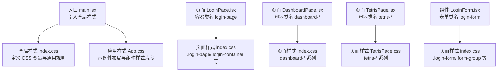
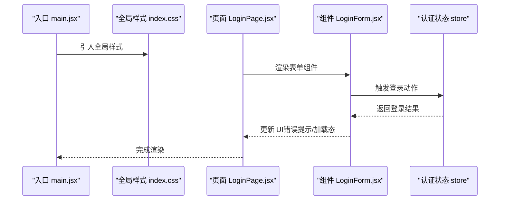
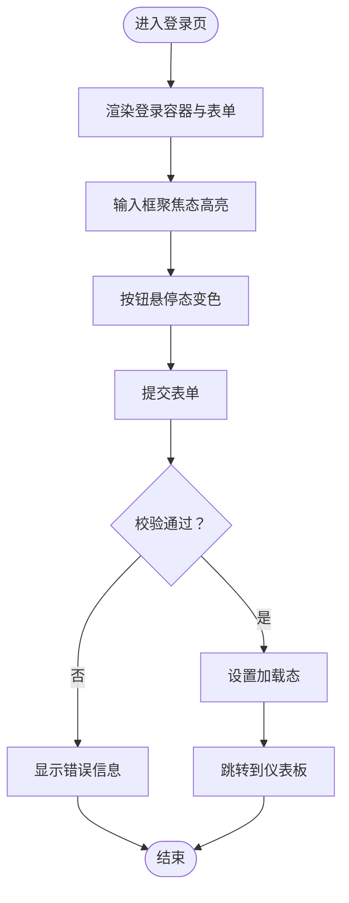
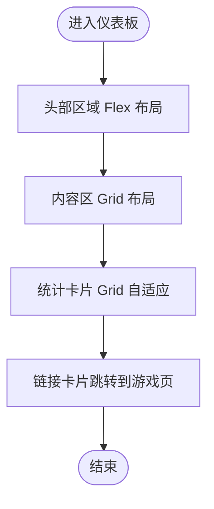
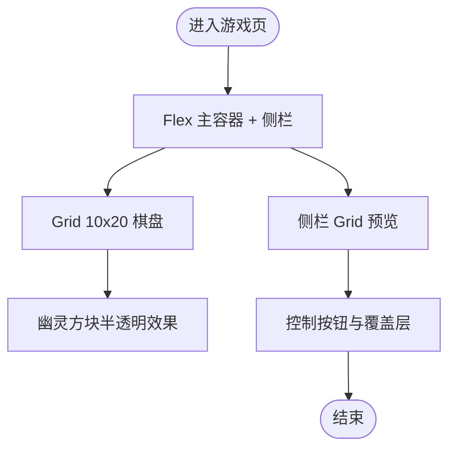
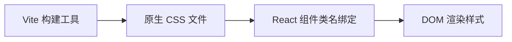

# 样式系统

<cite>
**本文引用的文件**
- [src/index.css](file://src/index.css)
- [src/App.css](file://src/App.css)
- [src/pages/TetrisPage.css](file://src/pages/TetrisPage.css)
- [src/components/LoginForm.jsx](file://src/components/LoginForm.jsx)
- [src/pages/LoginPage.jsx](file://src/pages/LoginPage.jsx)
- [src/pages/DashboardPage.jsx](file://src/pages/DashboardPage.jsx)
- [src/main.jsx](file://src/main.jsx)
- [vite.config.js](file://vite.config.js)
- [package.json](file://package.json)
- [src/store/authStore.js](file://src/store/authStore.js)
</cite>

## 目录
1. [简介](#简介)
2. [项目结构](#项目结构)
3. [核心组件](#核心组件)
4. [架构总览](#架构总览)
5. [详细组件分析](#详细组件分析)
6. [依赖关系分析](#依赖关系分析)
7. [性能考量](#性能考量)
8. [故障排查指南](#故障排查指南)
9. [结论](#结论)
10. [附录](#附录)

## 简介
本项目采用原生 CSS 的模块化样式组织方式，结合 Vite 构建工具与 React 组件化开发，形成清晰的全局样式、页面级样式与组件级样式的分层结构。样式系统以 CSS 变量为核心，统一管理颜色、阴影、边框等视觉元素；通过 Flexbox 和 CSS Grid 实现灵活的布局与响应式适配；在移动端场景下采用断点策略与弹性布局，确保跨设备一致性。同时，项目内嵌了基础的主题变量与颜色体系，便于后续扩展为完整的设计系统。

## 项目结构
样式文件分布遵循“全局样式 + 页面样式 + 组件样式”的分层组织：
- 全局样式：在入口处引入，负责根变量、重置与通用排版。
- 页面样式：按页面划分独立样式文件，避免样式污染。
- 组件样式：组件内部不直接写样式（本项目中 Login 组件未内联样式），通过类名与页面样式配合。

图表来源
- [src/main.jsx:3](file://src/main.jsx#L3)
- [src/index.css:1-261](file://src/index.css#L1-L261)
- [src/App.css:1-185](file://src/App.css#L1-L185)
- [src/pages/LoginPage.jsx:4-13](file://src/pages/LoginPage.jsx#L4-L13)
- [src/pages/DashboardPage.jsx:14-52](file://src/pages/DashboardPage.jsx#L14-L52)
- [src/pages/TetrisPage.css:1-293](file://src/pages/TetrisPage.css#L1-L293)
- [src/components/LoginForm.jsx:31-74](file://src/components/LoginForm.jsx#L31-L74)

章节来源
- [src/main.jsx:1-11](file://src/main.jsx#L1-L11)
- [src/index.css:1-261](file://src/index.css#L1-L261)
- [src/App.css:1-185](file://src/App.css#L1-L185)
- [src/pages/LoginPage.jsx:1-18](file://src/pages/LoginPage.jsx#L1-L18)
- [src/pages/DashboardPage.jsx:1-57](file://src/pages/DashboardPage.jsx#L1-L57)
- [src/pages/TetrisPage.css:1-293](file://src/pages/TetrisPage.css#L1-L293)
- [src/components/LoginForm.jsx:1-78](file://src/components/LoginForm.jsx#L1-L78)

## 核心组件
- 全局样式与变量
  - 在根节点定义主题变量，集中管理主色、辅助色、文本色、背景色、边框与阴影等，便于统一风格与主题切换。
  - 通用重置与排版：统一 margin/padding、box-sizing、字体族与抗锯齿，保证跨浏览器一致性。
- 页面级样式
  - 登录页：居中容器、卡片容器、表单组、按钮、提示与错误信息等类名，配合 Flexbox 居中与表单控件状态。
  - 仪表板：卡片布局、统计网格、用户信息区等，使用 Flexbox 与 CSS Grid 实现响应式布局。
  - 俄罗斯方块页：游戏区域、侧栏、控制按钮、覆盖层等，大量使用 CSS Grid 布局棋盘与预览格。
- 组件级样式
  - 表单组件通过类名与页面样式配合，避免在组件内重复定义样式，保持样式职责单一。

章节来源
- [src/index.css:1-261](file://src/index.css#L1-L261)
- [src/pages/LoginPage.jsx:1-18](file://src/pages/LoginPage.jsx#L1-L18)
- [src/pages/DashboardPage.jsx:1-57](file://src/pages/DashboardPage.jsx#L1-L57)
- [src/pages/TetrisPage.css:1-293](file://src/pages/TetrisPage.css#L1-L293)
- [src/components/LoginForm.jsx:1-78](file://src/components/LoginForm.jsx#L1-L78)

## 架构总览
样式系统采用“全局变量 + 页面样式 + 组件样式”的三层架构，结合 Vite 的原生 CSS 支持与 React 的类名绑定，形成清晰的样式组织与渲染流程。

图表来源
- [src/main.jsx:3](file://src/main.jsx#L3)
- [src/index.css:1-261](file://src/index.css#L1-L261)
- [src/pages/LoginPage.jsx:1-18](file://src/pages/LoginPage.jsx#L1-L18)
- [src/components/LoginForm.jsx:12-30](file://src/components/LoginForm.jsx#L12-L30)
- [src/store/authStore.js:9-27](file://src/store/authStore.js#L9-L27)

## 详细组件分析

### 全局样式与变量体系
- CSS 变量集中定义于根节点，包括主色、悬停色、辅助色、文本色、背景色、边框与阴影等，用于统一主题与状态反馈。
- 通用重置与排版：统一盒模型、字体族、抗锯齿与最小高度，确保基础一致性和可访问性。
- 通用类名：如登录页、仪表板页、俄罗斯方块页的容器类名，配合 Flexbox 或 Grid 实现布局。

章节来源
- [src/index.css:1-32](file://src/index.css#L1-L32)
- [src/index.css:38-261](file://src/index.css#L38-L261)

### 登录页样式与交互
- 布局：使用 Flexbox 将容器垂直水平居中，卡片容器设置最大宽度与阴影，提升可读性。
- 表单：表单组采用 Flex 列向布局，标签与输入框间距统一；输入框聚焦态使用主题色高亮与微弱阴影。
- 按钮：主按钮与次按钮分别使用主色与辅助色，悬停态与禁用态具备明确反馈。
- 错误与提示：错误消息与提示信息使用语义化类名，颜色与边框符合无障碍要求。

图表来源
- [src/pages/LoginPage.jsx:4-13](file://src/pages/LoginPage.jsx#L4-L13)
- [src/components/LoginForm.jsx:12-30](file://src/components/LoginForm.jsx#L12-L30)
- [src/index.css:74-158](file://src/index.css#L74-L158)

章节来源
- [src/pages/LoginPage.jsx:1-18](file://src/pages/LoginPage.jsx#L1-L18)
- [src/components/LoginForm.jsx:1-78](file://src/components/LoginForm.jsx#L1-L78)
- [src/index.css:38-158](file://src/index.css#L38-L158)

### 仪表板样式与网格布局
- 头部：使用 Flexbox 实现标题与用户信息的两端对齐，卡片圆角与阴影增强层次感。
- 内容区：统计卡片使用 CSS Grid 的自动列宽与最小宽度策略，实现响应式网格布局。
- 链接卡片：通过外链方式将“休闲娱乐”链接到俄罗斯方块页，保持样式一致性。

图表来源
- [src/pages/DashboardPage.jsx:14-52](file://src/pages/DashboardPage.jsx#L14-L52)
- [src/index.css:159-261](file://src/index.css#L159-L261)

章节来源
- [src/pages/DashboardPage.jsx:1-57](file://src/pages/DashboardPage.jsx#L1-L57)
- [src/index.css:159-261](file://src/index.css#L159-L261)

### 俄罗斯方块页样式与网格棋盘
- 整体布局：使用 Flexbox 包裹主区域与侧栏，主区域采用 Grid 构建 10×20 的棋盘，侧栏使用 Grid 构建“下一个方块”的预览。
- 颜色体系：每种方块类型使用不同颜色，配合内发光阴影增强立体感；幽灵方块使用半透明与虚线边框表示可放置位置。
- 控制与覆盖层：控制按钮使用主题色与悬停态；游戏结束与暂停覆盖层使用绝对定位与半透明背景，突出提示信息。
- 响应式与键位提示：键位提示使用 Grid 布局，断点下调整为两列展示。

图表来源
- [src/pages/TetrisPage.css:1-293](file://src/pages/TetrisPage.css#L1-L293)

章节来源
- [src/pages/TetrisPage.css:1-293](file://src/pages/TetrisPage.css#L1-L293)

### App 样式与示例片段
- 示例类名：包含计数器、英雄图层、下一步步骤、文档列表、分割条等示例样式，展示了 CSS 变量、伪元素、媒体查询与 Flexbox 的综合运用。
- 媒体查询：在不同断点下调整间距、对齐与布局方向，确保移动端体验。

章节来源
- [src/App.css:1-185](file://src/App.css#L1-L185)

## 依赖关系分析
- 构建工具：Vite 默认支持原生 CSS，无需额外预处理器配置。
- 运行时：React 组件通过类名与样式文件关联，无运行时样式注入。
- 依赖：项目未引入 CSS 预处理器，样式以原生 CSS 为主，便于快速迭代与维护。

图表来源
- [vite.config.js:1-8](file://vite.config.js#L1-L8)
- [package.json:12-31](file://package.json#L12-L31)

章节来源
- [vite.config.js:1-8](file://vite.config.js#L1-L8)
- [package.json:12-31](file://package.json#L12-L31)

## 性能考量
- 样式体积：当前样式文件体量较小，建议在功能稳定后进行样式拆分与按需加载，减少首屏 CSS 体积。
- 动画与阴影：阴影与过渡动画在低端设备上可能影响性能，建议在动画密集场景下使用 prefers-reduced-motion 查询。
- 媒体查询：合理使用断点，避免过多的条件判断导致重绘与回流。
- 变量复用：通过 CSS 变量统一颜色与尺寸，减少重复定义，降低维护成本。

## 故障排查指南
- 类名拼写错误：组件类名与页面样式不匹配会导致样式不生效，需核对类名与选择器。
- 样式优先级：若出现样式被覆盖，检查选择器特异性与 !important 使用情况。
- 响应式断点：移动端显示异常时，检查媒体查询断点与布局属性是否正确。
- 变量未生效：确认变量定义在根节点且命名规范，避免大小写与前缀不一致。
- 动画卡顿：在动画密集场景下，考虑禁用动画或简化阴影与过渡效果。

## 结论
本项目采用简洁高效的原生 CSS 样式组织方式，通过全局变量统一视觉语言，页面与组件样式分离，结合 Flexbox 与 CSS Grid 实现灵活布局与响应式适配。建议在后续迭代中逐步完善设计系统，增加变量命名规范、颜色体系与字体排版规范，并引入自动化测试与构建优化，以提升可维护性与性能表现。

## 附录
- 扩展指南
  - 设计系统：建立变量命名规范与颜色体系，补充字体排版与间距规范。
  - 组件库：将常用布局与交互封装为可复用组件，配套样式类名与文档。
  - 主题系统：基于 CSS 变量实现明暗主题切换，提供用户偏好记忆。
  - 响应式：统一断点策略，优先使用相对单位与媒体查询，确保移动端体验。
  - 调试技巧：使用浏览器开发者工具检查选择器、变量与布局，结合 CSS Grid/Flexbox 辅助线定位问题。
  - 兼容性：关注旧版浏览器的 CSS 变量与 Grid 支持，必要时提供降级方案。
  - 性能：合并与压缩 CSS，避免冗余选择器，减少重绘与回流。