# 登录表单验证

<cite>
**本文档引用的文件**
- [LoginForm.jsx](file://src/components/LoginForm.jsx)
- [LoginPage.jsx](file://src/pages/LoginPage.jsx)
- [authStore.js](file://src/store/authStore.js)
- [App.jsx](file://src/App.jsx)
- [ProtectedRoute.jsx](file://src/routes/ProtectedRoute.jsx)
- [DashboardPage.jsx](file://src/pages/DashboardPage.jsx)
- [index.css](file://src/index.css)
- [package.json](file://package.json)
</cite>

## 目录
1. [简介](#简介)
2. [项目结构](#项目结构)
3. [核心组件](#核心组件)
4. [架构概览](#架构概览)
5. [详细组件分析](#详细组件分析)
6. [依赖关系分析](#依赖关系分析)
7. [性能考虑](#性能考虑)
8. [故障排除指南](#故障排除指南)
9. [结论](#结论)

## 简介

本项目是一个基于React的登录表单验证系统，集成了React Hook Form与Zod验证库，实现了完整的用户认证流程。系统采用现代化的前端技术栈，包括React 19、Vite构建工具、Zustand状态管理、React Router路由管理和响应式设计。

该系统的核心特性包括：
- 实时表单验证与错误处理
- 用户友好的反馈机制
- 完整的认证状态管理
- 响应式布局设计
- 无障碍访问支持
- 移动端适配优化

## 项目结构

项目采用功能模块化的组织方式，主要目录结构如下：

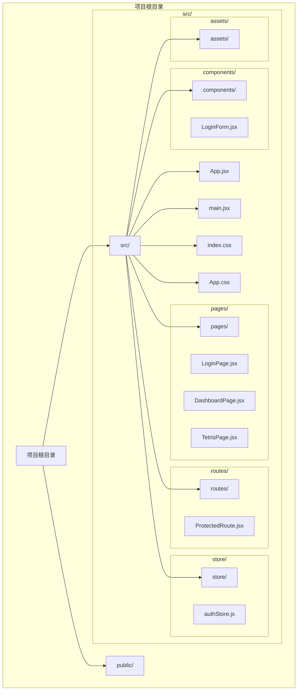

**图表来源**
- [LoginForm.jsx:1-78](file://src/components/LoginForm.jsx#L1-L78)
- [LoginPage.jsx:1-18](file://src/pages/LoginPage.jsx#L1-L18)
- [authStore.js:1-44](file://src/store/authStore.js#L1-L44)

**章节来源**
- [package.json:1-33](file://package.json#L1-L33)
- [src/App.jsx:1-44](file://src/App.jsx#L1-L44)

## 核心组件

### 表单验证架构

系统采用React Hook Form与Zod的组合验证方案，实现了声明式的表单验证和类型安全的验证规则。

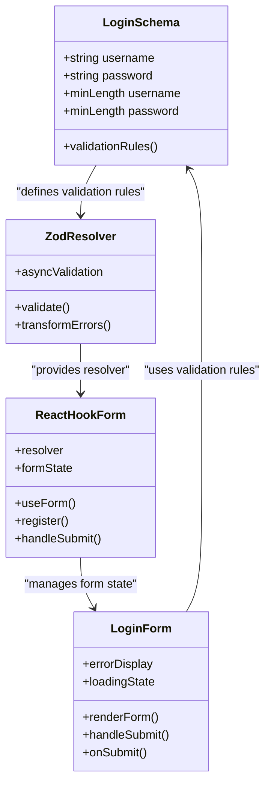

**图表来源**
- [LoginForm.jsx:7-22](file://src/components/LoginForm.jsx#L7-L22)

### 状态管理架构

系统使用Zustand实现轻量级的状态管理，集中管理认证相关的状态和操作。

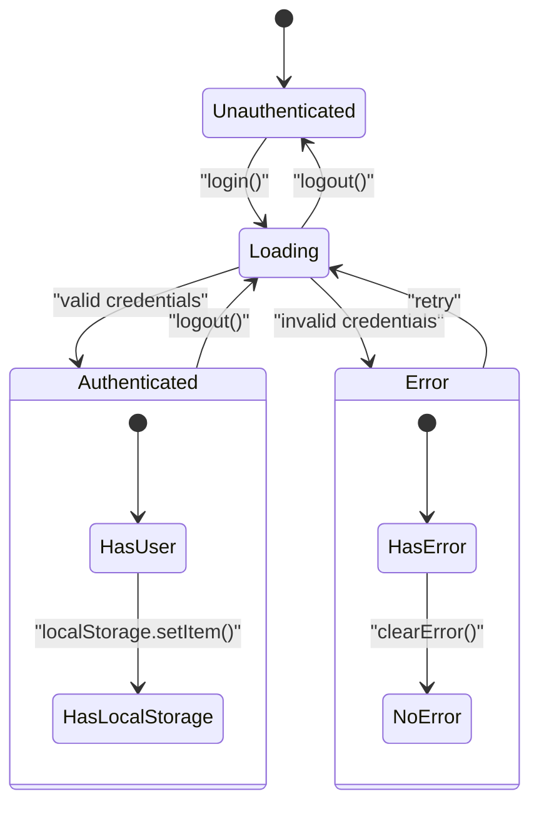

**图表来源**
- [authStore.js:9-40](file://src/store/authStore.js#L9-L40)

**章节来源**
- [LoginForm.jsx:1-78](file://src/components/LoginForm.jsx#L1-L78)
- [authStore.js:1-44](file://src/store/authStore.js#L1-L44)

## 架构概览

系统采用分层架构设计，清晰分离了表现层、业务逻辑层和数据持久化层。

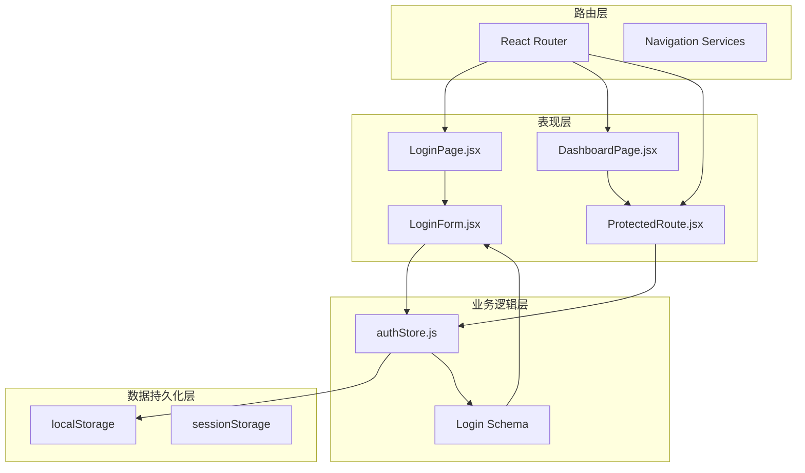

**图表来源**
- [App.jsx:17-39](file://src/App.jsx#L17-L39)
- [authStore.js:34-40](file://src/store/authStore.js#L34-L40)

### 数据流架构

系统实现了完整的数据流，从用户输入到状态更新的端到端流程。

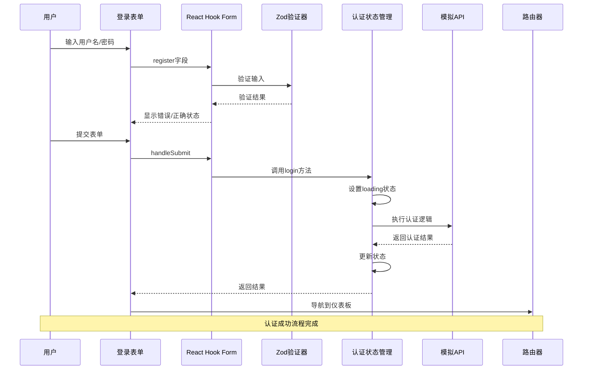

**图表来源**
- [LoginForm.jsx:24-29](file://src/components/LoginForm.jsx#L24-L29)
- [authStore.js:9-27](file://src/store/authStore.js#L9-L27)

**章节来源**
- [App.jsx:1-44](file://src/App.jsx#L1-L44)
- [LoginForm.jsx:1-78](file://src/components/LoginForm.jsx#L1-L78)

## 详细组件分析

### 登录表单组件 (LoginForm)

LoginForm组件是整个认证系统的核心，实现了完整的表单验证和用户交互功能。

#### 组件结构分析

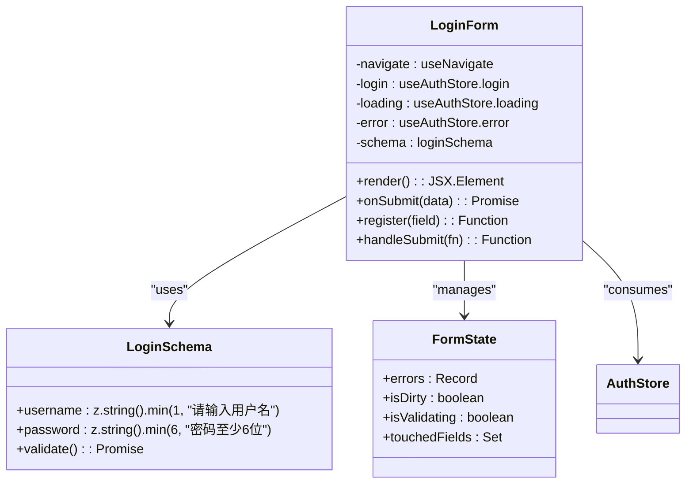

**图表来源**
- [LoginForm.jsx:12-75](file://src/components/LoginForm.jsx#L12-L75)

#### 表单字段配置

系统配置了两个核心字段：用户名和密码，每个字段都有明确的验证规则和用户提示。

| 字段名 | 类型 | 验证规则 | 错误消息 | 占位符 |
|--------|------|----------|----------|--------|
| username | string | 必填且非空 | 请输入用户名 | 请输入用户名 |
| password | string | 至少6个字符 | 密码至少6位 | 请输入密码 |

#### 实时验证实现

系统采用React Hook Form的默认验证策略，实现了即时的用户输入验证反馈。

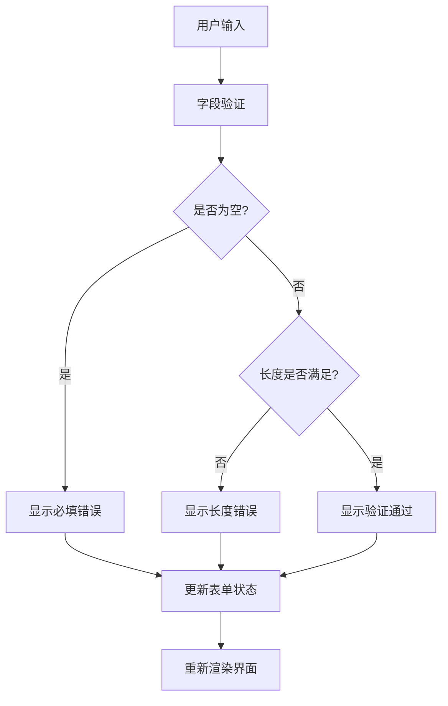

**图表来源**
- [LoginForm.jsx:16-22](file://src/components/LoginForm.jsx#L16-L22)

**章节来源**
- [LoginForm.jsx:1-78](file://src/components/LoginForm.jsx#L1-L78)

### 认证状态管理 (authStore)

authStore使用Zustand实现了轻量级的状态管理，集中处理所有认证相关的状态和操作。

#### 状态结构设计

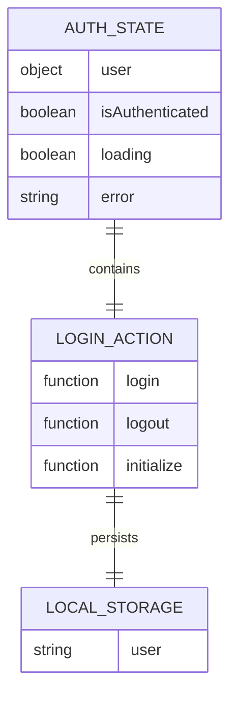

**图表来源**
- [authStore.js:3-41](file://src/store/authStore.js#L3-L41)

#### 异步认证流程

系统实现了模拟的异步认证流程，提供了真实的用户交互体验。

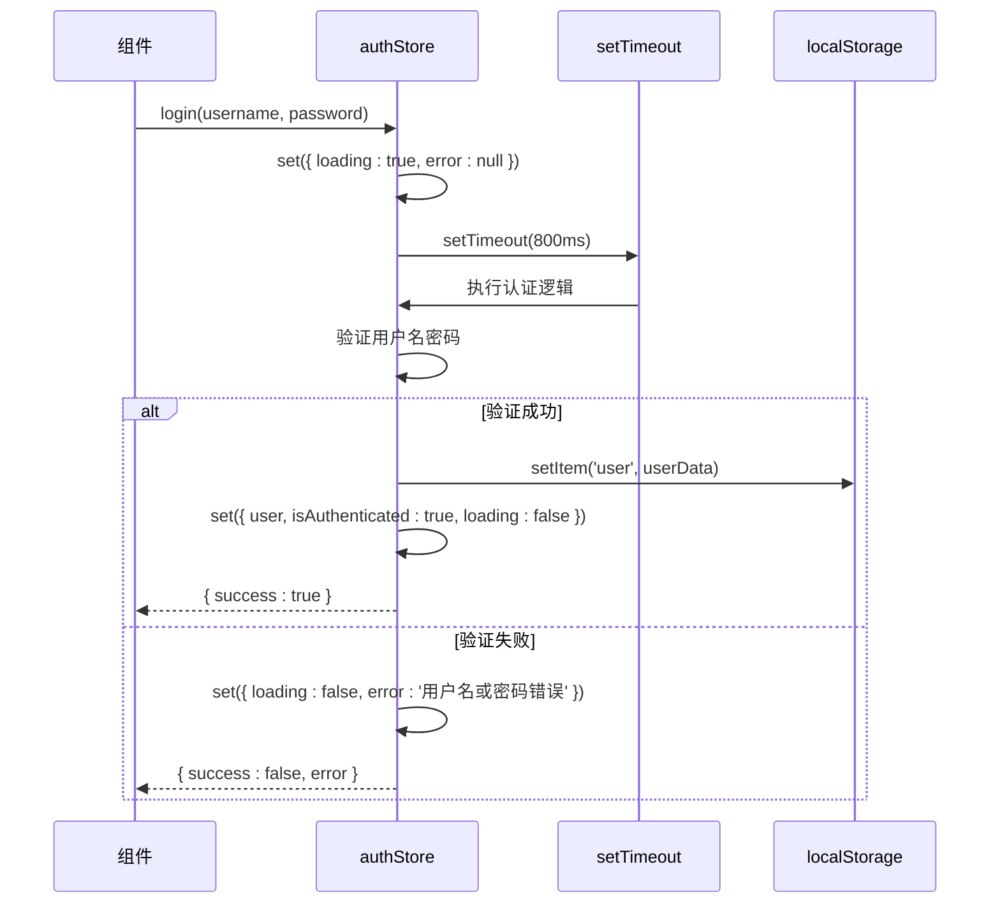

**图表来源**
- [authStore.js:9-27](file://src/store/authStore.js#L9-L27)

**章节来源**
- [authStore.js:1-44](file://src/store/authStore.js#L1-L44)

### 路由保护机制 (ProtectedRoute)

ProtectedRoute组件实现了路由级别的访问控制，确保只有认证用户才能访问受保护的页面。

#### 访问控制逻辑

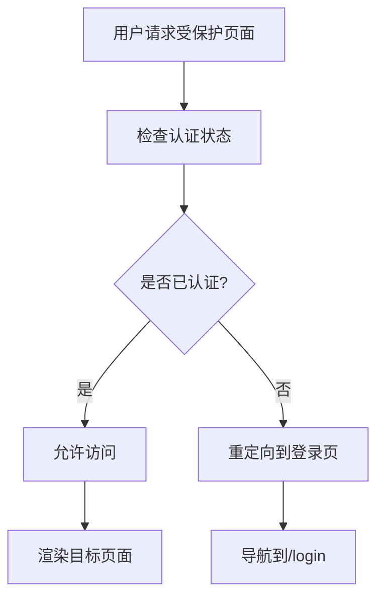

**图表来源**
- [ProtectedRoute.jsx:4-12](file://src/routes/ProtectedRoute.jsx#L4-L12)

**章节来源**
- [ProtectedRoute.jsx:1-15](file://src/routes/ProtectedRoute.jsx#L1-L15)

### 页面组件 (DashboardPage)

DashboardPage作为认证后的主页面，展示了用户信息和系统功能入口。

#### 页面功能结构

页面包含以下主要功能区域：
- 用户信息展示区
- 系统统计卡片网格
- 退出登录按钮
- 休闲娱乐链接（俄罗斯方块）

**章节来源**
- [DashboardPage.jsx:1-57](file://src/pages/DashboardPage.jsx#L1-L57)

## 依赖关系分析

系统的技术栈选择体现了现代React开发的最佳实践。

```mermaid
graph TB
subgraph "核心依赖"
React[react ^19.2.4]
ReactDOM[react-dom ^19.2.4]
ReactRouter[react-router-dom ^7.14.0]
end
subgraph "表单验证"
ReactHookForm[react-hook-form ^7.72.1]
Zod[zod ^4.3.6]
ZodResolver[@hookform/resolvers ^5.2.2]
end
subgraph "状态管理"
Zustand[zustand ^5.0.12]
end
subgraph "构建工具"
Vite[vite ^8.0.4]
ReactPlugin[@vitejs/plugin-react ^6.0.1]
end
subgraph "开发工具"
ESLint[eslint ^9.39.4]
Typescript[typescript-eslint]
end
React --> ReactHookForm
React --> Zustand
React --> ReactRouter
ReactHookForm --> Zod
ReactHookForm --> ZodResolver
Zustand --> React
Vite --> ReactPlugin
Vite --> React
```

**图表来源**
- [package.json:12-20](file://package.json#L12-L20)

### 外部依赖分析

| 依赖包 | 版本 | 主要用途 | 关键特性 |
|--------|------|----------|----------|
| react | ^19.2.4 | 核心框架 | 新特性支持、性能优化 |
| react-hook-form | ^7.72.1 | 表单管理 | 零依赖、高性能 |
| zod | ^4.3.6 | 类型验证 | 编译时类型安全 |
| zustand | ^5.0.12 | 状态管理 | 轻量级、易用性 |
| react-router-dom | ^7.14.0 | 路由管理 | 声明式路由 |
| @hookform/resolvers | ^5.2.2 | 验证器集成 | 与Zod无缝集成 |

**章节来源**
- [package.json:1-33](file://package.json#L1-L33)

## 性能考虑

### 渲染优化策略

系统采用了多种性能优化策略来提升用户体验：

1. **条件渲染优化**
   - 使用`disabled`属性防止重复提交
   - 条件显示错误消息，避免不必要的DOM更新

2. **状态更新优化**
   - 使用局部状态管理，避免全局状态污染
   - 合理的状态拆分，减少不必要的重渲染

3. **内存管理**
   - 及时清理定时器和事件监听器
   - 合理使用useEffect依赖数组

### 加载状态管理

系统实现了完善的加载状态管理，提供良好的用户体验：

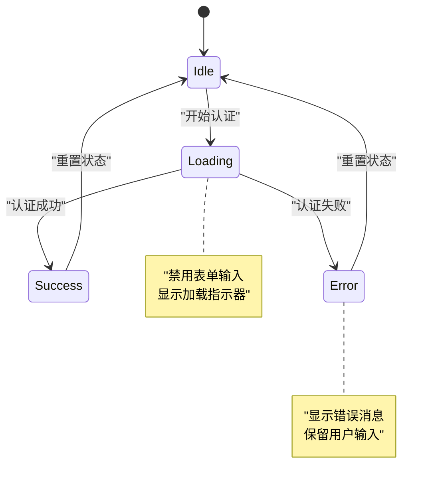

**图表来源**
- [LoginForm.jsx:42-67](file://src/components/LoginForm.jsx#L42-L67)
- [authStore.js:10-10](file://src/store/authStore.js#L10-L10)

## 故障排除指南

### 常见问题及解决方案

#### 表单验证问题

**问题**: 验证规则不生效
**原因**: Zod schema定义错误或resolver配置问题
**解决方案**: 
1. 检查schema定义的字段名称与表单字段一致
2. 确认resolver正确导入和配置
3. 验证Zod版本兼容性

#### 认证状态问题

**问题**: 登录后无法跳转到仪表板
**原因**: 路由保护逻辑或状态管理问题
**解决方案**:
1. 检查ProtectedRoute组件的认证状态判断
2. 验证useAuthStore的状态更新逻辑
3. 确认localStorage中的用户数据格式

#### 样式问题

**问题**: 表单样式显示异常
**原因**: CSS变量未正确设置或样式冲突
**解决方案**:
1. 检查:root中的CSS变量定义
2. 验证组件样式类名的正确性
3. 确认样式文件的加载顺序

**章节来源**
- [LoginForm.jsx:1-78](file://src/components/LoginForm.jsx#L1-L78)
- [authStore.js:1-44](file://src/store/authStore.js#L1-L44)

## 结论

本登录表单验证系统成功地将React Hook Form与Zod验证库结合，实现了现代化的表单验证解决方案。系统具有以下优势：

### 技术优势
- **类型安全**: Zod提供编译时类型检查，减少运行时错误
- **性能优异**: React Hook Form零依赖，渲染性能出色
- **开发体验**: 声明式API，易于理解和维护
- **状态管理**: Zustand轻量级，学习成本低

### 用户体验优势
- **实时反馈**: 即时的验证反馈和错误提示
- **响应式设计**: 完善的移动端适配
- **无障碍支持**: 符合WCAG标准的可访问性设计
- **加载状态**: 清晰的用户状态指示

### 扩展性考虑
系统为未来的功能扩展预留了良好的基础：
- 支持更复杂的验证规则
- 可以轻松添加新的认证方式
- 路由保护机制易于扩展
- 状态管理可以按需扩展

该系统为React应用的表单验证提供了一个优秀的参考实现，既保证了技术先进性，又兼顾了实用性和可维护性。