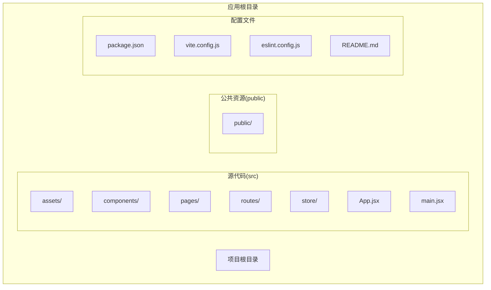
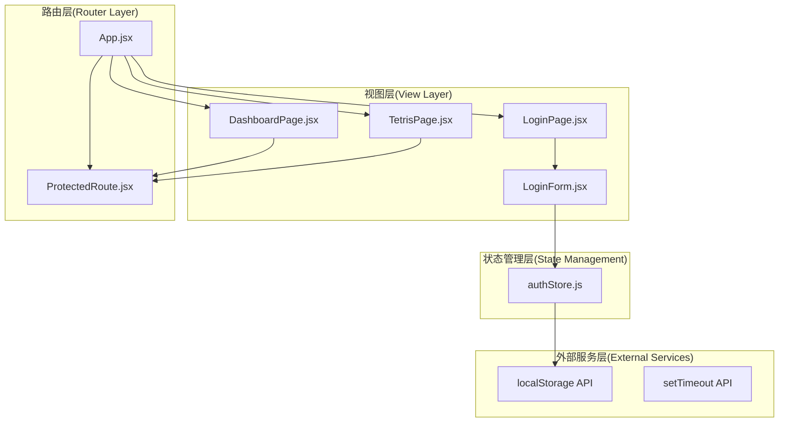
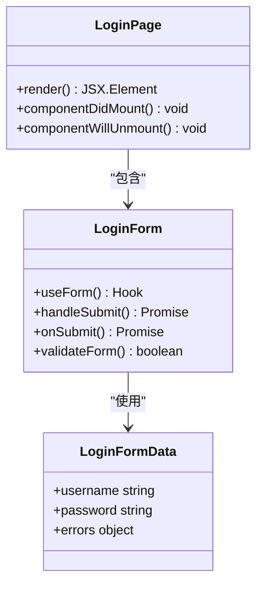
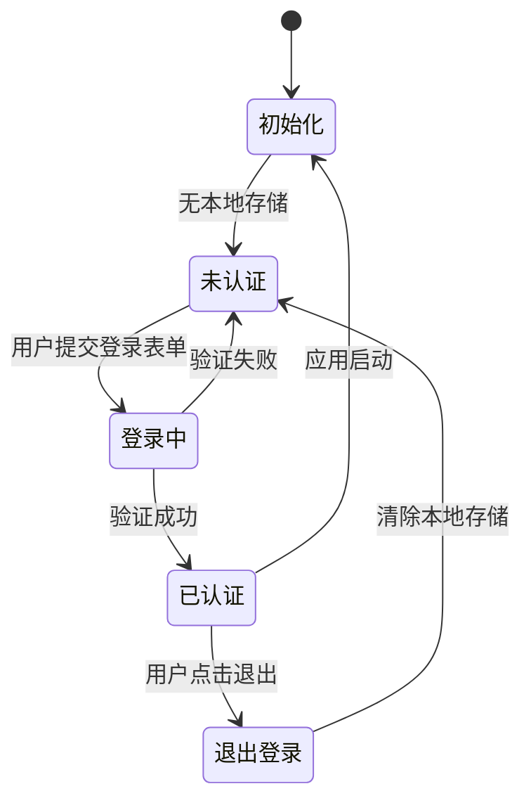
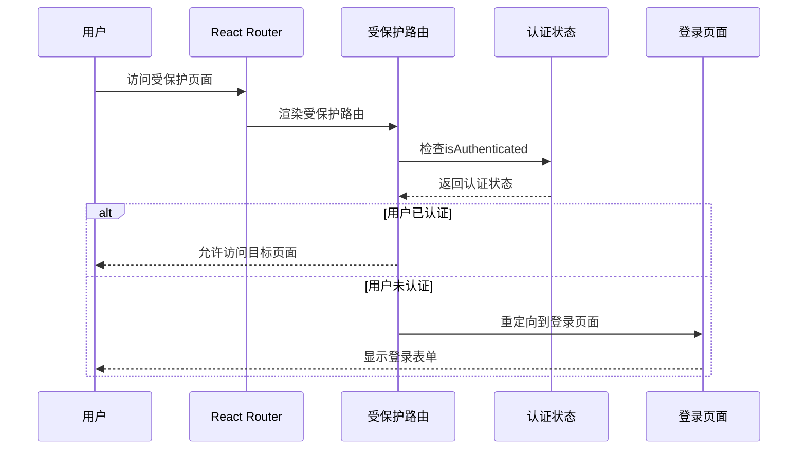
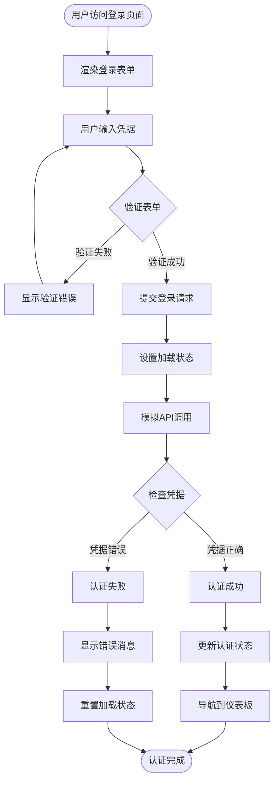
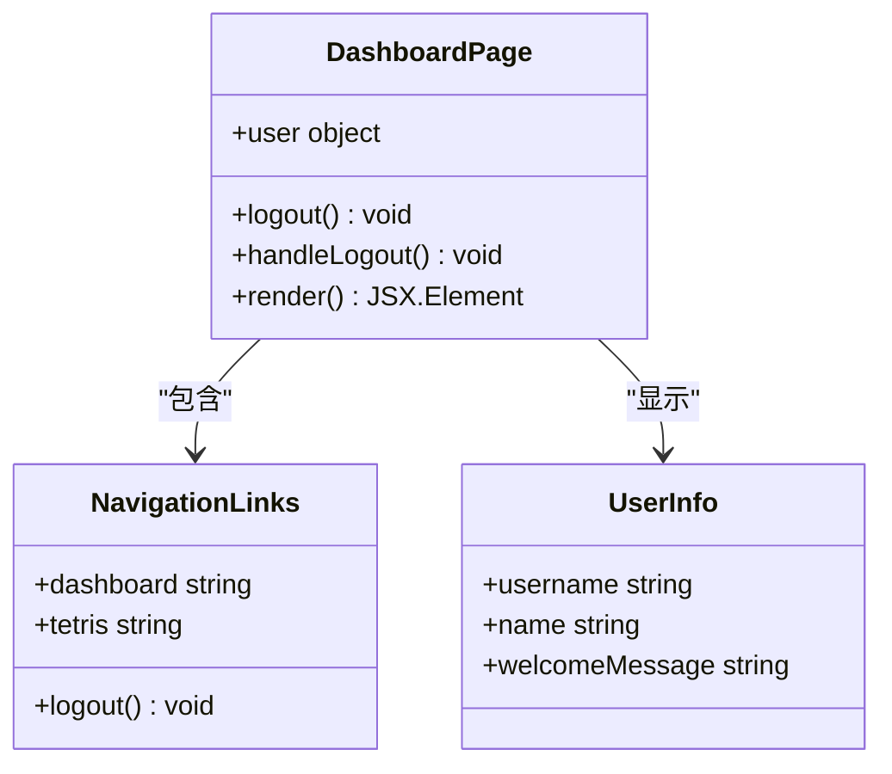

# 认证流程详解

<cite>
**本文档引用的文件**
- [src/App.jsx](file://src/App.jsx)
- [src/pages/LoginPage.jsx](file://src/pages/LoginPage.jsx)
- [src/components/LoginForm.jsx](file://src/components/LoginForm.jsx)
- [src/store/authStore.js](file://src/store/authStore.js)
- [src/routes/ProtectedRoute.jsx](file://src/routes/ProtectedRoute.jsx)
- [src/pages/DashboardPage.jsx](file://src/pages/DashboardPage.jsx)
- [src/pages/TetrisPage.jsx](file://src/pages/TetrisPage.jsx)
- [src/main.jsx](file://src/main.jsx)
- [src/index.css](file://src/index.css)
- [package.json](file://package.json)
</cite>

## 目录
1. [简介](#简介)
2. [项目结构](#项目结构)
3. [核心组件](#核心组件)
4. [架构概览](#架构概览)
5. [详细组件分析](#详细组件分析)
6. [依赖关系分析](#依赖关系分析)
7. [性能考虑](#性能考虑)
8. [故障排除指南](#故障排除指南)
9. [结论](#结论)

## 简介

本项目是一个基于React的认证应用，实现了完整的用户登录认证流程。该应用采用现代前端技术栈，包括React 19、React Router 7、Zustand状态管理和Zod表单验证库。认证流程涵盖了从用户访问登录页面到完成认证的完整生命周期，包括页面渲染、表单交互、状态更新和路由跳转等各个环节。

## 项目结构

该项目采用功能模块化的组织方式，主要目录结构如下：



**图表来源**
- [src/App.jsx:1-44](file://src/App.jsx#L1-L44)
- [src/main.jsx:1-11](file://src/main.jsx#L1-L11)

**章节来源**
- [src/App.jsx:1-44](file://src/App.jsx#L1-L44)
- [src/main.jsx:1-11](file://src/main.jsx#L1-L11)

## 核心组件

### 认证状态管理

应用使用Zustand实现全局状态管理，核心状态包括：
- 用户信息（user）
- 认证状态（isAuthenticated）
- 加载状态（loading）
- 错误信息（error）

### 表单验证系统

使用Zod进行客户端表单验证，支持：
- 用户名验证（必填）
- 密码验证（至少6位字符）
- 实时验证反馈
- 错误消息显示

### 路由保护机制

通过自定义ProtectedRoute组件实现路由级别的访问控制，确保只有认证用户才能访问受保护的页面。

**章节来源**
- [src/store/authStore.js:1-44](file://src/store/authStore.js#L1-L44)
- [src/components/LoginForm.jsx:1-78](file://src/components/LoginForm.jsx#L1-L78)
- [src/routes/ProtectedRoute.jsx:1-15](file://src/routes/ProtectedRoute.jsx#L1-L15)

## 架构概览

应用采用分层架构设计，各层职责清晰分离：



**图表来源**
- [src/App.jsx:10-41](file://src/App.jsx#L10-L41)
- [src/store/authStore.js:3-41](file://src/store/authStore.js#L3-L41)
- [src/routes/ProtectedRoute.jsx:4-12](file://src/routes/ProtectedRoute.jsx#L4-L12)

## 详细组件分析

### 登录页面组件

登录页面负责展示登录界面和承载登录表单：



**图表来源**
- [src/pages/LoginPage.jsx:3-15](file://src/pages/LoginPage.jsx#L3-L15)
- [src/components/LoginForm.jsx:12-29](file://src/components/LoginForm.jsx#L12-L29)

登录页面的主要功能：
- 提供用户友好的登录界面
- 集成表单验证和错误处理
- 支持加载状态显示
- 展示提示信息

**章节来源**
- [src/pages/LoginPage.jsx:1-18](file://src/pages/LoginPage.jsx#L1-L18)
- [src/components/LoginForm.jsx:1-78](file://src/components/LoginForm.jsx#L1-L78)

### 认证状态存储

认证状态存储是整个认证系统的核心组件：



**图表来源**
- [src/store/authStore.js:9-41](file://src/store/authStore.js#L9-L41)

状态存储的关键特性：
- 使用localStorage持久化用户会话
- 支持异步认证操作
- 提供初始化检查机制
- 管理完整的认证生命周期

**章节来源**
- [src/store/authStore.js:1-44](file://src/store/authStore.js#L1-L44)

### 路由保护机制

受保护路由组件确保访问控制：



**图表来源**
- [src/routes/ProtectedRoute.jsx:4-12](file://src/routes/ProtectedRoute.jsx#L4-L12)
- [src/App.jsx:21-36](file://src/App.jsx#L21-L36)

**章节来源**
- [src/routes/ProtectedRoute.jsx:1-15](file://src/routes/ProtectedRoute.jsx#L1-L15)
- [src/App.jsx:17-39](file://src/App.jsx#L17-L39)

### 登录表单组件

登录表单实现了完整的表单处理逻辑：



**图表来源**
- [src/components/LoginForm.jsx:24-29](file://src/components/LoginForm.jsx#L24-L29)
- [src/store/authStore.js:9-27](file://src/store/authStore.js#L9-L27)

**章节来源**
- [src/components/LoginForm.jsx:1-78](file://src/components/LoginForm.jsx#L1-L78)
- [src/store/authStore.js:9-27](file://src/store/authStore.js#L9-L27)

### 仪表板页面

仪表板页面展示了认证后的用户界面：



**图表来源**
- [src/pages/DashboardPage.jsx:4-11](file://src/pages/DashboardPage.jsx#L4-L11)

**章节来源**
- [src/pages/DashboardPage.jsx:1-57](file://src/pages/DashboardPage.jsx#L1-L57)

## 依赖关系分析

应用的依赖关系体现了清晰的技术栈选择和模块化设计：

```mermaid
graph TB
subgraph "应用依赖"
React[react@^19.2.4]
ReactDOM[react-dom@^19.2.4]
Router[react-router-dom@^7.14.0]
Zustand[zustand@^5.0.12]
HookForm[react-hook-form@^7.72.1]
Zod[zod@^4.3.6]
Resolver[@hookform/resolvers@^5.2.2]
end
subgraph "开发依赖"
Vite[vite@^8.0.4]
ESLint[eslint@^9.39.4]
Typescript[@types/react@^19.2.14]
TypescriptDOM[@types/react-dom@^19.2.3]
end
subgraph "构建工具"
VitePlugin[@vitejs/plugin-react@^6.0.1]
ESLintPluginReactHooks[eslint-plugin-react-hooks@^7.0.1]
ESLintPluginReactRefresh[eslint-plugin-react-refresh@^0.5.2]
end
React --> ReactDOM
React --> Router
React --> HookForm
HookForm --> Zod
HookForm --> Resolver
Zustand --> React
Vite --> React
Vite --> VitePlugin
ESLint --> ESLintPluginReactHooks
ESLint --> ESLintPluginReactRefresh
```

**图表来源**
- [package.json:12-31](file://package.json#L12-L31)

**章节来源**
- [package.json:1-33](file://package.json#L1-L33)

## 性能考虑

### 状态管理优化

应用采用了轻量级的状态管理模式，具有以下性能优势：
- **局部状态隔离**：每个组件只订阅必要的状态，避免不必要的重渲染
- **原子状态更新**：使用Zustand的原子性更新，减少状态同步开销
- **内存效率**：仅存储必要的认证信息，避免状态膨胀

### 表单验证性能

表单验证系统经过优化以确保最佳性能：
- **即时验证**：使用react-hook-form的实时验证，提供流畅的用户体验
- **最小化重渲染**：验证逻辑与UI渲染分离，避免频繁的DOM更新
- **缓存策略**：验证结果在用户输入过程中得到缓存

### 路由性能

路由系统的设计考虑了性能因素：
- **懒加载**：受保护的页面组件按需加载
- **快速重定向**：认证检查在组件渲染前完成
- **内存管理**：离开页面时自动清理事件监听器

## 故障排除指南

### 常见认证问题

#### 登录失败问题
**症状**：用户输入正确的凭据但仍显示认证失败
**解决方案**：
1. 检查浏览器控制台是否有JavaScript错误
2. 验证localStorage是否正常工作
3. 确认网络连接稳定

#### 页面重定向问题
**症状**：用户认证后无法正确跳转到目标页面
**解决方案**：
1. 检查ProtectedRoute组件的实现
2. 验证路由配置是否正确
3. 确认useNavigate钩子的使用

#### 状态同步问题
**症状**：用户状态与UI显示不一致
**解决方案**：
1. 检查Zustand状态更新是否正确触发
2. 验证useEffect依赖数组的配置
3. 确认状态订阅的正确性

### 调试方法

#### 浏览器开发者工具
1. **Network面板**：监控认证请求和响应
2. **Application面板**：检查localStorage中的用户数据
3. **Console面板**：查看错误日志和警告信息

#### 应用内调试
1. **状态检查**：在控制台中检查`useAuthStore.getState()`
2. **路由调试**：使用`location`对象检查当前路由状态
3. **表单调试**：验证表单字段的值和验证状态

### 性能监控方案

#### 关键指标监控
- **认证响应时间**：记录从提交到响应的时间
- **状态更新频率**：监控状态变化的频率和性能影响
- **内存使用**：定期检查应用的内存占用情况

#### 错误处理策略
1. **网络错误**：实现重试机制和用户友好的错误提示
2. **验证错误**：提供具体的错误信息和修复建议
3. **服务器错误**：优雅降级和错误恢复机制

**章节来源**
- [src/store/authStore.js:9-27](file://src/store/authStore.js#L9-L27)
- [src/components/LoginForm.jsx:24-29](file://src/components/LoginForm.jsx#L24-L29)

## 结论

本认证系统展现了现代React应用的最佳实践，通过合理的架构设计和组件分离，实现了清晰、可维护且高性能的认证流程。系统的主要优势包括：

1. **模块化设计**：清晰的组件边界和职责分离
2. **状态管理**：高效的Zustand状态管理模式
3. **用户体验**：流畅的表单验证和加载状态管理
4. **安全性**：基于localStorage的会话管理和路由保护
5. **可扩展性**：易于添加新功能和改进现有功能

该系统为类似的应用提供了良好的参考模板，特别是在认证流程、状态管理和用户体验优化方面。通过遵循这些模式和最佳实践，开发者可以构建出更加健壮和用户友好的认证系统。