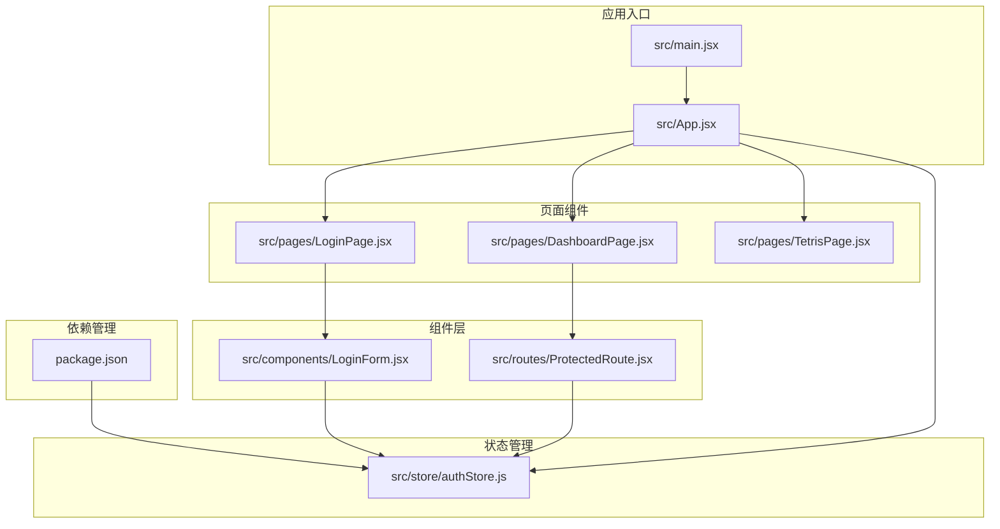
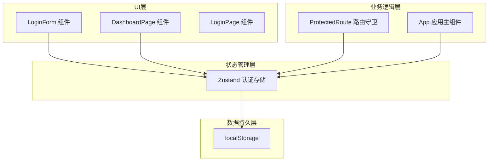
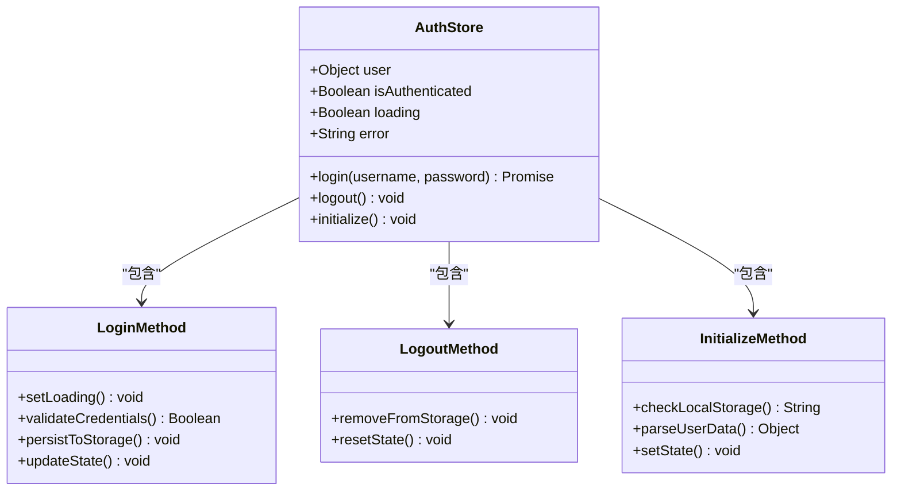
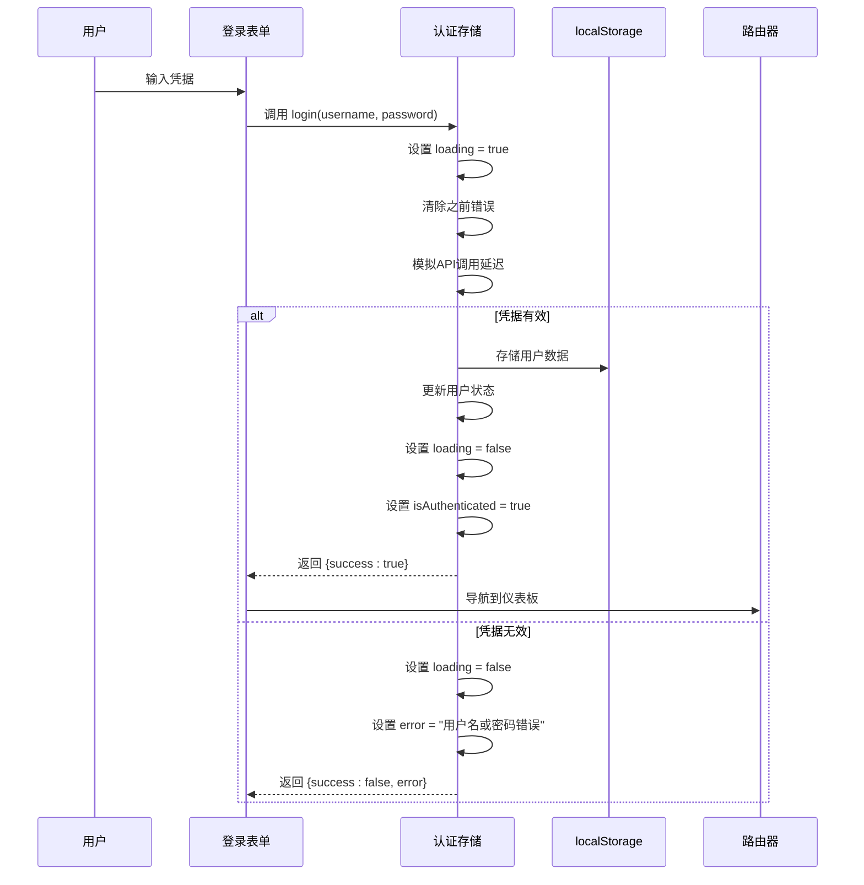
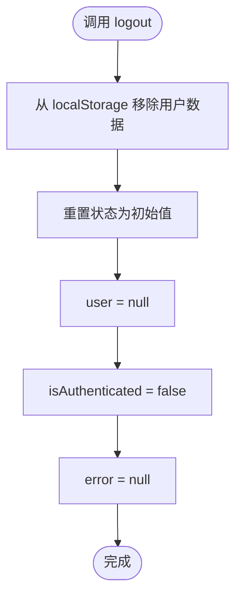
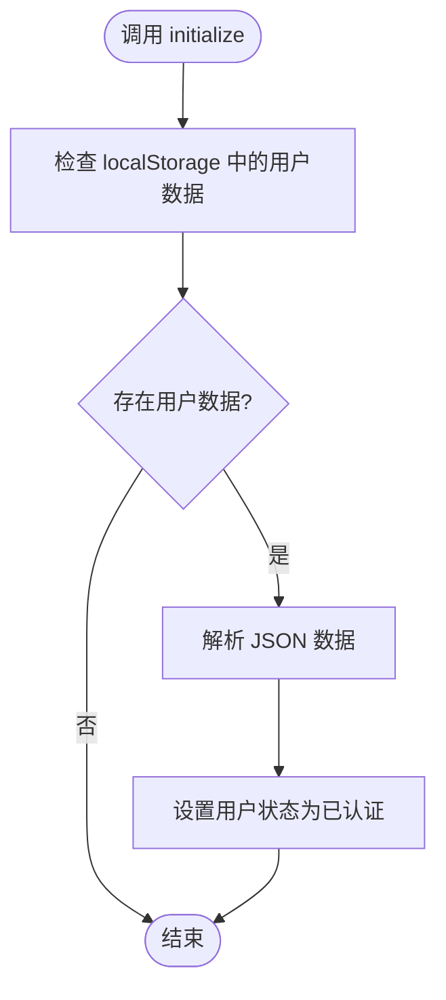
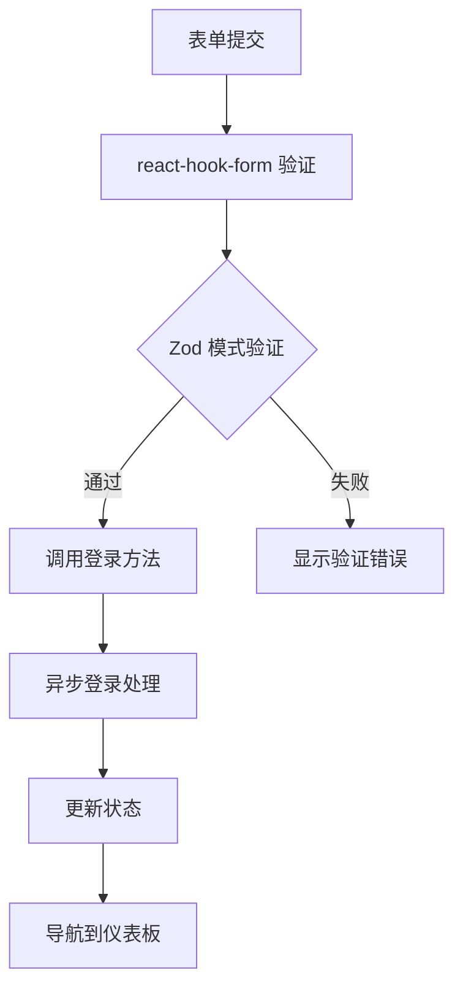
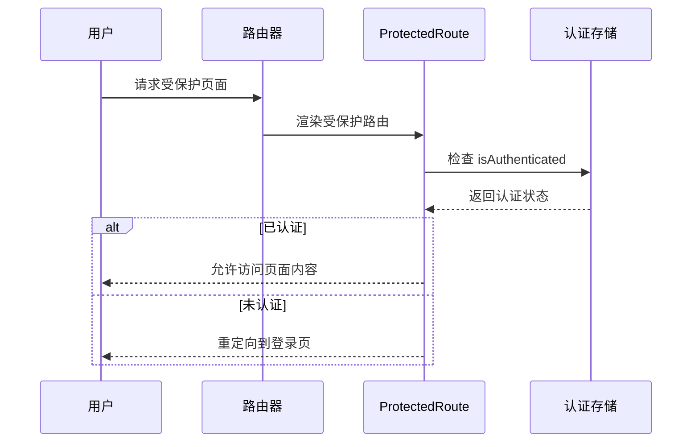
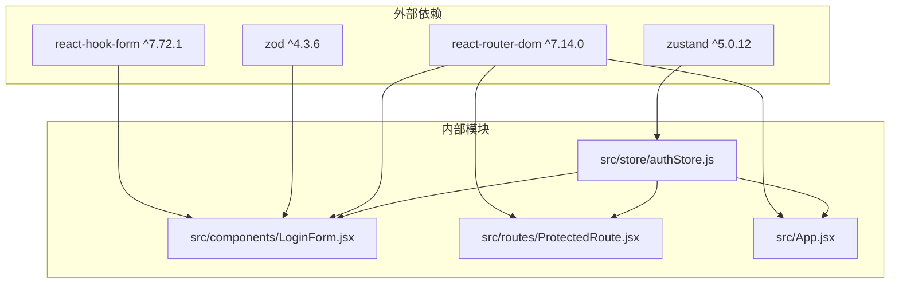
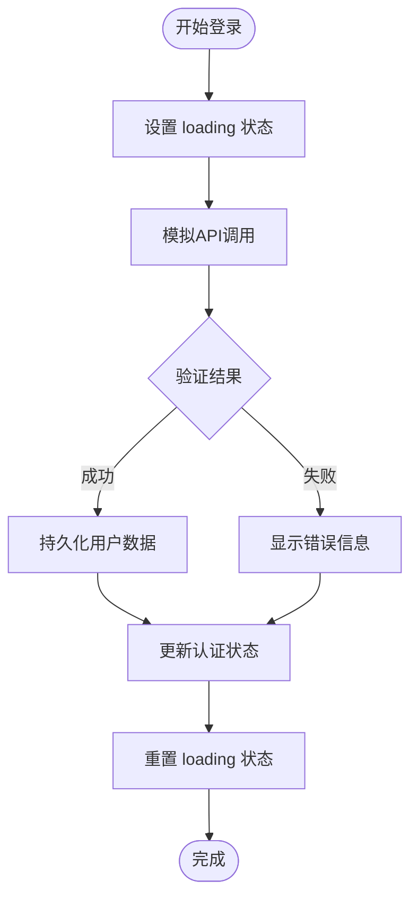

# 认证状态管理

<cite>
**本文档引用的文件**
- [authStore.js](file://src/store/authStore.js)
- [LoginForm.jsx](file://src/components/LoginForm.jsx)
- [LoginPage.jsx](file://src/pages/LoginPage.jsx)
- [DashboardPage.jsx](file://src/pages/DashboardPage.jsx)
- [ProtectedRoute.jsx](file://src/routes/ProtectedRoute.jsx)
- [App.jsx](file://src/App.jsx)
- [main.jsx](file://src/main.jsx)
- [package.json](file://package.json)
</cite>

## 目录
1. [简介](#简介)
2. [项目结构](#项目结构)
3. [核心组件](#核心组件)
4. [架构概览](#架构概览)
5. [详细组件分析](#详细组件分析)
6. [依赖关系分析](#依赖关系分析)
7. [性能考虑](#性能考虑)
8. [故障排除指南](#故障排除指南)
9. [结论](#结论)

## 简介

本项目展示了一个基于Zustand状态管理库的React认证系统实现。该系统提供了完整的用户认证流程，包括登录、登出和初始化功能，并集成了localStorage持久化机制。通过使用Zustand，我们实现了轻量级的状态管理，避免了Redux等重型解决方案的复杂性。

系统的核心特性包括：
- 基于Zustand的状态管理
- 异步登录流程的loading状态管理
- localStorage持久化存储
- 表单验证集成
- 受保护路由访问控制

## 项目结构

该项目采用模块化组织方式，主要文件结构如下：



**图表来源**
- [main.jsx:1-11](file://src/main.jsx#L1-L11)
- [App.jsx:1-44](file://src/App.jsx#L1-L44)
- [authStore.js:1-44](file://src/store/authStore.js#L1-L44)

**章节来源**
- [main.jsx:1-11](file://src/main.jsx#L1-L11)
- [App.jsx:1-44](file://src/App.jsx#L1-L44)
- [authStore.js:1-44](file://src/store/authStore.js#L1-L44)

## 核心组件

### Zustand认证存储

认证状态管理的核心是`useAuthStore`，它使用Zustand的`create`函数创建了一个全局状态容器。该存储包含了以下关键状态属性：

- `user`: 当前认证用户对象，初始为null
- `isAuthenticated`: 用户认证状态布尔值，初始为false  
- `loading`: 登录操作的加载状态，初始为false
- `error`: 错误信息，初始为null

存储还提供了三个核心方法：

1. **login**: 处理用户登录逻辑
2. **logout**: 处理用户登出逻辑  
3. **initialize**: 应用初始化时检查localStorage

**章节来源**
- [authStore.js:3-41](file://src/store/authStore.js#L3-L41)

### 登录表单组件

`LoginForm`组件负责处理用户输入和表单验证，集成了react-hook-form进行客户端验证。该组件：
- 使用Zod进行表单模式验证
- 集成Zustand认证状态
- 提供实时错误反馈
- 禁用表单输入以防止重复提交

**章节来源**
- [LoginForm.jsx:12-78](file://src/components/LoginForm.jsx#L12-L78)

### 仪表板页面

`DashboardPage`展示了认证后的受保护内容，显示用户信息和系统功能。该页面：
- 展示当前登录用户的欢迎信息
- 提供登出功能
- 包含导航到其他受保护页面的链接

**章节来源**
- [DashboardPage.jsx:4-57](file://src/pages/DashboardPage.jsx#L4-L57)

## 架构概览

系统采用分层架构设计，从上到下分为UI层、业务逻辑层和状态管理层：



**图表来源**
- [authStore.js:1-44](file://src/store/authStore.js#L1-L44)
- [LoginForm.jsx:4-14](file://src/components/LoginForm.jsx#L4-L14)
- [DashboardPage.jsx:6-11](file://src/pages/DashboardPage.jsx#L6-L11)
- [ProtectedRoute.jsx:5](file://src/routes/ProtectedRoute.jsx#L5)

## 详细组件分析

### 认证存储实现分析

#### 状态结构设计

Zustand认证存储采用了简洁而高效的状态结构设计：



**图表来源**
- [authStore.js:3-41](file://src/store/authStore.js#L3-L41)

#### 登录方法实现

登录方法实现了完整的异步认证流程：



**图表来源**
- [authStore.js:9-27](file://src/store/authStore.js#L9-L27)
- [LoginForm.jsx:24-29](file://src/components/LoginForm.jsx#L24-L29)

#### 登出方法实现

登出方法提供了简单的状态重置功能：



**图表来源**
- [authStore.js:29-32](file://src/store/authStore.js#L29-L32)

#### 初始化方法实现

初始化方法负责应用启动时的状态恢复：



**图表来源**
- [authStore.js:34-40](file://src/store/authStore.js#L34-L40)

**章节来源**
- [authStore.js:9-40](file://src/store/authStore.js#L9-L40)

### 表单验证集成

系统使用react-hook-form和Zod进行表单验证：



**图表来源**
- [LoginForm.jsx:7-22](file://src/components/LoginForm.jsx#L7-L22)
- [LoginForm.jsx:24-29](file://src/components/LoginForm.jsx#L24-L29)

**章节来源**
- [LoginForm.jsx:7-29](file://src/components/LoginForm.jsx#L7-L29)

### 受保护路由实现

受保护路由确保只有认证用户才能访问特定页面：



**图表来源**
- [ProtectedRoute.jsx:4-12](file://src/routes/ProtectedRoute.jsx#L4-L12)

**章节来源**
- [ProtectedRoute.jsx:4-12](file://src/routes/ProtectedRoute.jsx#L4-L12)

## 依赖关系分析

系统的主要依赖关系如下：



**图表来源**
- [package.json:12-19](file://package.json#L12-L19)
- [authStore.js:1](file://src/store/authStore.js#L1)
- [LoginForm.jsx:1-5](file://src/components/LoginForm.jsx#L1-L5)

**章节来源**
- [package.json:12-19](file://package.json#L12-L19)

## 性能考虑

### 状态选择优化

Zustand支持细粒度的状态选择，可以避免不必要的组件重新渲染：

```javascript
// 推荐：只选择需要的状态
const { user, isAuthenticated } = useAuthStore(state => ({
  user: state.user,
  isAuthenticated: state.isAuthenticated
}));

// 不推荐：选择整个状态对象
const state = useAuthStore(state => state);
```

### 异步操作优化

登录操作使用Promise包装，避免阻塞UI线程：



**图表来源**
- [authStore.js:9-27](file://src/store/authStore.js#L9-L27)

### 内存管理

系统实现了适当的内存清理机制：
- 登出时清除localStorage中的用户数据
- 重置所有认证相关状态
- 避免内存泄漏

## 故障排除指南

### 常见问题及解决方案

#### 登录失败问题

**症状**: 用户凭据正确但无法登录
**可能原因**: 
- localStorage存储格式不正确
- 网络请求超时
- 前端状态更新异常

**解决步骤**:
1. 检查浏览器localStorage中是否存在用户数据
2. 验证网络连接和API可用性
3. 查看浏览器开发者工具中的错误日志

#### 页面重定向问题

**症状**: 已登录用户被重定向到登录页面
**可能原因**:
- 认证状态丢失
- localStorage数据损坏
- 浏览器缓存问题

**解决步骤**:
1. 清除浏览器缓存和localStorage
2. 检查认证状态是否正确同步
3. 验证受保护路由配置

#### 性能问题

**症状**: 登录响应缓慢
**可能原因**:
- 过多的状态订阅
- 不必要的组件重新渲染
- 外部API调用延迟

**优化建议**:
1. 使用状态选择减少不必要的重渲染
2. 实施防抖和节流机制
3. 优化异步操作的并发处理

**章节来源**
- [authStore.js:21-24](file://src/store/authStore.js#L21-L24)
- [ProtectedRoute.jsx:7-9](file://src/routes/ProtectedRoute.jsx#L7-L9)

## 结论

本项目成功展示了如何使用Zustand构建一个轻量级但功能完整的认证系统。通过合理的状态设计、异步操作管理和localStorage持久化，实现了良好的用户体验和开发效率。

### 主要优势

1. **简洁性**: Zustand提供了比Redux更简单的API
2. **性能**: 原生支持细粒度状态选择，避免不必要的重渲染
3. **易用性**: 无需复杂的中间件配置
4. **类型安全**: 与TypeScript和Zod集成良好

### 改进建议

1. **错误处理增强**: 添加更详细的错误分类和处理机制
2. **状态持久化扩展**: 考虑添加状态快照和恢复功能
3. **并发控制**: 实现登录请求的去重和并发控制
4. **安全增强**: 添加CSRF保护和令牌刷新机制

该认证系统为中小型React应用提供了一个优秀的起点，可以根据具体需求进一步扩展和定制。