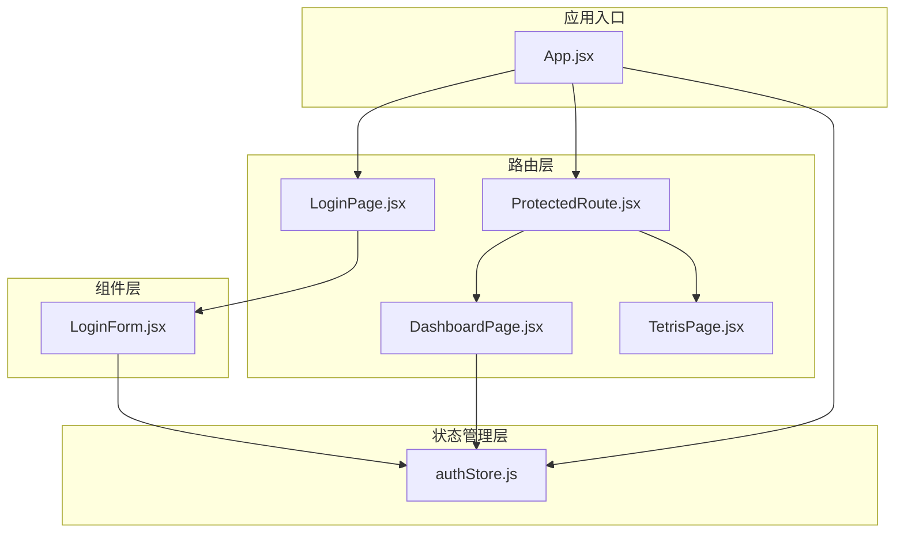
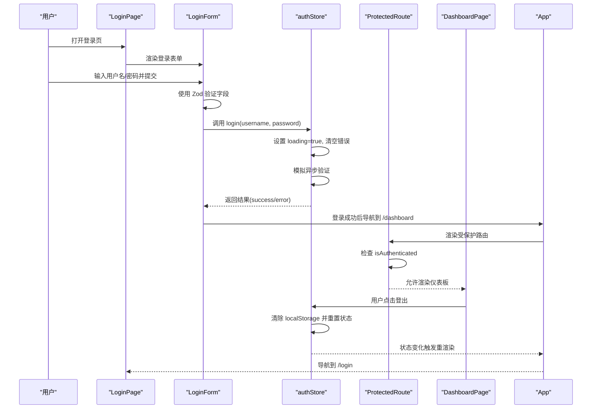
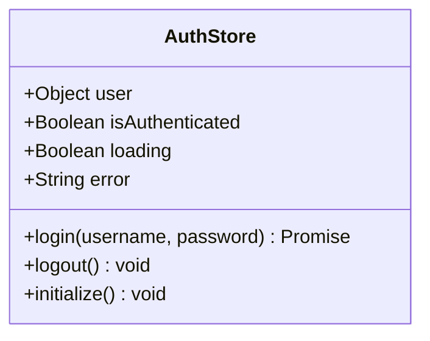
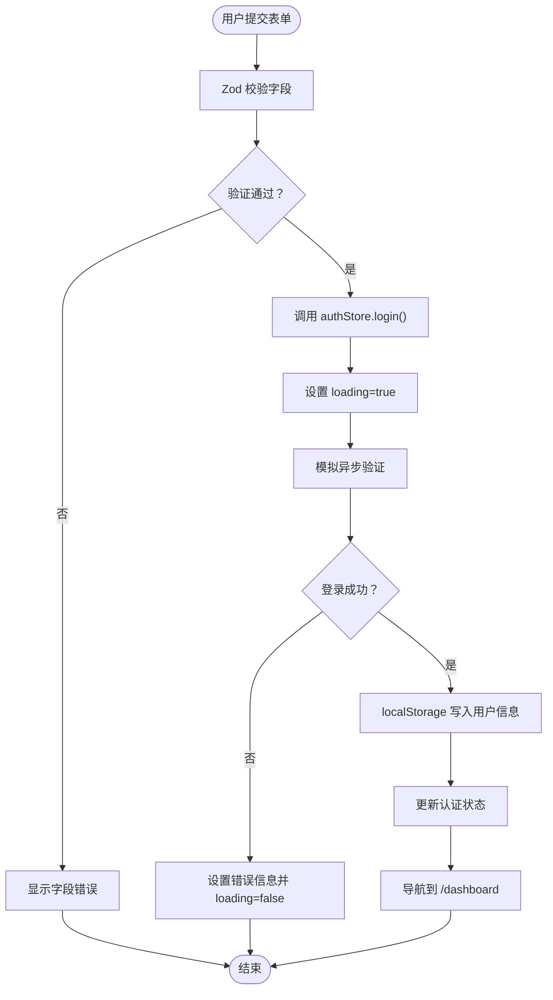
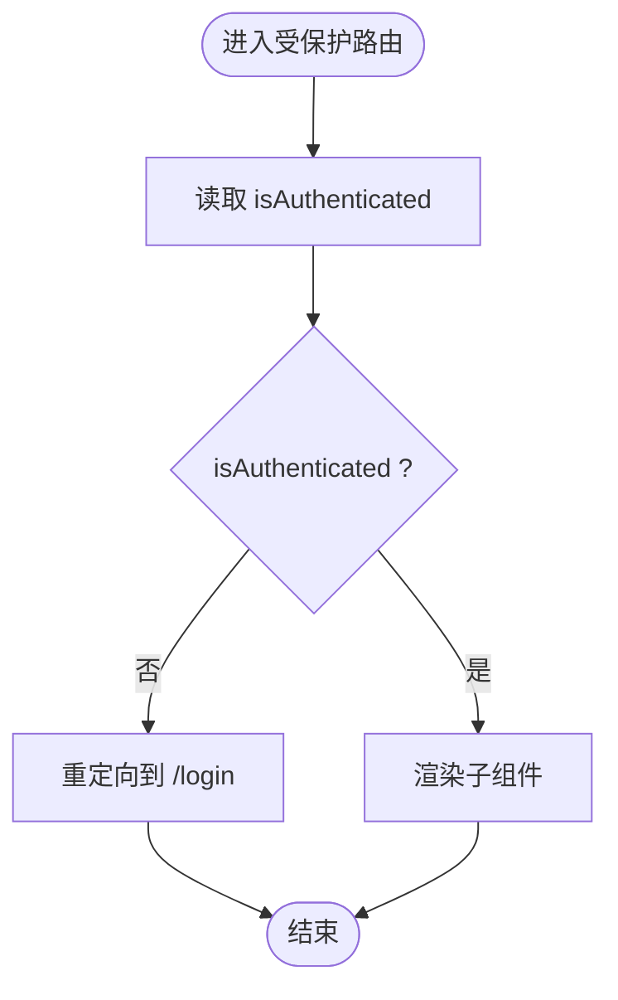
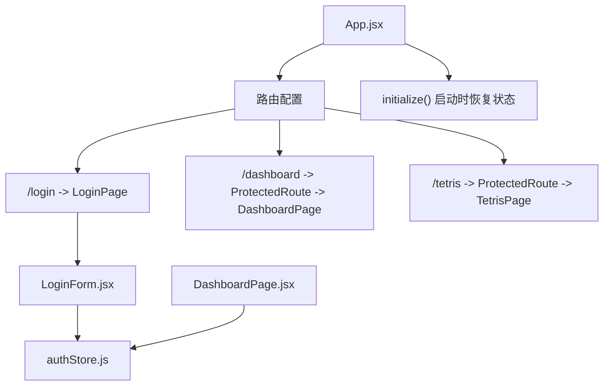
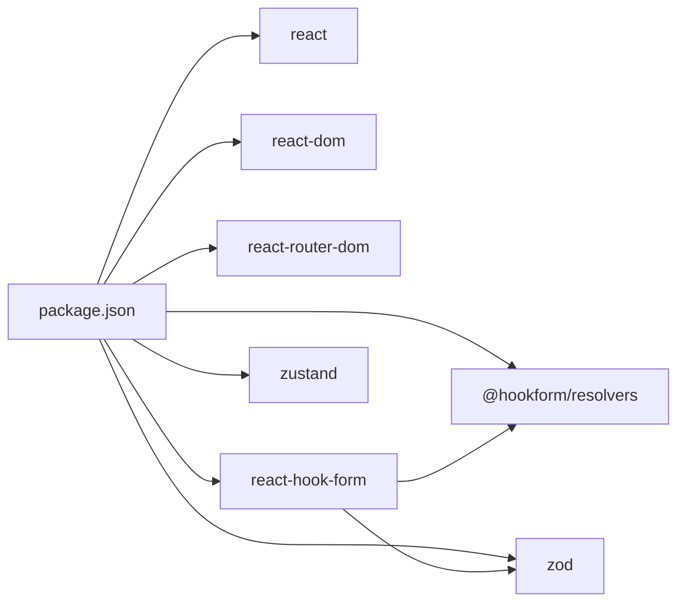

# 认证系统

<cite>
**本文档引用的文件**
- [authStore.js](file://src/store/authStore.js)
- [LoginForm.jsx](file://src/components/LoginForm.jsx)
- [ProtectedRoute.jsx](file://src/routes/ProtectedRoute.jsx)
- [LoginPage.jsx](file://src/pages/LoginPage.jsx)
- [App.jsx](file://src/App.jsx)
- [DashboardPage.jsx](file://src/pages/DashboardPage.jsx)
- [TetrisPage.jsx](file://src/pages/TetrisPage.jsx)
- [index.css](file://src/index.css)
- [TetrisPage.css](file://src/pages/TetrisPage.css)
- [package.json](file://package.json)
</cite>

## 目录
1. [简介](#简介)
2. [项目结构](#项目结构)
3. [核心组件](#核心组件)
4. [架构总览](#架构总览)
5. [详细组件分析](#详细组件分析)
6. [依赖关系分析](#依赖关系分析)
7. [性能考量](#性能考量)
8. [故障排除指南](#故障排除指南)
9. [结论](#结论)
10. [附录](#附录)

## 简介
本项目是一个基于 React 的认证系统演示，展示了如何使用 Zustand 进行状态管理、结合 localStorage 实现会话持久化、通过 React Hook Form 与 Zod 完成表单验证，并使用 ProtectedRoute 实现路由级访问控制。系统包含登录页、仪表板页以及一个受保护的游戏页面，演示了完整的用户认证流程：从用户输入到状态更新、会话保持与路由保护。

## 项目结构
项目采用按功能模块划分的目录结构：
- src/store：集中存放状态管理逻辑（Zustand）
- src/components：可复用的 UI 组件（如 LoginForm）
- src/pages：页面级组件（登录页、仪表板、游戏页）
- src/routes：路由保护组件
- 样式文件位于 src/index.css 和各页面样式文件中

图表来源
- [App.jsx:10-41](file://src/App.jsx#L10-L41)
- [LoginPage.jsx:1-18](file://src/pages/LoginPage.jsx#L1-L18)
- [ProtectedRoute.jsx:1-15](file://src/routes/ProtectedRoute.jsx#L1-L15)
- [LoginForm.jsx:12-78](file://src/components/LoginForm.jsx#L12-L78)
- [authStore.js:1-44](file://src/store/authStore.js#L1-L44)

章节来源
- [App.jsx:10-41](file://src/App.jsx#L10-L41)
- [package.json:12-20](file://package.json#L12-L20)

## 核心组件
本节概述认证系统的关键组件及其职责：
- Zustand 状态存储：负责用户状态、认证状态、加载状态与错误信息的集中管理，并提供初始化、登录、登出等方法。
- 表单组件 LoginForm：使用 React Hook Form 与 Zod 进行表单验证，提交后调用状态存储执行登录流程。
- 路由保护组件 ProtectedRoute：根据认证状态决定是否允许访问受保护页面。
- 页面组件：LoginPage 展示登录表单；DashboardPage 展示认证后的主界面；TetrisPage 为受保护的游戏页面。
- 样式系统：统一的视觉风格与交互反馈（错误提示、按钮状态等）。

章节来源
- [authStore.js:1-44](file://src/store/authStore.js#L1-L44)
- [LoginForm.jsx:12-78](file://src/components/LoginForm.jsx#L12-L78)
- [ProtectedRoute.jsx:1-15](file://src/routes/ProtectedRoute.jsx#L1-L15)
- [LoginPage.jsx:1-18](file://src/pages/LoginPage.jsx#L1-L18)
- [DashboardPage.jsx:1-57](file://src/pages/DashboardPage.jsx#L1-L57)
- [TetrisPage.jsx:1-413](file://src/pages/TetrisPage.jsx#L1-L413)
- [index.css:38-158](file://src/index.css#L38-L158)

## 架构总览
认证系统采用“状态驱动”的前端架构：
- 用户在登录页输入凭据，LoginForm 触发表单验证与登录流程。
- 登录成功后，状态存储写入 localStorage 并更新认证状态。
- 应用启动时自动初始化状态，恢复用户的登录状态。
- 受保护路由在渲染前检查认证状态，未认证则重定向至登录页。
- 仪表板与游戏页面在认证状态下展示内容，并提供登出能力。

图表来源
- [LoginForm.jsx:24-29](file://src/components/LoginForm.jsx#L24-L29)
- [authStore.js:9-32](file://src/store/authStore.js#L9-L32)
- [ProtectedRoute.jsx:4-12](file://src/routes/ProtectedRoute.jsx#L4-L12)
- [App.jsx:20-37](file://src/App.jsx#L20-L37)
- [DashboardPage.jsx:8-11](file://src/pages/DashboardPage.jsx#L8-L11)

## 详细组件分析

### Zustand 状态管理（authStore）
authStore 使用 Zustand 创建全局状态，包含以下关键属性与方法：
- 状态字段：user、isAuthenticated、loading、error
- 方法：
  - login(username, password)：模拟异步登录，成功时写入 localStorage 并更新状态，失败时设置错误信息
  - logout()：移除 localStorage 中的用户信息并重置状态
  - initialize()：应用启动时读取 localStorage 恢复认证状态

图表来源
- [authStore.js:3-41](file://src/store/authStore.js#L3-L41)

章节来源
- [authStore.js:1-44](file://src/store/authStore.js#L1-L44)

### 表单验证与登录流程（LoginForm）
LoginForm 使用 React Hook Form 与 Zod 对输入进行实时校验：
- 使用 Zod Schema 定义字段规则（用户名必填、密码至少6位）
- useForm 配合 zodResolver 将验证规则注入表单
- 提交时调用 useAuthStore 的 login 方法，根据返回结果进行导航或错误提示
- 表单禁用与加载态由状态存储控制，错误信息通过错误对象显示

图表来源
- [LoginForm.jsx:7-10](file://src/components/LoginForm.jsx#L7-L10)
- [LoginForm.jsx:20-29](file://src/components/LoginForm.jsx#L20-L29)
- [authStore.js:9-27](file://src/store/authStore.js#L9-L27)

章节来源
- [LoginForm.jsx:12-78](file://src/components/LoginForm.jsx#L12-L78)

### 路由保护（ProtectedRoute）
ProtectedRoute 是一个轻量的高阶组件，用于保护需要认证的页面：
- 读取认证状态（isAuthenticated）
- 未认证时重定向到 /login
- 已认证时渲染子组件

图表来源
- [ProtectedRoute.jsx:4-12](file://src/routes/ProtectedRoute.jsx#L4-L12)

章节来源
- [ProtectedRoute.jsx:1-15](file://src/routes/ProtectedRoute.jsx#L1-L15)

### 页面与导航（App、LoginPage、DashboardPage、TetrisPage）
- App：在应用启动时调用 initialize 恢复认证状态；配置路由与受保护页面
- LoginPage：承载 LoginForm，提供登录入口
- DashboardPage：展示认证后的主界面，提供登出与跳转到游戏页面的能力
- TetrisPage：受保护的游戏页面，演示路由保护的实际效果

图表来源
- [App.jsx:10-41](file://src/App.jsx#L10-L41)
- [LoginPage.jsx:1-18](file://src/pages/LoginPage.jsx#L1-L18)
- [DashboardPage.jsx:1-57](file://src/pages/DashboardPage.jsx#L1-L57)
- [TetrisPage.jsx:1-413](file://src/pages/TetrisPage.jsx#L1-L413)

章节来源
- [App.jsx:10-41](file://src/App.jsx#L10-L41)
- [LoginPage.jsx:1-18](file://src/pages/LoginPage.jsx#L1-L18)
- [DashboardPage.jsx:1-57](file://src/pages/DashboardPage.jsx#L1-L57)
- [TetrisPage.jsx:1-413](file://src/pages/TetrisPage.jsx#L1-L413)

## 依赖关系分析
系统依赖的核心库与版本：
- react、react-dom：UI 框架
- react-router-dom：路由与导航
- react-hook-form：表单状态与验证
- @hookform/resolvers：与 Zod 的解析器
- zod：类型与验证规则定义
- zustand：轻量状态管理

图表来源
- [package.json:12-20](file://package.json#L12-L20)

章节来源
- [package.json:12-20](file://package.json#L12-L20)

## 性能考量
- 状态粒度：Zustand 将认证状态集中管理，避免多处重复逻辑，减少不必要的重渲染
- 异步登录：使用 Promise 模拟异步请求，避免阻塞 UI
- 表单优化：React Hook Form 仅在字段变更时触发局部验证，提升交互流畅性
- 路由保护：受保护路由在渲染前快速判断认证状态，避免无效渲染
- 样式：CSS 类名简洁，无复杂动画影响性能

## 故障排除指南
- 登录失败提示
  - 现象：登录时出现错误信息
  - 原因：用户名或密码不匹配
  - 处理：检查 LoginForm 的错误显示逻辑与 authStore 的错误设置
  - 参考路径：[LoginForm.jsx:63](file://src/components/LoginForm.jsx#L63)、[authStore.js:21-24](file://src/store/authStore.js#L21-L24)
- 登录后无法访问受保护页面
  - 现象：导航到 /dashboard 或 /tetris 后被重定向回 /login
  - 原因：isAuthenticated 为 false
  - 处理：确认 App 在启动时调用了 initialize，确保 localStorage 中存在用户信息
  - 参考路径：[App.jsx:13-15](file://src/App.jsx#L13-L15)、[authStore.js:35-40](file://src/store/authStore.js#L35-L40)
- 登出后仍显示已登录
  - 现象：点击登出后仪表板仍显示用户信息
  - 原因：状态未正确重置或路由未刷新
  - 处理：确认 DashboardPage 的登出逻辑调用了 authStore.logout，并导航到 /login
  - 参考路径：[DashboardPage.jsx:8-11](file://src/pages/DashboardPage.jsx#L8-L11)、[authStore.js:29-32](file://src/store/authStore.js#L29-L32)
- 表单无法提交
  - 现象：点击登录按钮无响应
  - 原因：字段未通过 Zod 校验或 loading 状态导致按钮禁用
  - 处理：检查 LoginForm 的注册与提交逻辑，确认 loading 状态在异步完成后重置
  - 参考路径：[LoginForm.jsx:16-29](file://src/components/LoginForm.jsx#L16-L29)、[authStore.js:9-10](file://src/store/authStore.js#L9-L10)

章节来源
- [LoginForm.jsx:63](file://src/components/LoginForm.jsx#L63)
- [authStore.js:21-24](file://src/store/authStore.js#L21-L24)
- [App.jsx:13-15](file://src/App.jsx#L13-L15)
- [authStore.js:35-40](file://src/store/authStore.js#L35-L40)
- [DashboardPage.jsx:8-11](file://src/pages/DashboardPage.jsx#L8-L11)
- [authStore.js:29-32](file://src/store/authStore.js#L29-L32)
- [LoginForm.jsx:16-29](file://src/components/LoginForm.jsx#L16-L29)
- [authStore.js:9-10](file://src/store/authStore.js#L9-L10)

## 结论
该认证系统以 Zustand 为核心，结合 localStorage 实现会话持久化，通过 React Hook Form 与 Zod 提供可靠的表单验证，配合 ProtectedRoute 实现路由级访问控制。整体架构清晰、职责分离明确，具备良好的扩展性与可维护性。建议在生产环境中进一步增强安全措施（如令牌管理、HTTPS、CSRF 防护等），并引入更完善的错误处理与日志记录机制。

## 附录

### 认证流程步骤说明
- 用户打开登录页
- 用户输入用户名与密码
- 表单通过 Zod 校验
- 调用 authStore.login 执行登录
- 成功：写入 localStorage，更新认证状态，导航到 /dashboard
- 失败：显示错误信息，保持在登录页
- 应用启动：调用 initialize 恢复认证状态
- 访问受保护页面：ProtectedRoute 检查认证状态，未认证则重定向到 /login
- 登出：清除 localStorage，重置状态，导航到 /login

章节来源
- [LoginForm.jsx:24-29](file://src/components/LoginForm.jsx#L24-L29)
- [authStore.js:9-32](file://src/store/authStore.js#L9-L32)
- [ProtectedRoute.jsx:4-12](file://src/routes/ProtectedRoute.jsx#L4-L12)
- [App.jsx:13-15](file://src/App.jsx#L13-L15)
- [DashboardPage.jsx:8-11](file://src/pages/DashboardPage.jsx#L8-L11)

### 错误处理策略与最佳实践
- 表单层面：使用 Zod 定义严格的字段规则，提供即时反馈
- 状态层面：在登录过程中设置 loading 与 error，避免并发操作
- 路由层面：受保护路由在渲染前检查认证状态，确保访问控制
- 安全层面：localStorage 存储用户信息需谨慎，建议在生产环境使用更安全的令牌机制与 HTTPS
- 可靠性层面：为异步登录添加超时与重试机制，提升用户体验

### API 接口说明与使用示例
- 状态存储方法
  - login(username, password)：返回 Promise，包含 success 与 error 字段
  - logout()：清除用户信息并重置状态
  - initialize()：应用启动时调用，从 localStorage 恢复状态
- 使用示例
  - 登录：LoginForm 调用 login，根据返回值进行导航
  - 登出：DashboardPage 调用 logout，然后导航到 /login
  - 初始化：App 在 useEffect 中调用 initialize

章节来源
- [authStore.js:9-32](file://src/store/authStore.js#L9-L32)
- [LoginForm.jsx:24-29](file://src/components/LoginForm.jsx#L24-L29)
- [DashboardPage.jsx:8-11](file://src/pages/DashboardPage.jsx#L8-L11)
- [App.jsx:13-15](file://src/App.jsx#L13-L15)