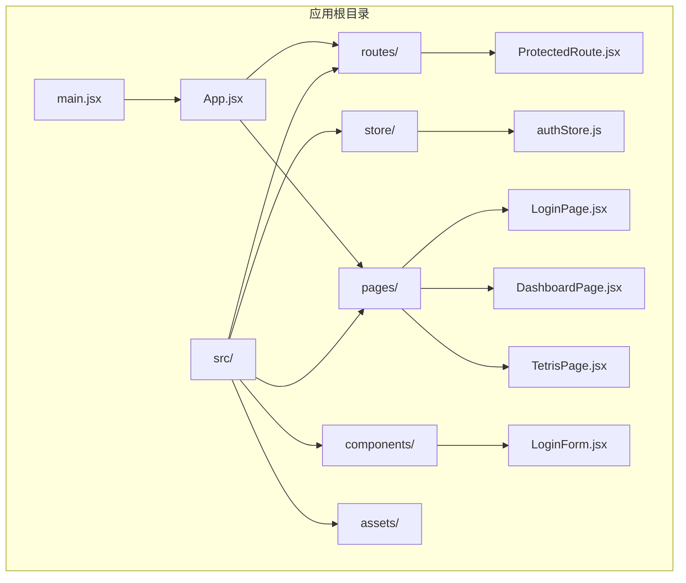
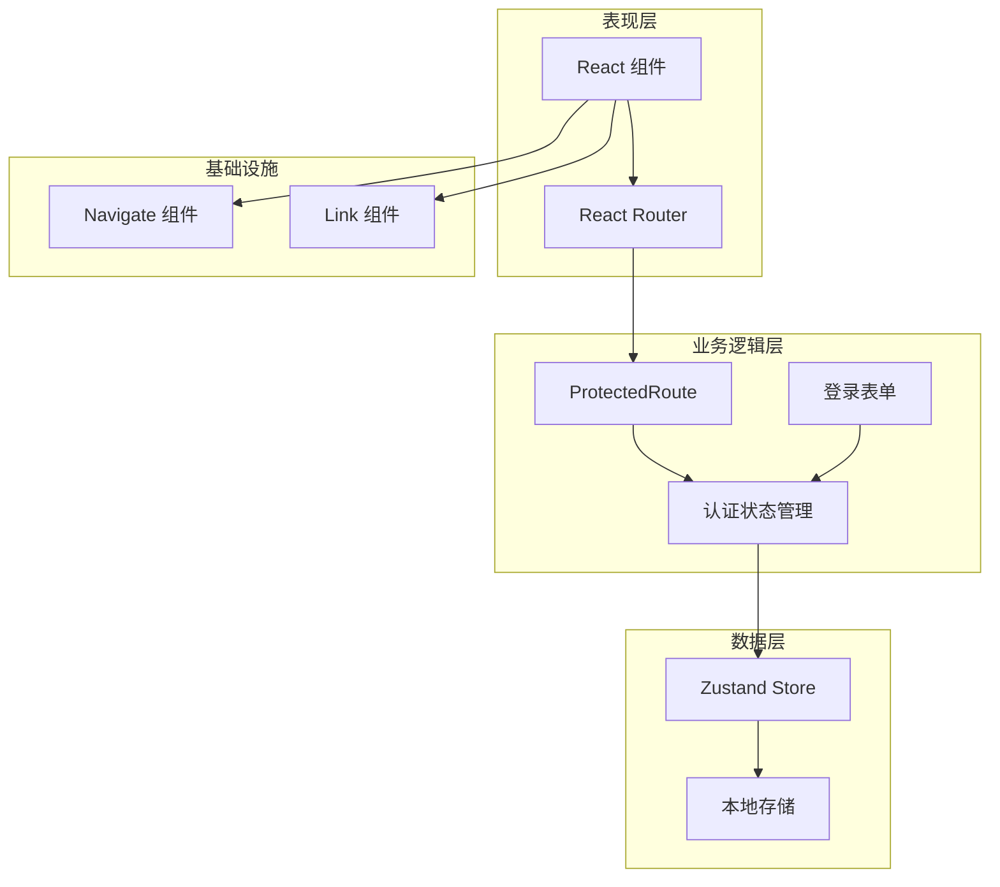
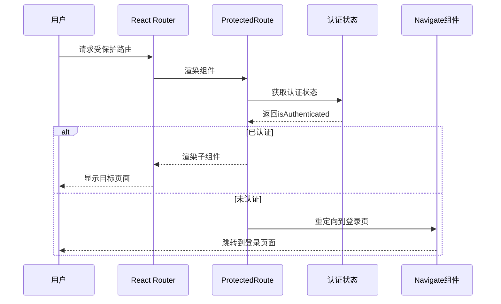
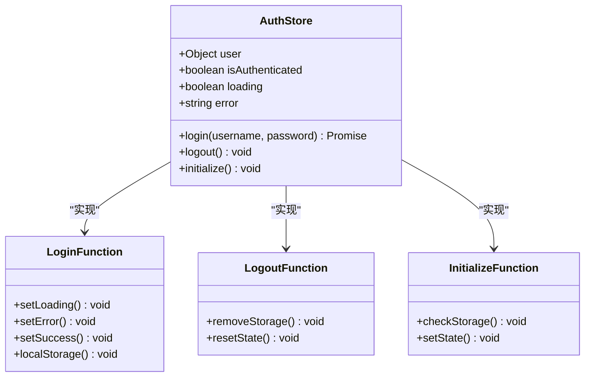
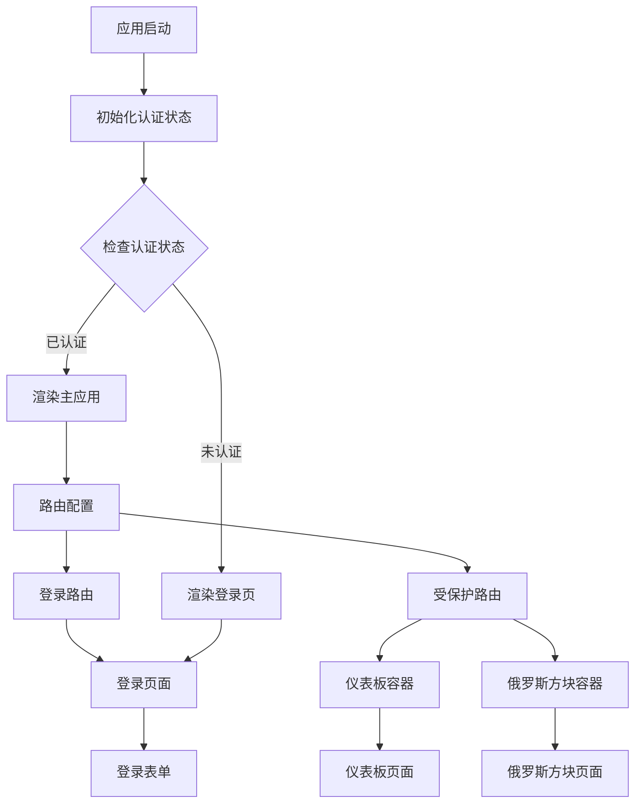
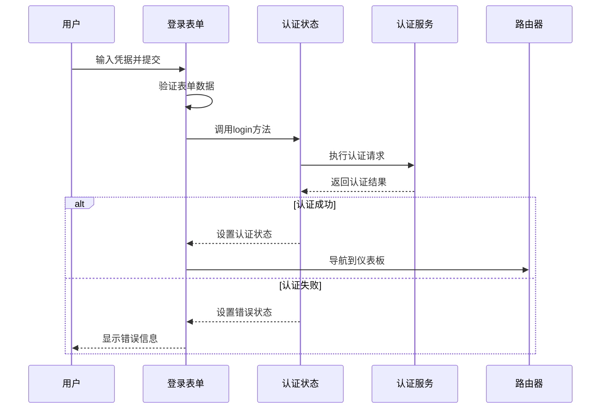
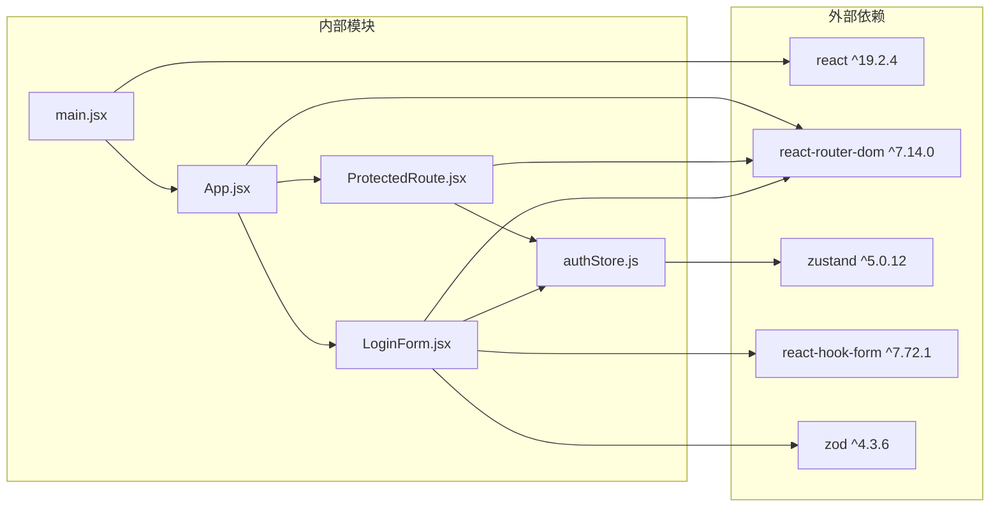

# 路由保护机制

<cite>
**本文档引用的文件**
- [ProtectedRoute.jsx](file://src/routes/ProtectedRoute.jsx)
- [authStore.js](file://src/store/authStore.js)
- [App.jsx](file://src/App.jsx)
- [main.jsx](file://src/main.jsx)
- [LoginPage.jsx](file://src/pages/LoginPage.jsx)
- [DashboardPage.jsx](file://src/pages/DashboardPage.jsx)
- [TetrisPage.jsx](file://src/pages/TetrisPage.jsx)
- [LoginForm.jsx](file://src/components/LoginForm.jsx)
- [index.css](file://src/index.css)
- [package.json](file://package.json)
</cite>

## 目录
1. [简介](#简介)
2. [项目结构](#项目结构)
3. [核心组件](#核心组件)
4. [架构概览](#架构概览)
5. [详细组件分析](#详细组件分析)
6. [依赖关系分析](#依赖关系分析)
7. [性能考虑](#性能考虑)
8. [故障排除指南](#故障排除指南)
9. [结论](#结论)

## 简介

本项目实现了一个基于React Router的路由保护机制，通过高阶组件（Higher-Order Component）模式构建了可复用的ProtectedRoute组件，为受限制的页面资源提供安全保障。该机制采用状态管理驱动的认证检查，结合React Router的导航控制，实现了完整的用户身份验证和授权流程。

系统的核心设计目标是：
- 提供统一的路由访问控制
- 支持条件渲染和自动重定向
- 实现状态驱动的认证检查
- 保证用户体验的流畅性
- 具备良好的扩展性和维护性

## 项目结构

该项目采用功能模块化的组织方式，主要目录结构如下：

**图表来源**
- [main.jsx:1-11](file://src/main.jsx#L1-L11)
- [App.jsx:1-44](file://src/App.jsx#L1-L44)

**章节来源**
- [main.jsx:1-11](file://src/main.jsx#L1-L11)
- [App.jsx:1-44](file://src/App.jsx#L1-L44)

## 核心组件

### ProtectedRoute 高阶组件

ProtectedRoute是整个路由保护机制的核心组件，采用函数式组件的形式实现，具有以下特点：

- **单一职责原则**：专门负责路由访问控制
- **无副作用设计**：不直接渲染UI元素，仅进行逻辑判断
- **条件渲染机制**：根据认证状态决定是否渲染子组件
- **自动重定向功能**：未认证用户自动跳转到登录页

该组件通过解构赋值接收children参数，利用useAuthStore钩子获取认证状态，实现简洁而高效的路由保护逻辑。

**章节来源**
- [ProtectedRoute.jsx:1-15](file://src/routes/ProtectedRoute.jsx#L1-L15)

### 认证状态管理

系统使用Zustand作为状态管理解决方案，提供了完整的认证生命周期管理：

- **状态结构**：包含用户信息、认证状态、加载状态和错误信息
- **异步登录流程**：模拟API调用，支持Promise返回
- **本地存储集成**：持久化用户会话信息
- **初始化机制**：应用启动时自动检查存储的用户信息

**章节来源**
- [authStore.js:1-44](file://src/store/authStore.js#L1-L44)

## 架构概览

系统采用分层架构设计，各层职责明确，耦合度低：

**图表来源**
- [App.jsx:17-41](file://src/App.jsx#L17-L41)
- [ProtectedRoute.jsx:4-12](file://src/routes/ProtectedRoute.jsx#L4-L12)
- [authStore.js:34-40](file://src/store/authStore.js#L34-L40)

## 详细组件分析

### ProtectedRoute 组件深度解析

ProtectedRoute组件实现了经典的高阶组件模式，其工作流程如下：

**图表来源**
- [ProtectedRoute.jsx:4-12](file://src/routes/ProtectedRoute.jsx#L4-L12)
- [App.jsx:21-37](file://src/App.jsx#L21-L37)

#### 实现细节分析

组件的核心逻辑基于三元运算符的条件判断：
- **认证检查**：通过useAuthStore()钩子获取isAuthenticated状态
- **重定向机制**：使用Navigate组件进行程序化导航
- **状态传递**：将子组件作为children参数传递给父级路由

这种设计确保了组件的纯函数特性，避免了不必要的重新渲染。

**章节来源**
- [ProtectedRoute.jsx:1-15](file://src/routes/ProtectedRoute.jsx#L1-L15)

### 认证状态管理器

authStore使用Zustand的create函数创建，具有以下设计特点：

**图表来源**
- [authStore.js:3-41](file://src/store/authStore.js#L3-L41)

#### 状态管理模式

系统采用集中式状态管理，所有认证相关的状态都存储在单一的store实例中：

- **用户状态**：包含用户名、显示名称等用户信息
- **认证标志**：布尔值表示当前用户的认证状态
- **加载状态**：指示异步操作的执行状态
- **错误信息**：存储认证过程中的错误详情

**章节来源**
- [authStore.js:1-44](file://src/store/authStore.js#L1-L44)

### 路由配置与集成

App组件负责整个应用的路由配置，采用了嵌套路由的设计模式：

**图表来源**
- [App.jsx:10-41](file://src/App.jsx#L10-L41)

#### 嵌套路由保护

系统通过在受保护路由上包裹ProtectedRoute组件实现嵌套保护：

- **仪表板路由**：`/dashboard`路径下的所有子路由都会受到保护
- **游戏路由**：`/tetris`路径下的所有子路由都会受到保护
- **条件渲染**：只有在认证状态下才会渲染对应的页面组件

**章节来源**
- [App.jsx:17-41](file://src/App.jsx#L17-L41)

### 登录流程组件

LoginForm组件集成了表单验证和提交逻辑，提供了完整的用户认证入口：

**图表来源**
- [LoginForm.jsx:24-29](file://src/components/LoginForm.jsx#L24-L29)
- [authStore.js:9-27](file://src/store/authStore.js#L9-L27)

#### 表单验证与错误处理

系统使用React Hook Form配合Zod进行表单验证：

- **字段验证**：用户名必填，密码至少6位字符
- **实时反馈**：输入时即时显示验证结果
- **错误展示**：清晰的错误消息提示
- **防重复提交**：加载状态下禁用提交按钮

**章节来源**
- [LoginForm.jsx:1-78](file://src/components/LoginForm.jsx#L1-L78)

## 依赖关系分析

系统依赖关系清晰，遵循单一职责原则：

**图表来源**
- [package.json:12-20](file://package.json#L12-L20)
- [main.jsx:1-11](file://src/main.jsx#L1-L11)

### 外部依赖分析

系统选择了轻量级且功能完备的依赖组合：

- **React 19**：提供最新的React特性支持
- **React Router 7**：支持最新的路由功能和性能优化
- **Zustand 5**：轻量级状态管理，无样板代码
- **React Hook Form**：高性能表单处理库
- **Zod**：类型安全的验证库

这些依赖的选择体现了现代React开发的最佳实践，平衡了功能性和性能。

**章节来源**
- [package.json:12-20](file://package.json#L12-L20)

## 性能考虑

### 渲染优化策略

系统采用了多种性能优化措施：

- **状态选择性订阅**：使用Zustand的状态选择器避免不必要的重渲染
- **组件懒加载**：大型页面组件按需加载
- **内存管理**：及时清理事件监听器和定时器
- **CSS优化**：使用CSS变量减少样式计算开销

### 认证状态缓存

系统实现了智能的认证状态缓存机制：

- **本地存储同步**：应用启动时自动恢复认证状态
- **状态持久化**：用户会话信息持久保存在localStorage中
- **快速初始化**：避免重复的认证检查请求

**章节来源**
- [authStore.js:34-40](file://src/store/authStore.js#L34-L40)

## 故障排除指南

### 常见问题诊断

#### 认证状态异常

**症状**：用户已登录但仍然被重定向到登录页

**排查步骤**：
1. 检查localStorage中是否存在用户信息
2. 验证认证状态的正确设置
3. 确认ProtectedRoute组件的渲染逻辑

**解决方案**：
- 清除localStorage中的用户数据
- 重新初始化认证状态
- 检查网络连接和API可用性

#### 路由重定向循环

**症状**：页面在登录页和目标页面之间无限循环

**排查步骤**：
1. 检查路由配置中的重定向逻辑
2. 验证ProtectedRoute组件的条件判断
3. 确认路由层级的正确嵌套

**解决方案**：
- 简化路由配置结构
- 添加路由状态检查
- 使用更精确的重定向条件

#### 表单验证错误

**症状**：表单提交时出现验证错误

**排查步骤**：
1. 检查Zod验证规则的定义
2. 验证React Hook Form的配置
3. 确认错误消息的显示逻辑

**解决方案**：
- 调整验证规则的严格程度
- 优化错误消息的用户体验
- 添加自定义验证器

**章节来源**
- [LoginForm.jsx:12-29](file://src/components/LoginForm.jsx#L12-L29)
- [ProtectedRoute.jsx:7-8](file://src/routes/ProtectedRoute.jsx#L7-L8)

## 结论

本项目的路由保护机制展现了现代React应用开发的最佳实践：

### 设计优势

- **简洁高效**：通过高阶组件模式实现了最小化的代码复杂度
- **可扩展性强**：模块化设计便于功能扩展和维护
- **用户体验优秀**：流畅的认证流程和直观的错误提示
- **性能表现良好**：合理的状态管理和渲染优化策略

### 技术亮点

- **状态驱动的认证**：基于Zustand的状态管理提供了可靠的认证状态
- **条件渲染机制**：灵活的路由保护和页面渲染控制
- **表单验证集成**：完整的前端验证和错误处理机制
- **嵌套路由支持**：完善的多层级路由保护方案

### 改进建议

虽然系统已经具备了完整的功能，但仍有一些可以改进的地方：

- **动态权限检查**：可以扩展权限级别和角色管理
- **错误边界处理**：添加全局错误边界组件提高稳定性
- **性能监控**：集成性能监控工具跟踪应用表现
- **安全增强**：添加CSRF保护和XSS防护机制

该路由保护机制为React应用提供了坚实的安全基础，通过合理的设计和实现，确保了用户数据的安全性和应用的可靠性。