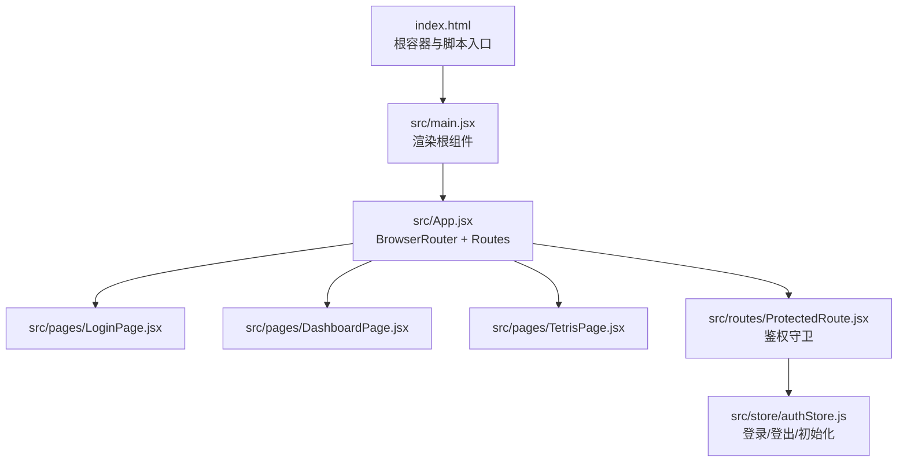
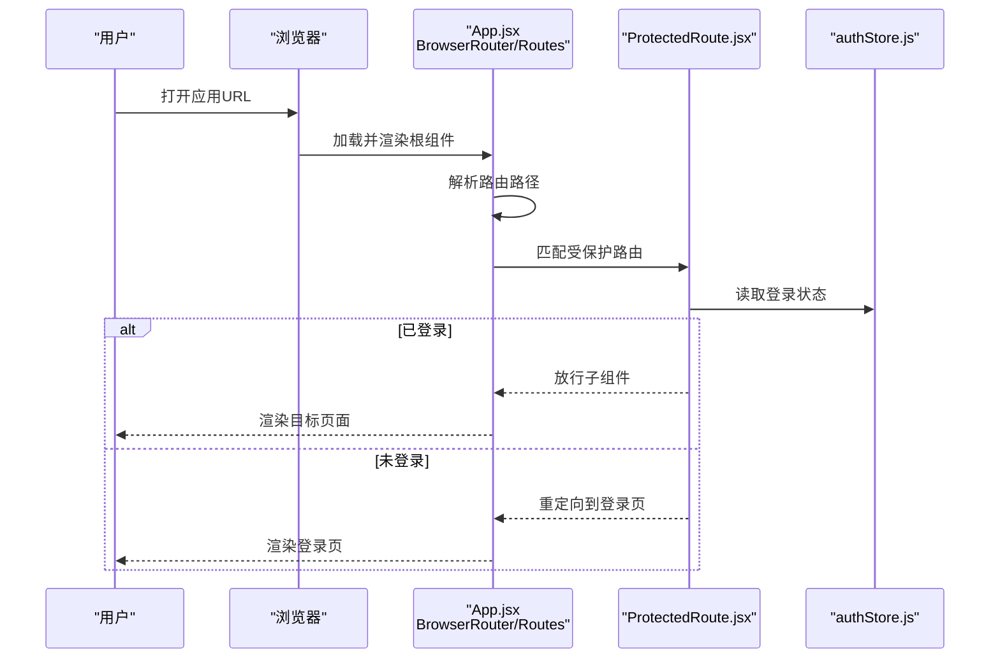
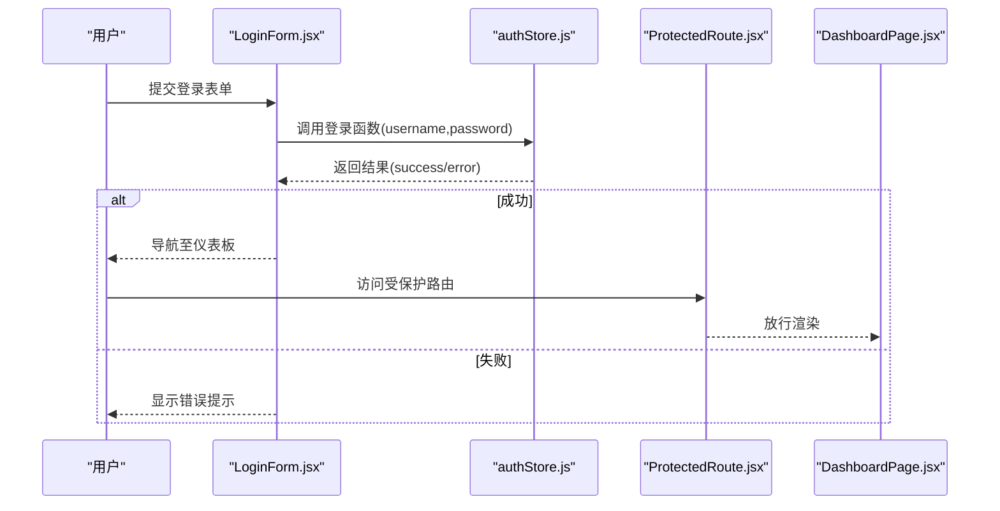
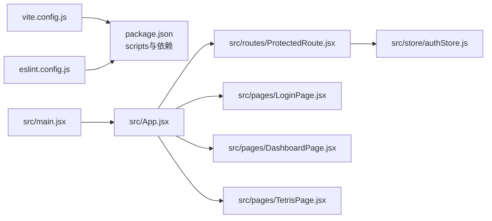

# 部署指南

<cite>
**本文引用的文件**
- [package.json](file://package.json)
- [vite.config.js](file://vite.config.js)
- [index.html](file://index.html)
- [README.md](file://README.md)
- [eslint.config.js](file://eslint.config.js)
- [.gitignore](file://.gitignore)
- [src/main.jsx](file://src/main.jsx)
- [src/App.jsx](file://src/App.jsx)
- [src/store/authStore.js](file://src/store/authStore.js)
- [src/routes/ProtectedRoute.jsx](file://src/routes/ProtectedRoute.jsx)
- [src/pages/LoginPage.jsx](file://src/pages/LoginPage.jsx)
- [src/pages/DashboardPage.jsx](file://src/pages/DashboardPage.jsx)
- [src/components/LoginForm.jsx](file://src/components/LoginForm.jsx)
- [src/pages/TetrisPage.jsx](file://src/pages/TetrisPage.jsx)
</cite>

## 目录
1. [简介](#简介)
2. [项目结构](#项目结构)
3. [核心组件](#核心组件)
4. [架构总览](#架构总览)
5. [详细组件分析](#详细组件分析)
6. [依赖分析](#依赖分析)
7. [性能考虑](#性能考虑)
8. [故障排查指南](#故障排查指南)
9. [结论](#结论)
10. [附录](#附录)

## 简介
本指南面向React登录应用的部署与运维，覆盖Vite构建配置对不同部署环境的影响、静态资源处理与CDN集成、主流平台（GitHub Pages、Netlify、Vercel）的部署步骤与配置要点、环境变量与API端点管理、域名绑定、性能优化与缓存策略、安全配置、监控与日志、回滚与故障恢复、以及CI/CD流水线集成与自动化部署。

## 项目结构
该应用采用Vite + React单页应用（SPA）架构，前端路由基于浏览器历史模式，使用本地存储进行认证状态持久化。核心入口为HTML模板中的挂载节点与JS入口文件，路由在应用顶层集中定义，受保护路由通过状态管理控制访问。

图表来源
- [index.html:1-14](file://index.html#L1-L14)
- [src/main.jsx:1-11](file://src/main.jsx#L1-L11)
- [src/App.jsx:1-44](file://src/App.jsx#L1-L44)
- [src/routes/ProtectedRoute.jsx:1-15](file://src/routes/ProtectedRoute.jsx#L1-L15)
- [src/store/authStore.js:1-44](file://src/store/authStore.js#L1-L44)

章节来源
- [index.html:1-14](file://index.html#L1-L14)
- [src/main.jsx:1-11](file://src/main.jsx#L1-L11)
- [src/App.jsx:1-44](file://src/App.jsx#L1-L44)

## 核心组件
- 构建与开发工具链
  - 使用Vite作为构建与开发服务器，提供快速热更新与打包能力。
  - ESLint配置启用React Hooks与React Refresh规则，确保开发体验与代码质量。
- 应用入口与路由
  - HTML模板定义根容器与模块入口脚本；JS入口负责渲染根组件。
  - App组件集中声明路由与重定向逻辑，受保护路由通过状态管理判断是否放行。
- 认证与状态管理
  - 使用轻量状态库进行登录、登出与初始化；登录成功后写入本地存储，刷新后自动恢复登录态。
- 页面与表单
  - 登录页包含登录表单，表单使用校验器进行输入约束；仪表板展示用户信息与导航至小游戏页面；小游戏页面为独立功能页面，提供返回导航。

章节来源
- [package.json:1-33](file://package.json#L1-L33)
- [vite.config.js:1-8](file://vite.config.js#L1-L8)
- [eslint.config.js:1-30](file://eslint.config.js#L1-L30)
- [src/main.jsx:1-11](file://src/main.jsx#L1-L11)
- [src/App.jsx:1-44](file://src/App.jsx#L1-L44)
- [src/store/authStore.js:1-44](file://src/store/authStore.js#L1-L44)
- [src/routes/ProtectedRoute.jsx:1-15](file://src/routes/ProtectedRoute.jsx#L1-L15)
- [src/pages/LoginPage.jsx:1-18](file://src/pages/LoginPage.jsx#L1-L18)
- [src/pages/DashboardPage.jsx:1-57](file://src/pages/DashboardPage.jsx#L1-L57)
- [src/components/LoginForm.jsx:1-78](file://src/components/LoginForm.jsx#L1-L78)
- [src/pages/TetrisPage.jsx:1-413](file://src/pages/TetrisPage.jsx#L1-L413)

## 架构总览
以下序列图展示从用户访问到页面渲染、路由匹配与受保护路由拦截的关键流程。

图表来源
- [src/App.jsx:1-44](file://src/App.jsx#L1-L44)
- [src/routes/ProtectedRoute.jsx:1-15](file://src/routes/ProtectedRoute.jsx#L1-L15)
- [src/store/authStore.js:1-44](file://src/store/authStore.js#L1-L44)

## 详细组件分析

### Vite构建配置与部署影响
- 基础配置
  - 默认插件启用React相关支持，满足开发与生产构建需求。
- SPA路由与基础路径
  - 浏览器历史模式需要服务器正确处理回退到index.html，避免刷新后404。
  - 生产构建输出静态资源，需配合CDN与缓存策略。
- 环境变量
  - Vite默认支持以VITE_前缀的环境变量注入到客户端代码。
- 性能与产物
  - 生产构建会进行代码分割、压缩与资源哈希命名，利于缓存与CDN分发。

章节来源
- [vite.config.js:1-8](file://vite.config.js#L1-L8)
- [package.json:1-33](file://package.json#L1-L33)

### 登录流程与受保护路由
- 登录流程
  - 表单提交触发状态管理登录函数，模拟异步验证成功后写入本地存储并切换登录态。
- 受保护路由
  - 未登录用户被重定向至登录页；已登录则放行至目标页面。

图表来源
- [src/components/LoginForm.jsx:1-78](file://src/components/LoginForm.jsx#L1-L78)
- [src/store/authStore.js:1-44](file://src/store/authStore.js#L1-L44)
- [src/routes/ProtectedRoute.jsx:1-15](file://src/routes/ProtectedRoute.jsx#L1-L15)
- [src/pages/DashboardPage.jsx:1-57](file://src/pages/DashboardPage.jsx#L1-L57)

章节来源
- [src/components/LoginForm.jsx:1-78](file://src/components/LoginForm.jsx#L1-L78)
- [src/store/authStore.js:1-44](file://src/store/authStore.js#L1-L44)
- [src/routes/ProtectedRoute.jsx:1-15](file://src/routes/ProtectedRoute.jsx#L1-L15)
- [src/pages/DashboardPage.jsx:1-57](file://src/pages/DashboardPage.jsx#L1-L57)

### 游戏页面与路由关系
- 游戏页面为独立功能页面，提供返回导航至仪表板。
- 与受保护路由机制一致，仅在登录状态下可访问。

章节来源
- [src/pages/TetrisPage.jsx:1-413](file://src/pages/TetrisPage.jsx#L1-L413)

### 静态资源处理与CDN集成
- 构建产物
  - 生产构建生成静态资源目录，包含带哈希的JS/CSS与媒体文件。
- CDN集成
  - 将静态资源托管至CDN，结合长期缓存与按需失效策略提升加载速度。
- 资源优化
  - 合理拆分代码，减少首屏体积；对不常变更的第三方库进行外部化（externals）以利用CDN缓存。

章节来源
- [package.json:1-33](file://package.json#L1-L33)

### 环境变量与API端点配置
- 客户端环境变量
  - 使用VITE_前缀的变量注入到客户端代码，如API基础地址、特性开关等。
- 服务端API
  - 在登录与业务请求中使用上述变量指向后端接口，确保开发/预发/线上环境隔离。
- 安全注意
  - 避免在客户端暴露敏感密钥；认证令牌建议通过安全的HttpOnly Cookie传递（若后端支持）。

章节来源
- [vite.config.js:1-8](file://vite.config.js#L1-L8)
- [src/components/LoginForm.jsx:1-78](file://src/components/LoginForm.jsx#L1-L78)

### 域名绑定与HTTPS
- 自定义域名
  - 在部署平台配置CNAME或自定义域，确保SSL证书生效。
- HTTPS强制
  - 平台通常提供自动HTTPS；如需更严格的安全策略，可在平台或CDN侧启用HSTS。

章节来源
- [README.md:1-17](file://README.md#L1-L17)

## 依赖分析
- 构建与开发
  - Vite提供开发服务器与生产打包；ESLint保障代码规范。
- 运行时依赖
  - React生态组件与路由、状态管理库构成运行时核心。
- 关键耦合点
  - App路由与受保护路由存在对状态管理的依赖；登录成功与否直接影响路由行为。

图表来源
- [vite.config.js:1-8](file://vite.config.js#L1-L8)
- [package.json:1-33](file://package.json#L1-L33)
- [eslint.config.js:1-30](file://eslint.config.js#L1-L30)
- [src/main.jsx:1-11](file://src/main.jsx#L1-L11)
- [src/App.jsx:1-44](file://src/App.jsx#L1-L44)
- [src/routes/ProtectedRoute.jsx:1-15](file://src/routes/ProtectedRoute.jsx#L1-L15)
- [src/store/authStore.js:1-44](file://src/store/authStore.js#L1-L44)
- [src/pages/LoginPage.jsx:1-18](file://src/pages/LoginPage.jsx#L1-L18)
- [src/pages/DashboardPage.jsx:1-57](file://src/pages/DashboardPage.jsx#L1-L57)
- [src/pages/TetrisPage.jsx:1-413](file://src/pages/TetrisPage.jsx#L1-L413)

章节来源
- [package.json:1-33](file://package.json#L1-L33)
- [eslint.config.js:1-30](file://eslint.config.js#L1-L30)
- [src/App.jsx:1-44](file://src/App.jsx#L1-L44)

## 性能考虑
- 代码分割与懒加载
  - 对非首屏页面（如游戏页）采用动态导入，降低首屏体积。
- 缓存策略
  - 静态资源启用长期缓存；通过文件哈希命名实现版本化失效。
- 资源压缩与合并
  - 生产构建自动进行压缩与最小化；CDN可进一步开启Gzip/Brotli。
- 首屏优化
  - 关键CSS内联，非关键CSS延迟加载；图片懒加载与响应式尺寸。
- 浏览器历史模式
  - 服务器需正确处理SPA回退，避免不必要的重定向与404。

章节来源
- [package.json:1-33](file://package.json#L1-L33)
- [vite.config.js:1-8](file://vite.config.js#L1-L8)

## 故障排查指南
- 构建问题
  - 确认构建脚本与依赖安装正常；查看构建日志定位具体报错。
- 开发与预览
  - 使用开发服务器与预览命令验证本地运行；确认端口占用与网络可达性。
- 路由与刷新
  - 若出现刷新后空白页，检查服务器对SPA回退的处理配置。
- 环境变量
  - 确保以VITE_前缀定义变量并在客户端读取；区分开发与生产环境变量文件。
- 认证状态
  - 检查本地存储中用户数据格式与有效期；必要时清理缓存后重试。

章节来源
- [package.json:1-33](file://package.json#L1-L33)
- [README.md:1-17](file://README.md#L1-L17)
- [.gitignore:1-25](file://.gitignore#L1-L25)
- [src/store/authStore.js:1-44](file://src/store/authStore.js#L1-L44)

## 结论
本指南提供了从构建配置到多平台部署、从性能优化到安全与运维的完整实践路径。建议在生产环境中结合CDN与缓存策略、严格的HTTPS与安全头配置、完善的监控与日志体系，以及标准化的CI/CD流水线，确保应用稳定、安全、可维护地交付给用户。

## 附录

### 平台部署步骤与配置要点

- GitHub Pages
  - 仓库设置：启用Pages功能，选择分支与根目录发布。
  - 基础路径：若部署在子路径，需在构建配置中设置基础路径，确保静态资源引用正确。
  - 回退处理：配置404回退到index.html，保证SPA路由正常工作。
  - 参考来源
    - [index.html:1-14](file://index.html#L1-L14)
    - [vite.config.js:1-8](file://vite.config.js#L1-L8)

- Netlify
  - 构建命令与发布目录：设置构建命令与输出目录，确保构建产物正确上传。
  - 净化规则：在站点设置中添加SPA回退规则，将未匹配路径回退到index.html。
  - 环境变量：在仪表板中配置VITE_前缀的环境变量，区分环境。
  - 参考来源
    - [package.json:1-33](file://package.json#L1-L33)
    - [vite.config.js:1-8](file://vite.config.js#L1-L8)

- Vercel
  - 配置：选择框架检测或手动配置构建命令与输出目录。
  - ISR/边缘：可利用边缘计算与增量静态再生（如适用）提升性能。
  - 环境变量：在项目设置中配置环境变量，支持按域名或路径分组。
  - 参考来源
    - [package.json:1-33](file://package.json#L1-L33)
    - [vite.config.js:1-8](file://vite.config.js#L1-L8)

### CI/CD流水线与自动化部署
- 触发条件
  - 主分支推送、标签创建或Pull Request合并触发流水线。
- 步骤建议
  - 代码检出 → 依赖安装 → Lint与测试 → 构建 → 产物上传/部署 → 健康检查 → 回滚保护。
- 回滚策略
  - 保留最近N个版本；失败自动回滚至上一个稳定版本；支持蓝绿/金丝雀发布。
- 监控与日志
  - 集成平台日志与指标；设置告警阈值；记录关键事件（登录、路由跳转、错误）。
- 参考来源
  - [package.json:1-33](file://package.json#L1-L33)
  - [eslint.config.js:1-30](file://eslint.config.js#L1-L30)