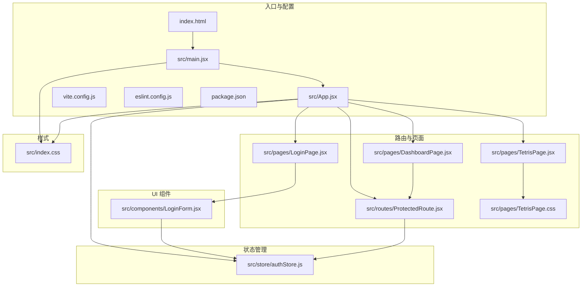
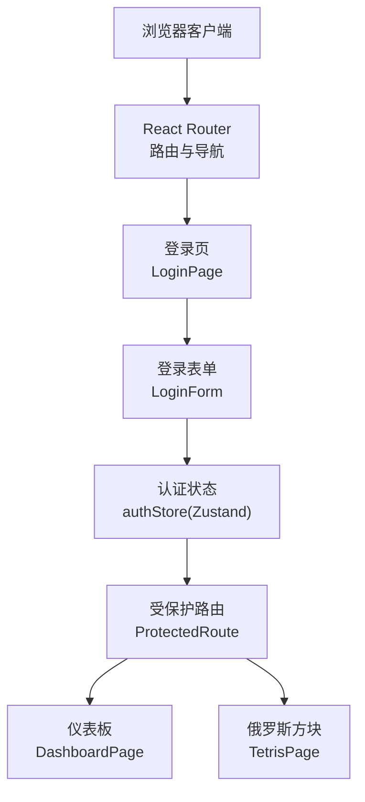
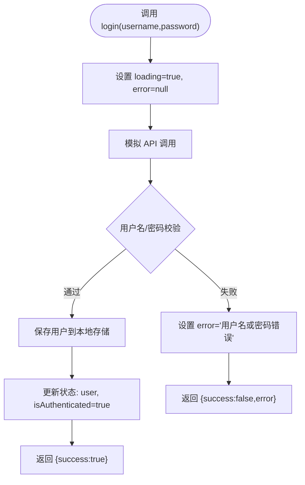
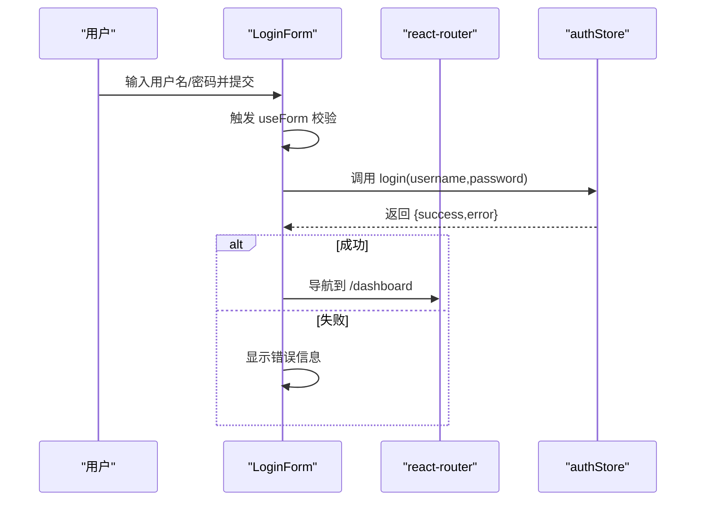
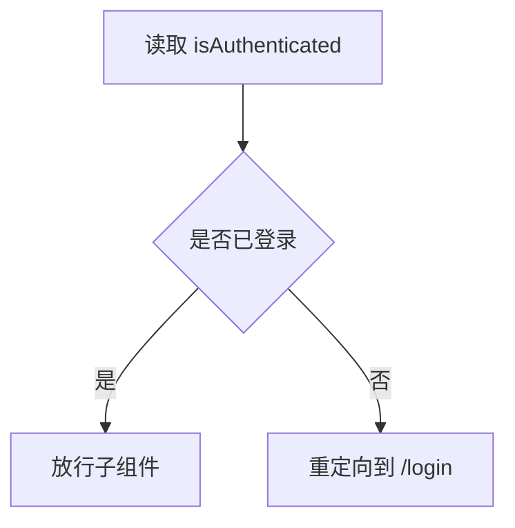
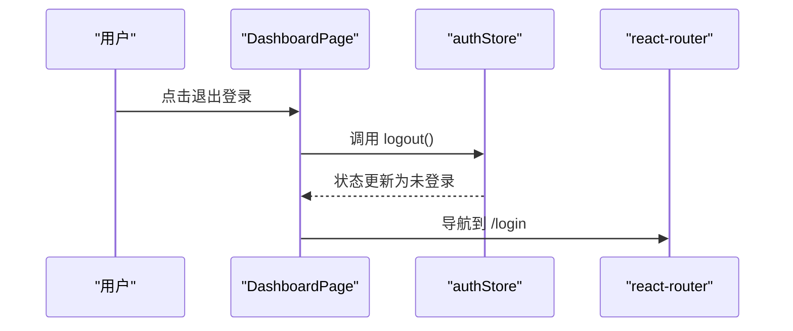
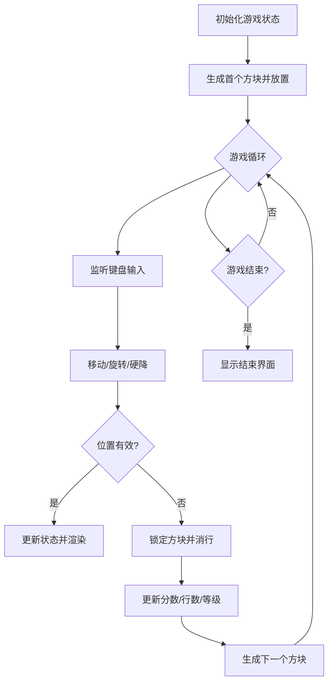
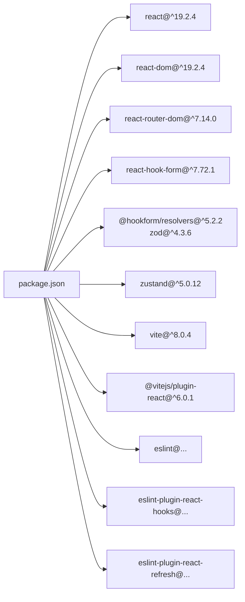

# 项目概述

<cite>
**本文档引用的文件**
- [README.md](file://README.md)
- [package.json](file://package.json)
- [vite.config.js](file://vite.config.js)
- [eslint.config.js](file://eslint.config.js)
- [index.html](file://index.html)
- [src/main.jsx](file://src/main.jsx)
- [src/App.jsx](file://src/App.jsx)
- [src/store/authStore.js](file://src/store/authStore.js)
- [src/components/LoginForm.jsx](file://src/components/LoginForm.jsx)
- [src/pages/LoginPage.jsx](file://src/pages/LoginPage.jsx)
- [src/pages/DashboardPage.jsx](file://src/pages/DashboardPage.jsx)
- [src/pages/TetrisPage.jsx](file://src/pages/TetrisPage.jsx)
- [src/pages/TetrisPage.css](file://src/pages/TetrisPage.css)
- [src/routes/ProtectedRoute.jsx](file://src/routes/ProtectedRoute.jsx)
- [src/index.css](file://src/index.css)
- [react-login-app.md](file://react-login-app.md)
</cite>

## 目录
1. [引言](#引言)
2. [项目结构](#项目结构)
3. [核心组件](#核心组件)
4. [架构总览](#架构总览)
5. [详细组件分析](#详细组件分析)
6. [依赖分析](#依赖分析)
7. [性能考虑](#性能考虑)
8. [故障排除指南](#故障排除指南)
9. [结论](#结论)
10. [附录](#附录)

## 引言
本项目是一个基于 React 19 的登录应用，集成了用户认证系统、受保护的仪表板展示以及俄罗斯方块小游戏功能。项目采用 Vite 作为构建工具与开发服务器，使用 Zustand 进行轻量级状态管理，结合 React Router 实现路由控制与权限保护。通过该应用，用户可以完成登录、查看个人仪表板、进行实时游戏，并在不同页面间安全跳转。

项目设计理念强调：
- 清晰的职责分离：路由、页面、组件、状态管理各司其职
- 易用的用户体验：简洁的登录流程、直观的仪表板与可玩的游戏
- 可扩展性：模块化的文件组织与可插拔的状态管理方案

## 项目结构
项目采用按功能分层的组织方式，核心目录与职责如下：
- public：静态资源
- src/assets：静态资源（如图片）
- src/components：可复用的 UI 组件（如登录表单）
- src/pages：页面级组件（登录页、仪表板、俄罗斯方块页）
- src/routes：路由守卫（受保护路由）
- src/store：全局状态管理（Zustand）
- 根目录配置：Vite、ESLint、包管理等

**图表来源**
- [src/main.jsx:1-11](file://src/main.jsx#L1-L11)
- [src/App.jsx:1-44](file://src/App.jsx#L1-L44)
- [src/store/authStore.js:1-44](file://src/store/authStore.js#L1-L44)
- [src/components/LoginForm.jsx:1-78](file://src/components/LoginForm.jsx#L1-L78)
- [src/pages/LoginPage.jsx:1-18](file://src/pages/LoginPage.jsx#L1-L18)
- [src/pages/DashboardPage.jsx:1-57](file://src/pages/DashboardPage.jsx#L1-L57)
- [src/pages/TetrisPage.jsx:1-413](file://src/pages/TetrisPage.jsx#L1-L413)
- [src/pages/TetrisPage.css:1-293](file://src/pages/TetrisPage.css#L1-L293)
- [src/routes/ProtectedRoute.jsx:1-15](file://src/routes/ProtectedRoute.jsx#L1-L15)
- [src/index.css:1-261](file://src/index.css#L1-L261)

**章节来源**
- [react-login-app.md:15-35](file://react-login-app.md#L15-L35)
- [package.json:1-33](file://package.json#L1-L33)

## 核心组件
- 认证状态管理（Zustand）：负责用户登录态、加载状态、错误信息与持久化
- 登录表单（React Hook Form + Zod）：提供输入校验、错误提示与提交处理
- 受保护路由：根据登录状态决定是否放行
- 页面组件：登录页、仪表板、俄罗斯方块页
- 构建与开发工具：Vite、ESLint

**章节来源**
- [src/store/authStore.js:1-44](file://src/store/authStore.js#L1-L44)
- [src/components/LoginForm.jsx:1-78](file://src/components/LoginForm.jsx#L1-L78)
- [src/routes/ProtectedRoute.jsx:1-15](file://src/routes/ProtectedRoute.jsx#L1-L15)
- [src/pages/LoginPage.jsx:1-18](file://src/pages/LoginPage.jsx#L1-L18)
- [src/pages/DashboardPage.jsx:1-57](file://src/pages/DashboardPage.jsx#L1-L57)
- [src/pages/TetrisPage.jsx:1-413](file://src/pages/TetrisPage.jsx#L1-L413)

## 架构总览
应用采用“入口 -> 路由 -> 页面/组件 -> 状态管理”的层次化架构。登录流程通过表单校验与状态管理完成；受保护路由确保未登录用户无法直接访问仪表板与游戏页面；俄罗斯方块作为独立页面，拥有自洽的游戏逻辑与渲染。

**图表来源**
- [src/App.jsx:17-39](file://src/App.jsx#L17-L39)
- [src/routes/ProtectedRoute.jsx:4-12](file://src/routes/ProtectedRoute.jsx#L4-L12)
- [src/components/LoginForm.jsx:24-29](file://src/components/LoginForm.jsx#L24-L29)
- [src/store/authStore.js:9-32](file://src/store/authStore.js#L9-L32)
- [src/pages/DashboardPage.jsx:8-11](file://src/pages/DashboardPage.jsx#L8-L11)
- [src/pages/TetrisPage.jsx:216-238](file://src/pages/TetrisPage.jsx#L216-L238)

## 详细组件分析

### 认证状态管理（Zustand）
- 状态字段：用户信息、登录态、加载状态、错误信息
- 核心动作：登录（异步）、登出、初始化（从本地存储恢复）
- 数据持久化：登录成功后写入本地存储，初始化时读取

**图表来源**
- [src/store/authStore.js:9-32](file://src/store/authStore.js#L9-L32)

**章节来源**
- [src/store/authStore.js:1-44](file://src/store/authStore.js#L1-L44)

### 登录表单（React Hook Form + Zod）
- 输入校验：用户名必填、密码最少 6 位
- 表单行为：提交时触发登录动作，成功则跳转到仪表板
- 错误提示：显示字段级与全局错误信息

**图表来源**
- [src/components/LoginForm.jsx:16-29](file://src/components/LoginForm.jsx#L16-L29)
- [src/store/authStore.js:9-32](file://src/store/authStore.js#L9-L32)

**章节来源**
- [src/components/LoginForm.jsx:1-78](file://src/components/LoginForm.jsx#L1-L78)

### 受保护路由（ProtectedRoute）
- 逻辑：若未登录则重定向至登录页；否则放行子组件
- 依赖：从 authStore 读取登录态

**图表来源**
- [src/routes/ProtectedRoute.jsx:4-12](file://src/routes/ProtectedRoute.jsx#L4-L12)
- [src/store/authStore.js:4-5](file://src/store/authStore.js#L4-L5)

**章节来源**
- [src/routes/ProtectedRoute.jsx:1-15](file://src/routes/ProtectedRoute.jsx#L1-L15)

### 仪表板页面（DashboardPage）
- 展示用户信息与统计卡片
- 提供退出登录与跳转到俄罗斯方块的功能入口

**图表来源**
- [src/pages/DashboardPage.jsx:8-11](file://src/pages/DashboardPage.jsx#L8-L11)
- [src/store/authStore.js:29-32](file://src/store/authStore.js#L29-L32)

**章节来源**
- [src/pages/DashboardPage.jsx:1-57](file://src/pages/DashboardPage.jsx#L1-L57)

### 俄罗斯方块页面（TetrisPage）
- 游戏逻辑：棋盘、方块生成、碰撞检测、旋转、消行计分、等级提升
- 控制方式：键盘方向键移动/旋转、空格硬降、P 暂停
- 渲染：网格布局、下一个方块预览、分数/行数/等级显示

**图表来源**
- [src/pages/TetrisPage.jsx:63-238](file://src/pages/TetrisPage.jsx#L63-L238)
- [src/pages/TetrisPage.jsx:240-268](file://src/pages/TetrisPage.jsx#L240-L268)

**章节来源**
- [src/pages/TetrisPage.jsx:1-413](file://src/pages/TetrisPage.jsx#L1-L413)

## 依赖分析
- 运行时依赖
  - React 19 与 React DOM：核心框架
  - react-router-dom：路由与导航
  - react-hook-form + @hookform/resolvers + zod：表单校验与解析
  - zustand：轻量级状态管理
- 开发依赖
  - vite：构建与开发服务器
  - @vitejs/plugin-react：React 支持
  - eslint 及相关插件：代码质量与规范

**图表来源**
- [package.json:12-31](file://package.json#L12-L31)

**章节来源**
- [package.json:1-33](file://package.json#L1-L33)

## 性能考虑
- Vite 提供快速的开发服务器与热更新能力，适合迭代开发
- Zustand 以极简 API 实现状态管理，避免不必要的重渲染
- React Hook Form 仅在需要时进行校验，减少无效计算
- 俄罗斯方块使用 useRef 缓存游戏状态，降低闭包与重渲染成本

[本节为通用性能建议，不直接分析具体文件，故无章节来源]

## 故障排除指南
- 登录失败
  - 检查用户名/密码是否符合校验规则
  - 查看错误提示信息
  - 确认登录动作是否正确返回结果
- 无法访问受保护页面
  - 确认登录状态是否已持久化
  - 检查受保护路由逻辑
- 俄罗斯方块无响应
  - 确认键盘事件绑定是否生效
  - 检查游戏状态初始化与定时器

**章节来源**
- [src/components/LoginForm.jsx:63-67](file://src/components/LoginForm.jsx#L63-L67)
- [src/store/authStore.js:35-40](file://src/store/authStore.js#L35-L40)
- [src/routes/ProtectedRoute.jsx:7-9](file://src/routes/ProtectedRoute.jsx#L7-L9)
- [src/pages/TetrisPage.jsx:253-268](file://src/pages/TetrisPage.jsx#L253-L268)

## 结论
本项目通过现代化技术栈实现了从登录认证到页面导航再到游戏娱乐的完整闭环。React 19 提供稳定的运行时基础，Vite 确保高效的开发体验，Zustand 使状态管理简单可靠，React Router 保障了路由安全与易用性。整体架构清晰、易于扩展，既适合初学者理解前端工程化实践，也为有经验的开发者提供了可演进的技术选型参考。

[本节为总结性内容，不直接分析具体文件，故无章节来源]

## 附录

### 技术选型说明
- React 19：稳定、高性能、生态成熟
- Vite：极速启动与构建、优秀的 HMR
- Zustand：API 简洁、无需 Provider、易于测试
- React Router：路由控制与权限保护
- React Hook Form + Zod：声明式表单与强类型校验

**章节来源**
- [README.md:10-16](file://README.md#L10-L16)
- [react-login-app.md:8-13](file://react-login-app.md#L8-L13)

### 开发与构建
- 启动开发服务器：npm run dev
- 生产构建：npm run build
- 预览构建：npm run preview
- 代码检查：npm run lint

**章节来源**
- [package.json:6-10](file://package.json#L6-L10)
- [vite.config.js:1-8](file://vite.config.js#L1-L8)
- [eslint.config.js:1-30](file://eslint.config.js#L1-L30)